# AI 时代软件商业模式的价值大迁徙

> [!IMPORTANT]
> **核心摘要**: 软件行业正在经历自 Cloud 革命以来最深刻的价值重组。本报告基于大量公开数据，系统论证了三个核心命题：
> **(1)** 价值从应用层 (SaaS) 向基础设施层 (IaaS) 和垂直 Agent 层发生不可逆的 **"Layer Shift"**；
> **(2)** 商业模式从 Seat-based 向 Outcome-based 范式迁移，中间层 (Generic SaaS/PaaS) 面临 **"The Hollow Middle"** 挤压；
> **(3)** Jevons Paradox 效应下，算力效率提升反而引爆总需求，Hyperscaler CapEx 从 2024 年 $256B 飙升至 2026 年预估 ~$700B，资本密集度已触及营收的 45-57%；
> **(4)** 开源模型的崛起（Meta Llama 4, Qwen 3, DeepSeek, Mistral）正加速模型层的商品化，倒逼价值进一步向"算力底座"与"数据护城河"两端集中。

---

## 一、核心论点：The Hollow Middle

AI 时代的软件价值栈正在从"橄榄型"向"哑铃型"演变。传统模型中，SaaS 应用层捕获最大份额的经济利润（高毛利、强黏性）。但在 AI 时代，价值集中向两端迁移：

```mermaid
%%{init: {
  'theme':'base',
  'themeVariables': {
    'primaryColor': '#A2D2FF',
    'primaryTextColor': '#4A4E69',
    'primaryBorderColor': '#A2D2FF',
    'lineColor': '#CDB4DB',
    'secondaryColor': '#FFC8DD',
    'tertiaryColor': '#CDB4DB',
    'clusterBkg': '#FAF9FB',
    'nodePadding': 10
  }
}}%%
graph TD
    subgraph PreAI ["Pre-AI Era"]
        A["SaaS 应用层<br/>High Value, High Margin"] --> B["PaaS 平台层<br/>Moderate Value"]
        B --> C["IaaS 基础设施层<br/>Commodity, Low Margin"]
    end

    subgraph AIEra ["AI Era - The Shift"]
        D["Vertical Agents<br/>High Value, Data Moat"] --> E["Model / Inference<br/>Commoditized Price War"]
        E --> F["Compute / Energy<br/>Critical Resource, High CapEx"]
    end

    classDef start fill:#A2D2FF,stroke:#89C2F8,stroke-width:1px,color:#4A4E69,rx:10,ry:10
    classDef process fill:#CDB4DB,stroke:#B59BC5,stroke-width:1px,color:#4A4E69,rx:10,ry:10
    classDef result fill:#FFC8DD,stroke:#FFB7C5,stroke-width:1px,color:#4A4E69,rx:10,ry:10
    classDef accent fill:#FFAFCC,stroke:#FF9FBF,stroke-width:1px,color:#4A4E69,rx:10,ry:10
    classDef decision fill:#E2F0CB,stroke:#D4E5B5,stroke-width:1px,color:#4A4E69,rx:10,ry:10

    class A start
    class B process
    class C result
    class D accent
    class E process
    class F decision
```

**Key Insights:**

- 🏆 **价值两极化**: 上端是拥有专有数据 + 垂直工作流的 Agent（如 Veeva, Palantir），下端是拥有算力垄断的 Hyperscaler（如 AWS, Azure, GCP）
- 📈 **中间层被挤压**: 通用 SaaS（如 CRM wrapper）和通用 PaaS（如 Vector DB）面临两端挤压——上被 Copilot/Agent 集成吞噬，下被开源模型替代
- ⚠️ **估值分化加剧**: 传统 SaaS 中位数 EV/Revenue 跌至 **5.1x**（2025 年 12 月），而 AI-native 公司中位数仍 **>10x**

---

## 二、Layer Analysis — 逐层解构

### 2.1 IaaS: 算力即权力 (Compute is the New Oil)

#### CapEx 爆炸：不可逆的军备竞赛

Hyperscaler 的资本支出正以前所未有的速度膨胀。这不是周期性投入，而是结构性范式转移：

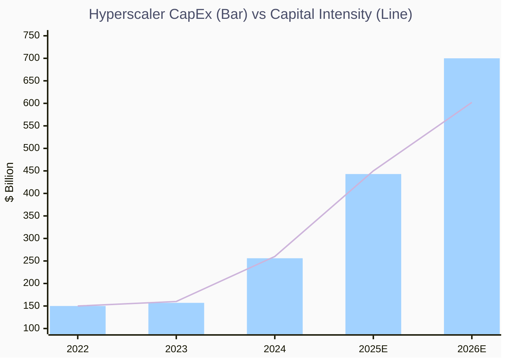

**Key Insights:**

- 🏆 **$700B (CNBC, 2026E)**: 截至 2026 年初，四大 Hyperscaler（Amazon, Google, Microsoft, Meta）合计 CapEx 预计接近 **$700B**，较 2025 年 +60%
- 📈 **Capital Intensity 触顶**: 资本密集度达到营收的 **45-57%**——历史上前所未有的水平。Alphabet 的 FCF 预计从 2025 年 $73.3B **暴跌 90%** 至 2026 年 $8.2B (Pivotal Research)
- ⚠️ **Goldman Sachs 预测**: 2025-2027 年 Hyperscaler 累计 CapEx 将达 **$1.15 Trillion**，是 2022-2024 年 $477B 的 2.4 倍

**逐家拆解**:

| 公司 | 2025 CapEx 指引 | 2026 CapEx 预估 | 关键战略 |
| :--- | :--- | :--- | :--- |
| **Amazon (AWS)** | $125B (+61% YoY) | >$150B | Trainium 自研芯片对抗 NVIDIA，price-performance 优势 30-40% |
| **Microsoft (Azure)** | ~$80B (FY25) | ~$121B (FY26, Jefferies) | Copilot 全栈嵌入 M365，$30/seat/mo 撬动 400M+ 安装基数 |
| **Alphabet (GCP)** | $91-93B | 最高 $185B（上调 3 次） | Anthropic 接入百万级 TPU，Gemini 企业方案"数十亿美元季度收入" |
| **Meta** | $64-72B | 最高 $135B | Llama 开源生态 + 自有 AI 应用("making a significantly larger investment here is very likely to be profitable") |

#### Jevons Paradox (杰文斯悖论)：效率提升 → 需求爆炸

Satya Nadella 和 Jensen Huang 均明确引用了这一经济学概念。DeepSeek 等模型带来的推理效率提升（Inference Cost 下降）并未减少算力需求，反而因为降低了单位使用成本而**刺激了更大规模的总需求**。

> **二阶推理 (Second-Order Thinking)**: 效率提升 → 单位成本下降 → 新用例涌现（AI Agent, RAG, 实时推理）→ 总算力需求暴增 → CapEx 持续攀升 → IaaS 层价值膨胀。这条因果链解释了为何 Hyperscaler 即便面临 FCF 暴跌的压力，依然不敢放缓投资——**"停下就是出局"**。

#### Custom Silicon War：打破 NVIDIA 定价权

- **AWS Trainium2**: 声称相比 NVIDIA H100 拥有 30-40% 更优的 Price-Performance，单位成本低至 ~$1/hr（H100 ~$3/hr）
- **Google TPU v5**: Anthropic 已承诺接入多达 100 万颗 TPU，覆盖训练与推理
- **Meta MTIA (Meta Training and Inference Accelerator)**: 自研芯片，主攻内部推理负载（Instagram Reels 推荐、广告排序）
- **战略意义**: 自研芯片赋予云厂商对抗 NVIDIA 定价权的筹码，也为企业客户提供了更低成本的训练/推理选项。NVIDIA 的护城河从"唯一供应商"转向"最优生态系统"。

---

### 2.2 PaaS: 商品化风暴 (The Commoditization Storm)

#### Vector Database: 从独立赛道到内置功能

Vector Database（如 Pinecone, Weaviate, Qdrant）曾是 AI Stack 中的"热赛道"。但 2024-2025 年，所有主流数据库（PostgreSQL/pgvector, MongoDB Atlas Vector Search, Redis）均内置了向量搜索功能，Vector DB 从独立品类被降维为一个 **feature**。

- **Pinecone** 通过推出 Serverless + 无缝集成策略试图保持独立存在
- **但趋势不可逆**: 企业不会为一个可以被 `CREATE INDEX ... USING hnsw` 替代的功能单独付费

#### Data Lakehouse: 双雄争霸走向融合

Databricks 和 Snowflake 的竞争正从差异化走向功能趋同：

| 维度 | Databricks | Snowflake |
| :--- | :--- | :--- |
| **起源** | 数据工程 / ML / Spark | 数据仓库 / SQL 分析 |
| **AI 战略** | Mosaic ML 收购 → 训练 + 推理 | Cortex AI → SQL-native AI |
| **定价模式** | Consumption (DBU) | Consumption (Credits) |
| **趋同点** | 双方均在对方核心领域发力，功能差异缩小 |

**二阶推理**: PaaS 的商品化会加速 **价值向两端迁移**——下游的应用需要差异化数据（Data Moat），上游的基础设施需要更便宜的算力（CapEx 效率）。PaaS 本身沦为"管道"。

---

### 2.3 SaaS: 灭绝还是进化 (Extinction or Evolution)

#### The Seat-based Death Spiral

传统 SaaS 的核心商业模式——按"人头"收费——正遭受 AI 的直接冲击。AI Agent 做得越多，企业需要的人类 Seat 就越少。

- **数据**: 2025 年，PricingSaaS 500 指数中，79 家公司 (16%) 采用了 **"Credit-based" (Hybrid)** 定价模式，**同比增长 126%**
- **Economic Reality**: AI 软件公司的 Inference Cost (COGS) 极高，通常需要 **6x 的 Revenue** 才能达到传统 SaaS 的 EBITDA 水平
- **估值衰退**: 传统 SaaS 中位数 EV/Revenue 从 2021 年巅峰的 ~15x 跌至 2025 年底的 **5.1x**，中位数营收增速降至 **12.2%**（2025Q4），Rule of 40 中位数仅 23%

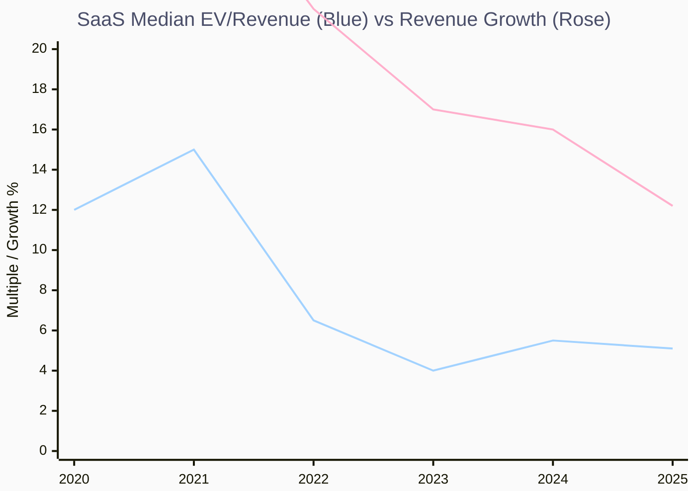

**Key Insights:**

- 🏆 **Multiple Compression**: SaaS EV/Revenue 从峰值 15x 腰斩至 5.1x，与营收增速同步下滑
- 📈 **AI-Native 溢价**: AI 原生公司中位数 Market Cap/Revenue **>10x**，传统 SaaS **<5x**——市场正在用估值投票
- ⚠️ **Rule of 40 警告**: 58 家上市 SaaS 中仅 **17%** 达到 Rule of 40 标准，说明多数公司既增长乏力又不够盈利

#### Microsoft Copilot: 巨头的降维打击

Microsoft 凭借其无与伦比的分发网络（Windows + M365 + Azure + GitHub），正在对整个 SaaS 生态发动降维打击：

- **M365 Copilot**: $30/seat/mo 附加费，直接叠加在 4 亿+ M365 用户基础上。即使仅 10% 渗透率 → **$14.4B ARR**
- **GitHub Copilot**: 已达 **$2B+ ARR**，**2,000 万** MAU，是微软增长最快的开发者产品
- **100M MAU**: Microsoft Copilot（含搜索、Office、IDE 等全线产品）月活突破 1 亿
- **Lock-in 加深**: 2025 年 11 月起，Microsoft 对 Enterprise Agreement 定价进行了 25 年来最重大的调整——Copilot 体验免费内置于 M365，但深度功能（Agent Mode, Graph 连接）需付费。**一旦用上，就再也离不开**

---

## 三、Case Studies — 典型案例解剖

### 3.1 开发者工具：GitHub Copilot vs Cursor

这是 AI 时代"平台 vs 创新者"之争的微缩模型。

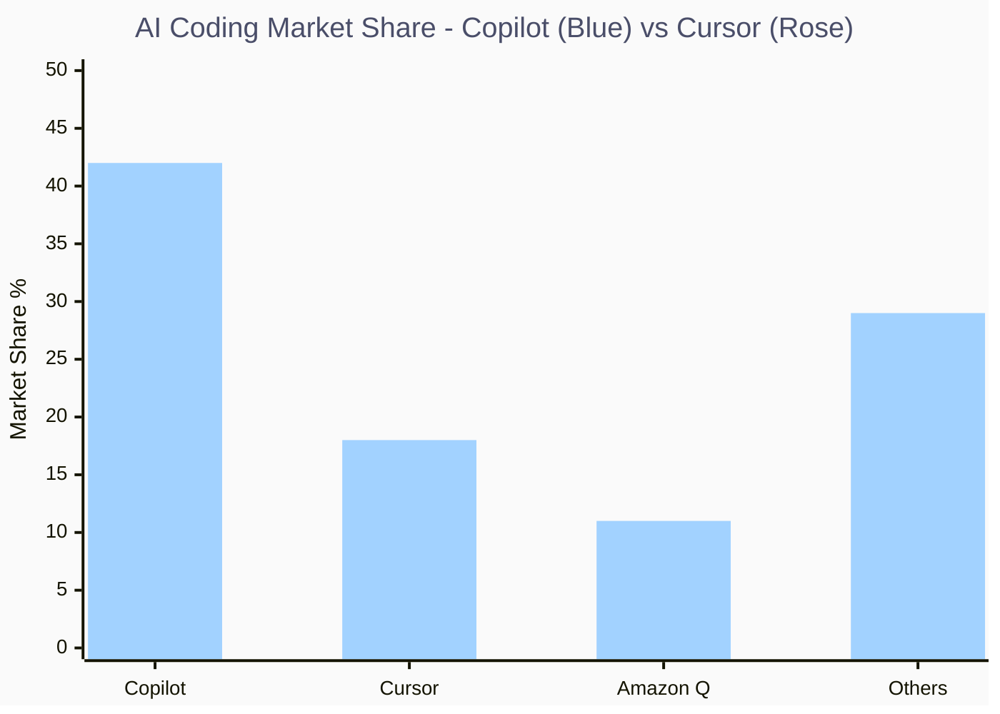

| 维度 | GitHub Copilot | Cursor |
| :--- | :--- | :--- |
| **ARR** | **$2B+** (Microsoft 最快增长产品) | **$500M+** ($29B 估值) |
| **市场份额** | **42%** (IDE 内嵌，零迁移成本) | **18%** (独立 IDE，需切换) |
| **核心优势** | GitHub 平台协同、企业级安全、多 IDE 支持 | 多文件编辑、项目级上下文理解、agentic 工作流 |
| **定价** | $10/mo (Individual), $19/mo (Business) | $20/mo (Pro), Token-based 上限 |
| **模型** | OpenAI GPT + 自有模型 | 多模型切换（GPT-4, Claude, etc.） |
| **竞争格局** | 依靠分发优势和 GitHub 生态护城河 | 依靠产品创新和开发者体验的差异化 |

**Key Insights:**

- 🏆 **分发 > 产品**: Copilot 凭借 GitHub 生态 + VS Code 内嵌实现了 42% 市场份额，尽管 Cursor 在产品功能上更具创新性
- 📈 **惊人增速**: Cursor 季度增长率达 **71%**，但绝对规模仍不到 Copilot 的 1/4
- ⚠️ **切换成本悖论**: Cursor 要求用户更换 IDE——这是企业团队采纳的最大障碍（"Getting 5 devs to switch editors is harder than you think"）

### 3.2 创意工具：Adobe Firefly — Credit-based 的教科书

Adobe Firefly 是传统 SaaS 巨头成功拥抱 AI 的标杆案例，展示了 **Credit-based Monetization** 如何运作。

- **生成量**: 截至 2025 年 5 月，累计生成 **24 Billion** 资产（2023 年 3 月上线，首 3 个月即达 1B）
- **市场份额**: 在 AI 设计工具中占据 **29%** 市场份额，领先 MidJourney (19%), Canva AI (16%), DALL·E (14%)
- **直接收入**: 2024-2025 年间 **$400M** 直接营收，ARR 预计 2025 年中超过 **$500M**
- **收入影响**: 2025 年对 Adobe 总营收的 "Revenue Influence" 约 **$1.5B**
- **体验**: 3x QoQ 生成量增长，2025 年 Firefly 集成了 Imagen 3, Veo 2 (Google), 以及 Flux 1.1 Pro (Black Forest Labs) 等第三方模型

**商业模式解剖**:

1. **Subscription + Credit Hybrid**: 用户通过升级 Creative Cloud 套餐获得 AI Credits（$20-$60/mo），Credits 用于生成图像、视频、向量
2. **Consumption Flywheel**: 更多应用集成（Photoshop → Premiere → Lightroom）→ 更多使用场景 → Credit 消耗增长 → 套餐升级
3. **Firefly Foundry** (Enterprise): 品牌级定制训练服务（基于企业自有内容、品牌指南、IP 训练专属模型）

> **二阶推理**: Adobe 的核心护城河不是 AI 模型本身（它甚至集成了竞品模型），而是 **(1)** 3.25 亿 Creative Cloud 用户基数 + **(2)** 3 亿+ 合规训练数据 + **(3)** 企业级版权保护（Content Authenticity Initiative）。这三者构成了后来者难以复制的壁垒——即便用同样的模型，也无法复制 Adobe 的分发能力和版权合规体系。

### 3.3 客服 AI：Klarna — 从激进到回调

Klarna 是 AI 替代人工的最激进实验者，也是第一个公开"承认过度"的案例。

- **Success**: AI 客服处理了 **2.3 Million** conversations（占总量 2/3），相当于 700 名全职客服的工作量，带来 **$40M** 利润改善
- **反转**: 2025 年 5 月，CEO Sebastian Siemiatkowski 公开表示 **"Cost-cutting gone too far"**，开始回调部分人工服务
- **启示**: AI 并非万能替代方案。高价值客户交互、复杂投诉处理、品牌体验维护——这些场景中 **"Human-in-the-loop"** 是不可或缺的

### 3.4 企业 AI：Salesforce Agentforce — 转型阵痛

- **Adoption**: 截止 2025 年底关闭 **18,500 笔交易**（9,500 paid），被标记为"Fastest growing product"
- **but**: 股价 YoY 最大跌幅 ~40%，反映市场对其"被 AI 颠覆"的深层恐惧——投资者担心 AI Agent 会直接消灭 CRM 的 Seat 需求
- **Paradox**: Salesforce 一方面推 Agentforce，另一方面其核心收入仍来自传统的 Seat-based CRM。**自我颠覆的两难**

---

## 四、Open Source vs Closed Source — 模型层的商品化

### 开源模型格局

2025 年标志着开源（Open Weight）模型全面追赶 Frontier 闭源模型：

| 模型                  | 参数量    | 开发者      | 关键特征                          |
| :------------------ | :----- | :------- | :---------------------------- |
| **Llama 4**         | 多模型族   | Meta     | April 2025 发布，Multimodal，开源许可 |
| **Mistral Large 3** | MoE 架构 | Mistral  | Dec 2025 发布，$13.7B ，开源多模态     |
| **DeepSeek V3/R1**  | MoE    | DeepSeek | 推理效率提升标杆，引发 Jevons Paradox 讨论 |
| **Qwen 3**          | 多模型族   | Alibaba  | 面向东亚市场，Omni 多模态               |
| **Gemma 2**         | 紧凑型    | Google   | 专注端侧部署，轻量化                    |

### 开源的商业化悖论

- **Meta 的策略**: 开源 Llama 不是慈善——Meta 通过降低行业推理成本获益（推动更多线上内容 → 更多广告收入）。2025 年 5 月推出激励计划，吸引初创公司采用 Llama
- **Mistral 的路径**: $2.7B 融资、$13.7B 估值。商业模式 = 开源模型吸引开发者 + 企业级托管服务（HSBC, BNP Paribas 多年期合同）+ Le Chat 消费者产品
- **Anthropic vs OpenAI**: 两家的收入增速惊人——Anthropic 2025 年 ARR 目标 **$9B**（2026 目标 $26B），OpenAI ARR 已超 **$20B**。但两者路径迥异：Anthropic 40% 企业 LLM 市场份额、预计 2027 年盈亏平衡；OpenAI 800M+ 周活用户、消费者驱动但预计 2028 年仍亏损 $74B

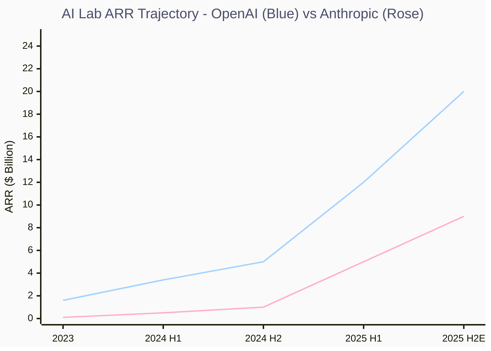

**Key Insights:**

- 🏆 **开源 ≠ 免费**: 开源模型降低了边际成本，但企业级部署（安全、合规、SLA）仍需付费——Mistral 正在这个缝隙里构建商业
- 📈 **模型层加速商品化**: 当 Llama 4, Mistral Large 3, DeepSeek 在多数 Benchmark 上追平 GPT-4o/Claude 3.5 时，模型本身不再是护城河——**数据、分发、应用场景**才是
- ⚠️ **盈利悬崖**: OpenAI 预计 2028 年仍亏损 $74B。这个行业的 Unit Economics 至今未被证明可持续

---

## 五、Edge AI: 被低估的第三极 (The Royalty Model)

### 为何 Edge AI 正在崛起

云端推理的成本高昂（GPU 小时 + 网络延迟 + 数据隐私），推动部分算力不可避免地**下沉到端侧**（PC, Phone, Car, IoT）。这催生了一种不同于 Cloud 的商业模式——**Royalty Model（授权费模式）**。

### Edge AI 生态玩家

| 公司                     | 业务模式                             | 价值定位                       |
| :--------------------- | :------------------------------- | :------------------------- |
| **Arm**                | IP 授权费 / Per-chip Royalty        | CPU 架构授权，覆盖全球 99% 智能手机     |
| **Qualcomm**           | 芯片 + AI Engine + Royalty         | 端侧推理芯片（Snapdragon X Elite） |
| **NVIDIA (Orin/Thor)** | 芯片销售 + DRIVE 软件栈                 | 高算力自动驾驶平台                  |
| **QNX **               | 嵌入式 OS 授权费 / Per-vehicle Royalty | 安全认证 RTOS，SDV 基础层          |

> **二阶推理**: Royalty Model 的核心优势是 **资本轻量 + 高毛利 + 长生命周期**。一辆汽车的生命周期是 10-15 年，每部设备上的 Royalty 会在整个生命期内持续产生收入。随着 SDV 让汽车从"硬件"变成"软件平台"，端侧软件的 TAM 将指数级扩展。

---

## 六、Pricing 2.0 — 商业模式范式迁移

### 三代定价模型对比

| 模式 | 描述 | 代表 | 适用场景 | 核心风险 |
| :--- | :--- | :--- | :--- | :--- |
| **Seat-based** (Legacy) | 按人头收费 | Microsoft 365, Salesforce CRM | 工具类软件 | 随 AI 替代人工，Seat 萎缩 (Death Spiral) |
| **Consumption / Token** (Present) | 按用量/Token/Credit 收费 | Snowflake, OpenAI API, Adobe Firefly | 基础设施、API、AI 生产力 | Revenue 波动大，客户极敏感地优化成本 |
| **Outcome-based** (Future) | 按结果/价值收费 | Klarna AI Customer Service, Coding Agents | Agentic AI、自动化工作流 | 归因困难 (Attribution)，需极强信任 |

### 从"卖工具"到"卖结果"

```mermaid
%%{init: {
  'theme':'base',
  'themeVariables': {
    'primaryColor': '#A2D2FF',
    'primaryTextColor': '#4A4E69',
    'primaryBorderColor': '#A2D2FF',
    'lineColor': '#CDB4DB',
    'secondaryColor': '#FFC8DD',
    'tertiaryColor': '#CDB4DB',
    'nodePadding': 10
  }
}}%%
graph LR
    A["Seat-based<br/>卖工具/卖椅子"] -->|"AI Agent 替代人工"| B["Credit-based<br/>卖弹药/卖 Token"]
    B -->|"AI 能力成熟"| C["Outcome-based<br/>卖结果/卖解决方案"]

    classDef start fill:#A2D2FF,stroke:#89C2F8,stroke-width:1px,color:#4A4E69,rx:10,ry:10
    classDef process fill:#CDB4DB,stroke:#B59BC5,stroke-width:1px,color:#4A4E69,rx:10,ry:10
    classDef result fill:#FFC8DD,stroke:#FFB7C5,stroke-width:1px,color:#4A4E69,rx:10,ry:10

    class A start
    class B process
    class C result
```

**Key Insights:**

- 🏆 **Outcome-based 是终局**: 当 AI Agent 能独立完成一个完整任务（如"解决一个客服工单"、"修一个 Bug"），按结果收费将成为必然——但这需要解决 Attribution 问题
- 📈 **过渡期是 Credit-based**: 126% 的同比增长表明市场正加速从 Seat 向 Credit 迁移，这是通往 Outcome-based 的桥梁
- ⚠️ **6x Revenue 陷阱**: AI 软件由于高推理成本 (COGS)，需要 6x Revenue 才能达到传统 SaaS 的 EBITDA——这意味着定价必须足够高，或 Inference Cost 必须持续下降

---

## 七、The Playbook — 新时代的"好生意"标准

### NDR → "Work Delivered" (工作交付量)

传统 SaaS 的核心看板指标是 **Net Dollar Retention (NDR)** ——衡量存量客户的续费扩展能力。在 AI 时代，新的指标正在浮现：

- **Work Delivered**: Agent 完成了多少个任务？解决了多少个工单？生成了多少行代码？
- **Cost per Task**: 单任务成本是否持续下降？（对应 Jevons Paradox）
- **Outcome Value**: 最终为客户创造了多少可量化的商业价值？

### Data Flywheel (数据飞轮)

最具持久竞争力的 AI 公司，都在构建**数据飞轮**：

1. **产品使用** → 产生专有数据
2. **专有数据** → 微调模型（Fine-tuning / RAG）
3. **更好的模型** → 更好的产品体验
4. **更好的体验** → 更多用户 → 更多数据
5. **循环加速** → 护城河加深

**典型案例**:

- **Adobe Firefly**: 3 亿+ 合规素材 → 训练专属模型 → 更好的生成质量 → 更多创作者使用 → 更多素材 → 飞轮加速
- **Tesla FSD**: 数百万辆车的行驶数据 → 训练自动驾驶模型 → 更安全的驾驶 → 更多用户信任 → 更多数据

### Workflow Intrusion (工作流嵌入深度)

AI 产品嵌入企业工作流的深度，决定了其可替代性：

- **浅层嵌入**: 即开即用的 AI Chat（如 ChatGPT Web）→ 切换成本极低
- **中层嵌入**: IDE 内的 Copilot → 有一定切换成本，但可替代
- **深层嵌入**: 集成进 ERP/CRM/DevOps Pipeline 的 AI Agent → 切换成本极高，接近"基础设施"级别

> **投资启示**: 寻找那些同时具备 **Data Flywheel + Deep Workflow Intrusion + Outcome-based Pricing** 三个特征的公司——它们是 AI 时代的"超级护城河"型标的。

---

## 八、Strategic Implications — 投资与战略建议

### 投资框架

```mermaid
%%{init: {
  'theme':'base',
  'themeVariables': {
    'primaryColor': '#A2D2FF',
    'primaryTextColor': '#4A4E69',
    'primaryBorderColor': '#A2D2FF',
    'lineColor': '#CDB4DB',
    'secondaryColor': '#FFC8DD',
    'tertiaryColor': '#CDB4DB',
    'nodePadding': 10
  }
}}%%
graph TD
    Q{"AI 时代<br/>投资决策树"}
    Q -->|"有专有数据?"| Y1["Deep Data Moat<br/>强烈关注"]
    Q -->|"仅做 Wrapper?"| N1["高风险<br/>可能被巨头吞噬"]
    Q -->|"控制算力?"| Y2["IaaS / Custom Silicon<br/>长期受益"]
    Q -->|"端侧软件?"| Y3["Royalty Model<br/>资本轻量型增长"]

    classDef start fill:#A2D2FF,stroke:#89C2F8,stroke-width:1px,color:#4A4E69,rx:10,ry:10
    classDef process fill:#CDB4DB,stroke:#B59BC5,stroke-width:1px,color:#4A4E69,rx:10,ry:10
    classDef result fill:#FFC8DD,stroke:#FFB7C5,stroke-width:1px,color:#4A4E69,rx:10,ry:10
    classDef accent fill:#FFAFCC,stroke:#FF9FBF,stroke-width:1px,color:#4A4E69,rx:10,ry:10
    classDef decision fill:#E2F0CB,stroke:#D4E5B5,stroke-width:1px,color:#4A4E69,rx:10,ry:10

    class Q decision
    class Y1 accent
    class N1 result
    class Y2 start
    class Y3 process
```

### 明确行动方向

1. **🔴 Short Generic SaaS**: 做空那些**没有专有数据**、仅提供 "Wrapper" 功能的通用 SaaS。它们将被 Microsoft 365 Copilot、开源 Agent、或垂直整合者吞噬。典型危险标的：功能可被 GPT + Zapier 复制的一切工具。

2. **🟢 Long Proprietary Data**: 做多拥有独特、非公开垂直行业数据的公司。**Data Moat** 是 AI 时代最深的护城河——模型可以开源，算力可以买到，但**独特数据不可复制**。关注 Veeva (生命科学)、Palantir (政府/国防)、Bloomberg (金融数据)。

3. **🟡 Watch CapEx Cyclicality**: Hyperscaler CapEx 已进入"不可阻挡"阶段，但 2027-2028 年可能出现 **"Capacity Digestion"** 周期——当算力供给暂时超过需求时，IaaS 层毛利会承压，NVIDIA 等芯片商会面临库存风险。这是"恐惧时刻"的买入窗口。

4. **🔵 Edge AI is Underrated**: 随着云端推理成本居高不下，端侧推理（On-device Inference）的经济性和隐私优势将逐步凸显。关注 **Arm** (IP 授权)、**Qualcomm** (端侧 AI 芯片)、**QNX** (汽车 RTOS)——Royalty Model 提供资本轻量型增长。

5. **🟣 AI Lab 的终极考验**: OpenAI ($20B ARR, 但 2028 年预计亏 $74B) 和 Anthropic ($9B ARR, 但 2027 年预计盈亏平衡) 的分化路径值得密切关注。**谁先实现可持续盈利，谁就证明了 AI 作为独立商业模式的可行性**。如果两者都持续亏损，那 AI 的价值最终只能通过 IaaS 层和应用层变现——模型层沦为"公共品"。

---

## 九、估值地图 — AI vs SaaS

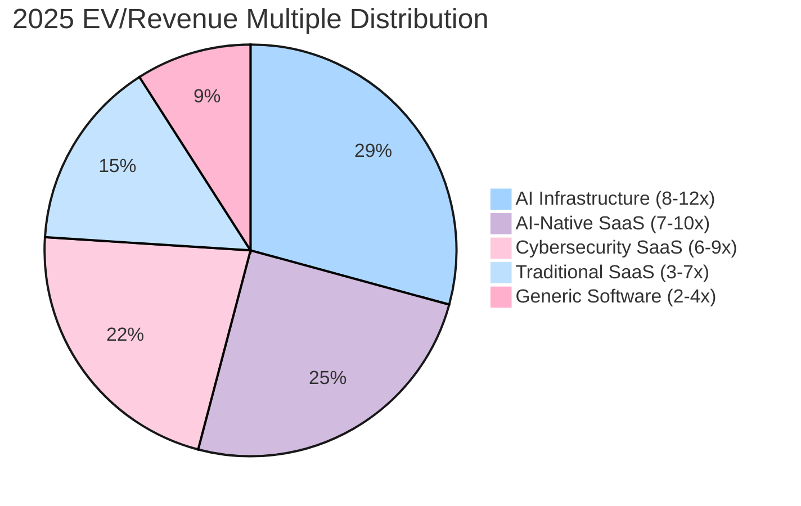

**Key Insights:**

- 🏆 **结构性溢价**: AI Infrastructure 类公司享受 8-12x 估值，是 Generic Software (2-4x) 的 3-4 倍
- 📈 **Cybersecurity 例外**: 在 SaaS 景气度下行中，Cybersecurity SaaS 因"刚需 + 合规驱动"维持 6-9x 溢价
- ⚠️ **AI 溢价可持续性**: 如果 AI 原生公司持续无法证明盈利能力，当前 >10x 的估值存在修正风险

---

## 十、结语：确定性与不确定性

### 高确定性判断 (High Conviction)

1. **价值迁移不可逆**: 从应用层向基础设施层和垂直 Agent 层的迁移是结构性的，不是周期性的
2. **Seat-based 模式将衰亡**: Credit-based 是过渡态，Outcome-based 是终态
3. **算力需求持续膨胀**: Jevons Paradox 保证需求增长快于效率提升——至少在 2027 年前

### 需要持续监测的变量 (Watch Variables)

1. **Inference Cost 下降曲线**: 如果 Token 价格降 10x 会发生什么？（类比 AWS S3 存储费用的历史路径）
2. **CapEx Digestion Cycle**: 2027-2028 年是否出现产能过剩？
3. **监管动态**: EU AI Act、美国 Executive Order 对开源模型的影响
4. **开源 vs 闭源终局**: Meta Llama 模式能否持续？如果连 OpenAI 都做不到盈利，Mistral 的商业化路径是否可行？

---

## 附录 A：AI 时代操作系统深度分析 — 从数据中心到终端

> [!IMPORTANT]
> 操作系统是整个计算栈中最"不可见"却最"不可替代"的一层。AI 正在从两端——**数据中心的 GPU 集群**和**终端设备的 NPU/MCU**——同时重塑操作系统的角色、架构和商业模式。本附录深度分析这两个方向的演进逻辑。

### A.1 数据中心 Server OS：Linux 的绝对统治与 AI-Native 分化

#### 格局现状：Linux 一统天下

AI 时代的数据中心操作系统格局极度集中——**Linux 已经赢得了 Server OS 的全面胜利**：

- **100%** 的全球 Top 500 超级计算机运行 Linux（自 2017 年以来不变）
- **71.9%** 的 Edge AI 推理负载运行在 Linux 上
- **Red Hat Enterprise Linux (RHEL)** 以 **43.1%** 市场份额领跑企业级 Linux Server 市场
- **Ubuntu** 以 **33.9%** 市场份额领跑全分发版排名
- Linux Kernel 已超过 **3,400 万行代码**，上个发布周期有 11,000+ 贡献者

| Server OS | 2025 市场定位 | AI 相关性 |
| :--- | :--- | :--- |
| **RHEL (Red Hat)** | 企业级 Linux 领导者 (43.1%) | RHEL 10 + NVIDIA CUDA Toolkit 深度集成，AI 推理/训练标准底座 |
| **Ubuntu (Canonical)** | 开发者首选 (33.9%) | DGX OS 基于 Ubuntu 24.04，AI Lab 默认开发环境 |
| **Azure Linux (Microsoft)** | Azure 云原生专用 OS | Azure Linux 3.0 支持 NC A100 GPU 节点池，标准化 AI 工作负载 |
| **Windows Server** | 传统企业负载 | AI 训练/推理场景几乎不使用，逐步边缘化 |

#### NVIDIA DGX OS：AI 专用操作系统的诞生

NVIDIA 没有满足于只做 GPU 硬件——它正在构建**全栈 AI 计算平台**，操作系统是关键一环：

- **DGX OS**: 基于 **Ubuntu 24.04** 定制，预装全套 NVIDIA AI 软件栈（CUDA, cuDNN, TensorRT, NCCL）
- **覆盖范围**: 从桌面级 **DGX Spark**（$3,000 起，128GB 统一内存）到工业级 **DGX SuperPOD**（数千 GPU 集群）
- **Grace-Blackwell 架构**: CPU (Arm) + GPU (Blackwell) 通过 NVLink-C2C 共享内存，OS 层负责统一调度
- **垂直整合意义**: NVIDIA 正在复制 Apple 的 "Silicon + OS + Software" 垂直整合策略——DGX OS 让 NVIDIA 从"芯片供应商"进化为 **"AI 计算平台公司"**

> **二阶推理**: DGX OS 的战略意图不是替代 Linux，而是在 Linux 之上构建一个**专有 AI 运行时层**。类似于 Android 基于 Linux Kernel 但创造了独立生态，DGX OS 可能在 AI 训练/推理领域创造类似的生态锁定——如果你的代码针对 DGX OS 优化，迁移到 AMD ROCm 或 Intel oneAPI 环境就需要额外成本。

#### VMware/Broadcom 颠覆：虚拟化层的 AI 时代危机

Broadcom 在 2024 年完成对 VMware 的 $69B 收购后，引发了数据中心 OS/虚拟化层的地震：

- **永久许可证终结** (2024 年初): VMware 停止销售所有永久许可证，强制转向订阅制
- **72 核最低购买** (2025 年初): 一度尝试强制每 CPU 至少购买 72 核许可——小型集群成本直接 **4 倍**，后因强烈反弹回撤至 16 核最低
- **合作伙伴大清洗**: 全球授权 VCSP 伙伴从 4,500+ 大幅缩减至仅 ~13 家
- **Essentials Plus 退役**: 中小企业常用的入门级套件被取消

**市场连锁反应**:

```mermaid
%%{init: {
  'theme':'base',
  'themeVariables': {
    'primaryColor': '#A2D2FF',
    'primaryTextColor': '#4A4E69',
    'primaryBorderColor': '#A2D2FF',
    'lineColor': '#CDB4DB',
    'secondaryColor': '#FFC8DD',
    'tertiaryColor': '#CDB4DB',
    'clusterBkg': '#FAF9FB',
    'nodePadding': 10
  }
}}%%
graph TD
    A["Broadcom 收购 VMware<br/>$69B, 2024"] --> B["永久许可证终结<br/>强制订阅制"]
    B --> C["中小企业成本激增<br/>4x 许可费上涨"]
    C --> D["企业加速迁移<br/>KVM / Proxmox / Hyper-V"]
    C --> E["Red Hat OpenShift<br/>VM + Container 统一"]
    B --> F["AI 负载绕过虚拟化<br/>裸金属 GPU 直通"]

    classDef start fill:#A2D2FF,stroke:#89C2F8,stroke-width:1px,color:#4A4E69,rx:10,ry:10
    classDef process fill:#CDB4DB,stroke:#B59BC5,stroke-width:1px,color:#4A4E69,rx:10,ry:10
    classDef result fill:#FFC8DD,stroke:#FFB7C5,stroke-width:1px,color:#4A4E69,rx:10,ry:10
    classDef accent fill:#FFAFCC,stroke:#FF9FBF,stroke-width:1px,color:#4A4E69,rx:10,ry:10

    class A start
    class B,C process
    class D,E result
    class F accent
```

**Key Insights:**

- 🏆 **AI 负载天然反虚拟化**: GPU 训练/推理需要裸金属 (Bare Metal) + GPU Passthrough，传统 VMware 虚拟化层反而是性能瓶颈——AI 加速了"去 VMware 化"
- 📈 **Red Hat 的战略窗口**: RHEL 10 集成 NVIDIA CUDA Toolkit + OpenShift Virtualization 统一 VM/Container，直接承接 VMware 逃离者
- ⚠️ **Broadcom 的短视风险**: 激进涨价短期提升 ARPU，但长期可能将客户推向开源替代品（KVM, Proxmox）和云原生方案

#### Red Hat 的 AI 战略：从 Linux 基座到 AI 平台

Red Hat 正在将自己从"Enterprise Linux 发行版"重新定位为 **"Enterprise AI 基础设施平台"**：

- **RHEL 10** (2025 年发布): 量子安全加密 + AI 框架预集成 + 不可变容器镜像 (Image Mode)
- **Red Hat + NVIDIA 战略合作**: 在 RHEL、OpenShift 和 Red Hat AI 全线集成 NVIDIA CUDA Toolkit
- **Red Hat AI 3**: 智能控制平面 (Intelligent Control Plane)，自动优化 GPU 基础设施分配
- **Red Hat Ansible Lightspeed**: 用 Gen AI 辅助基础设施自动化，降低 Linux 运维复杂度

---

### A.2 终端设备 OS：三场平行战争

AI 正在终端设备上催生三场截然不同的操作系统战争——**汽车**、**消费电子**、**工业 IoT**。

#### 战场一：汽车 OS — QNX vs Android Automotive vs Linux

汽车操作系统是增速最快、壁垒最高的 OS 细分市场：

- **市场规模**: 2025 年 **$23.33B**，预计 2030 年达 **$37.22B** (CAGR 9.8%)
- 功能安全认证 (ISO 26262 ASIL D) 构成极高进入壁垒——目前仅 QNX、VxWorks 和 Green Hills INTEGRITY 通过最高级别认证

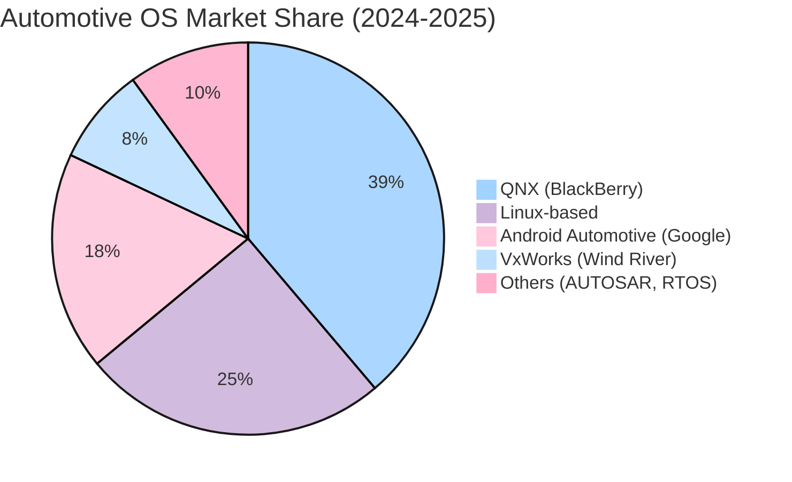

**Key Insights:**

- 🏆 **QNX 仍是王者**: **38.8%** 市场份额 (Mordor Intelligence, 2024)，嵌入 **2.35 亿辆** 汽车，ISO 26262 ASIL D 认证是核心护城河
- 📈 **AAOS 快速崛起**: Hyundai Motor Group (2024.12)、Mazda (2025.7) 先后宣布采用 Android Automotive，Google 正以信息娱乐系统为切入点渗透汽车
- ⚠️ **分层共存是现实**: 一辆现代 SDV 通常运行 **多个 OS**——QNX 管安全关键域（ADAS, 底盘），Linux 管中间件，AAOS 管座舱——操作系统之间是分层协作而非零和竞争

| 维度 | QNX (BlackBerry) | AAOS (Google) | AGL Linux |
| :--- | :--- | :--- | :--- |
| **核心优势** | 功能安全认证 (ASIL D)，微内核实时性 | Google 生态 (Maps, Assistant, Play Store) | 开源免费，无授权费 |
| **商业模式** | Per-vehicle Royalty + SDK 授权 | 免费 OS + Google 服务绑定 | 免费，OEM 自行维护 |
| **安全层级** | 最高 (ADAS, 刹车, 转向) | 中等 (信息娱乐) | 中低 (信息娱乐, 中间件) |
| **AI 适配** | QNX SDP 8.0: 64 核扩展，SDV 架构 | On-device AI via Google TPU/Tensor | 可集成各类 AI 框架 |
| **市场份额** | ~38.8% (安全域主导) | ~18% (信息娱乐域快速增长) | ~25% (中国 OEM 偏好) |

#### 战场二：消费电子 OS — NPU 驱动的 On-Device AI

2024-2025 年，消费电子操作系统的核心叙事变成了 **"AI PC / AI Phone"**——将推理算力从云端下沉到设备端：

- **Microsoft Windows 11 + Copilot+ PC**: 定义 "AI PC" 标准——需专用 **NPU ≥ 40 TOPS**。OS 层内嵌 Recall、CoCreator、Windows Studio Effects 等 AI 功能，Copilot Agent 深度集成
- **Apple Intelligence + Neural Engine**: M4 芯片 Neural Engine (38 TOPS)，iOS/macOS 原生 AI 功能（文本重写、图像生成、Siri 增强），**所有推理在设备端完成**——隐私是核心卖点
- **Google ChromeOS + Android**: Gemini Nano 端侧模型，Android 15 内置 AI 摘要和翻译

| 操作系统 | NPU/AI 芯片 | AI 运行时 | 商业模式影响 |
| :--- | :--- | :--- | :--- |
| **Windows 11** | Intel Core Ultra (NPU), Snapdragon X Elite (45 TOPS) | Copilot Runtime, DirectML, ONNX | Copilot $30/mo 附加费 → OS 变成 AI 服务分发平台 |
| **macOS/iOS** | Apple Neural Engine (M4: 38 TOPS) | Core ML, MLX | Apple Intelligence 免费内置 → 增强硬件售价溢价 |
| **Android** | Google Tensor G4, Snapdragon 8 Gen 3 | Gemini Nano, TFLite | 设备端 AI 免费 → 增强 Google 服务黏性 |

> **二阶推理**: NPU 正在像当年的 GPU 一样成为消费设备的"标配"。这意味着 OS 厂商从"管理硬件资源"进化到 **"调度 AI 推理资源"**。未来的操作系统竞争本质上是一场 **"谁的 AI Runtime 更好"** 的战争——类似于当年的浏览器引擎之争 (WebKit vs V8 vs Gecko)。Windows 的 Copilot Runtime、Apple 的 Core ML、Google 的 Gemini Nano 正在成为新一代的平台控制点。

#### 战场三：工业 IoT / 嵌入式 — RTOS 的复兴

AI 驱动的 Edge Computing 正在催生 RTOS (Real-Time Operating System) 市场的强劲复兴：

- **RTOS 市场规模**: 2025 年 **$7.22B**，预测 2035 年达 **$15.16B** (CAGR 7.7%)
- **嵌入式软件市场**: 2024 年 **$17.8B**，预测 2032 年达 **$34.1B** (CAGR 8.5%)
- **Edge AI 市场**: 2025 年 **$25B**，预测 2033 年达 **$120B**

| RTOS                     | 开发者              | 核心领域       | AI 适配策略                                     |
| :----------------------- | :--------------- | :--------- | :------------------------------------------ |
| **QNX**                  | BlackBerry       | 汽车、医疗、工业   | QNX SDP 8.0 + SDV Accelerator，微内核安全隔离       |
| **VxWorks**              | Wind River       | 航空航天、国防、工业 | Wind River Linux + VxWorks Hypervisor，云-边协同 |
| **FreeRTOS**             | Amazon (AWS)     | IoT、消费电子   | AWS IoT 深度集成，Greengrass Edge Runtime        |
| **Zephyr**               | Linux Foundation | IoT、可穿戴    | 开源社区驱动，贡献者 5 年增长 5x                         |
| **ThreadX (Azure RTOS)** | Microsoft        | MCU、工业传感器  | Azure IoT 集成，已捐赠给 Eclipse Foundation        |

---

### A.3 未来演进趋势：OS 层的五大预判

```mermaid
%%{init: {
  'theme':'base',
  'themeVariables': {
    'primaryColor': '#A2D2FF',
    'primaryTextColor': '#4A4E69',
    'primaryBorderColor': '#A2D2FF',
    'lineColor': '#CDB4DB',
    'secondaryColor': '#FFC8DD',
    'tertiaryColor': '#CDB4DB',
    'clusterBkg': '#FAF9FB',
    'nodePadding': 5,
    'fontSize':12
  }
}}%%
graph TD
    T["AI 时代 OS 演进趋势"]
    T --> T1["趋势 1<br/>AI Runtime 成为<br/>OS 核心组件"]
    T --> T2["趋势 2<br/>Hypervisor 层<br/>被 AI 负载绕过"]
    T --> T3["趋势 3<br/>多 OS 共存架构<br/>成为标配"]
    T --> T4["趋势 4<br/>安全认证 OS<br/>溢价扩大"]
    T --> T5["趋势 5<br/>OS 从售卖产品<br/>到售卖平台服务"]

    classDef start fill:#A2D2FF,stroke:#89C2F8,stroke-width:1px,color:#4A4E69,rx:10,ry:10
    classDef process fill:#CDB4DB,stroke:#B59BC5,stroke-width:1px,color:#4A4E69,rx:10,ry:10
    classDef result fill:#FFC8DD,stroke:#FFB7C5,stroke-width:1px,color:#4A4E69,rx:10,ry:10
    classDef accent fill:#FFAFCC,stroke:#FF9FBF,stroke-width:1px,color:#4A4E69,rx:10,ry:10
    classDef decision fill:#E2F0CB,stroke:#D4E5B5,stroke-width:1px,color:#4A4E69,rx:10,ry:10

    class T decision
    class T1 start
    class T2 process
    class T3 result
    class T4 accent
    class T5 start
```

**五大趋势详解**:

1. **AI Runtime 成为 OS 核心组件**: 未来的 OS 不仅管理 CPU/Memory/Disk，还要管理 NPU/GPU 推理调度、模型缓存、Token 预算。**Copilot Runtime (Windows)、Core ML (Apple)、DGX OS AI Stack (NVIDIA)** 是这一趋势的先锋。OS 的竞争力将越来越取决于其 AI 调度效率。

2. **传统 Hypervisor 层被 AI 负载绕过**: GPU 训练/推理天然需要裸金属直通 (Bare Metal + VFIO Passthrough)。VMware 等传统虚拟化方案在 AI 场景中贡献的价值为零甚至为负。Broadcom 的激进涨价加速了这一趋势——**AI 数据中心正在"去虚拟化"**。

3. **多 OS 共存架构成为标配**: 一辆 SDV 同时运行 QNX (安全域) + Linux (中间件) + AAOS (座舱)。一台 AI Server 可能运行 DGX OS (GPU 集群) + RHEL (管理节点) + Container Runtime (K8s)。**Hypervisor/Microkernel 的角色从"虚拟化"转向"多域隔离与安全分区"**。

4. **安全认证 OS 的溢价扩大**: 随着 AI 进入汽车 (ADAS L3+)、医疗 (手术机器人)、航空 (UAV) 等安全关键领域，通过 **ISO 26262 ASIL D、IEC 62304、DO-178C** 认证的 OS 将享受更高的 Royalty 溢价。这是 QNX、VxWorks、Green Hills 的结构性利好——**认证壁垒 + AI 渗透 = 价值双重扩大**。

5. **OS 从"产品"到"平台服务"**: Microsoft (Windows as a Service + Copilot)、Apple (Apple Intelligence 内置于 OS)、NVIDIA (DGX OS + Cloud Access)——OS 不再是一次性购买的产品，而是持续产生收入的 **AI 服务分发平台**。这一转变在 B2B (Red Hat 订阅制) 和 B2C (Windows Copilot+ $30/mo) 两端同时发生。

### A.4 投资映射

| OS 细分 | 关键玩家 | 商业模式 | AI 时代前景 |
| :--- | :--- | :--- | :--- |
| **Server Linux** | Red Hat (IBM), Canonical | 订阅/支持服务 | ✅ AI 基座层，NVIDIA CUDA 深度绑定，需求刚性 |
| **AI-Native OS** | NVIDIA (DGX OS) | 硬件捆绑，平台锁定 | ✅ 垂直整合策略，类 Apple 生态闭环 |
| **Virtualization** | VMware (Broadcom) | 订阅（强制转换） | ⚠️ AI 负载绕过虚拟化，客户加速逃离 |
| **Automotive RTOS** | QNX (BlackBerry), VxWorks | Per-vehicle Royalty | ✅ 安全认证壁垒 + SDV 渗透，长周期高毛利 |
| **Consumer AI OS** | Microsoft, Apple, Google | 订阅/硬件溢价/服务黏性 | ✅ NPU 成标配，OS 成 AI 服务分发平台 |
| **IoT RTOS** | FreeRTOS (AWS), Zephyr | 免费 + 云服务绑定 | ✅ Edge AI 市场 $25B → $120B 增长 |

---

> [!NOTE]
> **Disclaimer**: 本报告基于公开数据撰写，仅供研究参考，不构成任何投资建议。所有数据均来自公开来源（SEC Filings, 公司财报电话会议, 行业分析师报告, 新闻报道），截止日期为 2026 年 2 月。
