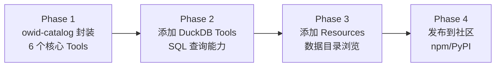

# OWID MCP Server 调研报告

> 调研日期：2026-02-10
> 目标：评估将 owid-catalog Python API 封装为本地 MCP Server 的可行性，以及社区是否已有稳定的解决方案。

## 1. 社区现状：无现成方案

### 1.1 搜索结论

经过多渠道全面搜索，**目前不存在任何社区或官方的 OWID MCP Server 实现**。

| 搜索渠道 | 搜索关键词 | 结果 |
|:---------|:----------|:-----|
| Brave Web Search | `OWID "Our World in Data" MCP server` | 零结果 |
| Brave Web Search | `owid-catalog MCP server GitHub` | 零结果 |
| Brave Web Search | `site:github.com/owid MCP` | 零结果 |
| grep.app (GitHub 代码搜索) | `owid mcp server` | 零结果 |
| Anthropic Claude Plugins 官方市场 | 搜索 OWID 相关 | 无相关插件 |
| npm / PyPI | 搜索 `owid-mcp` | 无相关包 |

### 1.2 OWID 官方态度

OWID 团队目前未发布任何 MCP 相关项目。他们的 AI 集成策略集中在：

- **owid-catalog** Python 库：供数据科学家直接调用
- **Charts API**：REST 风格，面向 Web 集成
- **DuckDB / Datasette**：SQL 接口，面向数据分析
- **Data API (data-api repo)**：RESTful API，DuckDB 后端

---

## 2. 自建方案：技术可行性分析

### 2.1 技术栈选型

| 组件 | 推荐方案 | 说明 |
|:----|:--------|:-----|
| **MCP SDK** | `mcp` (Python SDK) | 官方 SDK，包含 FastMCP 高层 API |
| **数据层** | `owid-catalog` | OWID 官方 Python 库，提供完整的数据访问 API |
| **传输协议** | stdio | 本地 MCP Server 标准模式 |
| **包管理** | `uv` 或 `pip` | 推荐 `uv` 以获得更快的依赖解析 |
| **Python 版本** | ≥ 3.10 | owid-catalog 的最低要求 |

### 2.2 owid-catalog API 映射为 MCP Tools

owid-catalog 的 `Client` 类提供三个核心子 API，可直接映射为 MCP Tools：

```
Client
├── charts     → ChartsAPI     → search() / fetch()
├── tables     → TablesAPI     → search() / fetch()
└── indicators → IndicatorsAPI → search() / fetch()
```

**推荐的 MCP Tool 设计（6 个核心 Tools）：**

| MCP Tool 名称 | 对应 owid-catalog 方法 | 用途 |
|:-------------|:---------------------|:-----|
| `search_charts` | `client.charts.search(query)` | 按关键词搜索已发布的图表 |
| `fetch_chart` | `client.charts.fetch(slug)` | 获取特定图表的数据（CSV 格式） |
| `search_tables` | `client.tables.search(...)` | 搜索 ETL 目录中的数据表 |
| `fetch_table` | `client.tables.fetch(path)` | 按路径获取完整数据表 |
| `search_indicators` | `client.indicators.search(query)` | 语义搜索数据指标 |
| `fetch_indicator` | `client.indicators.fetch(path)` | 获取特定指标的时间序列 |

**可选的附加 Tools：**

| MCP Tool 名称 | 用途 |
|:-------------|:-----|
| `quick_search` | 便捷搜索（封装 `owid.catalog.search`） |
| `quick_fetch` | 便捷获取（封装 `owid.catalog.fetch`，支持 chart slug 和 table path） |
| `query_duckdb` | 直接 SQL 查询 OWID Parquet 文件（高级用户） |

### 2.3 完整实现蓝图

以下是一个完整可运行的 MCP Server 实现：

```python
"""
OWID MCP Server - 封装 owid-catalog Python API 为本地 MCP Server
依赖: pip install mcp owid-catalog
运行: python owid_mcp_server.py
"""
import json
from mcp.server.fastmcp import FastMCP

# 初始化 MCP Server
mcp = FastMCP(
    "owid-data",
    dependencies=["owid-catalog"],
)


@mcp.tool()
def search_charts(query: str, limit: int = 10) -> str:
    """Search for published OWID charts by keyword.

    Args:
        query: Search keywords, e.g. "population growth", "CO2 emissions"
        limit: Maximum number of results to return (default: 10)

    Returns:
        JSON list of matching charts with title, slug, and URL.
    """
    from owid.catalog import Client

    client = Client()
    results = client.charts.search(query)

    output = []
    for r in results[:limit]:
        output.append({
            "title": getattr(r, "title", ""),
            "slug": getattr(r, "slug", ""),
            "url": f"https://ourworldindata.org/grapher/{getattr(r, 'slug', '')}",
        })
    return json.dumps(output, ensure_ascii=False, indent=2)


@mcp.tool()
def fetch_chart(slug: str, format: str = "csv") -> str:
    """Fetch data for a specific OWID chart by its slug.

    Args:
        slug: Chart slug from search results, e.g. "life-expectancy"
        format: Output format - "csv" for tabular data, "json" for metadata

    Returns:
        Chart data in the requested format.
    """
    from owid.catalog import Client

    client = Client()
    tb = client.charts.fetch(slug)

    if format == "json":
        return tb.to_json(orient="records")
    return tb.to_csv()


@mcp.tool()
def search_tables(
    query: str = "",
    namespace: str = "",
    dataset: str = "",
    table: str = "",
    channel: str = "garden",
    limit: int = 10,
) -> str:
    """Search for data tables in OWID's ETL catalog.

    Args:
        query: Free-text search query
        namespace: Filter by data source (e.g. "un", "wb", "who")
        dataset: Filter by dataset name
        table: Filter by table name
        channel: ETL channel - "garden" (cleaned), "meadow" (raw), "grapher"
        limit: Maximum results (default: 10)

    Returns:
        JSON list of matching tables with path and metadata.
    """
    from owid.catalog import Client

    client = Client()
    kwargs = {}
    if namespace:
        kwargs["namespace"] = namespace
    if dataset:
        kwargs["dataset"] = dataset
    if table:
        kwargs["table"] = table
    if channel:
        kwargs["channel"] = channel

    results = client.tables.search(**kwargs)

    output = []
    for r in results[:limit]:
        output.append({
            "path": getattr(r, "path", ""),
            "table": getattr(r, "table", ""),
            "dataset": getattr(r, "dataset", ""),
            "namespace": getattr(r, "namespace", ""),
            "version": getattr(r, "version", ""),
        })
    return json.dumps(output, ensure_ascii=False, indent=2)


@mcp.tool()
def fetch_table(
    path: str,
    columns: str = "",
    countries: str = "",
    limit: int = 100,
) -> str:
    """Fetch a specific data table from OWID catalog by its path.

    Args:
        path: Full table path, e.g. "garden/un/2024-07-12/un_wpp/population"
        columns: Comma-separated column names to include (empty = all)
        countries: Comma-separated country names to filter (empty = all)
        limit: Maximum rows to return (default: 100, use -1 for all)

    Returns:
        Table data in CSV format.
    """
    from owid.catalog import Client

    client = Client()
    tb = client.tables.fetch(path)

    # Filter columns
    if columns:
        cols = [c.strip() for c in columns.split(",")]
        available = [c for c in cols if c in tb.columns]
        if available:
            tb = tb[available]

    # Filter countries
    if countries and "country" in tb.reset_index().columns:
        country_list = [c.strip() for c in countries.split(",")]
        tb = tb.reset_index()
        tb = tb[tb["country"].isin(country_list)]

    # Limit rows
    if limit > 0:
        tb = tb.head(limit)

    return tb.to_csv()


@mcp.tool()
def search_indicators(query: str, limit: int = 10) -> str:
    """Semantic search for data indicators in OWID catalog.

    Uses AI-powered semantic similarity to find relevant indicators.

    Args:
        query: Natural language query, e.g. "renewable energy share"
        limit: Maximum results (default: 10)

    Returns:
        JSON list of matching indicators with name, path, and description.
    """
    from owid.catalog import Client

    client = Client()
    results = client.indicators.search(query)

    output = []
    for r in results[:limit]:
        output.append({
            "name": getattr(r, "name", ""),
            "path": getattr(r, "path", ""),
            "description": getattr(r, "description", ""),
        })
    return json.dumps(output, ensure_ascii=False, indent=2)


@mcp.tool()
def quick_fetch(slug_or_path: str, limit: int = 100) -> str:
    """Quickly fetch OWID data by chart slug or table path.

    This is a convenience tool that auto-detects the input type:
    - Chart slug: e.g. "life-expectancy"
    - Table path: e.g. "garden/un/2024-07-12/un_wpp/population"

    Args:
        slug_or_path: Chart slug or catalog table path
        limit: Maximum rows to return (default: 100)

    Returns:
        Data in CSV format.
    """
    from owid.catalog import fetch

    tb = fetch(slug_or_path)

    if limit > 0:
        tb = tb.head(limit)

    return tb.to_csv()


if __name__ == "__main__":
    mcp.run(transport="stdio")
```

### 2.4 配置与运行

#### 安装依赖

```bash
# 方法一：使用 uv（推荐）
uv pip install mcp owid-catalog

# 方法二：使用 pip
pip install mcp owid-catalog
```

#### 客户端配置（以 Gemini CLI / Claude Desktop 为例）

在 MCP 配置文件中添加：

```json
{
  "mcpServers": {
    "owid-data": {
      "command": "python",
      "args": ["/path/to/owid_mcp_server.py"],
      "env": {}
    }
  }
}
```

或者使用 `uv` 运行（自动管理虚拟环境）：

```json
{
  "mcpServers": {
    "owid-data": {
      "command": "uv",
      "args": [
        "run",
        "--with", "mcp",
        "--with", "owid-catalog",
        "python",
        "/path/to/owid_mcp_server.py"
      ]
    }
  }
}
```

---

## 3. 替代方案对比

### 3.1 方案 A：owid-catalog 封装（推荐）

```
┌─────────────┐     ┌──────────────┐     ┌──────────────┐
│  LLM Agent  │────▶│  MCP Server  │────▶│ owid-catalog │
│  (Claude /  │◀────│  (FastMCP)   │◀────│  (Python)    │
│   Gemini)   │     └──────────────┘     └──────┬───────┘
└─────────────┘                                 │
                                                ▼
                                    ┌───────────────────┐
                                    │  OWID CDN / API   │
                                    │  (Parquet/Feather) │
                                    └───────────────────┘
```

| 优点 | 缺点 |
|:----|:----|
| ✅ 开发简单，~200 行代码 | ❌ 首次查询较慢（需下载 Feather 索引） |
| ✅ 完整利用 OWID 官方 API | ❌ 依赖 owid-catalog 版本兼容性 |
| ✅ 支持语义搜索（indicators） | ❌ 大表返回数据量可能过大（需截断） |
| ✅ 自动处理数据格式转换 | |

### 3.2 方案 B：DuckDB 直连 Parquet

```
┌─────────────┐     ┌──────────────┐     ┌──────────────────┐
│  LLM Agent  │────▶│  MCP Server  │────▶│  DuckDB Engine   │
│             │◀────│  (FastMCP)   │◀────│  (in-process)    │
└─────────────┘     └──────────────┘     └──────┬───────────┘
                                                │  SQL Query
                                                ▼
                                    ┌───────────────────────┐
                                    │ catalog.ourworldindata │
                                    │ .org/garden/...       │
                                    │ (Remote Parquet)      │
                                    └───────────────────────┘
```

```python
# DuckDB 直连示例 Tool
@mcp.tool()
def query_owid_sql(sql: str) -> str:
    """Execute SQL against OWID Parquet catalog via DuckDB.

    Example:
      SELECT country, year, population
      FROM read_parquet('https://catalog.ourworldindata.org/garden/un/2024-07-12/un_wpp/un_wpp.parquet')
      WHERE country = 'China'
      LIMIT 10
    """
    import duckdb
    result = duckdb.sql(sql).df()
    return result.to_csv(index=False)
```

| 优点 | 缺点 |
|:----|:----|
| ✅ 极高性能（列式扫描） | ❌ 需要知道 Parquet 文件 URL |
| ✅ 灵活的 SQL 查询能力 | ❌ 无语义搜索，需精确路径 |
| ✅ 支持聚合、JOIN 等高级操作 | ❌ SQL 注入风险（需沙箱） |
| ✅ 无需 owid-catalog 依赖 | ❌ 缺少元数据/描述信息 |

### 3.3 方案 C：混合方案（最强）

将方案 A 和 B 结合，用 owid-catalog 做搜索和发现，用 DuckDB 做高性能数据查询：

- **搜索/发现**：`search_charts`, `search_tables`, `search_indicators` → owid-catalog
- **数据获取**：`fetch_table`, `query_sql` → DuckDB 直连 Parquet
- **便捷操作**：`quick_fetch` → owid-catalog

---

## 4. 实施建议

### 4.1 推荐路线



**Phase 1（立即可用，~2 小时）：**

- 创建 `owid_mcp_server.py`，实现 6 个核心 Tools
- 在本地 MCP 配置中注册
- 测试基本的搜索和数据获取功能

**Phase 2（增强，~1 小时）：**

- 添加 DuckDB SQL 查询 Tool
- 实现查询结果缓存
- 添加输出行数限制保护

**Phase 3（完善，~2 小时）：**

- 添加 MCP Resources（数据目录、主题列表）
- 添加 MCP Prompts（常用查询模板）
- 错误处理和日志

**Phase 4（社区贡献）：**

- 打包为 PyPI 包
- 编写 README 和使用文档
- 提交到 MCP Server 社区列表

### 4.2 关键注意事项

> [!WARNING]
> **数据量控制**：OWID 某些表可能有上百万行数据，MCP 返回时**必须设置行数限制**（建议默认 100 行），否则会导致 LLM context window 溢出。

> [!IMPORTANT]
> **冷启动延迟**：owid-catalog 首次调用会下载并缓存 Feather 格式的目录索引文件（约 50-100MB），后续调用会使用缓存。建议在 MCP Server 的 `lifespan` 中预热数据。

> [!NOTE]
> **无需 API Key**：OWID 的所有数据和 API 均免费开放，无需认证，数据基于 CC BY 4.0 许可。

---

## 5. 总结

| 维度 | 结论 |
|:----|:-----|
| **社区方案** | ❌ 不存在，OWID 尚未被任何 MCP Server 覆盖 |
| **自建可行性** | ✅ 非常可行，owid-catalog + FastMCP，约 200 行 Python 代码 |
| **推荐方案** | 方案 A（owid-catalog 封装）立即启动，Phase 2 补充 DuckDB |
| **开发成本** | Phase 1 约 2 小时即可完成 |
| **社区价值** | 🌟 若发布，将是首个 OWID MCP Server，填补数据领域空白 |

---

## 参考资料

- [MCP Python SDK (官方)](https://github.com/modelcontextprotocol/python-sdk)
- [FastMCP 文档](https://modelcontextprotocol.github.io/python-sdk/)
- [owid-catalog API 文档](https://docs.owid.io/projects/etl/libraries/catalog/api/)
- [OWID ETL 架构](https://docs.owid.io/projects/etl/architecture/)
- [OWID Data Catalog](https://catalog.ourworldindata.org/)
