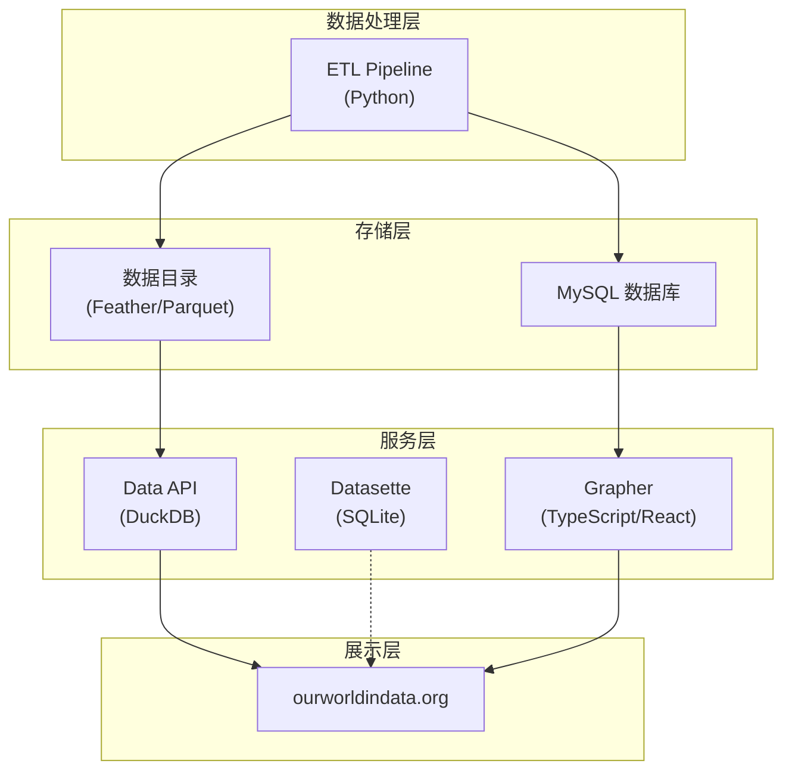
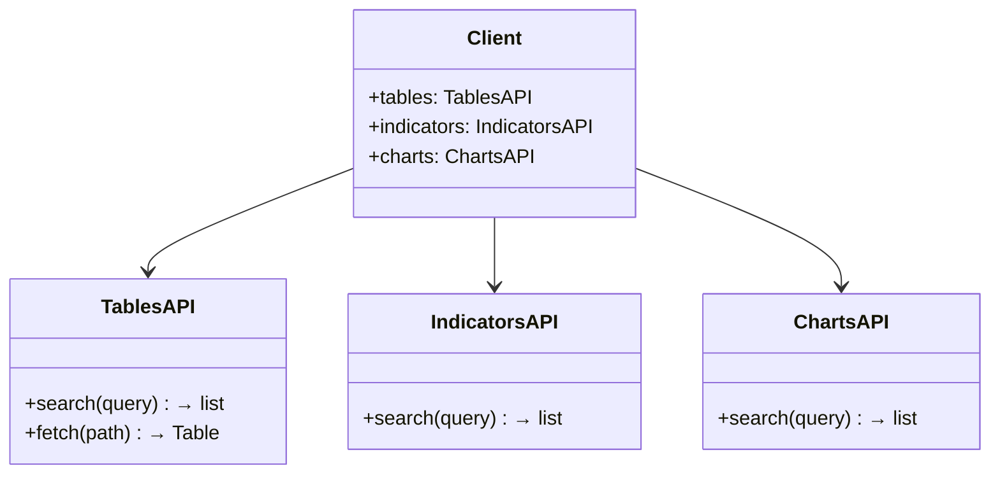

# Our World in Data (OWID) 深度调研报告

> **调研日期**: 2026-02-10
> **信息来源**: OWID 官网、ETL 技术文档、GitHub 仓库、PyPI

---

## 目录

1. [组织概况](#1-组织概况)
2. [数据目录与主题分类](#2-数据目录与主题分类)
3. [技术架构总览](#3-技术架构总览)
4. [ETL 数据管道详解](#4-etl-数据管道详解)
5. [数据访问方式对比](#5-数据访问方式对比)
6. [Python API (owid-catalog) 详解](#6-python-api-owid-catalog-详解)
7. [实战案例](#7-实战案例)
8. [附录：关键资源清单](#8-附录关键资源清单)

---

## 1. 组织概况

### 1.1 基本信息

| 维度 | 详情 |
|------|------|
| **全称** | Our World in Data (OWID) |
| **性质** | 科学在线出版平台 (Scientific Online Publication) |
| **法律实体** | Global Change Data Lab (GCDL)，英国注册慈善机构（Charity No. 1186433） |
| **学术隶属** | 牛津大学 Martin 全球发展项目 (Oxford Martin Programme on Global Development) |
| **官网** | [https://ourworldindata.org](https://ourworldindata.org) |
| **许可证** | 数据与图表: CC BY 4.0；软件工具: MIT License |
| **创办人** | Max Roser (经济学家，牛津大学研究员) |

### 1.2 使命与定位

OWID 的使命是 **"Research and data to make progress against the world's largest problems"**（用研究和数据推动解决世界最大的问题）。核心定位为：

- **数据再出版平台 (Data Republisher)**：从联合国、世界银行、WHO 等上游数据源采集原始数据，经过标准化处理后重新发布
- **可视化研究平台**：将数据转化为交互式图表和深度研究文章
- **开放数据倡导者**：所有数据、图表均以 CC BY 4.0 许可免费开放

### 1.3 核心团队

| 角色 | 姓名 | 职责 |
|------|------|------|
| 创始人 | Max Roser | 整体方向与研究 |
| 研究主管 | Hannah Ritchie | 研究团队管理 |
| 数据主管 | Edouard Mathieu | 数据工程与质量 |

### 1.4 资金来源

OWID 的资金模式为 **多元化资助 + 读者捐赠**：

**主要资助者：**

- Bill and Melinda Gates Foundation（盖茨基金会）
- Quadrature Climate Foundation
- Musk Foundation
- Bloomberg Philanthropies
- FTX Future Fund（已终止）
- Pritzker Innovation Fund
- UK Foreign, Commonwealth & Development Office (FCDO)
- Federal Ministry of Education and Research (BMBF)

**其他来源：**

- 4,000+ 个人读者捐赠
- 牛津大学 Martin School 项目支持

---

## 2. 数据目录与主题分类

OWID 将其研究主题组织为 **10 大一级分类**，涵盖 **100+ 子主题页面**。

### 2.1 主题分类总览

| 序号 | 一级分类 | 子主题数 | 代表性子主题 |
|------|----------|---------|-------------|
| 1 | Population and Demographic Change（人口与人口变化） | 8 | 人口增长、预期寿命、生育率、城市化、移民 |
| 2 | Health（健康） | 34 | 死因、心血管疾病、癌症、心理健康、COVID-19、疫苗、抗生素 |
| 3 | Energy and Environment（能源与环境） | 30 | 气候变化、CO₂排放、能源结构、可再生能源、生物多样性、塑料污染 |
| 4 | Food and Agriculture（食品与农业） | 20 | 农业生产、作物产量、饥饿与营养不良、食品价格、化肥 |
| 5 | Poverty and Economic Development（贫困与经济发展） | 20 | 贫困、经济增长、不平等、外援、税收、贸易全球化 |
| 6 | Education and Knowledge（教育与知识） | 6 | 全球教育、识字率、研发、互联网 |
| 7 | Innovation and Technological Change（创新与技术变革） | 6 | 技术变革、人工智能、太空探索、交通运输 |
| 8 | Living Conditions, Community and Wellbeing（生活条件与福祉） | 14 | 无家可归、能源获取、幸福感、宗教、信任、孤独感 |
| 9 | Human Rights and Democracy（人权与民主） | 9 | 人权、民主、女性权利、LGBT+权利、童工 |
| 10 | Violence and War（暴力与战争） | 7 | 战争与和平、核武器、恐怖主义、凶杀 |

### 2.2 Data Explorers（数据浏览器）

OWID 还提供 **Data Explorer** 工具——可配置的交互式多图表浏览器，允许用户在同一界面内切换相关指标：

| Explorer | 地址 |
|----------|------|
| Poverty Data Explorer | [ourworldindata.org/explorers/poverty-explorer](https://ourworldindata.org/explorers/poverty-explorer) |
| Population & Demography | [ourworldindata.org/explorers/population-and-demography](https://ourworldindata.org/explorers/population-and-demography) |
| Global Health | [ourworldindata.org/explorers/global-health](https://ourworldindata.org/explorers/global-health) |
| Energy | [ourworldindata.org/explorers/energy](https://ourworldindata.org/explorers/energy) |

### 2.3 数据模型

OWID 的数据模型采用三层结构：

```
Dataset (数据集)
  └── Table (表)
       └── Indicator / Variable (指标/变量)
```

- **Dataset**: 顶层容器，代表一个来源或主题的数据集
- **Table**: 数据表，一个 Dataset 可以包含多个 Table
- **Indicator**: 具体的变量列，如 "Life expectancy at birth"

每个层级都附带丰富的元数据（来源、描述、单位、许可证等）。

---

## 3. 技术架构总览

OWID 的技术栈可以分为四个核心系统：



### 3.1 核心仓库

| 仓库                                                            | 语言         | 功能                           | Stars |
| ------------------------------------------------------------- | ---------- | ---------------------------- | ----- |
| [owid/etl](https://github.com/owid/etl)                       | Python     | ETL 数据管道、`owid-catalog` 库    | -     |
| [owid/owid-grapher](https://github.com/owid/owid-grapher)     | TypeScript | 可视化平台、网站、管理后台                | 1.4k+ |
| [owid/data-api](https://github.com/owid/data-api)             | Python     | RESTful Data API (DuckDB 后端) | -     |
| [owid/owid-datasette](https://github.com/owid/owid-datasette) | Python     | Datasette 数据浏览实例             | -     |

### 3.2 技术选型

| 组件 | 技术选择 | 说明 |
|------|----------|------|
| **ETL 管道** | Python | 数据处理、清洗、标准化 |
| **数据存储** | Feather + Parquet | 列存储格式，高效查询 |
| **主数据库** | MySQL | Grapher 图表系统的后端 |
| **查询引擎** | DuckDB | Data API 的 SQL 查询引擎 |
| **可视化** | TypeScript + React + Mobx | 所有代码用 TypeScript 编写 |
| **数据浏览** | Datasette + datasette-parquet | 基于 SQLite/DuckDB 的 Web 界面 |
| **部署** | Hetzner (ETL) + DigitalOcean (Website) | 混合部署架构 |

---

## 4. ETL 数据管道详解

### 4.1 核心设计理念

OWID 作为 **数据再出版平台**，需要从多个上游数据源持续获取、处理、维护数据。ETL 的设计目标是：

1. **可追溯性**: 每一步都可追溯到原始数据源
2. **可重复性**: 所有步骤脚本化，可重复执行
3. **版本控制**: 数据集按日期版本化管理
4. **元数据完整性**: 贯穿整个流程的元数据传递

### 4.2 五阶段工作流


#### Stage 1: Snapshot（快照）

| 维度 | 描述 |
|------|------|
| **目的** | 从上游提供方复制原始数据文件到 OWID 平台 |
| **保障** | 确保上游数据可追溯，即使原始链接失效也可访问 |
| **技术** | DVC 文件 + 下载脚本 |
| **位置** | `snapshots/` 目录 |
| **版本化** | 同一数据集的不同版本按时间快照保存 |
| **命令** | `etls` |

**关键特征**: 每个上游数据文件对应一个 DVC 文件，如果数据源以多个文件发布，则需要创建多个 DVC 文件。

#### Stage 2: Meadow（草地）— 格式化

| 维度 | 描述 |
|------|------|
| **目的** | 将 Snapshot 原始数据转换为统一的内部格式 |
| **输入** | Snapshot 快照文件 |
| **输出** | Dataset 对象（包含一个或多个 Table） |
| **元数据** | 传播 Snapshot 的元数据，很少在此阶段新增 |
| **依赖规则** | 只能依赖 Snapshot 步骤，不能依赖 Garden 或其他步骤 |

#### Stage 3: Garden（花园）— 清洗与标准化

| 维度 | 描述 |
|------|------|
| **目的** | 核心处理阶段：过滤异常值、标准化国家名称、增强元数据 |
| **输入** | 通常依赖 Meadow 步骤，也可依赖其他 Garden 步骤 |
| **输出** | 清洗后的高质量数据集 |
| **元数据** | 定义 Dataset、Table、Indicator 三层元数据（YAML 文件） |

**核心处理任务：**

- 国家名称标准化 (Country Harmonization)
- 异常值过滤
- 数据合并（如长期指标合并多个数据源）
- 元数据增强

**依赖链示例 — 人口指标：**

```yaml
# 长期人口指标依赖多个 Garden 数据源
data://garden/demography/2023-03-31/population:
  - data://garden/hyde/2017/baseline
  - data://garden/gapminder/2023-03-31/population
  - data://garden/un/2022-07-11/un_wpp
  - data://open_numbers/open_numbers/latest/gapminder__systema_globalis
```

#### Stage 4: Grapher（图表）— 数据库适配

| 维度 | 描述 |
|------|------|
| **目的** | 将 Garden 数据集适配为 Grapher 图表系统要求的格式 |
| **输入** | 通常只加载一个 Garden 步骤 |
| **输出** | 适配 MySQL 格式的数据视图 |
| **特殊步骤** | 对应的 `grapher://` 步骤会自动生成，将数据导入 MySQL |
| **工作量** | 应尽量少，主要是格式适配 |

#### Stage 5: Export（导出）— 发布

| 维度 | 描述 |
|------|------|
| **目的** | 将数据发布到系统其他部分，如 Data Explorer 或多维指标 (MDIM) |
| **产物** | Data Explorers、Multi-Dimensional Indicators |

### 4.3 数据路径命名规范

ETL 中的每个数据步骤使用统一的路径标识：

```
data://{channel}/{namespace}/{version}/{dataset}
```

- **channel**: 数据处理阶段（meadow / garden / grapher）
- **namespace**: 数据源命名空间（如 un, who, worldbank）
- **version**: 版本日期（如 2024-07-12）
- **dataset**: 数据集名称

**示例：**

```
data://garden/un/2024-07-12/un_wpp          # Garden 阶段的联合国人口数据
data://meadow/un/2024-07-12/un_wpp          # Meadow 阶段的联合国人口数据
```

### 4.4 CLI 工具

| 命令 | 功能 |
|------|------|
| `etls` | 执行 Snapshot 步骤 |
| `etlr` | 执行数据步骤（Meadow/Garden/Grapher） |

---

## 5. 数据访问方式对比

OWID 提供 **5 种主要数据访问方式**，适用于不同使用场景。

### 5.1 方式对比表

| 方式 | 技术 | 适用场景 | 数据粒度 | 门槛 |
|------|------|----------|---------|------|
| **Charts API** | REST (HTTP) | 获取图表数据 | 按图表 | ⭐ 最低 |
| **Python API** | `owid-catalog` | 编程分析 | 按表/指标 | ⭐⭐ 中等 |
| **DuckDB** | SQL over Parquet | 大数据查询 | 按表 | ⭐⭐⭐ 较高 |
| **Datasette** | Web SQL UI | 交互式浏览 | 按表 | ⭐ 最低 |
| **GitHub CSV** | 直接下载 | 快速获取 | 按仓库 | ⭐ 最低 |

### 5.2 Charts API（图表 API）

**最简单的数据获取方式**——只需在图表 URL 后追加文件扩展名。

| 端点 | 功能 | 示例 |
|------|------|------|
| `GET /grapher/{slug}` | 图表 HTML 页面 | `/grapher/life-expectancy` |
| `GET /grapher/{slug}.csv` | CSV 格式数据 | `/grapher/life-expectancy.csv` |
| `GET /grapher/{slug}.metadata.json` | 元数据（JSON） | `/grapher/life-expectancy.metadata.json` |
| `GET /grapher/{slug}.zip` | 打包下载（CSV + 元数据 + README） | `/grapher/life-expectancy.zip` |
| `GET /grapher/{slug}.config.json` | 图表配置 | `/grapher/life-expectancy.config.json` |
| `GET /grapher/{slug}.readme.md` | 数据说明文档 | `/grapher/life-expectancy.readme.md` |

**优势**: 零编程门槛、URL 直觉化、支持多种输出格式

**示例**:

```bash
# 下载预期寿命数据
curl -O https://ourworldindata.org/grapher/life-expectancy.csv

# 获取元数据
curl https://ourworldindata.org/grapher/life-expectancy.metadata.json | python -m json.tool
```

### 5.3 Python API（owid-catalog）

见 [第 6 节](#6-python-api-owid-catalog-详解) 详细说明。

### 5.4 DuckDB 直查 Parquet

OWID 将 ETL 目录以 **Parquet 格式** 托管在公开 CDN 上，可直接使用 DuckDB 查询。

**URL 模式：**

```
https://catalog.ourworldindata.org/{channel}/{namespace}/{version}/{dataset}/{table}.parquet
```

**示例：**

```sql
-- 查询 Cherry Blossom 数据集的前 100 行
SELECT *
FROM 'https://catalog.ourworldindata.org/garden/biodiversity/2025-04-07/cherry_blossom/cherry_blossom.parquet'
LIMIT 100;

-- 查询人口数据
SELECT country, year, population
FROM 'https://catalog.ourworldindata.org/garden/un/2024-07-12/un_wpp/population.parquet'
WHERE country = 'China'
ORDER BY year DESC
LIMIT 20;
```

**优势**:

- 零下载：DuckDB 使用 HTTP Range Requests 按需读取
- SQL 语法：数据科学家和分析师熟悉
- 高性能：DuckDB 多线程并行查询
- 与 Python/R/Node.js/CLI 均可集成

### 5.5 Datasette 浏览器

OWID 维护一个公共 Datasette 实例：[https://datasette-public.owid.io](https://datasette-public.owid.io)

- 通过 `datasette-parquet` 插件支持 DuckDB 查询 Parquet 文件
- 可直接在 Web 界面运行 SQL 查询
- 支持 CSV 导出

### 5.6 方式选择决策树

```
需要获取 OWID 数据？
│
├── 只需单个图表的数据？
│   └── → Charts API（URL + .csv）
│
├── 需要编程分析（Python）？
│   ├── 简单搜索 + 获取？
│   │   └── → owid-catalog (search / fetch)
│   └── 批量、复杂查询？
│       └── → DuckDB over Parquet
│
├── 需要交互式浏览？
│   └── → Datasette Web UI
│
└── 需要离线分析？
    └── → GitHub CSV 下载 / Parquet 下载
```

---

## 6. Python API (owid-catalog) 详解

### 6.1 基本信息

| 维度 | 详情 |
|------|------|
| **包名** | `owid-catalog` |
| **PyPI** | [pypi.org/project/owid-catalog](https://pypi.org/project/owid-catalog/) |
| **最新版本** | v1.0.0rc2（Release Candidate） |
| **Python 要求** | Python 3.10+ |
| **安装** | `pip install owid-catalog` |
| **所在仓库** | [owid/etl](https://github.com/owid/etl)（已从独立仓库合入 ETL monorepo） |
| **描述** | A Pythonic API for working with OWID's data catalog |

### 6.2 核心组件



### 6.3 使用方式

#### 方式一：Client 对象 (面向对象)

```python
from owid.catalog import Client

client = Client()

# 通过表路径直接获取数据
tb = client.tables.fetch("garden/un/2024-07-12/un_wpp/population")

# 搜索表
results = client.tables.search("population")

# 搜索指标
indicators = client.indicators.search("life expectancy")

# 搜索图表
charts = client.charts.search("GDP per capita")
```

#### 方式二：便捷函数 (快捷方法)

```python
from owid.catalog import search, fetch

# 搜索（默认搜索图表）
results = search("population")

# 获取搜索结果的数据
tb = results[0].fetch()

# 直接通过 chart slug 获取
tb = fetch("life-expectancy")

# 通过表路径获取
tb = fetch("garden/un/2024-07-12/un_wpp/population")

# 通过 Grapher 表路径获取
tb = fetch("grapher/biodiversity/2025-04-07/cherry_blossom/cherry_blossom")
```

### 6.4 表路径格式

```
{channel}/{namespace}/{version}/{dataset}/{table}
```

| 组件 | 说明 | 示例 |
|------|------|------|
| channel | ETL 阶段 | `garden`, `grapher`, `meadow` |
| namespace | 数据源命名空间 | `un`, `who`, `worldbank` |
| version | 版本日期 | `2024-07-12` |
| dataset | 数据集名称 | `un_wpp` |
| table | 表名 | `population` |

### 6.5 返回数据类型

`fetch()` 返回的是 OWID 自定义的 `Table` 对象，本质上是增强版的 Pandas DataFrame：

- 继承 Pandas DataFrame 的所有功能
- 附带丰富的元数据（来源、描述、单位等）
- 支持元数据的自动传递和合并

---

## 7. 实战案例

### 案例 1: 使用 Charts API 获取预期寿命数据

```python
import pandas as pd

# 直接从 URL 读取 CSV
url = "https://ourworldindata.org/grapher/life-expectancy.csv"
df = pd.read_csv(url)

# 筛选中国和美国
df_filtered = df[df['Entity'].isin(['China', 'United States'])]
print(df_filtered.tail(10))
```

### 案例 2: 使用 owid-catalog 搜索并获取数据

```python
from owid.catalog import search, fetch

# 搜索人口相关数据
results = search("world population")
for r in results[:5]:
    print(r)

# 获取联合国人口数据
tb = fetch("garden/un/2024-07-12/un_wpp/population")
print(tb.head())
print(tb.metadata)
```

### 案例 3: 使用 DuckDB 查询 CO₂ 排放数据

```python
import duckdb

conn = duckdb.connect()

query = """
SELECT country, year, co2_per_capita
FROM 'https://catalog.ourworldindata.org/garden/gcp/2023-12-12/global_carbon_budget/global_carbon_budget.parquet'
WHERE country IN ('China', 'United States', 'India')
  AND year >= 2000
ORDER BY country, year
"""

df = conn.execute(query).fetchdf()
print(df)
```

### 案例 4: 使用 R 语言 (owidapi 包)

```r
# install.packages("owidapi")
library(owidapi)

# 通过 chart slug 获取数据
data <- owid_fetch("life-expectancy")
head(data)
```

---

## 8. 附录：关键资源清单

### 8.1 官方网址

| 资源 | 地址 |
|------|------|
| 官网 | [ourworldindata.org](https://ourworldindata.org/) |
| 技术文档 | [docs.owid.io/projects/etl](https://docs.owid.io/projects/etl/) |
| 数据目录 | [ourworldindata.org/data](https://ourworldindata.org/data) |
| Datasette 实例 | [datasette-public.owid.io](https://datasette-public.owid.io/) |
| SDG Tracker | [ourworldindata.org/sdgs](https://ourworldindata.org/sdgs) |

### 8.2 GitHub 仓库

| 仓库 | 用途 |
|------|------|
| [owid/etl](https://github.com/owid/etl) | ETL 管道 + owid-catalog Python 库 |
| [owid/owid-grapher](https://github.com/owid/owid-grapher) | 可视化平台 (TypeScript/React) |
| [owid/data-api](https://github.com/owid/data-api) | Data API (DuckDB 后端) |
| [owid/owid-datasette](https://github.com/owid/owid-datasette) | Datasette 实例配置 |

### 8.3 API 文档

| API | 文档地址 | 功能 |
|-----|----------|------|
| Charts API | [docs.owid.io/projects/etl/api/chart-api](https://docs.owid.io/projects/etl/api/chart-api/) | 图表数据与元数据 |
| Tables API | [docs.owid.io/projects/etl/api/catalog-api](https://docs.owid.io/projects/etl/api/catalog-api/) | ETL 目录表数据 |
| Indicators API | [docs.owid.io/projects/etl/api/semantic-search-api](https://docs.owid.io/projects/etl/api/semantic-search-api/) | 语义搜索指标 |
| Search API | [docs.owid.io/projects/etl/api/search-api](https://docs.owid.io/projects/etl/api/search-api/) | 图表和数据集搜索 |
| Python Library | [docs.owid.io/projects/etl/libraries/catalog/api](https://docs.owid.io/projects/etl/libraries/catalog/api/) | owid-catalog 库文档 |

### 8.4 示例与教程

| 资源 | 地址 |
|------|------|
| Python Colab Notebook | [Google Colab](https://colab.research.google.com/drive/1HDcqCy6ZZ05IznXzaaP9Blvvp3qoPnP8?usp=sharing) |
| Observable JS Notebook | [ObservableHQ](https://observablehq.com/@owid/recreating-the-life-expectancy-chart) |
| ETL 架构文档 | [docs.owid.io/projects/etl/architecture](https://docs.owid.io/projects/etl/architecture/) |
| ETL 工作流 | [docs.owid.io/projects/etl/architecture/workflow](https://docs.owid.io/projects/etl/architecture/workflow/) |
| 国家标准化指南 | [docs.owid.io/projects/etl/guides/harmonize-countries](https://docs.owid.io/projects/etl/guides/harmonize-countries) |

---

> **免责声明**: 本报告基于公开信息整理，信息时效为调研日期。OWID 的 API 和工具仍在活跃开发中，部分内容可能在后续版本中发生变化。
