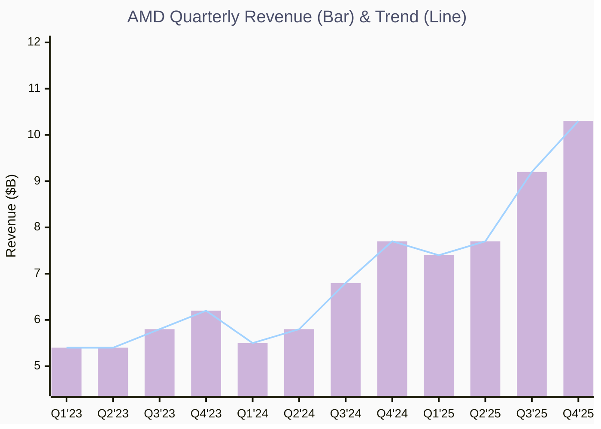
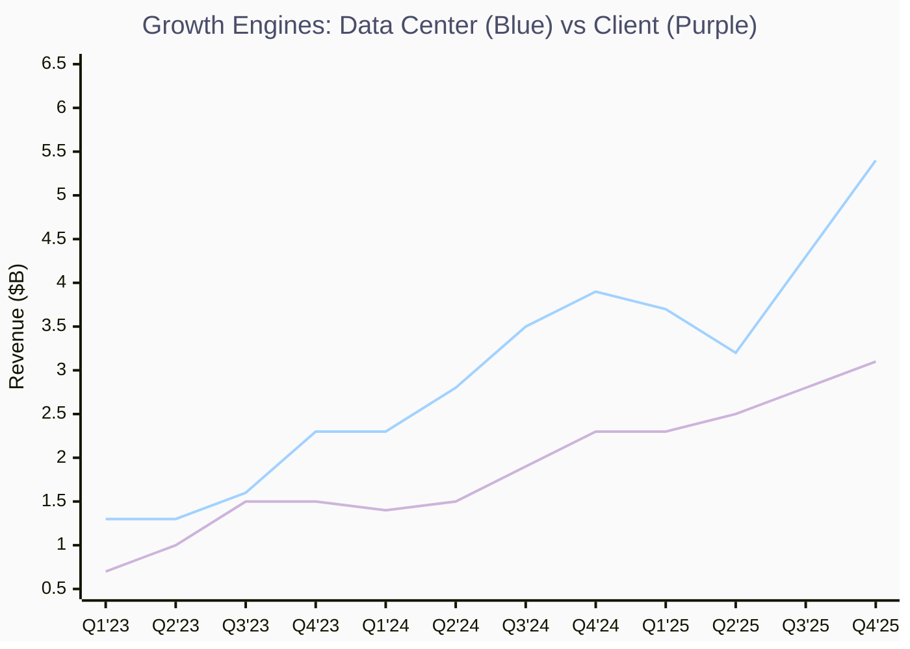
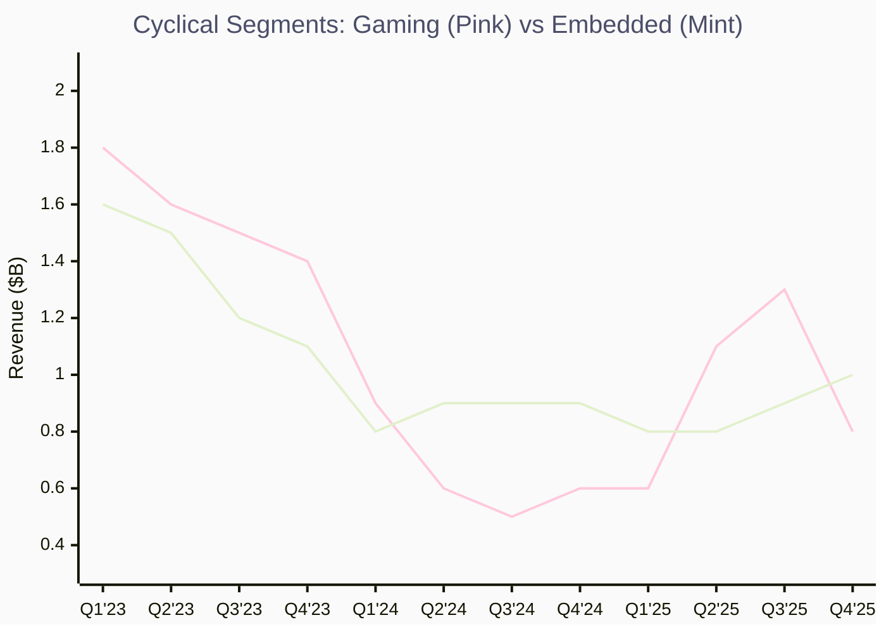
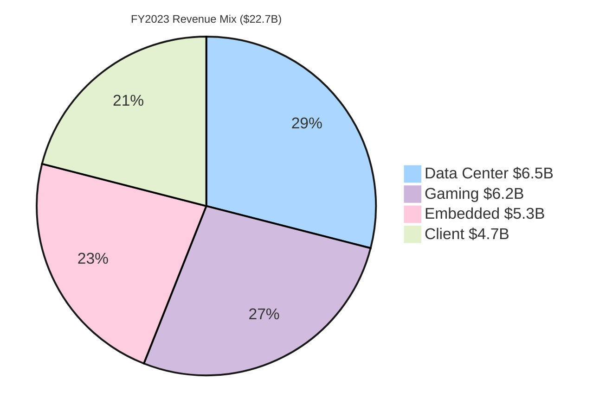
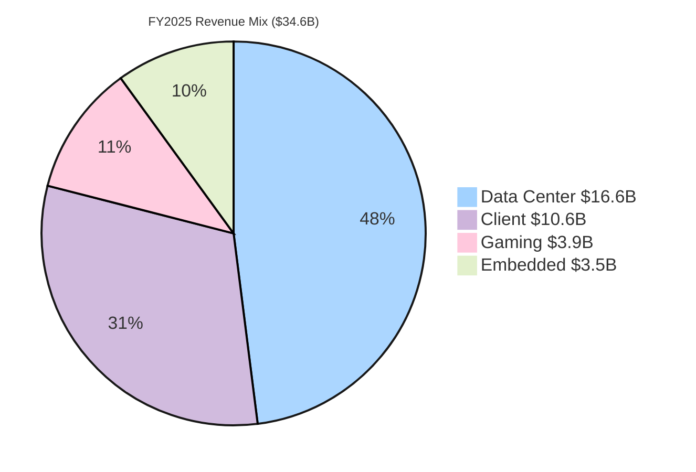
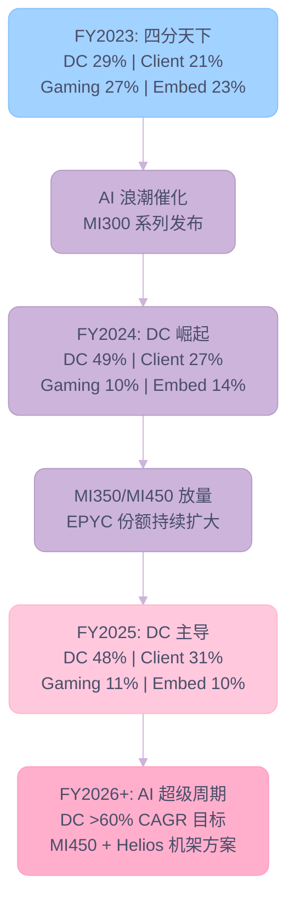
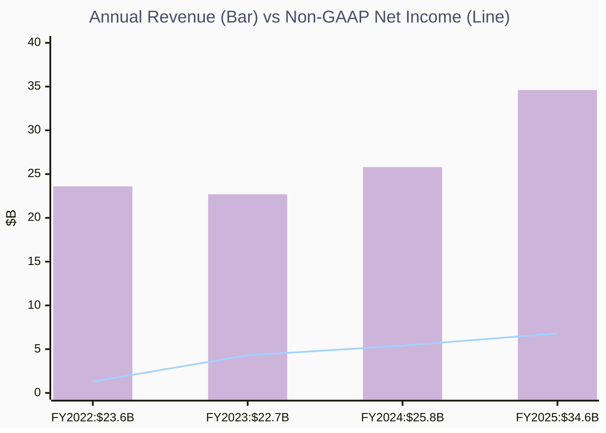
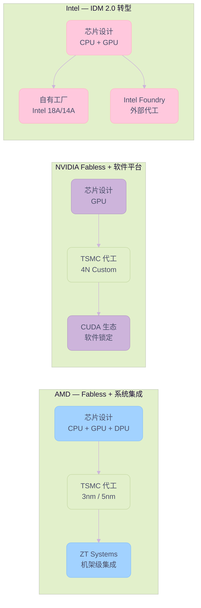

# AMD Q4 FY2025

> **分析日期**：2026-02-11
> **分析师**：2026-02-11
> **数据来源**：AMD IR 季度财报新闻稿、SEC 10-K/10-Q 文件、Q4 FY2025 Earnings Call Transcript
> **分析周期**：FY2023-FY2025（12 个季度 + 3 个完整财年）

---

## 关键发现

> **"2025 年是 AMD 的分水岭之年——不仅完成了业绩的 J 型反转，更确立了其作为全球 AI 基础设施核心双极之一的战略地位。"**

### 1. 战略转型的终局：AI-First 架构确立

AMD 已彻底摆脱过去"四足鼎立"（Data Center, Client, Gaming, Embedded 均衡发展）的格局。**Data Center 业务占比达 48%**（$16.6B），实质上已转型为一家**以 AI 为核心的高性能计算平台公司**。

- **独特性**：收购 ZT Systems 后，AMD 成为全球**唯一**同时拥有顶尖 x86 CPU + 高端 AI GPU + 高性能网络 + 机架级系统交付能力的芯片巨头。这一"全栈能力"是其对抗 Broadcom/Custom ASIC 的最大护城河。

### 2. Data Center 的"双引擎"驱动

不同于 Nvidia 纯依赖 GPU，AMD 拥有独特的双重增长曲线：

- **CPU (EPYC)**：在 Intel Xeon 存量市场持续攻城略地，连续 33 个季度份额增长，且随着 Turin/Venice 发布，TCO 优势持续扩大。
- **GPU (Instinct)**：MI300 证明了 AMD 的交付能力（首年 $5B+），MI350/450 将决定其能否从"第二供货商"升级为"核心战略伙伴"。管理层对 **>60% 长期 CAGR** 的信心表明供需两端均已打通。

### 3. "冰火两重天"的周期错配

当前业绩呈现剧烈的板块分化：

- **Secular Growth (结构性增长)**：Data Center (+39%) 和 Client (+34%) 受 AI 浪潮和换机周期驱动，处于加速上升通道。
- **Cyclical Correction (周期性修正)**：Gaming 和 Embedded 深陷去库存周期。

> [!TIP]
> **洞察**：市场的担忧往往集中在 Gaming/Embedded 的拖累，但**这两块业务的周期性底部已现**。随着 2026 年 Embedded 复苏和 2027 年下一代主机周期启动，原本的"拖油瓶"将转变为现金流极其稳健的"压舱石"，叠加 Data Center 的高爆发，AMD 的盈利弹性将被进一步放大。

### 4. 关键风险与博弈

- **中国市场**：已成"沉没成本"，未来不再指望中国营收贡献，反而消除了最大的地缘政治不确定性。
- **执行风险**：2026 下半年的 MI450 + Helios 机架方案是"生死之战"。这不仅是芯片竞争，更是供应链（CoWoS 产能）、软件栈（ROCm 成熟度）和系统集成能力的综合大考。

### 5. 核心数据速览

| 指标 | FY2025 | YoY 变化 |
|------|--------|----------|
| **总营收** | $34.6B | **+34%** |
| **Non-GAAP 净利润** | $6.8B | **+26%** |
| **Non-GAAP EPS** | $4.17 | **+26%** |
| **Data Center 营收** | $16.6B（占比 48%） | **+32%** |
| **Client & Gaming 营收** | $14.6B（占比 42%） | **+51%** |
| **Embedded 营收** | $3.5B（占比 10%） | **-3%** |
| **Q4 FY2025 单季营收** | $10.3B（创纪录） | **+34%** |
| **Q4 FY2025 自由现金流** | $2.1B（创纪录） | 接近翻倍 |

---

## 一、公司概况

**Advanced Micro Devices, Inc.**（AMD）是全球领先的高性能计算和图形处理半导体公司，总部位于加州圣克拉拉。公司四大业务板块覆盖从数据中心到边缘的全栈计算：

| 维度 | 详情 |
|------|------|
| **CEO** | Dr. Lisa Su（苏姿丰），2014 年上任以来带领 AMD 完成战略转型 |
| **CFO** | Jean Hu（胡建平），负责财务与资本配置 |
| **市值** | ~$180B（截至 2026-02-11） |
| **CIK** | 0000002488 |
| **主要竞争对手** | NVIDIA（GPU/AI）、Intel（CPU/Data Center）、Broadcom（定制芯片） |

### 四大业务板块

1. **Data Center**：EPYC 服务器 CPU + Instinct AI GPU（MI300/MI350/MI450）
2. **Client**：Ryzen 消费级及商用 PC 处理器（包含 Ryzen AI 系列）
3. **Gaming**：Radeon 显卡 + PlayStation/Xbox 半定制 SoC
4. **Embedded**：FPGA、自适应 SoC（来自 Xilinx 收购）、嵌入式 CPU

---

## 二、最新季度财报深度解读（Q4 FY2025）

### 2.1 核心财务数据

| 指标 | Q4 FY2025 | Q4 FY2024 | YoY 变化 | QoQ 变化 |
|------|-----------|-----------|----------|----------|
| **营收** | $10.3B | $7.7B | **+34%** | +11% |
| **毛利率（GAAP）** | 54% | 51% | +300bp | — |
| **毛利率（Non-GAAP）** | 57% | 54% | +290bp | — |
| **营业利润（Non-GAAP）** | $2.9B | $2.0B | **+41%** | — |
| **净利润（Non-GAAP）** | $2.5B | $1.8B | **+42%** | — |
| **EPS（Non-GAAP）** | $1.53 | $1.09 | **+40%** | — |
| **自由现金流** | $2.1B | — | 接近翻倍 | 创纪录 |

> [!NOTE]
> Q4 毛利率包含 $360M MI308 库存拨备回拨。排除该项及 $390M 中国 MI308 营收后，Non-GAAP 毛利率约 55%。

### 2.2 分部业绩

| 分部 | Q4 FY2025 营收 | YoY | QoQ | 营业利润率 |
|------|---------------|-----|-----|-----------|
| **Data Center** | $5.4B | +39% | +24% | 33% |
| **Client** | $3.1B | +34% | +13% | — |
| **Gaming** | $843M | +50% | -35% | — |
| **Embedded** | $950M | +3% | +11% | 38% |

**各分部要点**：

- **Data Center**（$5.4B，占比 52%）：EPYC Turin（第 5 代）占服务器 CPU 营收超过一半；Instinct MI350 系列 GPU 加速交付，覆盖头部 8/10 AI 客户
- **Client**（$3.1B，创纪录）：Ryzen 商用笔记本/台式机出货量同比增长 40%+；赢得多个电信、金融、航空航天大客户
- **Gaming**（$843M）：半定制 SoC 同比增长但环比下降（正常季节性）；Radeon RX 9000 系列假期销售强劲
- **Embedded**（$950M）：测试测量和航空航天需求改善；FY2025 年度设计赢单 $17B（+20% YoY），累计超 $50B

### 2.3 Q1 FY2026 展望

| 指标 | 指引 |
|------|------|
| **营收** | ~$9.8B（±$300M），YoY +32% |
| **毛利率（Non-GAAP）** | ~55% |
| **运营费用** | ~$3.05B |
| **MI308 中国营收** | ~$100M（后续不再预测） |

---

## 三、过去 3 年季度营收变化趋势

### 3.1 总营收季度走势（Q1 2023 - Q4 2025）

| 季度 | 营收（$B） | YoY | QoQ |
|------|-----------|-----|-----|
| Q1 2023 | 5.4 | -9% | — |
| Q2 2023 | 5.4 | -18% | flat |
| Q3 2023 | 5.8 | -4% | +8% |
| Q4 2023 | 6.2 | +10% | +7% |
| Q1 2024 | 5.5 | +2% | -11% |
| Q2 2024 | 5.8 | +9% | +7% |
| Q3 2024 | 6.8 | +18% | +16% |
| Q4 2024 | 7.7 | +24% | +13% |
| Q1 2025 | 7.4 | +36% | -3% |
| Q2 2025 | 7.7 | +32% | +4% |
| Q3 2025 | 9.2 | +36% | +20% |
| Q4 2025 | 10.3 | +34% | +11% |

**Key Insights:**

- 🏆 **增长加速**：从 FY2023 低谷的同比下滑到 FY2025 连续四季度 30%+ YoY 增长，呈现 J 型复苏曲线
- 📈 **季度级别跨越**：单季营收从 $5.4B 攀升至 $10.3B，3 年内接近翻倍
- ⚠️ **Q1 季节性**：Q1 2024 和 Q1 2025 均出现环比下滑，反映 PC / 嵌入式业务的季节性模式

### 3.2 季度分部营收明细

| 季度 | Data Center | Client | Gaming | Embedded | 总计 |
|------|-------------|--------|--------|----------|------|
| Q1 2023 | 1.3 | 0.7 | 1.8 | 1.6 | 5.4 |
| Q2 2023 | 1.3 | 1.0 | 1.6 | 1.5 | 5.4 |
| Q3 2023 | 1.6 | 1.5 | 1.5 | 1.2 | 5.8 |
| Q4 2023 | 2.3 | 1.5 | 1.4 | 1.1 | 6.2 |
| Q1 2024 | 2.3 | 1.4 | 0.9 | 0.8 | 5.5 |
| Q2 2024 | 2.8 | 1.5 | 0.6 | 0.9 | 5.8 |
| Q3 2024 | 3.5 | 1.9 | 0.5 | 0.9 | 6.8 |
| Q4 2024 | 3.9 | 2.3 | 0.6 | 0.9 | 7.7 |
| Q1 2025 | 3.7 | 2.3 | 0.6 | 0.8 | 7.4 |
| Q2 2025 | 3.2 | 2.5 | 1.1 | 0.8 | 7.7 |
| Q3 2025 | 4.3 | 2.8 | 1.3 | 0.9 | 9.2 |
| Q4 2025 | 5.4 | 3.1 | 0.8 | 1.0 | 10.3 |

> 单位：$B。Client & Gaming 在 FY2025 合并报告，上表中已拆分为独立分部。

#### 增长引擎：Data Center (Blue) vs Client (Purple)

**Key Insights:**

- 🏆 **Data Center 一飞冲天**：从 Q1 2023 的 $1.3B 飙升至 Q4 2025 的 $5.4B，3 年增长 315%
- 📈 **Client 稳步攀升**：从 $0.7B 底部恢复至 $3.1B 纪录，得益于 Ryzen "Zen 5" 架构和商用市场份额扩张

#### 周期性业务：Gaming (Pink) vs Embedded (Mint)

**Key Insights:**

- ⚠️ **Gaming 高度波动**：受主机周期（PlayStation/Xbox 第 7 年）和半定制 SoC 采购节奏影响，从 $1.8B 高点跌至 $0.5B 再回弹
- 📉 **Embedded 仍在筑底**：从 Q1 2023 的 $1.6B 高点跌至 $0.8-1.0B 区间，但 $50B+ 设计赢单储备预示长期复苏

---

## 四、营收结构变迁分析

### 4.1 年度营收结构对比

| 分部 | FY2022 | FY2023 | FY2024 | FY2025 |
|------|--------|--------|--------|--------|
| **Data Center** | $6.0B（26%） | $6.5B（29%） | $12.6B（49%） | $16.6B（48%） |
| **Client** | $6.2B（26%） | $4.7B（21%） | $7.1B（27%） | $10.6B（31%） |
| **Gaming** | $6.8B（29%） | $6.2B（27%） | $2.6B（10%） | $3.9B（11%） |
| **Embedded** | $4.6B（19%） | $5.3B（23%） | $3.6B（14%） | $3.5B（10%） |
| **总计** | $23.6B | $22.7B | $25.8B | $34.6B |

### FY2023 营收结构

### FY2025 营收结构

**Key Insights:**

- 🏆 **Data Center 主导地位确立**：从 FY2023 占 29% 跃升至 FY2025 占 48%，EPYC CPU + Instinct GPU 双引擎驱动
- 📈 **Client 份额回升**：从 21% 回升至 31%，Ryzen 处理器的 ASP（平均售价）提升 + 商用市场渗透是关键驱动力
- 📉 **Gaming 大幅萎缩**：从 27% 降至 11%，主机周期进入第 7 年，半定制 SoC 采购放缓
- ⚠️ **Embedded 缩水过半**：从 23% 缩至 10%，工业/通信市场需求疲软和客户库存去化导致

### 4.2 结构变迁的战略含义

AMD 的营收结构在过去 3 年经历了**根本性重塑**，从一家"四足鼎立"的半导体公司转变为**以 Data Center 为核心的 AI 计算平台公司**。

**转型的三大驱动力**：

1. **EPYC 服务器 CPU 持续抢占 Intel 份额**：连续 33 个季度服务器 CPU 市场份额同比增长（截至 Q2 2025）；FY2025 超 1,600 个 EPYC 云实例上线，较前一年增长 50%+
2. **Instinct GPU 快速起量**：MI300 系列自 Q4 2023 开始出货，FY2024 贡献超 $5B 营收；MI350 系列已覆盖头部 8/10 AI 客户
3. **Gaming 半定制周期性下行 + Embedded 库存调整**：非自身业务能力问题，而是行业周期的自然结果

---

## 五、Earnings Call 深度解读（Q4 FY2025）

### 5.1 管理层核心表态

**Lisa Su（CEO）关键发言**：

> "2025 was a defining year for AMD, with record revenue and earnings driven by strong execution and broad-based demand for our high-performance and AI platforms."

> "We are entering 2026 with strong momentum across our business, led by accelerating adoption of our high-performance EPYC and Ryzen CPUs and the rapid scaling of our data center AI franchise."

**Jean Hu（CFO）关键发言**：

> "Our record fourth quarter and full-year results demonstrate AMD's ability to deliver profitable growth at scale. We achieved record non-GAAP operating income and free cash flow."

### 5.2 Q&A 关键问答精粹

#### Q: Data Center 营收能否在 2026 年达到 60%+ 增长目标？

**Lisa Su**：长期 DC 营收 >60% CAGR 目标在 2026 年"certainly possible"。驱动力包括：

- EPYC Turin + Genoa 持续放量，Venice（下一代）下半年发布将"extends our leadership"
- MI450 将在 FY2026 下半年"非常显著地"放量
- 虽然不对分部做具体指引，但对 DC 整体保持"非常乐观"

#### Q: 中国 MI308 营收展望？

**Lisa Su**：Q4 的 $390M 来自早期获批许可，是"非经常性"质。Q1 指引 $100M，此后"不再预测任何中国额外收入"——因为"it's a very dynamic situation"。MI325 许可证已提交，但结果不确定。

#### Q: 服务器 CPU 供应能力？

**Lisa Su**：需求强劲，公司已经增加了 TSMC 等供应链伙伴的产能。Q1 指引中服务器业务环比增长正是供应改善的体现。整体服务器 CPU TAM 在 2026 年将呈"strong double-digit"增长。

#### Q: 毛利率趋势？

**Jean Hu**：每一代产品都提供更多能力，因此长期看各代产品毛利率应逐代提升。但新产品初期放量时可能偏低，随着规模、良率和测试改进而提升。Q1 55% 毛利率是"很干净的指引"（不含拨备影响）。

#### Q: PC 市场 2026 展望？

**Lisa Su**：PC TAM 可能因内存等组件涨价而"下降一些"，下半年"略低于季节性"。但 AMD 仍有信心实现 PC 业务增长——聚焦点在**企业市场**和**高端/Premium 市场**。

#### Q: Gaming 下行幅度？

**Jean Hu**：2026 年半定制 SoC 营收将出现"significant double-digit decline"，因为这是当前主机周期的第 7 年。下一代 Xbox（搭载 AMD SoC）预计 2027 年推出。

#### Q: 面对 ASIC 竞争（如 Google TPU、定制芯片）的应对？

**Lisa Su**：AI 市场成熟后将出现更多"workload-optimized"方案，AMD 拥有"full compute stack"（GPU + CPU + 网络），triplet 架构在推理和训练场景均具灵活性。未来将"lean into inference as a significant opportunity"。

### 5.3 管理层发出的风险信号

| 风险项 | 管理层原话 / 指引 | 严重程度 |
|--------|------------------|----------|
| **中国出口管制** | "Very dynamic situation"，不再预测 Q1 后中国收入 | 🟡 中等 |
| **Gaming 周期下行** | 半定制 SoC 2026 年"significant double-digit decline" | 🟡 中等 |
| **运营费用快速增长** | Q4 OpEx 同比增长 42%，R&D / 市场推广投入加大 | 🟢 可控 |
| **PC 市场 TAM 压力** | 组件涨价导致 PC TAM 可能下滑 | 🟢 轻微 |
| **AI GPU 竞争加剧** | NVIDIA 及 ASIC 方案持续迭代 | 🟡 中等 |

---

## 六、年度财务健康评估

### 6.1 年度损益表摘要

| 指标 | FY2022 | FY2023 | FY2024 | FY2025 |
|------|--------|--------|--------|--------|
| **营收** | $23.6B | $22.7B | $25.8B | $34.6B |
| **毛利润** | $11.1B | $10.5B | $12.7B | $17.2B |
| **毛利率** | 47% | 46% | 49% | 50% |
| **Non-GAAP 毛利率** | — | 50% | 53% | 52% |
| **研发费用** | $5.0B | $5.9B | $6.1B | $7.3B |
| **营业利润** | $1.3B | $0.4B | $1.9B | $3.7B |
| **Non-GAAP 营业利润** | — | $4.9B | $6.1B | $7.8B |
| **净利润** | $1.3B | $0.9B | $1.6B | $4.3B |
| **Non-GAAP 净利润** | — | $4.3B | $5.4B | $6.8B |
| **Non-GAAP EPS** | — | $2.65 | $3.31 | $4.17 |

**Key Insights:**

- 🏆 **盈利能力飞跃**：Non-GAAP 净利润从 FY2022 的 $1.3B 增长至 FY2025 的 $6.8B，CAGR 达 73%
- 📈 **营收加速**：FY2025 营收同比 +34%，增速较 FY2024 的 +14% 显著加快
- ⚠️ **GAAP vs Non-GAAP 差距**：无形资产摊销和股权激励导致 GAAP 净利润（$4.3B）远低于 Non-GAAP（$6.8B）

### 6.2 资产负债表要点（Q4 FY2025 末）

| 指标 | 数值 |
|------|------|
| **现金及短期投资** | $10.6B |
| **存货** | $7.9B |
| **长期债务** | ~$3.2B |
| **股票回购** | FY2025 回购 12.4M 股，返还 $1.3B；剩余授权 $9.4B |

### 6.3 自由现金流

| 年度 | 自由现金流指标 |
|------|---------------|
| **FY2025 Q4** | 单季 $2.1B（创纪录） |
| **FY2025 全年** | 显著增长，支撑 $1.3B 回购 |

---

## 七、竞争格局与战略定位

### 7.1 Data Center AI 竞争矩阵

| 竞争对手 | 优势 | AMD 的应对策略 |
|----------|------|---------------|
| **NVIDIA** | H100/B200 生态系统壁垒深厚，CUDA 锁定 | ROCm 开源策略 + vLLM 原生支持；MI450 + Helios 机架方案差异化 |
| **Intel** | Xeon 存量客户基础庞大 | EPYC 连续 33 季度份额增长，TCO 优势持续扩大 |
| **Google TPU** | 定制化 AI 芯片，成本优化 | Instinct 系列多产品线覆盖（MI430X/MI440X/MI450/MI455X）|
| **Broadcom** | 定制 ASIC 合作模式 | 全栈计算能力（CPU + GPU + NIC）+ 系统级交付（ZT Systems） |

### 7.2 AMD 的差异化优势

1. **唯一同时拥有 x86 CPU + GPU + 网络 + 系统能力的厂商**（收购 ZT Systems 后）
2. **Chiplet 架构领先**：CDNA 3/4 GPU + "Zen 5" CPU 的异构计算方案
3. **开放生态**：ROCm 开源 + vLLM + PyTorch 原生支持 vs NVIDIA 的封闭 CUDA
4. **全栈机架方案**：Helios 机架 = Instinct MI450 GPU + EPYC Venice CPU + Pensando Vulcano NIC

---

## 八、AI 战略与合作伙伴深度解析

> AMD 正在从一家"卖芯片的公司"转型为"构建 AI 基础设施生态系统的平台公司"。其 AI 战略的核心逻辑是：**以开放生态对抗封闭垄断，以全栈方案取代单点器件**。

### 8.1 与顶级 AI 模型开发商的战略合作

#### 8.1.1 OpenAI — 史诗级合作（6 Gigawatt / 多代产品）

2025 年，AMD 与 OpenAI 达成了 AI 行业**有史以来规模最大的硬件合作协议之一**：

| 维度 | 详情 |
|------|------|
| **合作规模** | 6 Gigawatt（6GW）GPU 部署，涵盖多代产品线 |
| **产品路线** | MI300X → MI350X → MI450 系列 → 未来迭代 |
| **合作模式** | 核心战略计算伙伴（Core Strategic Compute Partner） |
| **战略意义** | OpenAI 首次将 AMD 提升为与 NVIDIA 并列的核心硬件供应商 |
| **潜在投资** | 据报道 AMD 可能对 OpenAI 持股，深化利益绑定 |

> [!IMPORTANT]
> 这笔交易的战略意义远超营收数字本身——它打破了 NVIDIA 在超大规模 AI 训练市场的"唯一供货商"地位，证明 AMD 的 Instinct GPU + ROCm 软件栈已达到**生产级部署标准**。OpenAI 将与 AMD 共同优化产品路线图（co-optimize roadmaps），这意味着 AMD 未来的 GPU 架构将直接反映世界最大 AI 实验室的需求。

#### 8.1.2 Meta — 大规模 AI 推理部署

Meta 是 AMD Instinct GPU 最早的大规模采用者之一：

- **MI300X** 已在 Meta 数据中心大规模部署，主要用于 **Llama 系列模型的推理加速**
- Meta 的公开基准测试显示，MI300X 在特定推理场景下的性价比优于 NVIDIA H100
- ROCm 对 PyTorch（由 Meta 主导开发）的原生支持，极大降低了 Meta 的迁移成本

#### 8.1.3 xAI（Elon Musk）— 高密度 GPU 集群

Elon Musk 的 xAI 已将 AMD Instinct GPU 纳入其 **Colossus 超级计算集群**的扩展计划：

- xAI 采用 NVIDIA + AMD 双供应商策略，以降低单一供应商风险
- AMD 的开放生态（ROCm + vLLM）与 xAI 偏好开源的技术理念高度契合

#### 8.1.4 Microsoft Azure — 云端 AI 加速

Microsoft Azure 已将 AMD Instinct MI300X 纳入其 **ND MI300X v5** 虚拟机系列：

- 面向企业客户提供基于 AMD GPU 的 AI 训练和推理服务
- Azure 的多供应商 GPU 策略（NVIDIA + AMD + 自研 Maia）为 AMD 提供了稳定的云端出货渠道

#### 8.1.5 HUMAIN（沙特阿拉伯）— $10B 主权 AI 基础设施

2025 年 5 月，在 Trump 总统访问沙特期间，AMD CEO Lisa Su 与 HUMAIN CEO Tareq Amin 共同宣布：

| 维度 | 详情 |
|------|------|
| **合作规模** | $10B，5 年期 |
| **算力部署** | 初期 50MW（Q4 2025），扩展至 500MW+ |
| **产品覆盖** | Instinct GPU + EPYC CPU + Pensando DPU + Ryzen AI Edge |
| **软件栈** | ROCm 开放生态，支持 PyTorch / SGLang 等主流框架 |
| **算力目标** | 2026 年初实现 Multi-Exaflop 计算能力 |
| **战略意义** | 主权 AI 市场首个全栈供应商级别合作，开辟 NVIDIA 薄弱地带 |

> [!TIP]
> HUMAIN 交易的独特价值在于：(1) **全栈部署**——这是 AMD 收购 ZT Systems 和 Pensando 后首次展示完整的"芯片到机架"交付能力；(2) **主权 AI 市场先发**——中东/东南亚的主权 AI 基建需求正在爆发，NVIDIA 在这些市场的覆盖相对薄弱；(3) **地缘多元化**——减少对中国市场的依赖，获得中东资本的长期支持。

### 8.2 AI GPU 产品路线图

| 产品 | 架构 | 制程 | 发布时间 | 关键升级 |
|------|------|------|----------|----------|
| **MI300X** | CDNA 3 | TSMC 5nm / 6nm | Q4 2023 | 192GB HBM3，首代大规模部署 |
| **MI325X** | CDNA 3 | TSMC 5nm / 6nm | Q1 2025 | 256GB HBM3E，带宽提升 40% |
| **MI350** 系列 | CDNA 4 | TSMC 3nm | 2025 H2 | **推理性能提升 35x**（vs MI300），4x AI 计算提升 |
| **MI450** 系列 | CDNA Next | TSMC 3nm+ | 2026 H2 | 机架级方案（Helios），OpenAI 核心合作产品 |
| **MI500** 系列 | 下一代 | 待定 | 2027+ | 规划中 |

### 8.3 ROCm 软件生态：AMD 的阿喀琉斯之踵与破局之路

ROCm（Radeon Open Compute）是 AMD 对抗 NVIDIA CUDA 生态的核心软件平台。客观评估：

**现状差距：**

- CUDA 拥有 **18 年** 的先发优势（2007 年推出），ROCm 仅 **10 年**（2016 年推出）
- CUDA 性能优势从此前的 40-50% 缩小到 **10-30%**，但在高并发场景差距仍然显著
- 开发者生态差距明显：CUDA 拥有数百万开发者、数千个优化库；ROCm 社区仍在早期阶段
- 框架兼容性：PyTorch 已**官方支持** ROCm，但 TensorFlow 等框架的 ROCm 支持仍落后数月

**破局策略：**

- **ROCm 7.0**：承诺 3x 性能提升，更好的消费级 GPU 和 Windows 支持
- **开源差异化**：ROCm 完全开源 vs CUDA 闭源，吸引主权 AI 和学术机构
- **框架原生集成**：与 PyTorch、vLLM、SGLang 等高增长推理框架深度合作
- **客户联合优化**：与 OpenAI、Meta 等客户共同调优，用"大客户背书"弥补生态广度不足

### 8.4 全栈 AI 方案的并购逻辑

AMD 通过三次关键收购，构建了**从芯片到系统**的完整 AI 基础设施能力：

| 收购 | 时间 | 金额 | 获得能力 | 战略价值 |
|------|------|------|----------|----------|
| **Xilinx** | 2022 | $49B | FPGA、自适应计算 | Embedded 市场 + 边缘 AI |
| **Pensando** | 2022 | $1.9B | DPU（数据处理单元）| 网络加速、安全卸载 |
| **ZT Systems** | 2025 H1 | $4.9B | 机架级 AI 系统集成 | "芯片到机架"交付，加速客户部署 |

> [!NOTE]
> ZT Systems 收购的核心逻辑：过去 AI 集群从订单到生产需要"数个季度"，ZT Systems 的系统集成能力将这一周期大幅缩短。Lisa Su 预计该收购将在 **2025 年底 / 2026 年初**开始贡献利润。同时，CEO Lisa Su 的 ZT Systems 联手 Pensando 网络团队，将为 Helios 机架方案提供软硬件一体的竞争力。

---

## 九、Trump 产业政策影响分析

> 2025-2026 年的 Trump 产业政策正在深刻重塑全球半导体格局。对 AMD 而言，这既是挑战（关税成本、出口限制），也是机遇（国产化激励、竞争对手制衡）。

### 9.1 关税政策：最直接的成本冲击

2026 年 1 月 14 日，Trump 签署行政命令，对特定高性能 AI 芯片征收 **25% 进口关税**：

| 维度 | 详情 |
|------|------|
| **法律依据** | Section 232（贸易扩展法），以国家安全为由 |
| **涵盖产品** | NVIDIA H200、AMD MI325X 等满足特定性能基准的 AI 芯片 |
| **政策目标** | 激励芯片制造商在美国本土生产（Domestic Manufacturing Incentive） |
| **豁免条件** | 承诺在美国建设制造产能的企业可申请豁免（细则待定） |
| **后续预警** | 白宫声明未来可能对"更广泛的半导体及其衍生产品"征收更高关税 |

**对 AMD 的影响评估：**

| 维度 | 分析 |
|------|------|
| **成本传导** | AMD 是 Fabless 公司，100% 依赖 TSMC 代工（台湾/亚利桑那），芯片进口将承受 25% 额外成本 |
| **竞争公平性** | NVIDIA 同样受影响（H200 也在征税范围内），竞争格局未根本改变 |
| **转嫁能力** | AI 芯片需求远超供给，AMD 有一定能力将成本转嫁至下游客户 |
| **本土制造激励** | TSMC 亚利桑那工厂（Fab 21）正在建设中，首批 2nm 产能预计 2026-2027 年投产 |

> [!WARNING]
> 关税政策的最大不确定性在于"后续扩展"——如果 Trump 将 25% 关税扩展至所有进口半导体，而非仅限于高端 AI 芯片，AMD 的 Client 和 Embedded 业务将面临更广泛的成本压力。不过，由于 NVIDIA、Qualcomm 等竞争对手同样依赖 TSMC 代工，这一政策理论上不会改变 AMD 的相对竞争地位。

### 9.2 出口管制：中国市场已成"沉没成本"

| 政策节点 | 内容 | 对 AMD 影响 |
|----------|------|------------|
| **2022 年 10 月** | Biden 政府首次限制高端 AI 芯片对华出口 | MI250 受限，开始开发"中国特供版" |
| **2023 年 10 月** | 出口管制升级，性能阈值进一步收紧 | MI308（降规版）可合规出口 |
| **2025 年 Q4** | MI308 获得早期特批，出货 $390M | 一次性事件，非经常性收入 |
| **2026 年 Q1** | 管理层指引仅 $100M，此后不再预测中国收入 | Lisa Su：""Very dynamic situation" |

**战略应对**：AMD 管理层已明确表态——**不再将中国市场纳入增长预测**。这实质上将"中国市场不确定性"从估值风险中剥离，转而将战略重心移向中东（HUMAIN）和东南亚的主权 AI 基础设施市场。

> [!NOTE]
> FY2025 出口管制对 AMD 的直接财务影响约 $1.5B（含减值和库存拨备），但 Q4 $360M MI308 库存拨备回拨表明此前计提偏保守。长期看，中国市场的丧失反而消除了 AMD 最大的地缘政治"暗雷"，使其估值体系更加清晰。

### 9.3 CHIPS Act 演变：从补贴到股权投资

Trump 政府对 CHIPS Act 的执行方式发生了重大转变：

| 维度 | Biden 时期 | Trump 时期 |
|------|-----------|-----------|
| **执行模式** | 直接拨款（Grants） | 转为股权投资（Equity） |
| **Intel 案例** | 计划拨付 $8.5B 补贴 | 改为 $8.9B 购买 Intel 9.9% 股权（$20.47/股） |
| **资金来源** | CHIPS Act 专项拨款 | CHIPS Act 未拨付余额 + DoD Secure Enclave |
| **对 AMD 影响** | 间接——AMD 作为 Fabless 不直接获得补贴 | Intel 获得政府资本注入 + NVIDIA $5B 投资，供应链格局复杂化 |

**AMD 的定位**：

- AMD 本身不从 CHIPS Act 直接获益（Fabless 模式无自有工厂）
- 但 AMD 的核心代工伙伴 **TSMC** 在亚利桑那的工厂投资（总计 $100B+）将受益于 CHIPS Act 激励
- 如果 TSMC 亚利桑那产线达产，AMD 有可能在美国本土获得先进制程产能，**从而规避未来可能的半导体关税**

### 9.4 地缘战略：Trump 中东之行与 AMD 的全球化布局

2025 年 5 月 Trump 访问沙特阿拉伯期间，AMD CEO Lisa Su 亲自出席了 Saudi-US Investment Forum，当面与 Trump 总统及沙特王储 MBS 会晤。$10B HUMAIN 交易在此背景下宣布，具有明确的**地缘政治配合**属性：

- **Trump 议程**：展示美国科技公司在中东的扩张作为外交成果
- **沙特议程**：通过"硅多元化"（Silicon Diversity）策略避免过度依赖 NVIDIA
- **AMD 议程**：获得中东主权资本支持 + 开辟新的增量市场

> [!TIP]
> 在 Trump 产业政策的大框架下，AMD 的定位颇为有利：(1) 作为 Fabless 公司，它不需要像 Intel 那样承担数百亿美元的工厂建设成本；(2) 它的主要供应商 TSMC 正在积极扩建美国产能；(3) 中东与东南亚的主权 AI 基建开支正在爆发，AMD 已通过 HUMAIN 等交易抢占先机。**核心风险在于关税扩展至所有半导体的可能性**——这将直接压缩毛利率，但从竞争对等角度看，NVIDIA 和 Qualcomm 将承受相同压力。

---

## 十、竞争对比：AMD vs NVIDIA vs Intel

> 这三家公司代表了半导体行业的三种截然不同的商业模式和竞争策略。理解它们的差异是评估 AMD 投资价值的关键。

### 10.1 商业模式对比

### 10.2 核心维度对比

| 维度 | AMD | NVIDIA | Intel |
|------|-----|--------|-------|
| **商业模式** | Fabless + 系统集成 | Fabless + 软件平台 | IDM（自有工厂 + 外包） |
| **FY2025 营收** | $34.6B | ~$130B | ~$53B（含 Foundry） |
| **毛利率** | 52%（Non-GAAP） | ~75% | ~40%（整体） |
| **AI GPU 营收** | ~$9.5B（FY2025E） | ~$100B+（Data Center） | <$1B（Gaudi 系列） |
| **CPU 市场地位** | 服务器份额稳步上升至 ~25% | 无（Grace ARM 起步） | 服务器份额 ~70%（下行中） |
| **制程节点** | TSMC 3nm / 5nm | TSMC 4N Custom | Intel 18A（自有）+ TSMC |
| **软件生态** | ROCm（开源，追赶中） | CUDA（闭源，统治级） | oneAPI（起步阶段） |
| **网络能力** | Pensando DPU | Mellanox InfiniBand | 有限 |
| **系统集成** | ZT Systems（机架级） | DGX / HGX 参考设计 | 有限 |

### 10.3 芯片设计能力对比

#### CPU 设计

| 维度 | AMD（EPYC / Ryzen） | Intel（Xeon / Core Ultra） |
|------|---------------------|---------------------------|
| **架构** | Zen 5（当前）→ Zen 6（2026） | Lion Cove + Skymont（异构） |
| **Chiplet 策略** | 业界领先，多 CCD + IOD 设计 | 逐步采纳 Tile 架构 |
| **核心密度** | Turin：最高 192 核（标准 2P） | Granite Rapids：最高 128 核 |
| **TCO 优势** | 能效比持续领先，云厂商偏好 | 存量客户基础大，迁移成本高 |
| **市场份额** | 连续 33 个季度增长 | 持续下降，但仍占 ~70% |

#### AI GPU 设计

| 维度 | AMD（Instinct） | NVIDIA（H/B/Blackwell 系列） |
|------|----------------|--------------------------|
| **当代旗舰** | MI350 系列（CDNA 4, 3nm） | B200 / B300（Blackwell, 4N） |
| **理论算力** | MI300X: 1,307 TFLOPS | H100: 990 TFLOPS（但实际性能更优） |
| **推理性能** | MI350: 35x vs MI300（声称） | B200: 4x vs H100（实测） |
| **HBM 容量** | MI300X: 192GB HBM3 | H200: 141GB HBM3E |
| **互连** | Infinity Fabric + Pensando | NVLink + NVSwitch + InfiniBand |
| **机架方案** | Helios（MI450 + Venice + Vulcano） | DGX SuperPOD（GB200 NVL72） |

### 10.4 制造与供应链对比

| 维度 | AMD | NVIDIA | Intel |
|------|-----|--------|-------|
| **代工依赖** | 100% TSMC | 100% TSMC（4N Custom） | 混合：自有 + TSMC |
| **先进封装** | TSMC CoWoS + SoIC | TSMC CoWoS | EMIB + Foveros（自有） |
| **产能风险** | 与 NVIDIA 共享 TSMC 产能，受 CoWoS 瓶颈约束 | TSMC 第一优先客户，产能分配优势 | 自有产能执行风险（18A 延迟） |
| **成本结构** | Fabless 无晶圆厂折旧负担 | 同上 | IDM 模式承担巨额资本开支（~$25B/年） |
| **2nm 规划** | Zen 6 Venice 将采用 TSMC N2 | 预计 2026+ 使用 TSMC N2 | Intel 14A（相当于 1.4nm），时间待定 |
| **台湾风险** | 高——核心产能在台湾 | 高——核心产能在台湾 | 中——有美国本土产能 |

> [!IMPORTANT]
> **TSMC 依赖的双刃剑**：AMD 和 NVIDIA 同为 TSMC 的 Fabless 客户，但 NVIDIA 作为 TSMC 最大的 AI 芯片客户，在产能分配和定制化制程（4N Custom）上享有显著优先权。AMD 需要与 Apple、NVIDIA、Qualcomm 等竞争 TSMC 的 3nm / 2nm 产能槽位（wafer slots），这是一个重要但常被忽视的竞争劣势。

### 10.5 软件生态深度对比：CUDA vs ROCm

| 维度 | NVIDIA CUDA | AMD ROCm |
|------|-------------|----------|
| **推出时间** | 2007 年（18 年历史） | 2016 年（10 年历史） |
| **开发者规模** | 数百万活跃开发者 | 快速增长但仍远少于 CUDA |
| **开源程度** | 闭源专有 | 完全开源 |
| **核心库** | cuDNN, cuBLAS, TensorRT（深度优化） | MIOpen, rocBLAS（追赶中） |
| **框架支持** | PyTorch, TensorFlow, JAX（即时原生支持） | PyTorch 官方支持；TensorFlow/JAX 支持滞后数月 |
| **性能差距** | 基准线 | 落后 10-30%（此前为 40-50%），高并发场景差距更大 |
| **迁移工具** | N/A | HIPIFY 自动转换（生产级应用仍需手动优化） |
| **企业采用** | 统治级——几乎所有企业 AI 均基于 CUDA | 起步阶段——大客户（Meta, OpenAI）开始验证 |
| **TCO 比较** | 硬件溢价高，但开发效率高 | 硬件成本低 15-40%，但开发/迁移成本更高 |

> [!TIP]
> **软件生态是 AMD 在 AI GPU 竞争中最大的短板**，但也是改善速度最快的领域。ROCm 7.0 承诺的 3x 性能提升如果兑现，将大幅缩小与 CUDA 的差距。更关键的是，OpenAI 和 Meta 等超大规模客户的采用正在形成"飞轮效应"——他们的工程团队贡献 ROCm 优化代码 → 生态改善 → 吸引更多中型客户。这与 CUDA 早年的增长路径高度相似。

### 10.6 产业联盟与生态对比

| 维度 | AMD | NVIDIA | Intel |
|------|-----|--------|-------|
| **AI 超级客户** | OpenAI, Meta, xAI, Microsoft | 所有主流 AI 公司 | 有限（Gaudi 未获大规模采用） |
| **云服务商** | Azure, AWS, GCP, Oracle Cloud | 全平台深度整合 | Azure（有限） |
| **主权 AI** | HUMAIN $10B（沙特）| HUMAIN（沙特，另一交易）| 无重大主权 AI 交易 |
| **系统 OEM** | Dell, HPE, Lenovo, Super Micro + ZT | Dell, HPE（参考设计主导） | Dell, HPE（传统关系） |
| **半导体联盟** | TSMC 深度合作（N2 首批客户） | TSMC 第一优先客户 | TSMC 外包 + 自有 Foundry |
| **政府关系** | 间接受益（TSMC 美国扩产） | 间接受益 | 直接受益（$8.9B 政府入股） |

### 10.7 SWOT 综合评估

#### AMD 的竞争优势

1. **CPU 领域的结构性机会**：EPYC 在服务器市场的份额从 2018 年的 <5% 增长到 ~25%，且仍在加速。Intel 的制造困境（18A 延迟）为 AMD 持续扩张提供了窗口。
2. **唯一的全栈非 NVIDIA AI 方案**：CPU（EPYC）+ GPU（Instinct）+ DPU（Pensando）+ 系统（ZT Systems）+ 软件（ROCm），这在 ASIC 方案无法覆盖的通用 AI 场景中具有独特价值。
3. **Fabless 模式的财务灵活性**：无晶圆厂折旧负担，资本支出远低于 Intel；可根据需求弹性调整 TSMC 代工量。
4. **开放生态的战略吸引力**：ROCm 开源策略吸引主权 AI 客户（不愿被 CUDA 锁定）和注重供应链安全的企业。

#### AMD 的竞争劣势

1. **ROCm 软件生态差距**：这是 AMD 最大的单一弱点。即使硬件性能领先 32%（MI300X vs H100 TFLOPS），CUDA 的软件优化仍能在实际工作负载中反超 10-30%。
2. **TSMC 产能分配劣势**：NVIDIA 是 TSMC 最大的 AI 芯片客户，在产能、定制化制程和 CoWoS 封装产能分配上享有优先权。
3. **AI GPU 规模劣势**：AMD AI GPU 营收（~$9.5B）仅为 NVIDIA Data Center 营收（~$100B+）的不到 10%，在研发投入和客户绑定上存在量级差距。
4. **HBM 采购成本**：NVIDIA 作为全球最大的 HBM 采购方，在内存定价上享有显著的规模优势。正如业界观点："You can't beat Nvidia if you use HBM, because Nvidia buys the most HBM and has a cost advantage."

---

## 十一、投资洞察

### 11.1 核心增长驱动力

| 驱动力 | 时间窗口 | 预期影响 |
|--------|----------|----------|
| **MI450 + Helios 放量** | FY2026 H2 | Data Center AI 营收跨越式增长 |
| **OpenAI 6GW 多代合作** | FY2026-FY2028 | 稳定的超大规模 GPU 需求保障 |
| **HUMAIN $10B 部署** | FY2026-FY2030 | 主权 AI 市场先发优势变现 |
| **EPYC Venice 发布** | FY2026 H2 | 服务器 CPU 份额持续扩大（TSMC 2nm） |
| **企业 AI 渗透** | FY2026-FY2028 | MI440X 面向企业 8-GPU 系统 |
| **下一代 Xbox SoC** | FY2027 | Gaming 半定制周期重启 |
| **Embedded 设计赢单兑现** | FY2026-FY2030 | $50B+ 储备逐步转化为营收 |

### 11.2 关键风险

| 风险 | 概率 | 影响 |
|------|------|------|
| **MI450 交付延迟或性能不及预期** | 低 | 高——直接影响 2026 H2 AI 营收增长斜率 |
| **ROCm 生态改善不及预期** | 中 | 高——软件差距阻碍 AI GPU 市占率提升 |
| **半导体关税扩展至所有产品** | 中 | 中——压缩毛利率，但竞争对手同受影响 |
| **中国出口管制进一步收紧** | 中 | 低——已将中国市场视为"沉没成本" |
| **NVIDIA 定价策略压制** | 中 | 中——AI GPU 市场 AMD 仍是挑战者 |
| **TSMC 产能分配不利** | 低 | 中——影响 2nm 时代的产品竞争力 |
| **PC TAM 下行** | 中 | 低——AMD 聚焦高端和企业可部分对冲 |
| **Semi-custom 周期下行** | 高 | 低——已明确指引，FY2027 新周期将反转 |

### 11.3 乐观 / 悲观情景

**乐观情景（Bull Case）**：

- MI450 + Helios 如期放量，Data Center FY2026 营收增长 60%+
- OpenAI / HUMAIN 大单持续落地，AI GPU 营收突破 $15B
- EPYC 服务器份额突破 30%，Venice 拉动 ASP 提升
- ROCm 7.0 兑现 3x 性能提升，软件生态差距大幅缩小
- FY2026 总营收 $43-45B，Non-GAAP EPS $5.5+

**悲观情景（Bear Case）**：

- MI450 放量慢于预期，竞品 ASIC 加速分流
- 半导体关税扩展至全品类，Non-GAAP 毛利率跌至 48-50%
- 中国出口管制导致 $2B+ 营收损失（如 MI325 许可被拒）
- ROCm 生态改善缓慢，中型客户采用率低于预期
- FY2026 总营收 $38-40B，Non-GAAP EPS $4.5-5.0

---

## 十二、总结

AMD 在 Lisa Su 的领导下，已完成从一家依赖 PC 和游戏的传统芯片公司向 **AI 基础设施核心供应商**的战略转型。FY2025 的 $34.6B 营收和 $6.8B Non-GAAP 净利润证明了这一战略的成功。

**短期看**，FY2026 上半年将面临 Gaming 周期下行、PC TAM 压力和 25% AI 芯片关税的三重挑战，但 Data Center CPU+GPU 的增长动能强劲，管理层 Q1 FY2026 ~$9.8B 的营收指引（+32% YoY）传递了坚定信心。

**中期看**，FY2026 下半年是关键转折点——MI450 + Helios 机架方案的放量、OpenAI 6GW 合作的持续落地、以及 HUMAIN $10B 部署的启动，将共同决定 AMD 能否从"有力挑战者"升级为"核心供应商"。Lisa Su 明确表示 Data Center 营收长期 CAGR >60% 目标在 2026 年"certainly possible"。

**长期看**，AMD 是 AI 计算"双引擎"时代（x86 + AI GPU）中**唯一**具备全栈能力的玩家——从芯片（EPYC + Instinct）到网络（Pensando DPU）到系统（ZT Systems）到软件（ROCm + vLLM），这使其在面对 NVIDIA 的 CUDA 生态壁垒和 ASIC 方案时拥有独特的竞争维度。**ROCm 软件生态的成熟速度**是决定 AMD 能否最终兑现 AI 战略的最关键变量。

**在 Trump 产业政策的大背景下**，AMD 的 Fabless 模式使其无需承担 Intel 级别的工厂资本开支，同时通过 TSMC 美国扩产间接受益于国产化激励。中东主权 AI 基建的爆发为 AMD 开辟了 NVIDIA 覆盖薄弱的增量市场，而中国市场的战略放弃则消除了最大的地缘政治不确定性。

---

> **免责声明**：本报告仅供研究参考，不构成任何投资建议。投资者应基于自身情况做出独立判断。
> **数据来源**：AMD IR 新闻稿、SEC 10-K/10-Q 文件、Q4 FY2025 Earnings Call Transcript、Brave Search、Reuters、White House Fact Sheet、AI Multiple Research
