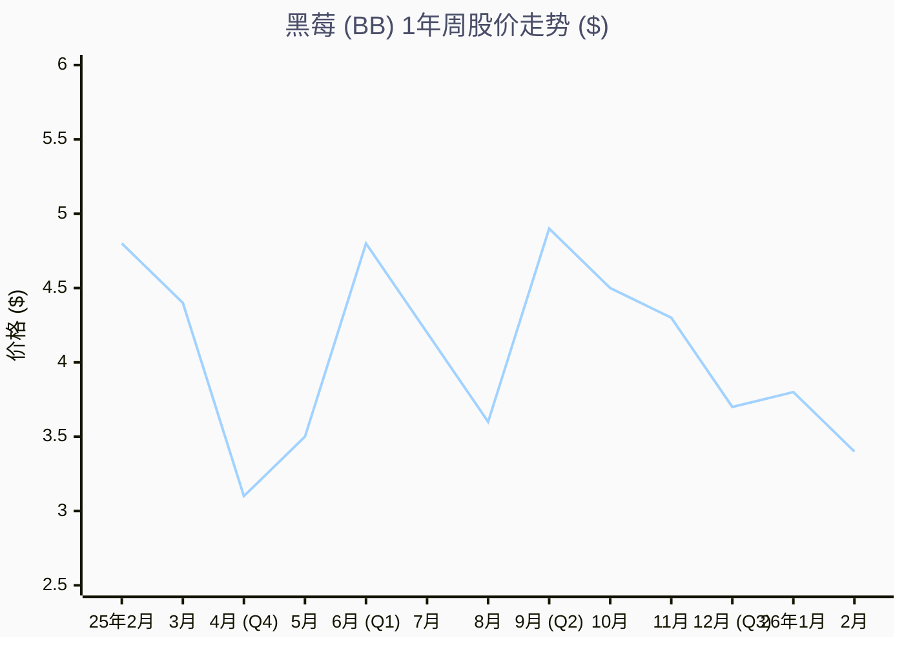

# 黑莓 (BB) 1年股价走势与关键驱动因素分析

> **分析周期**: 2025年2月 - 2026年2月
> **当前价格**: ~$3.40 (截至 2026年2月12日)
> **52周范围**: $2.80 - $5.32
> **主要趋势**: **波动复苏** — 由转向 GAAP 盈利的基本面转变驱动。

---

## 1. 执行摘要

在过去的一年里（2025年2月 - 2026年2月），黑莓的股价已与其“Meme Stock”（网红股）的过去脱钩，现在完全基于**扭亏为盈的基本面**进行交易。

价格走势的主要驱动力是**盈利拐点**。在多年的亏损之后，黑莓在 2026财年第一季度（2025年6月）公布了 12 个季度以来的首个 GAAP 净利润，引发了约 30% 的反弹。然而，近期的波动（2025年12月 - 2026年2月）反映了尽管业绩稳健但市场出现的“卖事实”行为，因为市场正在等待下一个主要催化剂：**车载操作系统（Vehicle OS）的收入变现**。

---

## 2. 1年股价走势可视化

下图展示了黑莓 (NYSE: BB) 在过去 52 周的周收盘价，并标注了关键驱动事件。

> **图表说明**:
>
> - **底部 ($2.80 - $3.00)**: 建立于 2025年4月/5月，正值 Cylance 资产剥离的不确定期。
> - **顶部 ($5.00 - $5.32)**: 在 2025年6月和9月“超预期并上调指引”的财报发布后进行了测试。
> - **当前区域 ($3.40 - $3.80)**: 随着 Q3 后投资者热情冷却，进入盘整阶段。

---

## 3. 关键价格驱动因素深度分析

1年的价格走势可以分为三个明显的叙事阶段：

### 第一阶段：“利空出尽”重置期 (2025年2月 - 2025年5月)

**价格走势**: **看跌 / 筑底** ($4.80 → $3.00)

- **📉 下跌 (2025年4月)**: 股价在 25财年第四季度财报发布后下跌约 9%。
  - **原因**: 尽管收入稳定，但由于 **Cylance 资产剥离**，指引变得复杂。投资者难以对“新黑莓”（分拆效应）进行建模，导致不确定性。
  - **催化剂**: 将 Cylance 出售给 Arctic Wolf 的交易完成，虽然减少了大量收入（1亿多美元），但提高了利润质量。市场最初因收入下降而惩罚股价，随后才意识到利润率的提升。

### 第二阶段：盈利拐点 (2025年6月 - 2025年9月)

**价格走势**: **强劲看涨反转** ($3.20 → $5.32)

- **🚀 突破 (2025年6月)**: 股价在巨量成交（6400万股）下飙升 **+12%**。
  - **驱动力**: **26财年第一季度财报**。公司报告 **GAAP 净利润 190万美元**——这是3年来的首次盈利。
  - **理由**: 这是 CEO John Giamatteo 战略的“概念验证”。通过削减成本并专注于高利润的 QNX 业务，止血成功。卖空者被迫回补。

- **🚀 确认 (2025年9月)**: 股价跳涨 **+9%** 至 52周新高。
  - **驱动力**: **26财年第二季度财报**。GAAP 利润扩大至 1330万美元；QNX 收入创历史新高。
  - **理由**: 市场意识到 Q1 的盈利并非侥幸。“扭亏为盈”的叙事成为共识。

### 第三阶段：“拿出增长来”与获利回吐 (2025年10月 - 至今)

**价格走势**: **回调 / 盘整** ($5.00 → $3.40)

- **📉 回撤 (2025年12月)**: 尽管 Q3 业绩稳健超预期，股价仍下跌 **-13%**。
  - **驱动力**: **“卖事实”**。Q3 GAAP 利润（1370万美元）虽好，但环比增长微乎其微（1330万美元）。
  - **理由**:
        1. **估值重估**: 股价自5月低点已上涨约 60%。在 >$5.00 的价位，市场定价的增长速度高于实际交付的 10% QNX 增长。
        2. **宏观逆风**: 2025年底，广泛的“AI 颠覆”担忧打击了传统软件股。
        3. **缺乏“车载 OS”收入**: 投资者正在等待 Vector/IVY 合作伙伴关系带来的爆发性收入，目前仍处于“设计中标”阶段，尚未最大化版税支票。

---

## 4. 估值驱动关键因素

基于1年的分析，以下变量与 BB 的股价相关性最高：

### 1. GAAP 盈利的一致性 (正相关)

* **观察**: 每一个 **GAAP 净收入为正** 的季度都确立了比 2024年低点更高的股价*底部*。
- **洞察**: 机构投资者（量化/算法）筛选“盈利科技股”。保持盈利迫使 BB 进入这些买入名单。

### 2. QNX 收入增长率 (高敏感度)

* **观察**: 市场忽略了“安全通信”业务的稳定性，但对 **QNX 增长** 反应剧烈。
- **洞察**: QNX 是“增长引擎”。如果 QNX 增长加速至 15-20%（由 SDV/车载 OS 驱动），市销率（P/S）倍数将扩张。如果停滞在 10%，股价将在 $5 封顶。

### 3. 股票回购 (支撑位)

* **观察**: 公司一直在 ~$4.13 的价格回购股票。
- **洞察**: 这创造了一个“软底部”。管理层在捍卫股价，表明他们认为低于 $4.00 的价格被低估了。

---

## 5. 结论：投资者现在关注什么？

“扭亏为盈”交易（从亏损转向盈利）已经**完成并计入股价**。V型复苏的1年图表反映了这一点。

该股目前正过渡到 **“增长”交易**。要突破 **$5.32** 的52周高点，黑莓需要证明：

1. **车载 OS 变现**: 来自 Vector/IVY 合作伙伴关系的实质性收入。
2. **加速 QNX 增长**: 从同比约 10% 提升至 >15%。

**战略定论**: 当前在 **$3.40 - $3.50** 附近的盘整代表了预期的重置，为押注长期软件定义汽车 (SDV) 超级周期的投资者提供了一个风险调整后的入场点。
