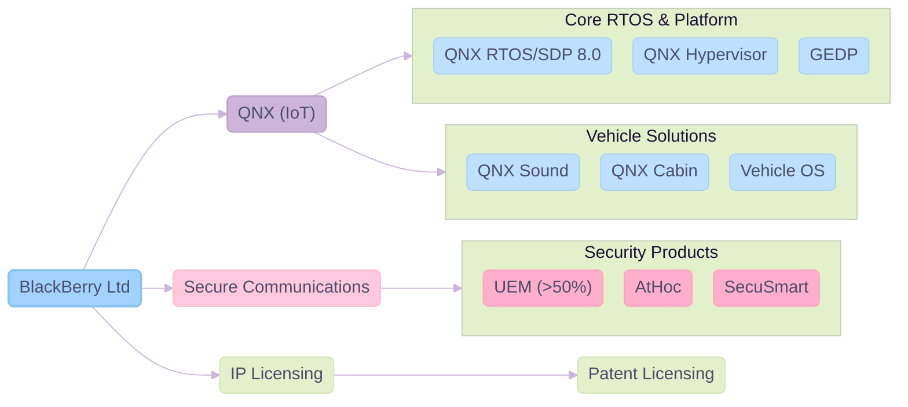
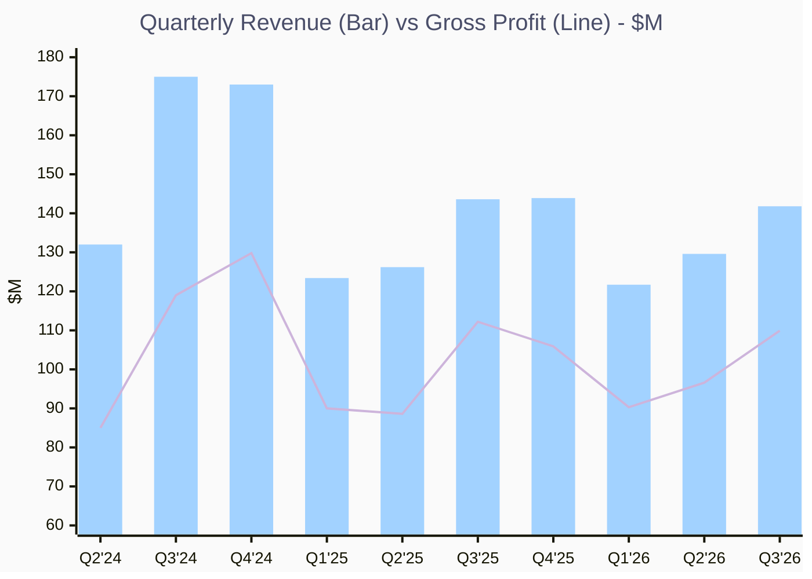
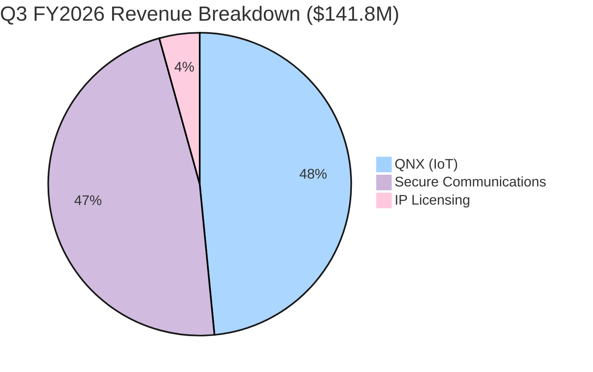
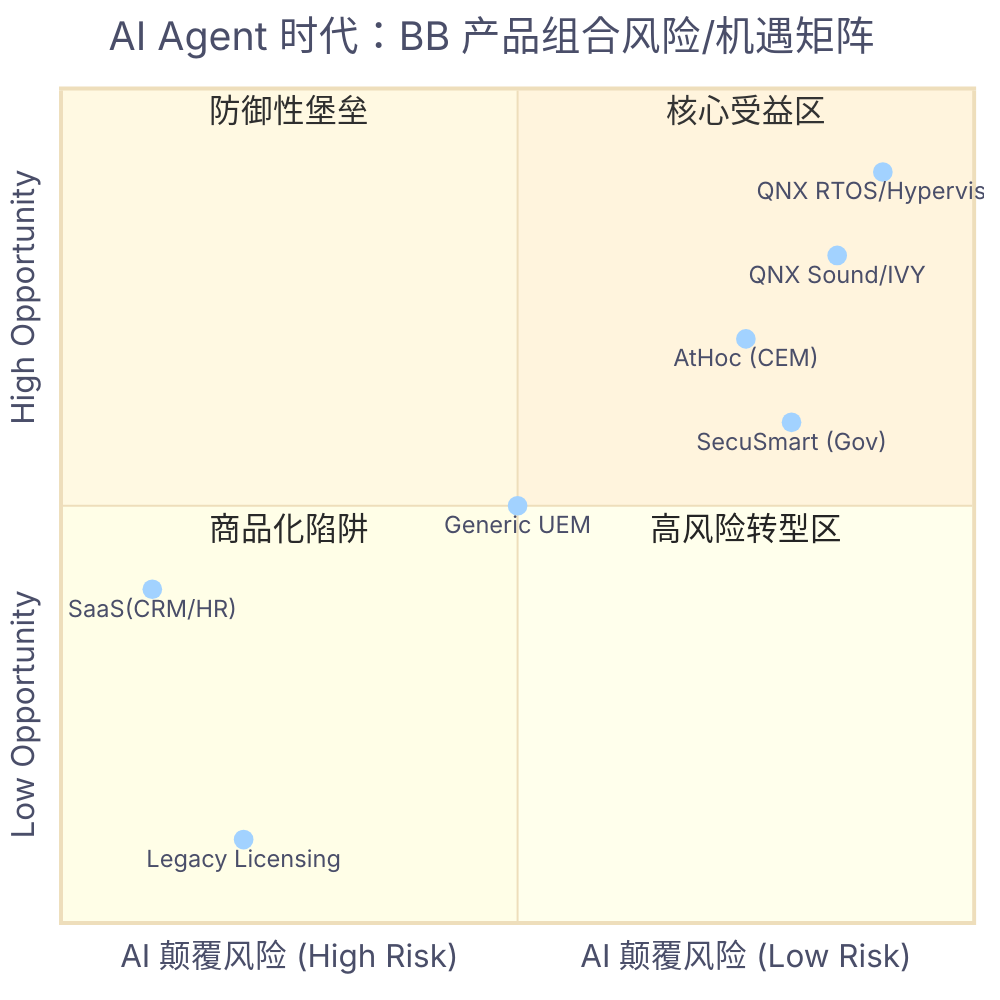
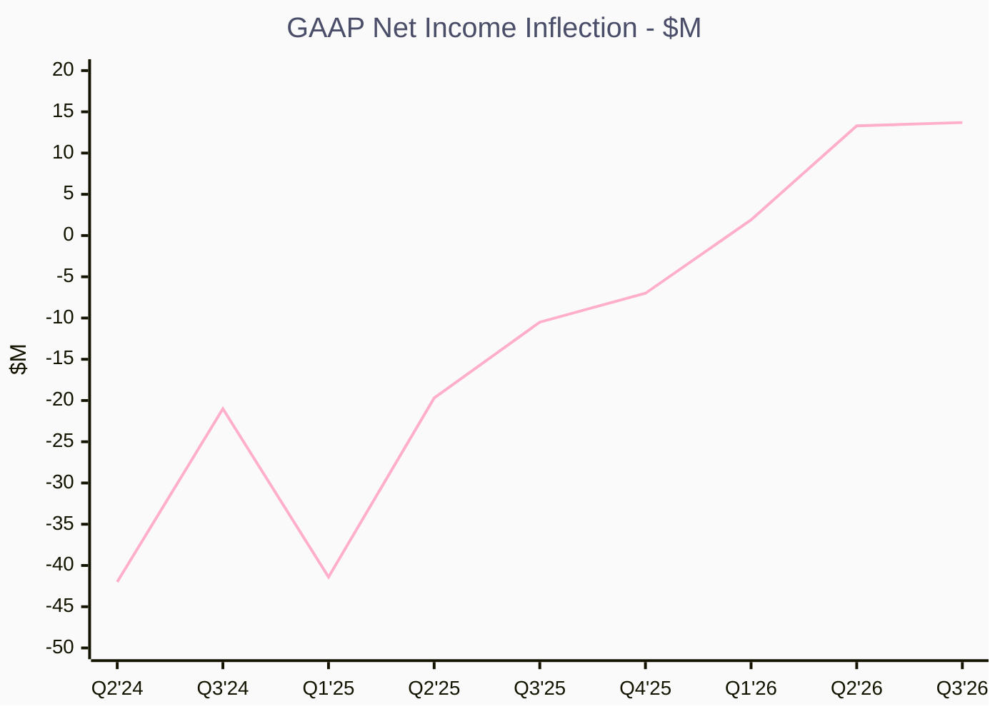
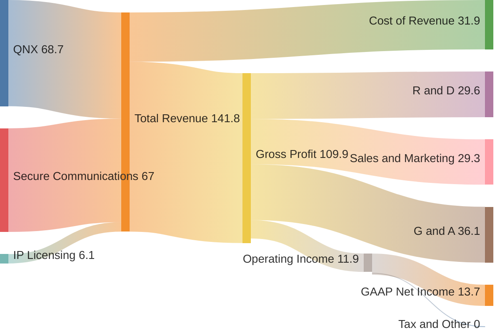
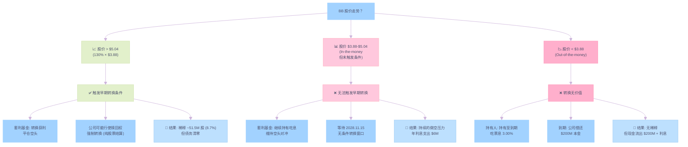

# BlackBerry Q3 FY2026

> **报告日期**: 2026年2月11日 | **数据截止**: Q3 FY2026 (2025年11月30日)
> **股票代码**: NYSE: BB / TSX: BB | **CIK**: 0001070235
> **来源**: SEC EDGAR 10-Q/10-K, 财报电话会议, Reuters, Yahoo Finance

---
---

## 目录

- [一、核心摘要](#一核心摘要-executive-summary)
- [二、公司概况与业务架构](#二公司概况与业务架构)
- [三、12 季度核心财务数据](#三12-季度核心财务数据)
- [四、过去 8 季度电话会议纪要](#四过去-8-季度电话会议纪要)
- [五、核心业务深度分析](#五核心业务深度分析)
- [六、AI 驱动的业务变革](#六ai-驱动的业务变革-ai-driven-transformation)
- [七、SaaS 已死与 BlackBerry 产品定位](#七saas-已死与-blackberry-产品定位)
- [八、财务健康评估](#八财务健康评估)
- [九、竞争格局](#九竞争格局)
- [十、风险分析](#十风险分析)
- [十一、投资洞察与估值](#十一投资洞察与估值)
- [十二、结论](#十二结论)
- [附录 A：BMW & QNX 战略整合深度解析](#附录-a-bmw--qnx-战略整合深度解析)
- [附录 B：Warrior & Guardian — QNX & Vector 战略合作深度调研](#附录-b-warrior--guardian--qnx--vector-战略合作深度调研)
- [附录 C：QNX 在 GEM (通用嵌入式) 与机器人市场的深度调研](#附录-c-qnx-在-gem-通用嵌入式-与机器人市场的深度调研)
- [附录 D：$200M 可转换债券深度解析](#附录-d200m-可转换债券深度解析--300-convertible-senior-notes-due-2029)

## 一、核心摘要

BlackBerry 已经完成了从智能手机制造商到纯软件公司的历史性转型。在 CEO John Giamatteo 的领导下，公司聚焦两大核心业务：**QNX 嵌入式操作系统**（IoT）和**安全通信**（Secure Communications），并已剥离亏损的 Cylance 端点安全业务（出售给 Arctic Wolf）。

**当前关键指标（Q3 FY2026，截至2025年11月30日）**：

| 指标         | 数据                 | 同比变化       |
| :--------- | :----------------- | :--------- |
| 总营收        | $141.8M            | -1.3%      |
| QNX 营收     | $68.7M（历史新高）       | +10%       |
| 安全通信营收     | $67.0M             | —          |
| 调整后 EBITDA | $28.7M（20% margin） | —          |
| GAAP 净利润   | $13.7M             | 连续第3季度盈利   |
| 运营现金流      | $17.9M             | +200% YoY  |
| 自由现金流      | $17.0M             | —          |
| 现金及投资      | $377.5M            | +$111M YoY |
| QNX 装车量    | 2.75亿辆             | +2000万 YoY |

> [!IMPORTANT]
> **核心投资论点**: BlackBerry 正处于转型拐点——连续3季度 GAAP 盈利，QNX 连创营收新高，Cylance 剥离后财务简化，现金储备充裕（$377.5M），且已启动股票回购。QNX 在 SDV（软件定义汽车）领域的护城河正在扩大，275M 车辆的市场存量和 BMW 新合作构成长期增长动力。

---

## 二、公司概况与业务架构

### 2.1 转型历程

BlackBerry 的转型可分为三个阶段：

1. **2013-2019: 手机退出期** — 停产手机硬件，开始软件化转型
2. **2019-2024: 业务重塑期** — 收购 Cylance ($1.4B)，重组 IoT 和 Cybersecurity 两大部门，出售非核心 IP 给 Malikie
3. **2024-至今: 聚焦增长期** — 出售 Cylance 给 Arctic Wolf，聚焦 QNX + Secure Communications 双引擎

### 2.2 当前业务架构

**Key Insights:**

- 🏆 **双引擎聚焦**: 剥离 Cylance 后，QNX + Secure Communications 构成清晰的双轮驱动架构
- 📈 **QNX 产品矩阵扩展**: 从核心 RTOS 延伸至 Sound/Cabin/Vehicle OS，单车价值持续提升
- ⚠️ **IP Licensing 缩减中**: 遗留收入不可预测，非战略重点

### 2.3 核心管理层

| 职位 | 姓名 | 关键背景 |
| :--- | :--- | :--- |
| CEO | John Giamatteo | 2023年11月上任，前 McAfee 消费者业务总裁 |
| CFO | Tim Foote | 2024年加入，负责财务纪律与资本配置 |
| QNX 总裁 | John Wall | 2025年11月上任，QNX 30年老将 |

---

## 三、12 季度核心财务数据

> [!NOTE]
> BlackBerry 财年从3月1日开始，FY2026 = 2025年3月-2026年2月。Q3 FY2026 对应自然季度 2025年9月-11月。Q4 FY2024 的数据因 Cylance 分拆和 Malikie IP 出售导致异常。
> 带括号数字表示亏损。LTD = Long-Term Debt.

| 季度 | 自然时间 | 总营收 | 毛利润 | 毛利率 | 营业利润 | GAAP 净利润 | 长期债务 | 现金 | EPS |
| :--- | :--- | :--- | :--- | :--- | :--- | :--- | :--- | :--- | :--- |
| Q3 FY2026 | Sep-Nov '25 | $141.8M | $109.9M | 77.5% | $11.9M | $13.7M | $196.2M | $270.3M | $0.02 |
| Q2 FY2026 | Jun-Aug '25 | $129.6M | $96.6M | 74.5% | $11.5M | $13.3M | $195.9M | $276.4M | $0.02 |
| Q1 FY2026 | Mar-May '25 | $121.7M | $90.3M | 74.2% | $2.0M | $1.9M | $195.6M | $276.0M | $0.00 |
| Q4 FY2025 | Dec-Feb '25 | $143.9M | $105.9M | 73.6% | ($6.2M) | ($7.0M) | — | — | ($0.01) |
| Q3 FY2025 | Sep-Nov '24 | $143.6M | $112.2M | 78.1% | $19.5M | ($10.5M) | — | $189.0M | ($0.02) |
| Q2 FY2025 | Jun-Aug '24 | $126.2M | $88.6M | 70.2% | $2.2M | ($19.7M) | — | $171.0M | ($0.03) |
| Q1 FY2025 | Mar-May '24 | $123.4M | $90.0M | 72.9% | ($12.9M) | ($41.4M) | — | $143.0M | ($0.07) |
| Q4 FY2024 | Dec-Feb '24 | $173.0M | $129.8M | 75.0% | ($40.0M) | ($56.0M) | — | $175.0M | ($0.10) |
| Q3 FY2024 | Sep-Nov '23 | $152.0M | $119.0M | 78.3% | $18.0M | ($21.0M) | — | — | ($0.04) |
| Q2 FY2024 | Jun-Aug '23 | $132.0M | $85.0M | 64.4% | ($47.0M) | ($42.0M) | — | — | ($0.07) |

> [!TIP]
> **趋势解读**: FY2025-FY2026 是转折期。由于 Cylance 业务剥离，营收规模从 Q4 FY2024 的 $173M 调整至当前的 $140M+ 水平做实。毛利率稳定在 74-78%，QNX 毛利率持续攀升至 85%。现金储备大幅增至 $377.5M，反映了更健康的资产负债表。

### 季度营收趋势

**Key Insights:**

- 🏆 **Q3 FY2026 营收 $141.8M**: 在新业务架构下（无 Cylance）稳步回升
- � **营收断层原因**: Q1 FY2025 起营收下降主要是由于 Cylance 剥离 ($173M -> $123M)
- 📈 **毛利润率 77.5%**: 剥离低毛利硬件和服务的包袱后，盈利质量显著提升

### Q3 FY2026 营收结构

**Key Insights:**

- 🏆 **QNX 占比 48.5%**: 首次接近半壁江山，历史新高营收 $68.7M
- 📈 **双引擎均衡**: QNX ($68.7M) 与 Secure Comms ($67.0M) 几乎持平
- ⚠️ **IP Licensing 仅占 4.3%**: 遗留收入逐季递减

### 年度财务趋势

| 财年 | 总营收 | 毛利润 | 净利润 | 总资产 | 总负债 | 股东权益 | 商誉 |
| :--- | :--- | :--- | :--- | :--- | :--- | :--- | :--- |
| FY2025 | $534.9M | $394.9M | ($79.0M) | $1.3B | $575.7M | $719.9M | $472.4M |
| FY2024 | $853.0M | $520.0M | ($130.0M) | $1.4B | $619.0M | $776.0M | $562.0M |
| FY2023 | $656.0M | $419.0M | ($734.0M) | $1.7B | $822.0M | $857.0M | $595.0M |
| FY2022 | $718.0M | $467.0M | $12.0M | $2.6B | $1.0B | $1.6B | $844.0M |
| FY2021 | $893.0M | $643.0M | ($1.1B) | $2.8B | $1.3B | $1.5B | $849.0M |

> FY2025 营收下降主要因 Cylance 出售（Q1 FY2025 完成），FY2024 含完整 Cylance + Malikie IP 出售一次性收入。

---

## 四、过去 8 季度电话会议纪要

### Q3 FY2026（2025年12月18日）

| 维度 | 关键信息 |
| :--- | :--- |
| **CEO 核心表态** | "Q3 was another quarter of solid results, adding to our track record of consistently meeting or beating guidance." |
| **QNX 亮点** | 营收 $68.7M（历史新高），+10% YoY；任命 John Wall 为 QNX 总裁；与 Vector 合作的车辆软件平台（vehicle OS）开发进展顺利，第二版早期访问版定于1月发布 |
| **QNX 设计胜利** | 超内部目标；中国豪华 EV 品牌选择 QNX Sound；欧洲 Top 5 全球 OEM 签约多年期 QNX Cabin 合同；QNX SDP 8 被 NASA 加入支持列表 |
| **安全通信** | 营收 $67M；荷兰政府八位数多年期续约；AtHoc 获 FedRAMP High 认证，赢得美国海军和司法部 |
| **财务** | GAAP 净利 $13.7M（连续第3季度）；运营现金流 $17.9M（+200% YoY）；回购 120万股（$5M，均价 $4.13），全年回购 880万股 |
| **展望** | Q4 QNX 营收 $71-77M（再创纪录），全年 $262-266M；安全通信全年上调至 $247-251M；FY2026 总 EBITDA 上调至 $97-104M |
| **CEO Q&A 要点** | ① 中国 EV 胜利来自成本/重量节省+软件功能优势 ② GEM 市场投资重心在 go-to-market，增加渠道和合作伙伴 ③ Secure Communications 有近年来最强的 pipeline，FY27 增长预期乐观 |

---

### Q2 FY2026（2025年9月25日）

| 维度 | 关键信息 |
| :--- | :--- |
| **CEO 核心表态** | 连续第二季度 GAAP 盈利，上调全年营收展望 |
| **QNX 亮点** | 营收 $62.5M；QNX SDP 8 继续获得设计胜利；中国 OEM 选择 QNX Sound |
| **安全通信** | UEM 获得德国 BSI 认证（全球首个），续约率持续改善 |
| **财务** | GAAP 净利 $13.3M；上调 FY2026 营收预期 |
| **CEO Q&A 要点** | ① QNX 在中国市场因 SDV 安全需求获得新机遇 ② Vehicle OS（与 Vector 合作）将显著提升单车 ASP |

---

### Q3 FY2025（2024年12月19日）

| 维度 | 关键信息 |
| :--- | :--- |
| **CEO 核心表态** | "This is the first time in 12 quarters that BlackBerry has generated both positive operating and free cash flow." |
| **QNX 亮点** | 营收 $62M，+13% YoY/QoQ，超指引上限；德国豪华车企选择 QNX Hypervisor；亚洲最大 OEM 之一选择 QNX OS 用于 ADAS |
| **战略举措** | 签署 Cylance 出售给 Arctic Wolf 的最终协议；SDP 8.0 获得 10+ 硅厂商支持；最大工业自动化客户从 SDP 7 升级到 SDP 8 |
| **安全通信** | 营收 $93M（含 Cylance），超指引；UEM 端点管理 YoY+QoQ 增长；Secure Comms ARR $215M（+8% YoY），DBNRR 95% |
| **财务** | IoT EBITDA $18M（+38% QoQ），Secure Comms EBITDA $22M（30% margin）；总毛利率 74% |
| **CEO Q&A 要点** | ① Cylance 出售所得将用于强化资产负债表+投资增长 ② QNX 将加大 R&D 和销售投入 ③ 探索日本 OEM 云端 QNX Cabin 订阅 |

---

### Q2 FY2025（2024年9月26日）

| 维度 | 关键信息 |
| :--- | :--- |
| **CEO 核心表态** | Cyber 营收 $87M（+10% YoY），IoT $55M，公司整体改善 |
| **QNX 亮点** | QNX SDP 8.0 获首批设计胜利；日本 OEM ADAS 双胜；Hyundai Mobis 跟进选择 QNX Hypervisor；QNX Sound 被 HaleyTek 整合；Stellantis 数字座舱双胞胎产品化 |
| **安全通信** | Secure Comms 集体增长 24% YoY；UEM 续约率过去两年最佳；AtHoc 续约率接近 100% |
| **战略** | IVY 因 OEM 开发延迟放缓，团队整合进 QNX；聘请高级 GEM go-to-market 高管 |
| **CEO Q&A 要点** | ① 汽车 OEM SDV 延迟反而是长期利好——OEM 需要 BB 更深度支持 ② Vehicle OS 概念兴起——BB 有机会成为中间件整合者 |

---

### Q1 FY2025（2024年6月27日）

| 维度 | 关键信息 |
| :--- | :--- |
| **CEO 核心表态** | 首季度完整运营（Cylance 仍含在报表），Malikie IP 出售完成 |
| **QNX 亮点** | 营收受 OEM 开发延迟影响偏软；SDP 8.0 于 CES 2024 发布，初期反馈积极 |
| **安全通信** | EPS 好于预期；Cylance 继续面临客户流失，MDR 托管服务有正向贡献 |
| **CEO Q&A 要点** | ① 公司战略清晰——聚焦 QNX + Secure Comms 双引擎 ② 积极探索 Cylance 退出选项 |

---

### Q4 FY2024（2024年4月3日）

| 维度 | 关键信息 |
| :--- | :--- |
| **CEO 核心表态** | IoT revenue $66M（+25% YoY，+20% QoQ），backlog 创历史新高约 $815M |
| **QNX 亮点** | SDP 8.0 发布——性能线性扩展至64核，性能媲美/超越 Linux 但保持功能安全性；Hypervisor 上云，Stellantis 首创数字座舱 digital twin；QNX Sound 首单（欧洲 OEM） |
| **安全通信** | Cyber 营收 $92M（+5% YoY）；ARR 企稳至 $280M（+3% QoQ）；DBNRR 85%（+3ppt QoQ）；马来西亚政府大单开始部署，KL 网络安全卓越中心开幕 |
| **医疗/工业** | 全球 Top 5 医疗 OEM 选择 QNX 用于下一代血液/心脏影像机；美国 OEM 选择 QNX 用于第五代手术机器人 |
| **CEO Q&A 要点** | ① Vehicle OS 概念成为 OEM 新需求——BB 负责中间件整合，OEM 聚焦差异化体验 ② 专业服务团队扩编 |

---

### Q3 FY2024（2023年12月）

| 维度 | 关键信息 |
| :--- | :--- |
| **核心要点** | IoT 继续增长态势；Cylance 面临竞争压力，客户流失加剧；整体仍处亏损但趋势改善 |
| **战略** | 开始积极评估 Cylance 的战略选项（最终导致出售） |

---

### Q2 FY2024（2023年9月）

| 维度 | 关键信息 |
| :--- | :--- |
| **核心要点** | 总营收 $132M；QNX 表现稳健但受 OEM 延迟影响；Cylance 持续拖累整体盈利；公司宣布战略重组 |

---

## 五、核心业务深度分析

### 5.1 QNX：嵌入式操作系统的隐形冠军

#### 市场地位

- 全球超过 **2.75亿辆汽车**运行 QNX 系统（YoY +2000万）
- 在 ADAS 和数字座舱领域占据主导地位
- 25+ 家全球电动汽车和传统 OEM 使用 QNX
- **SDP 8.0** 已获得 10+ 硅厂商支持（包括 Qualcomm、NXP 等）

#### 产品竞争力

| 产品 | 定位 | 竞争优势 |
| :--- | :--- | :--- |
| QNX SDP 8.0 | 下一代 RTOS | 64核线性扩展，功能安全认证（ISO 26262），性能媲美 Linux 但无开源安全隐患 |
| QNX Hypervisor | 虚拟化平台 | 支持混合关键域（safety-critical + 非关键域），已上云 |
| QNX Sound | 软件定义音频 | 消除昂贵音频硬件，降低 BOM，开辟新收入流 |
| QNX Cabin | 云端座舱开发 | 数字座舱 digital twin，加速开发周期，订阅制收入 |
| Vehicle OS（与 Vector） | 车辆软件平台 | 中间件整合层，显著提升单车 ASP，目标定价远高于核心 RTOS |

#### 增长驱动力

1. **SDV 趋势加速** — OEM 越来越需要 BB 提供更深层次的软件支持（从 RTOS 到中间件到 Vehicle OS）
2. **单车 ASP 提升** — 从单一 RTOS ($1-3/车) 向全栈软件平台 ($10-30/车) 扩展
3. **GEM 垂直拓展** — 工业自动化（Bentley Nevada, 机器人）、医疗器械（手术机器人、影像）、航空航天（NASA）、铁道
4. **中国市场突破** — 连续两季度赢得中国 OEM（包括豪华 EV），利用 BOM 节省和安全认证优势
5. **BMW 合作** — 2026年1月宣布 QNX 集成至 BMW 下一代车辆平台

#### 财务质量

- QNX 毛利率: ~84-85%（纯软件/版税模型）
- EBITDA margin: ~24%（含增长投资）
- Backlog（估计终身版税）: ~$815M（Q4 FY2024 数据，持续增长）
- FY2026 指引: 营收 $262-266M，EBITDA $67-73M

### 5.2 Secure Communications：政府/国防的护城河

#### 核心客户画像

全球政府和国防机构、金融服务

#### 产品矩阵

| 产品 | 占安全通信营收 | 核心客户 | 关键认证 |
| :--- | :--- | :--- | :--- |
| UEM | >50% | 美国联邦政府、德国政府、荷兰政府、英国 MoD、全球银行 | 德国 BSI 认证（全球首个 UEM） |
| AtHoc | ~20-25% | 美国 DHS、DoJ、美国海军、美国空军、国务院 | FedRAMP High（唯一 CEM 供应商） |
| SecuSmart | ~20-25% | 德国政府机构、欧洲军方 | NATO/欧盟安全级别 |

#### 竞争壁垒

1. **不可替代的安全认证** — BSI（UEM）、FedRAMP High（AtHoc）均为行业独家
2. **on-premise 部署优势** — 数据主权要求下，on-prem UEM 竞争者已退出投资
3. **极高切换成本** — 政府系统深度集成，续约率接近 100%（AtHoc）
4. **地理扩展** — 从核心（美国、德国）扩展至荷兰、英国、澳大利亚、马来西亚、印度

#### 关键指标（Q3 FY2026）

- ARR: $216M（+$3M QoQ）
- DBNRR: 92%
- EBITDA margin: 26%

#### 增长催化剂

- 全球国防开支增加（NATO 2% GDP 目标 + Buy Canada 倡议）
- 印度市场新进入（与印度政府初步接触）
- UEM BSI 认证打开德国/欧洲新市场

### 5.3 IP Licensing：现金奶牛但缩减中

- 季度营收 $3-7M，来自 Malikie 出售前遗留专利协议
- 高毛利（~71-87%），但不可预测且逐渐缩减
- 非战略重点

---

## 六、AI 驱动的业务变革

随着生成式 AI (GenAI) 和边缘 AI (Edge AI) 的兴起，BlackBerry 正在重塑其核心产品组合，从单纯的安全连接转向"智能安全与边缘计算"。

### 6.1 QNX：边缘 AI 的高性能底座

在软件定义汽车 (SDV) 中，AI 推理 (Inference) 正在从云端下沉至车端边缘节点 (Edge)。QNX 正在成为这一转变的关键推动者：

1. **QNX SDP 8.0 作为 AI 算力底座**
    - **高性能并发**：支持 64 核处理器线性扩展，使车载芯片 (如 NVIDIA Thor, Qualcomm Snapdragon Ride) 能由于实时运行复杂的 AI 模型（自动驾驶感知、座舱个性化）。
    - **确定性延迟**：相比 Linux，QNX 微内核架构保证了 AI 任务的高优先级调度，确保关键任务（如自动刹车 AI 判定）的微秒级响应。

2. **QNX Sound & AI**
    - **场景**：利用 AI 算法不仅分离人声/噪声（用于通话），更用于"车内声场分区"——驾驶员听导航，后排乘客看电影，互不干扰。
    - **商业模式**：纯软件解决方案替代昂贵的物理隔音硬件，为 OEM 节省 BOM 成本，同时为 BB 带来高毛利软件订阅收入。

3. **IVY 的 AI 潜力 (长期)**
    - 虽然 IVY 采用率尚在早期，但其核心价值在于"端侧数据处理"。利用 AI 在车端直接处理传感器数据（如驾驶员疲劳监测、电池健康预测），仅上传高价值洞察至云端，大幅降低云存储和传输成本。

### 6.2 Secure Communications：AI 赋能的网络安全

虽然出售了 Cylance 这一独立的端点安全业务，但 BlackBerry 在其保留的政府/高安全业务中保留了核心 AI 能力：

- **Cylance AI 引擎集成**：Cylance 的核心预测性 AI 模型 (Predictive AI) 仍被集成在 UEM 和各类安全产品底层。该模型经过数亿个威胁样本训练，能以 99%+ 的准确率预测并拦截未知的零日攻击 (Zero-day attacks)，无需频繁更新病毒库。
- **Cylance Assistant (GenAI)**：
  - **功能**：基于生成式 AI 的安全顾问，集成在控制台。
  - **价值**：帮助 SOC (安全运营中心) 分析师快速解读复杂的威胁信号，自动生成事件报告，将平均响应时间 (MTTR) 缩短数小时。对于人手不足的政府/企业安全团队，这是极大的效率倍增器。

---

## 七、SaaS 已死与 BlackBerry 产品定位

2026年，"SaaS 已死" (SaaS is Dead) 从一个激进观点演变为影响市场的核心叙事。AI Agent (智能代理) 的兴起正在根本性颠覆传统 SaaS 的 "UI + 席位" 商业模式。然而，深入分析显示 **BlackBerry (尤其是 QNX) 处于这场风暴的"免疫区"，甚至是受益区**。

### 7.1 "SaaS 已死" 核心论点

市场担忧 AI Agent 将取代人类操作软件，导致：

1. **UI 层消亡**：用户不再通过 GUI 操作软件，而是向 Agent 下达自然语言指令。
2. **按席位定价 (Per-Seat Pricing) 崩溃**：当 1 个 Agent 可以替代 10 个人类用户，基于用户数的订阅收入将断崖式下跌。
3. **功能商品化**：通用功能（如写邮件、做报表）被 LLM 零成本替代。

### 7.2 QNX 的"物理层免疫"

QNX **不是 SaaS**，它是嵌入在芯片之上的**安全关键实时操作系统 (RTOS)**。AI Agent 无法颠覆 QNX，原因如下：

#### AI 时代产品定位象限图

**Key Insights:**

- **QNX (右上)**: 处于"低颠覆风险 + 高赋能机遇"的最佳甜蜜点。AI 需要它作为底座，却无法替代它。
- **Secure Comms (中上/右上)**: 高合规要求构成了护城河，AI 更多是增强工具（如 Cylance Assistant）而非替代者。

- **物理确定性 vs 逻辑推理**：AI Agent 擅长逻辑推理，但无法处理毫秒级的物理控制（如气囊弹出、刹车响应）。QNX 管理的是物理硬件，必须具备 100% 的确定性，这是概率性的 LLM 无法替代的。

- **机器对机器 (M2M) vs 人机交互 (HCI)**：SaaS 解决的是人与软件的交互（UI），QNX 解决的是芯片与传感器的交互。AI Agent 颠覆的是 UI，而 QNX 深埋在 UI 之下。
- **定价免疫**：QNX 收入赖于 **版税 (Royalty)** 和 **开发许可**，与人类用户席位无关。

### 7.3 Cylance 剥离：完美的防御性撤退

BlackBerry 在 2025 年 2 月完成 Cylance 出售，现在看来是**教科书级的战略择时**：

- **逃离风暴眼**：端点安全 (Endpoint Security) 是受 AI 颠覆最严重的 SaaS 领域之一（AI Agent 可自动巡检，且攻击手段 AI 化）。
- **保留核心**：剥离了受 SaaS 恐慌影响最大的资产，留下了免疫的 QNX 和高壁垒的政府业务。

### 7.4 安全通信的合规壁垒

虽然 UEM 属于企业软件，但 BlackBerry 的 **政府/高安全市场** 具有特殊护城河：

- **"Human-in-the-loop" 刚需**：核电站报警、总统车队通信等场景（AtHoc/SecuSmart），绝不允许 AI Agent 自主决策，必须有人类介入。
- **合规锁定**：FedRAMP High、北约机密级认证构成了极高的替换成本，AI 新势力难以短期突破。

---

## 八、财务健康评估

### 8.1 盈利能力拐点

**Key Insights:**

- 🏆 **Q1 FY2026 转正**: 结束连续多年亏损，GAAP 净利润 +$1.9M
- 📈 **连续 7 季度改善**: 从 Q2 FY2024 低谷 ($-42M) 到 Q3 FY2026 ($+13.7M)，累计改善 $55.7M
- ⚠️ **2022年以来最强季度**: Q3 FY2026 GAAP 净利润 $13.7M，创近4年新高

连续 7 个季度 GAAP 盈利能力环比改善，2022年以来最强季度 GAAP 净利润。

### 8.1.1 Q3 FY2026 财务流向

**Key Insights:**

- 🏆 **毛利率 77.5%**: 营收 $141.8M 中仅 $31.9M 为成本，体现纯软件模型
- 📈 **双引擎并驾齐驱**: QNX ($68.7M) 和 Secure Comms ($67.0M) 贡献几乎持平
- ⚠️ **OpEx 占毛利 86.4%**: R&D + S&M + G&A 合计 $95M，增长投资与盈利能力的平衡点

### 8.2 现金流与资产负债表

| 指标 | Q3 FY2026 | 趋势 |
| :--- | :--- | :--- |
| 运营现金流 | $17.9M | Q2 的 $3.4M → Q3 的 $17.9M，YoY +200% |
| 自由现金流 | $17.0M | 12季度以来首次正 FCF (不含 Malikie) |
| 现金及投资 | $377.5M | +$111M YoY，+$14M QoQ |
| 长期债务 | $196.2M | 稳定（可转换债券） |
| 净现金头寸 | ~$181M | 现金 > 债务 |
| 股东权益 | $741.1M | QoQ 改善 |

> [!TIP]
> **健康信号**: 公司处于净现金状态（现金 $377.5M > 长期债务 $196.2M），且同时投资增长和回购股票——这是管理层对业务前景有信心的强信号。

### 8.3 资本配置

- **有机投资**: 加大 QNX R&D 和 go-to-market（OpEx YoY +7%）
- **股票回购**: FY2026 已回购 880万股（完全抵消员工激励稀释），Q3 以均价 $4.13 回购
- **潜在 M&A**: 管理层暗示探索利用多余资本的"增长机会"

---

## 九、竞争格局

### 9.1 QNX 竞争对手矩阵

| 层面 | QNX (BB) | AUTOSAR Adaptive (Vector 等) | Linux/Android Auto | Wind River (Aptiv) | Green Hills |
| :--- | :--- | :--- | :--- | :--- | :--- |
| 功能安全认证 | ✅ ISO 26262 ASIL-D | ✅ 标准合规 | ❌ 无原生支持 | ✅ DO-178C | ✅ DO-178C |
| 数字座舱 | ✅ 主导地位 | ⚠️ 有限 | ✅ 用户体验优 | ❌ 非重点 | ❌ 非重点 |
| ADAS | ✅ 强势增长 | ✅ 标准化 | ⚠️ 安全风险 | ✅ 有实力 | ⚠️ 小众 |
| SDK/开发体验 | ✅ SDP 8.0 + 云端 | ⚠️ 复杂 | ✅ 开源生态 | ✅ 良好 | ⚠️ 封闭 |
| 市场份额 | **#1** (275M+ 车辆) | 增长中 | 增长中 | #2-3 | 小众 |
| 定价模型 | 版税 + 开发许可 | 授权费 | 开源（集成成本） | 授权费 | 授权费 |

#### QNX 的核心护城河

1. 微内核架构 — 任何组件失败不影响整个系统（vs. Linux 的宏内核）
2. 275M 车辆安装基础 — 替换成本极高
3. 安全认证生态 — ISO 26262、IEC 61508 等全覆盖
4. SDP 8.0 性能突破 — 打破了"安全=慢"的传统认知

### 9.2 芯片生态深度调研：与硅巨头的战略绑定

QNX 的最大护城河之一是与全球主流芯片厂商 (Silicon Vendors) 的深度绑定。所有的下一代车载高性能计算 (HPC) 平台，几乎都将 QNX 作为默认或首选的安全操作系统底座。

| 芯片 合作伙伴            | 合作领域                       | 关键产品集成                                                | 核心价值                                                                                        | 产业渗透情况                                                      |
| :-------------------- | :------------------------- | :---------------------------------------------------- | :------------------------------------------------------------------------------------------ | :---------------------------------------------------------- |
| **NVIDIA**            | **自动驾驶 (ADAS) & 机器人**      | **DRIVE Thor / Orin, Jetson** 集成 QNX OS for Safety | **算力底座**：NVIDIA 提供超强 AI 算力，QNX 提供 ASIL-D 安全执行环境。QNX 是唯一能跑满 Thor 2000 TOPS 算力且不过热、不崩溃的 RTOS。 | **极高**。几乎所有使用 NVIDIA Orin/Thor 的高端 EV (如比亚迪、蔚来、理想) 都标配 QNX。 |
| **Qualcomm**          | **数字座舱 (Digital Cockpit)** | **Snapdragon Digital Chassis** 集成 QNX Hypervisor   | **虚拟化**：在单芯片上同时运行 Android (娱乐) 和 QNX (仪表)。QNX Hypervisor 是高通座舱平台的"金标准"配置。                   | **垄断级**。高通 8155/8295 芯片几乎 100% 搭配 QNX Hypervisor 出货。        |
| **AMD**               | **工业/医疗 & 机器人**            | **Kria SOMs, Ryzen Embedded** 集成 QNX SDP 8.0       | **硬实时 (Hard Real-time)**：针对手术机器人和精密工业控制，QNX 提供微秒级抖动控制，补齐了 AMD x86 架构在实时性上的短板。               | **快速增长**。在达芬奇手术机器人等高端医疗设备中不可替代。                             |
| **NXP**               | **区域控制器 (Zonal Control)**  | **S32 系列 (S32G/S32Z)** 集成 QNX OS                   | **功能安全 (Safety)**：S32 芯片专注于车辆网关和底盘控制，QNX 轻量级微内核完美契合其资源受限但安全要求极高的特性。                         | **稳固**。传统 Tier 1 (博世、大陆) 的首选方案。                             |
| **Texas Instruments** | **边缘 AI & 机器人**            | **Jacinto 7 (TDA4VM)** 集成 QNX SDK                  | **功能安全普及化**：TI 提供高性价比 AI 芯片，QNX 提供易于认证的软件栈，大幅降低工业机器人过安全认证 (IEC 61508) 的门槛。                  | **利基市场**。在移动机器人 (AMR) 和工业视觉传感器中广泛应用。                        |

### 9.3 Secure Communications 竞争

| 竞品                   | 领域     | BB 优势                         |
| :------------------- | :----- | :---------------------------- |
| Microsoft Intune     | 云端 UEM | BB 在 on-prem、数据主权场景不可替代       |
| VMware Workspace ONE | 企业 UEM | BB 聚焦政府/金融高安全细分               |
| Everbridge           | 关键事件管理 | BB AtHoc 是唯一 FedRAMP High CEM |
|                      |        |                               |

---

## 十、风险分析

| 风险因素 | 风险等级 | 描述与缓解措施 |
|:---|:---|:---|
| **汽车行业周期性与 OEM 延迟** | 🔴 高 (High) | **描述**: 全球 SDV 开发延迟导致 OEM 推迟项目，直接影响 QNX 开发许可收入。 **缓解**: 管理层视为"积压需求"而非取消；多元化至 GEM 市场。 |
| **Vehicle OS 产品执行风险** | 🔴 高 (High) | **描述**: 与 Vector 合作的 Alloy Kore 若未能赢得首批客户，单车 ASP 提升逻辑将失效。 **缓解**: 借助 BMW 合作案例作为标杆；利用 Vector 在工具链的统治力。 |
| **安全通信增长上限** | 🟡 中 (Med) | **描述**: UEM 市场成熟，主要增长依赖于存量续约和缓慢的地理扩展。 **缓解**: 推出 Cylance Assistant 等 AI 增值服务提升 ARPU。 |
| **估值与市场预期** | 🟡 中 (Med) | **描述**: 股价约 $4-5，市场仍在观望转型成果。若盈利中断，股价可能回调。 **缓解**: 持续回购股票 ($4.13/share) 支撑股价底线。 |
| **长期债务 (可转债)** | 🟡 中 (Med) | **描述**: $200M 3.00% Convertible Senior Notes (2029年2月到期)，转换价 ~$3.88/share。套利基金在 $3.88-$5.04 区间制造结构性做空压力；最大潜在稀释 ~8.0% (~51.5M 股)。 **缓解**: 公司有权选择纯现金结算避免稀释；$377.5M 现金覆盖到期偿付无压力；年利息仅 $6M。详见 [附录 D](#附录-d200m-可转换债券深度解析--300-convertible-senior-notes-due-2029)。 |

---

## 十一、投资洞察与估值

### Bull Case（乐观情景）— 目标: $8-10

- Vehicle OS 赢得首批 OEM 客户，单车 ASP 跃升 5-10x
- QNX FY2027 营收增长 15-20%，达到 $300M+
- Secure Communications 受国防开支推动转为增长
- GAAP EPS 全年 $0.10+，触发机构投资者重新关注
- 市场给予 5-7x P/S（vs 当前约 4.5x）

### Base Case（基准情景）— 目标: $5-7

- QNX 维持 10-12% 增长，FY2027 达 $285-295M
- Secure Communications 持平或小幅增长
- 全年 GAAP 盈利，FCF 稳定正值
- 持续回购，稀释率为零
- 市场逐步认可转型成功

### Bear Case（悲观情景）— 目标: $3-3.5

- 汽车行业深度衰退，QNX 增长停滞
- Vehicle OS 未能获得客户
- 安全通信客户流失加速
- GAAP 盈利中断
- Linux/AUTOSAR 在关键域蚕食 QNX 份额

### 关键催化剂时间表

| 时间 | 事件 |
| :--- | :--- |
| 2026年1月 | CES 2026 — QNX/Vehicle OS 新公告，BMW 合作详情 |
| 2026年3月 | Q4 FY2026 + 全年财报 + FY2027 指引 |
| 2026年6月 | Q1 FY2027 — 验证 QNX 增长可持续性 |
| 2026年下半年 | Vehicle OS 首批客户公告（如有） |
| 持续 | 大型 OEM 设计胜利公告（特别是中国市场） |

---

## 十二、结论

BlackBerry 正处于其第三次重大转型的拐点。公司已经：

1. ✅ **完成业务精简** — 剥离 Cylance，聚焦 QNX + Secure Communications
2. ✅ **恢复盈利能力** — 连续3季度 GAAP 盈利，7季度连续改善
3. ✅ **建立增长引擎** — QNX SDP 8.0、Sound、Cabin、Vehicle OS（与 Vector）、GEDP
4. ✅ **强化资产负债表** — $377.5M 现金，净现金状态，启动回购

下一阶段的关键变量是：**QNX 能否从"嵌入式 RTOS 供应商"升级为"车辆软件平台提供商"**。如果 Vehicle OS 获得 OEM 采用，单车 ASP 的跃升将从根本上改变公司的收入天花板和估值倍数。

对于耐心的长期投资者，当前 $4-5 的价位提供了一个"**转型已被验证但增长期权尚未被定价**"的入场机会。

---

> **免责声明**: 本报告基于公开信息编制，不构成投资建议。投资有风险，决策需谨慎。
> **数据来源**: SEC EDGAR (10-Q, 10-K), 财报电话会议纪录 (The Motley Fool, Insider Monkey), Reuters, Yahoo Finance, Brave Search

---

## 附录 A：BMW & QNX 战略整合深度解析

### 合作背景

2026年1月，BlackBerry 宣布其 QNX 技术全面集成至 BMW 集团的下一代电动汽车平台 "Neue Klasse"（新世代车型）。这是 QNX 历史上最具战略意义的 OEM 合作之一，标志着 QNX 从单一组件供应商升级为核心平台合作伙伴。

### 核心集成领域

| 技术组件 | 具体应用 | 战略意义 |
| :--- | :--- | :--- |
| **QNX OS for Safety** | **安全关键系统底层** | 为车辆的动力域（Power）、底盘域（Chassis）和自动驾驶域提供 ISO 26262 ASIL-D 级别的安全执行环境。确保在任何软件故障下，车辆核心控制（刹车、转向）不受影响。 |
| **QNX Hypervisor** | **数字座舱 (Digital Cockpit)** | 在同一块高性能芯片上同时运行 **Android Automotive OS** (用于娱乐/导航) 和 **实时仪表盘系统** (用于显示车速/警报)。Hypervisor 实现了"混合关键性"隔离——即使 Android 死机，仪表盘依然稳定运行。 |
| **ADAS & 自动驾驶** | **Level 2/2+ 辅助驾驶** | QNX 为 BMW 的辅助驾驶系统提供实时操作系统支持，处理来自摄像头和雷达的传感器数据流，做出毫秒级决策。 |

### 商业与战略影响

1. **"软件定义汽车" (SDV) 的标杆范例**
    - BMW "Neue Klasse" 是全球公认的 SDV 先锋项目。BMW 选择全栈 QNX 技术（而非 Linux 或纯自研），是对 QNX "安全+性能" 路线的最高级别背书。这将成为其他豪华 OEM（如 Mercedes-Benz, Audi）的重要参考架构。

    - 在 "Neue Klasse" 中，QNX 渗透到了动力、底盘、座舱、ADAS 等多个域控制器。叠加 Hypervisor 和中间件授权，预估单车 QNX 软件价值可能提升至 **$15-20+**。

2. **长期收入确定性**
    - "Neue Klasse" 平台车型预计将于 2026 年底量产，并持续销售至 2030 年代中后期。每售出一辆 BMW 新世代车型，BlackBerry 都将获得相应的软件版税 (Royalty)，为未来 5-10 年锁定了高毛利的经常性收入流。

---

## 附录 B：Warrior & Guardian — QNX & Vector 战略合作深度调研

### 合作背景：SDV 时代的"强强联合"

2026年，软件定义汽车 (SDV) 进入深水区，OEM 面临巨大的软件集成复杂性挑战。

- **BlackBerry QNX**: 嵌入式底层操作系统的绝对霸主（Warrior），不仅提供安全基座，也是性能保障。
- **Vector**: 汽车软件标准 AUTOSAR 的领军者（Guardian），其 MICROSAR 协议栈是行业的通用语言。

双方联手推出了 **"Alloy Kore"** (或类似深度集成平台)，旨在为 OEM 提供开箱即用的 SDV 基础软件底座。

### 产品互补与价值点

| 维度 | QNX (底层/内核) | Vector (中间件/应用层) | **联合价值 (Joint Prop)** |
| :--- | :--- | :--- | :--- |
| **技术栈** | QNX SDP 8.0 (RTOS) + Hypervisor | MICROSAR Adaptive (AUTOSAR) | **预集成 (Pre-integrated)**: 消除复杂的适配工作，OEM 拿来即用。 |
| **功能定位** | 硬件抽象、资源调度、实时性保障 | 通信管理、诊断、服务发现 | **端到端安全**: 从内核到应用层的全栈 ISO 26262 ASIL-D 认证。 |
| **商业模式** | 运行时版税 (Royalty) | 开发工具 + 运行时授权 | **统一采购**: 降低 OEM 供应链管理成本。 |

### 具体的合作产品内容

1. **MICROSAR on QNX**: Vector 的 AUTOSAR Adaptive 协议栈被深度优化以运行在 QNX 微内核之上，利用 QNX 的 IPC (进程间通信) 机制实现极低延迟。
2. **Alloy Kore 平台**: 一个参考架构，将 QNX OS、Hypervisor 与 Vector 的中间件打包，预置了 SDV 所需的 OTA 引擎、网络堆栈和安全网关。
3. **开发工具链打通**: Vector 的 DaVinci 工具链直接支持配置 QNX 参数，开发者可以在一个 IDE 中完成从应用层到 OS 层的配置。

### 市场反应与产品洞察

**市场反应**:

- **分析师观点**: 这一合作被视为"Win-Win"。QNX 巩固了底层地位，防止了 Linux 在高性能域的过度扩张；Vector 获得了最强的执行环境支持。
- **OEM 态度**: 极其欢迎。Mercedes-Benz 等豪华 OEM 正在评估该联合方案，因为这能帮他们节省 12-18 个月的底层软件整合时间，让他们能专注于上层 AI 应用差异化。

**对 QNX 部门的深度影响**:

1. **产品化身"Vehicle OS"**: 以前 QNX 只是一个组件 (OS)，现在通过集成 Vector，它变成了真正的 **"Vehicle OS"** 平台。这赋予了 BlackBerry 向上层软件栈定价的能力 (不仅仅卖 OS，而是卖平台)。
2. **防御 Linux**: Vector 也可以支持 Linux，但与 QNX 的深度绑定（尤其在功能安全域）构建了高护城河，使得"Safety Linux"的替代方案变得缺乏吸引力且实施复杂。
3. **ASP 提升**: 集成方案的价值远高于单一 OS，有助于维持和提升单车版税水平。

---

## 附录 C：QNX 在 GEM 与机器人市场的深度调研

汽车之外，QNX 正在 **GEM (General Embedded Market)** 悄然构建第二增长曲线。这一市场甚至比汽车更分散、更依赖高可靠性与实时性。

### 1. 核心市场布局

| 细分领域 | 典型应用 | 为什么选择 QNX (Value Prop) | 核心合作伙伴/客户 |
| :--- | :--- | :--- | :--- |
| **医疗器械 (Medical)** | 手术机器人、血液分析仪、质子治疗设备 | **IEC 62304 Class C 认证**：生命攸关，绝不允许死机。QNX 微内核实现医疗级隔离。 | Intuitive Surgical (达芬奇), GE Healthcare, Siemens Healthineers |
| **工业自动化 (Industry 4.0)** | 机器视觉、PLC 控制器、AMR (自主移动机器人) | **硬实时 (Hard Real-time)**：微秒级抖动控制，确保机械臂精准同步。 | Rockwell Automation, Honeywell, Audi (工厂机器人) |
| **机器人 (Robotics)** | 仓储物流机器人、人形机器人 (Humanoid) | **ROS 2 支持**：QNX 完美支持 ROS 2 框架，解决了 Linux 在实时性和安全性上的短板。 | AMD (Kria SOMs), Nvidia (Holoscan/Isaac), Haply Robotics |

### 2. 深度案例：手术机器人与触觉反馈

在 **Haply Robotics** 的案例中，QNX OS 8.0 被用于控制高精密力反馈 (Haptics) 手柄。

- **挑战**: 远程手术需要医生"感觉"到组织的阻力。如果 OS 有延迟 (Jitter)，触觉反馈会失真，导致手术事故。
- **QNX 方案**: QNX 提供了确定性的通信机制，确保力反馈信号 <1ms 传输，实现了"身临其境"的远程操作手感。Linux 即使打补丁也难以达到这种稳定性。

### 3. 市场进入阶段与战略影响

- **当前阶段**: **"渠道扩张期"**。QNX 正在从"直销大客户"转向"通过芯片商分销"。
  - **Arrow/Avnet 分销**: 利用这些巨头触达数万家中小 GEM 客户。
  - **芯片绑定**: 与 AMD Kria、Nvidia Jetson 深度绑定，开发者买板卡即送 QNX 试用版。
- **战略影响**:
  - **平滑周期**: 工业/医疗周期与汽车不同步，能有效平滑 QNX 的季度收入波动。
  - **高毛利维持**: GEM 市场极其碎片化，客户对价格不敏感（更在意稳定性），维持了 QNX 80%+ 的毛利。

---

## 附录 D：$200M 可转换债券深度解析 — 3.00% Convertible Senior Notes due 2029

### 1. 发行背景与历史沿革

BlackBerry 的可转债历史可追溯至 2013 年公司转型之初。以下是完整的债务演变链条：

| 阶段 | 时间 | 工具 | 金额 | 利率 | 持有人 | 结局 |
| :--- | :--- | :--- | :--- | :--- | :--- | :--- |
| ① 初始融资 | 2013-2018 | 3.75% Convertible Debentures | $1.245B → $605M | 3.75% | 公开市场 + Fairfax | 2020年9月赎回 |
| ② 再融资 | 2020年9月 | 1.75% Convertible Debentures | $365M | 1.75% | **Fairfax Financial** | 2023年11月到期偿还 |
| ③ 过渡桥接 | 2023年11月 | 1.75% Extension Debentures | $150M | 1.75% | **Fairfax Financial** | 2024年2月偿还 |
| ④ **当前** | **2024年1月** | **3.00% Convertible Senior Notes** | **$200M** | **3.00%** | **机构投资者 (QIB)** | **存续中 → 2029年2月到期** |

> [!IMPORTANT]
> **关键转变**: 第④阶段标志着 BlackBerry 可转债持有人结构发生根本性变化——从 Fairfax Financial 一家独大的「关联方融资」转向广泛的合格机构投资者 (QIB) 市场化融资。这降低了 Fairfax 对 BB 的控制力/影响力，同时也意味着新持有人的行为模式将更偏向「套利」而非「长期战略持有」。

### 2. 核心条款全景拆解

#### 2.1 基础条款

| 条款 | 内容 | 解读 |
| :--- | :--- | :--- |
| **发行日** | 2024年1月29日 | 初始规模 $160M，因市场需求旺盛上调至 $175M + $25M 超额配售 = **$200M** |
| **利率** | 3.00% per annum | 半年付息一次（2月15日 / 8月15日），年利息支出 **$6M** |
| **到期日** | 2029年2月15日 | 除非提前转换、赎回或回购 |
| **转换价格** | **~$3.88/share** | 定价日 (1/24/2024) 收盘价 $2.93 的 **132.5%** (即 32.50% premium) |
| **转换率** | 257.5826 shares / $1,000 principal | $200M 本金可最多转换为 **~51.52M 股** |
| **结算方式** | 现金 / 股票 / 混合，**由公司自行选择** | 极关键条款——公司有权选择不稀释 |
| **优先级** | Senior Unsecured Obligations | 在资本结构中优先于旧 Fairfax 债务 |
| **募资用途** | 偿还 $150M Fairfax 1.75% Extension Debentures + 通用企业用途 | 本质是「以新换旧」+ 低成本锁定长期融资 |
| **发行方式** | SEC Rule 144A Private Placement | 仅面向合格机构买家 (QIB)，非公开市场 |
| **受托人** | Computershare Trust Company, N.A. | 独立第三方托管 |

#### 2.2 转换触发条件 (Conversion Triggers)

> **核心判断**: 可转债并非「随时可转」。在到期前约 3 个月，持有人需满足特定条件才能行使转换权。

| 时间窗口 | 条件 | 实操解读 |
| :--- | :--- | :--- |
| **2024.1.29 – 2028.11.14** (到期前 ~3 个月) | 仅在满足以下**任一**条件时可转换： ① **股价触发**: 在连续30个交易日中，至少20个交易日收盘价 ≥ 130% × 转换价格 (**≥ $5.04**) ② **交易价格条件**: Notes 交易价格 < 98% of (股价 × 转换率) ③ **公司赎回通知**: 公司发出赎回通知期间 ④ **重大公司事件** (Fundamental Change) | 条件①是最主要的触发路径——**意味着 BB 股价需要持续稳定在 $5.04 以上才能触发早期转换** |
| **2028.11.15 – 2029.2.13** (到期前最后 ~3 个月) | **无条件转换** — 持有人可在此期间内随时转换 | 最终窗口期，无论股价多少都可转换 |

#### 2.3 公司赎回权 (Optional Redemption by Company)

- **赎回窗口**: 2027年2月20日起（发行满3年后），若 BB 股价在连续30个交易日中至少20个交易日 ≥ 130% × 当时转换价格 (**≥ $5.04**)，公司可以按面值 + 应计利息赎回全部 Notes
- **赎回时结算**: 若公司发出赎回通知，被赎回期间转换的 Notes 只能以**股票**结算（非现金）
- **战略意义**: 这给予公司在股价持续高位时「强制清除」债务的能力，但代价是稀释

#### 2.4 Fundamental Change 保护 (Put Right)

- 若发生重大公司事件（如被收购、退市、控制权变更），持有人有权要求公司以 **100% 面值 + 应计利息** 回购 Notes
- 公司在此情景下需额外提高转换率 (Make-Whole Adjustment)，补偿持有人因提前转换而损失的时间价值
- **实操意义**: 若 BB 被收购，可转债持有人不会被「牺牲」——他们要么拿回全部本金，要么以更优的转换率换股

### 3. 债权持有人行为分析

#### 3.1 持有人画像

由于通过 Rule 144A 发行，持有人均为**合格机构投资者 (QIB)**，典型参与者包括：

| 类型 | 代表 | 策略 | 对 BB 股价的影响 |
| :--- | :--- | :--- | :--- |
| **可转债套利基金** | Citadel, Millennium, DE Shaw 等 | 买入可转债 + 做空正股 (Delta Hedging) | 🔴 **短期负面** — 做空正股会压制股价 |
| **长线信用基金** | PIMCO, BlackRock 等 | 持有至到期吃票息 + 等待股价突破转换价 | 🟢 **中性偏正** — 不做空，稳定持有 |
| **事件驱动基金** | Elliott, Baupost 等 | 押注被收购/重大事件触发 Put Right | 🟡 **中性** — 持仓观望 |

> [!WARNING]
> **可转债套利 (Convertible Arbitrage) 是最大的短期风险**。根据行业惯例，新发行可转债约 **60-70%** 被套利基金购入。这些基金的标准操作是：买入可转债获取票息和转换期权，同时做空等量的正股来对冲 delta。这解释了 BB 在 2024 年初发行后持续面临的卖压。

#### 3.2 三种情景下的持有人行为预判

**Key Insights:**

- 🏆 **最佳情景 (股价 > $5.04)**: 触发转换，债务清零，但产生 ~8.7% 稀释。公司可选择现金结算避免稀释
- ⚠️ **最可能情景 (股价 $3-5)**: 持有人无法转换，套利基金继续做空对冲，年付 $6M 利息
- 📉 **悲观情景 (股价 < $3.88)**: 到期需偿还 $200M 本金，但公司目前持有 $377.5M 现金，偿付无压力

### 4. 稀释影响量化分析

#### 4.1 最大潜在稀释

| 指标 | 数据 |
| :--- | :--- |
| 当前流通股 | ~590M |
| 最大可转换股数 | ~51.52M |
| **最大稀释比例** | **~8.0%** |
| 转换后总股本 | ~641.5M |
| 当前 EPS (TTM) | $0.04 |
| 全稀释 EPS (TTM) | ~$0.033 |

#### 4.2 关键控制因素：公司结算选择权

> [!TIP]
> **这是 BB 可转债条款中对既有股东最友好的设计**。BlackBerry 拥有在转换时选择以**纯现金**、**纯股票**或**现金+股票混合**结算的自主权。这意味着：
>
> - 若公司现金充裕（当前 $377.5M），可以选择现金结算，**完全避免稀释**
> - 若公司希望保留现金，可以选择股票结算，代价是稀释
> - 预期管理层将根据当时的现金状况和股价水平做出最优选择

### 5. 对股价走势的影响分析

#### 5.1 短期影响（当前 – FY2027）

| 因素 | 方向 | 机制 |
| :--- | :--- | :--- |
| 可转债套利做空 | 🔴 负面 | 套利基金持续做空正股对冲 delta，在 $3-5 区间形成卖压 |
| $3.88 转换价格阻力 | 🔴 负面 | 股价接近 $3.88 时，套利基金会增加空头对冲比例，形成"磁吸效应" |
| 年 $6M 利息支出 | 🟡 轻微负面 | 占当前 EBITDA (~$97M) 的 ~6%，影响有限 |
| 回购对冲 | 🟢 正面 | 公司 FY2026 回购 880万股 (均价 $4.13)，部分抵消做空压力 |

#### 5.2 中期影响（FY2028 – 2029）

| 因素 | 方向 | 机制 |
| :--- | :--- | :--- |
| $5.04 触发价上方：赎回加速 | 🟢 正面 | 若股价 > $5.04，公司可赎回 → 债务清零 → 做空平仓 → 正反馈 |
| 2028年11月无条件转换窗口 | 🟡 中性 | 持有人集中行使转换权，短期股票供给增加但债务消除 |
| 2029年2月到期 | 取决于现金 | 若未转换，需偿还 $200M。管理层需提前规划 |

#### 5.3 「磁吸效应」与价格天花板

可转债的存在在 **$3.88 – $5.04** 区间创造了一个「半透膜」：

- **$3.88 以下**: 转换无价值，主要影响是套利做空压力
- **$3.88 – $5.04**: 转换在价内 (In-the-money)，但无法触发条件转换。套利基金会加大做空对冲 (更高的 delta)，形成股价天花板效应
- **$5.04 以上**: 触发条件，可转换成立。若持续突破，做空平仓反而形成买盘

> [!NOTE]
> **投资者启示**: 在 2029 年 2 月到期前，BB 股价在 $3.88 – $5.04 区间将面临可转债套利的结构性卖压。要突破这一区间，需要**强劲的基本面催化剂**（如 Vehicle OS 签约大客户、QNX 营收加速增长至 $300M+、或被收购传闻）来压倒套利卖压。

### 6. 综合评估

| 维度 | 评价 | 理由 |
| :--- | :--- | :--- |
| **对公司现金流影响** | 🟢 可控 | 年利息 $6M，占 EBITDA < 7%；现金 $377.5M 远超 $200M 本金 |
| **对股东稀释风险** | 🟡 中等 | 最大稀释 ~8%，但公司有纯现金结算选择权 |
| **对短期股价影响** | 🔴 负面 | 套利做空在 $3.88-$5.04 区间制造结构性阻力 |
| **对资本结构影响** | 🟢 正面 | 从 Fairfax 关联方融资转向市场化融资，降低了治理风险 |
| **发行条款质量** | 🟢 有利 | 转换溢价 32.5% 适度；公司保留结算方式选择权和赎回权 |

> **底线判断**: $200M 3.00% 可转债是一把双刃剑。短期内，套利基金的对冲做空在 $3.88-$5.04 区间形成价格天花板；但长期看，年仅 $6M 利息成本换取 $200M 低成本资本（对比股权融资的永久稀释），是明智的财务工程。关键变量是 **股价能否在 2027-2029 年突破 $5.04** —— 若 QNX Vehicle OS 兑现增长承诺，公司可选择赎回清债 + 触发做空平仓的正向螺旋。
