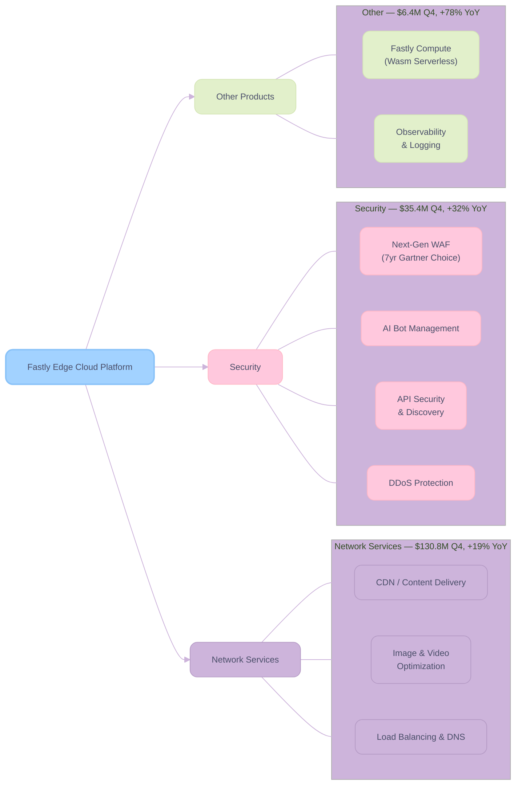
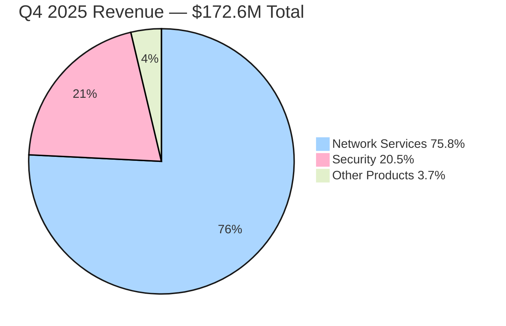
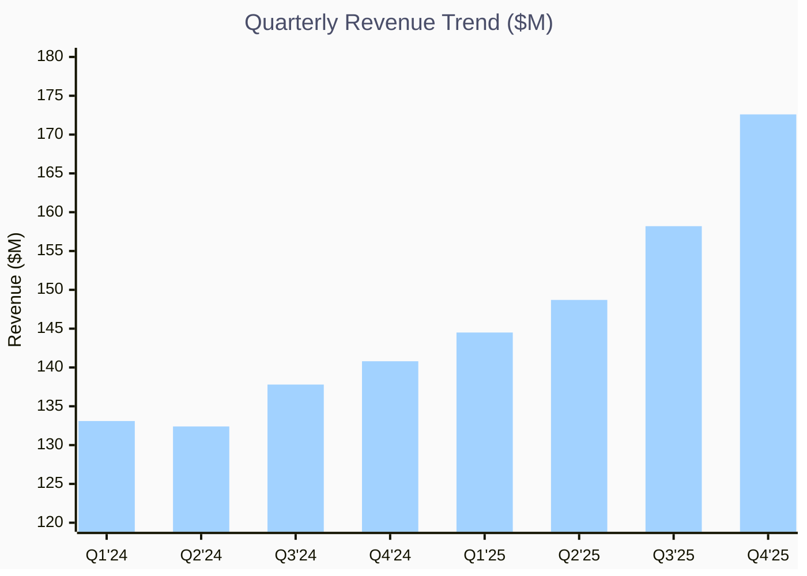
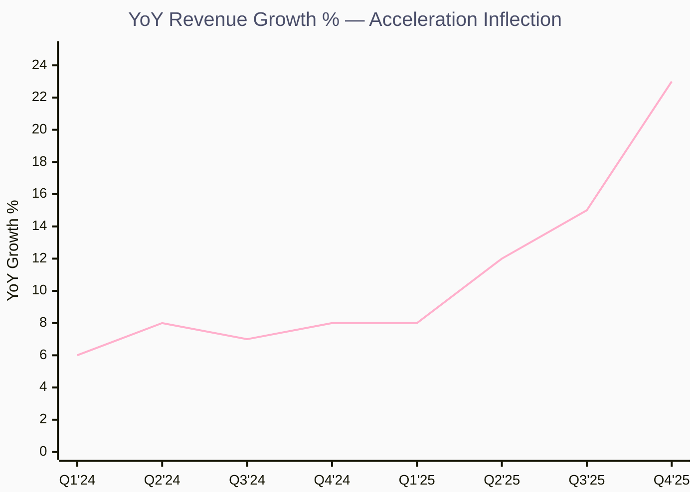
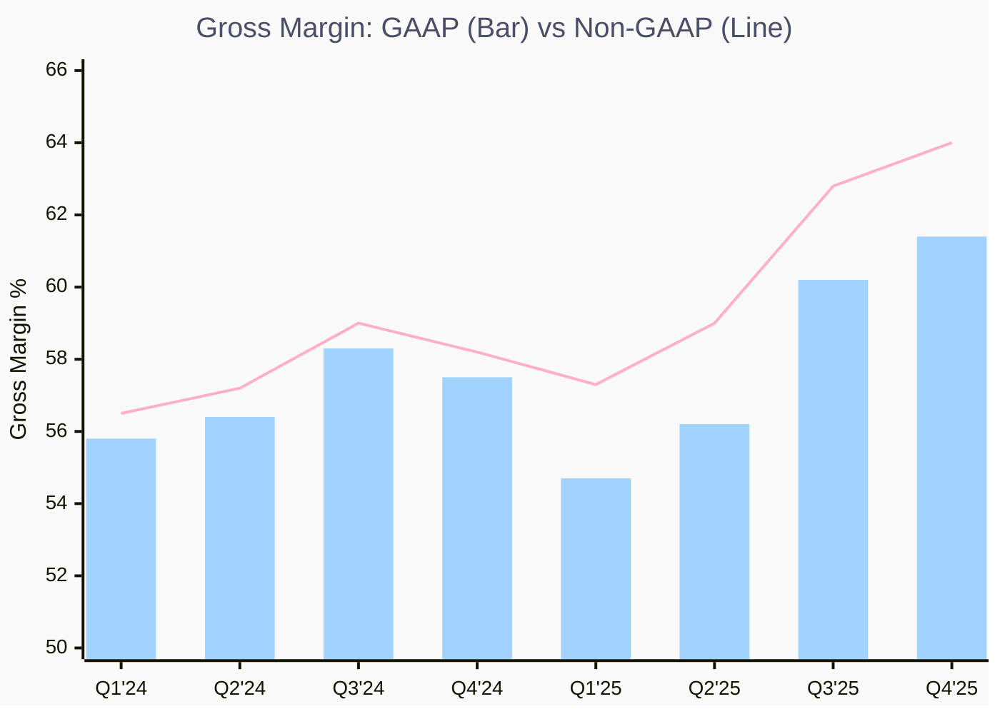
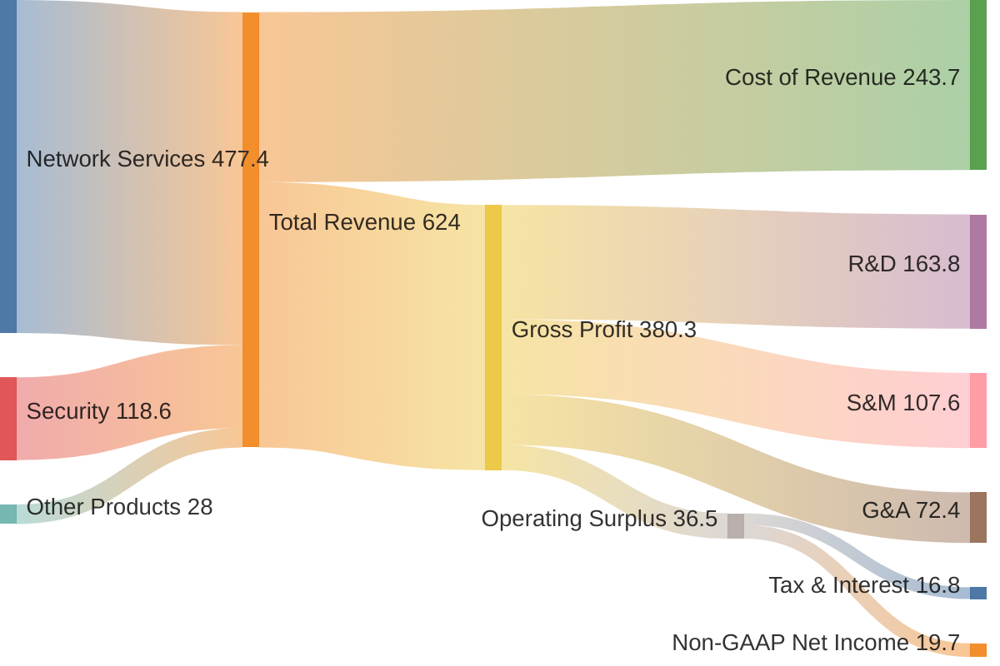
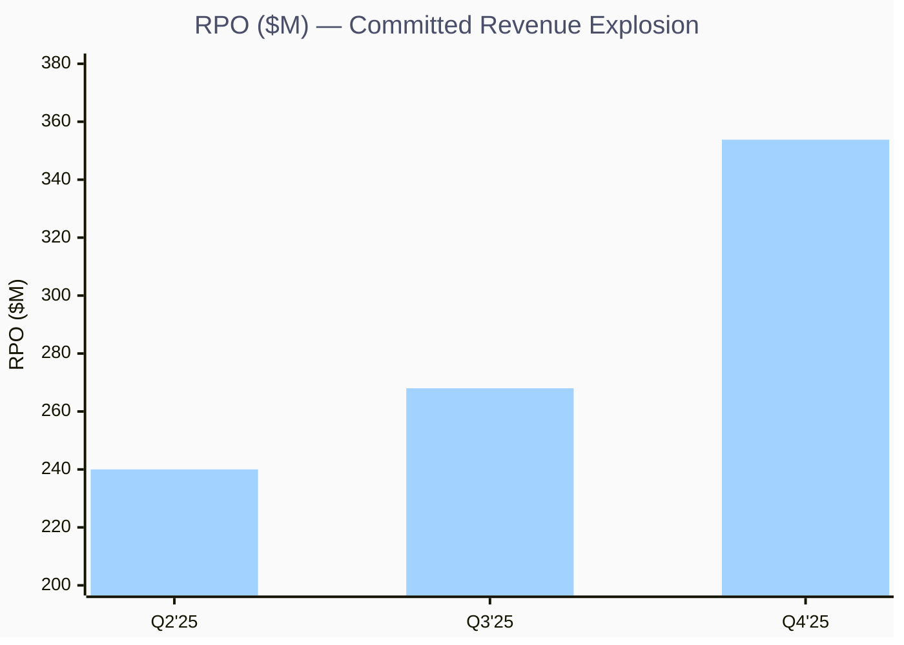
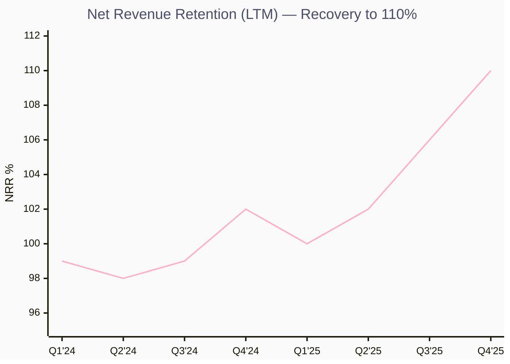
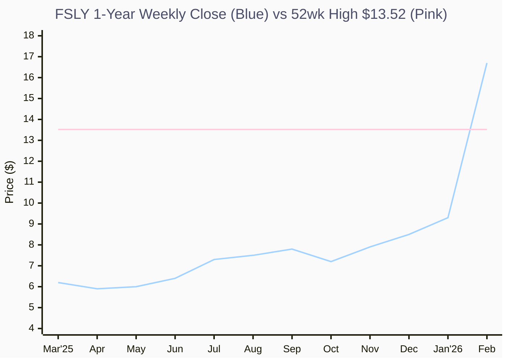

# FSLY Q4 FY2025

> **Fastly, Inc. (NASDAQ: FSLY)** — Edge Cloud Platform
> **报告日期**：2026 年 2 月 12 日 | **最新财报**：Q4 2025 (FY2025)

---

## 一、执行摘要 (Executive Summary)

**核心结论：Speculative Buy — Fastly 正站在一个由 AI/Agentic 浪潮驱动的战略转折点上。**

Fastly 在 Q4 2025 交出了一份**里程碑式的财报**：Revenue $172.6M（+23% YoY，公司历史上最大的 sequential dollar growth），Gross Margin 64%（创纪录），首次实现全年盈利（FY2025 Non-GAAP Net Income $19.7M），连续四个季度正 Free Cash Flow。管理层给出 2026 年 Revenue 指引 $700-720M（+14% YoY），Non-GAAP Operating Margin 翻倍至 8%，标志着公司从"烧钱换增长"正式进入**规模化盈利阶段**。

### 核心发现

| 维度 | 关键判断 |
|------|----------|
| 📊 **财务健康** | 收入加速增长（Q4 +23% YoY），毛利率创历史新高 64%，首年盈利，FCF 全年 $45.8M |
| 📈 **增长引擎** | Security Revenue +32% YoY（占比升至 21%），NRR 提升至 110%，RPO 暴增 55% 至 $353.8M |
| 🏆 **竞争优势** | 性能领先（edge latency），7 年蝉联 Gartner Peer Insights Customer's Choice，AI/Agentic 定位清晰 |
| 👤 **管理层** | 新 CEO Kip Compton（上任 7 个月）执行力强劲，新 CFO Rich Wong 推动财务纪律和 CapEx 透明化 |
| ⚠️ **核心风险** | Top 10 客户集中度 34%，消费型收入模型波动性大，$340M+ 可转债稀释风险，宏观/地缘不确定性 |

---

## 二、公司概览 (Company Profile)

### 2.1 基本信息

| 项目 | 详情 |
|------|------|
| **公司全称** | Fastly, Inc. |
| **Ticker** | FSLY (NASDAQ) |
| **CEO** | Kip Compton（2025 年 7 月上任） |
| **CFO** | Richard Wong（2025 年 Q3 加入） |
| **总部** | 旧金山, 加利福尼亚 |
| **员工数** | ~1,103 |
| **市值** | ~$2.5B（截至 2026/2/12 盘后） |
| **CIK** | 0001517413 |
| **官网** | [fastly.com](https://www.fastly.com) |

### 2.2 核心业务分部

Fastly 的业务围绕**边缘云平台 (Edge Cloud Platform)** 展开，核心产品线分为三大板块：

**Key Insights:**

- 🏆 **Network Services 仍是核心收入支柱**：占总收入 ~76%，Q4 增速 19% 远超行业 6-7% 的市场增长率
- 📈 **Security 是最快增长板块**：+32% YoY，占比已升至 21%，cross-sell 飞轮效应显现
- ⚠️ **Other Products 基数小但增速惊人**：+78% YoY，Compute@Edge 正在获得 AI workload 牵引力

### 2.3 关键产品与服务

1. **Content Delivery Network (CDN)**：基于边缘 POP (Point of Presence) 的全球内容分发，以低延迟和高性能著称。Fastly 的 CDN 采用 **Varnish** 开源技术定制构建，提供实时配置推送（秒级生效 vs 竞争对手分钟级）。

2. **Next-Gen WAF (Web Application Firewall)**：收购 Signal Sciences 后整合的核心安全产品，连续 **7 年**获得 Gartner Peer Insights Customer's Choice Award。WAF 仍是 Security Revenue 的主要贡献者。

3. **API Security Suite**：2025 年推出的高增长新产品线，包括 API Discovery（Q3 2025）和 API Inventory（Q4 2025），帮助客户可视化和保护 API 流量。

4. **AI Bot Management**：针对 Agentic AI 时代的流量管理解决方案，帮助客户区分、优化和阻止 AI 爬虫/机器人流量。支持 RSL (Really Simple Licensing) 协议，行业首发。

5. **Fastly Compute (Edge Serverless)**：基于 WebAssembly/Wasm 的边缘计算平台，支持 AI 推理工作负载，客户用于存储大型训练数据集和边缘推理。

### 2.4 收入结构

**Key Insights:**

- 🏆 **Network Services 占比 75.8%**：流量驱动型收入，$130.8M，受益于 event-driven traffic 和客户 upsell
- 📈 **Security 占比 20.5%**：战略性增长板块，WAF + Bot Mgmt + API Security 组合拳
- ⚠️ **Other Products 占比 3.7%**：Compute@Edge 处于早期放量阶段，AI workload 赋予想象空间

---

## 三、财务分析 (Financial Analysis)

### 3.1 季度收入趋势（8 季度）

**Key Insights:**

- 🏆 **收入连续四个季度加速增长**：Q1 +8% → Q2 +12% → Q3 +15% → Q4 +23% YoY
- 📈 **Q4 实现公司史上最大 sequential dollar growth**：环比增长 $14.4M，收入拐点信号明确
- ⚠️ **消费型定价模型意味着收入有季节性波动风险**：Q1 通常是全年低点

### 3.1.1 YoY Revenue Growth 加速曲线

**Key Insights:**

- 🏆 **增速从 FY2024 的 ~7% 平台加速至 Q4'25 的 23%**：增速拐点清晰，非线性跃升
- 📈 **Q3→Q4 增速跳升 800bps**：单季增速跃升幅度为近 3 年之最
- ⚠️ **2026 全年指引 +14%**：管理层保守指引 vs 当前动能，是否持续 beat 是关键

### 3.2 季度关键财务数据表

| 指标 | Q1 2025 | Q2 2025 | Q3 2025 | Q4 2025 | QoQ 趋势 |
|------|---------|---------|---------|---------|----------|
| **Revenue** | $144.5M | $148.7M | $158.2M | $172.6M | 📈 加速 |
| **YoY Growth** | +8% | +12% | +15% | +23% | 📈📈 |
| **Gross Margin (Non-GAAP)** | 57.3% | 59.0% | 62.8% | 64.0% | 📈 |
| **Operating Income (Non-GAAP)** | ~Breakeven | ~$1M | $11.5M | $21.2M | 📈📈 |
| **Operating Margin (Non-GAAP)** | ~0% | ~1% | 7.3% | 12.3% | 📈📈 |
| **Net Income (Non-GAAP)** | Loss | ~Breakeven | Profit | $20.1M | 📈📈 |
| **EPS (Non-GAAP Diluted)** | -$0.05 | ~$0.00 | ~$0.04 | $0.12 | 📈📈 |
| **FCF** | $8.2M | $10.1M | $18.9M | $8.6M | ⚠️ Q4 CapEx timing |
| **NRR (LTM)** | 100% | 102% | 106% | 110% | 📈📈 |
| **RPO** | N/A | ~$240M | $268M | $353.8M | 📈📈📈 |
| **Enterprise Customer Count** | N/A | 573 | 586 | 599 | 📈 |
| **Cash & Investments** | ~$205M | ~$321M | ~$343M | ~$362M | 📈 |

### 3.3 年度关键财务数据

| 指标 | FY2022 | FY2023 | FY2024 | FY2025 | 趋势 |
|------|--------|--------|--------|--------|------|
| **Revenue** | $432.7M | $506.0M | $544.0M | $624.0M | 📈 |
| **YoY Growth** | +22% | +17% | +7.5% | +15% | 📈 反弹 |
| **Gross Profit** | $235.3M | $296.6M | $319.7M | $380.3M | 📈 |
| **Gross Margin** | 54.4% | 58.6% | 58.8% | 60.9% | 📈 |
| **Operating Income (GAAP)** | -$186.3M | -$132.9M | -$137.3M | -$103.5M | 📈 |
| **Net Income (GAAP)** | -$189.8M | -$124.2M | -$119.2M | -$106.2M | 📈 |
| **Net Income (Non-GAAP)** | Loss | Loss | -$12.1M | $19.7M | ✅ 转正 |
| **Adj EBITDA** | N/A | N/A | $32.6M | $77.4M | 📈📈 |
| **FCF** | Negative | Negative | -$35.7M | $45.8M | ✅ 转正 |
| **Total Assets** | $1.56B | $1.43B | $1.35B | ~$1.3B | ⚠️ 缩表 |
| **Total Debt** | ~$940M | ~$370M | ~$340M | ~$530M | ⚠️ 新增可转债 |
| **Stockholders' Equity** | $417M | $815M | $784M | ~$570M | ⚠️ |

### 3.4 毛利率趋势（8 季度）

**Key Insights:**

- 🏆 **Q4 Non-GAAP 毛利率 64% 创历史新高**：比指引中值 61.5% 高出 250bps，比去年同期 57.5% 提升 650bps
- 📈 **Incremental Gross Margin 达 76%**：增量收入的单位经济学极其优异，规模效应 + 价格纪律双驱动
- ⚠️ **2026 年毛利率指引 63%±50bps**：预期 Q2/Q3 因新 POP 上线有季节性回调，Q1/Q4 更高

### 3.5 FY2025 收入流向（Sankey 图）

**Key Insights:**

- 🏆 **FY2025 首次实现 Non-GAAP Net Income $19.7M**：从亏损到盈利的历史性跨越
- 📈 **Gross Profit $380.3M（Margin 60.9%）**：成本控制优异，incremental GM 76%
- ⚠️ **OpEx 三大项合计 $343.8M**：R&D 占比最高（$163.8M），研发投入维持高强度

### 3.6 资产负债表与现金流

**资产负债表亮点 (Q4 2025)**：

- **现金、等价物及投资**：$362M（环比增加 $19M）
- **Total Debt**：~$530M（含 2030 年到期的 $180M 零息可转债）
- **Convertible Notes 细节**：0% 利息，32.5% conversion premium，另有 $18M cap call 交易（100% conversion premium，对应股价 $23.4）
- **Stockholders' Equity**：~$570M

**现金流亮点 (FY2025)**：

- **Cash from Operations**：$94.4M（vs FY2024 的 $16.4M）
- **Free Cash Flow**：$45.8M（vs FY2024 的 -$35.7M），全年正向翻转 $81.6M
- **CapEx (Infrastructure)**：FY2025 约 5% of revenue；2026 指引大幅提升至 10-12%

---

## 四、运营指标 (Operating Metrics)

### 4.1 关键 KPI 追踪

| 指标 | Q1 2025 | Q2 2025 | Q3 2025 | Q4 2025 | 解读 |
|------|---------|---------|---------|---------|------|
| **NRR (LTM)** | 100% | 102% | 106% | 110% | 显著回升，大客户 upsell 驱动 |
| **Annual Revenue Retention** | — | — | — | 98.7% | 略低于 FY2024 的 99.0% |
| **RPO** | N/A | ~$240M | $268M (+16% YoY) | $353.8M (+55% YoY) | 爆发式增长，committed revenue 大增 |
| **Current RPO (cRPO)** | N/A | N/A | N/A | ~$248M (+37% YoY) | 占 RPO 70%，近期可识别性高 |
| **Top 10 客户占比** | ~33% | 32% | 32% | 34% | 大客户增速 +30%，但集中度仍可控 |
| **Enterprise Client Count** | N/A | 573 | 586 | 599 | 稳步扩大 |
| **Price Erosion** | Mid-teens | Mid-teens | Contracting | Mid-single digits | 定价纪律显著改善 ✅ |
| **Traffic Growth** | N/A | N/A | N/A | Mid-20s% | 流量健康增长 |

### 4.2 RPO 爆发式增长

**Key Insights:**

- 🏆 **RPO 暴增至 $353.8M（+55% YoY）**：Q3→Q4 单季增加 $85.8M，反映大客户签署更大、更长期承诺
- 📈 **Current RPO ~$248M（+37% YoY）**：占 RPO 70%，12 个月内将转化为收入
- ⚠️ **RPO 增速远超收入增速（55% vs 23%）**：committed revenue 积累加速，为 2026 打下收入基础

### 4.3 NRR 回升趋势

**Key Insights:**

- 🏆 **NRR 从 98% 底部回升至 110%**：大客户 upsell/cross-sell 飞轮启动，接近 SaaS 行业优秀水平
- 📈 **Q3→Q4 跃升 400bps**：单季最大增幅，受益于 Top 10 客户 +30% YoY 增速
- ⚠️ **年度 Revenue Retention 98.7% 微降**：存在部分中小客户流失，但 NRR > 100% 证明 expansion 远大于 churn

---

## 五、电话会议纪要 (Earnings Call Insights)

### 5.1 四季度主题对比

| 季度 | CEO | 核心主题 | 关键战略信号 |
|------|-----|----------|-------------|
| **Q1 2025** | Todd Nightingale（末任） | 收入 beat guidance 上限，FCF 首次转正 | 上调全年指引 +$10M，Compute 产品 +64% YoY，TikTok 美国收入不确定性 |
| **Q2 2025** | Kip Compton（首秀） | 新 CEO 首个电话会议，动能持续 | Go-to-market 转型开始，新 CFO Richard Wong 加入，聚焦 ROI 纪律 |
| **Q3 2025** | Kip Compton | Revenue +15%，Gross Margin 62.8%（+380bps QoQ） | 全年指引再上调至 $610-614M，API Discovery 发布，Security cross-sell 加速 |
| **Q4 2025** | Kip Compton | **里程碑式季度**：Revenue +23%，GM 64%，首年盈利 | 2026 指引 $700-720M (+14%)，AI/Agentic 战略清晰化，CapEx 提升至 10-12% |

### 5.2 Q4 2025 CEO Q&A 精选解读

#### 🤖 AI/Agentic 流量与业务影响

> **CEO Kip Compton**: "We're seeing an increase in traffic related to agents... if you've used AI tools, they often check a lot more websites than you might. That's more traffic processed through the Fastly network."

**解读**：Agentic AI 对 Fastly 构成三重利好：(1) 流量增量（agent 比人类用户请求量更大），(2) 安全需求（AI Bot 管理），(3) Edge Compute 工作负载（推理和数据存储）。管理层将 AI 视为 "tailwind"，而非竞争威胁。

#### 💰 定价纪律与价格侵蚀收缩

> **CFO Rich Wong**: "Our price erosion in Q4 was in the mid-single digits. We have historically talked about mid-teens price erosion."

**解读**：这是一个极其关键的信号。价格侵蚀从 mid-teens（~13-15%）收缩至 mid-single digits（~4-6%），意味着 Fastly 在"性能真正重要的场景"中具备了定价权。这是毛利率能从 57% 跃升至 64% 的核心驱动因素之一。

#### 📊 RPO 增长的质量

> **CEO Kip Compton**: "It's been a very deliberate and intentional part of our strategy... encouraging more revenue commitments to help manage or mitigate the volatility from a purely utility-based pricing model."

**解读**：管理层有意识地通过 RPO 增长来对冲消费型收入模型的波动性。RPO +55% 不仅是增长信号，更是商业模式向"更可预测"方向演进的证据。

#### 🏗️ CapEx 提升至 10-12% 的原因

> **CFO Rich Wong**: "We are seeing potentially 25% to 75% increases year-on-year on memory component pricing... the increase is both for growth CapEx and to mitigate supply chain constraints."

**解读**：CapEx 从 5% 提升至 10-12% of revenue 看似激进，但实际是：(1) FY2025 有 ~$10M 推迟到 2026，(2) 内存涨价 25-75%（HBM 带动整体内存市场），(3) 大部分是 growth CapEx（非维护），(4) APJ 区域新 POP 扩建。管理层强调其**软件定义基础设施**的资本效率优于传统 CDN。

#### 📈 2026 指引的信心来源

> **CFO Rich Wong**: "We do a very robust planning process... we're looking at it on a customer-by-customer basis."
> **CEO Kip Compton**: "I think you had 18 different calibrations from his team."

**解读**：2026 年 $700-720M 的指引是经过 18 次校准的精细预测，体现了新 CFO 的分析严谨性。指引隐含 Q1 $168-174M（+18% YoY 中值），全年 +14%，管理层对超越市场增速（Network Services 市场 6-7%，Security 市场 12-13%）充满信心。

---

## 六、竞争格局与行业分析 (Competitive Landscape)

### 6.1 竞争对手概览

| 竞争对手 | 核心业务 | FY2025E 收入 | 关键差异 | 对 Fastly 的威胁 |
|----------|----------|-------------|----------|----------------|
| **Cloudflare (NET)** | CDN + Security + Zero Trust + Workers AI | ~$1.8B | 全栈平台，SMB 到 Enterprise 全覆盖，AI 推理能力更强 | 🔴 **最大竞争者**，产品广度远超 Fastly |
| **Akamai (AKAM)** | 传统 CDN + Security + Cloud Computing | ~$3.9B | 规模最大，企业渗透最深，Guardicore 微分段 | 🟡 **传统竞争对手**，但创新速度较慢 |
| **Amazon CloudFront (AMZN)** | AWS 集成 CDN | 未单独披露 | AWS 生态锁定，与 Lambda@Edge 深度集成 | 🔴 **价格竞争和生态锁定** |
| **Limelight/Edgio** | CDN + Streaming | 已申请破产 | — | 🟢 竞争者退出，市场份额可重新分配 |
| **Vercel/Netlify** | 前端部署 + Edge Functions | 私有 | 开发者体验优先，Jamstack 生态 | 🟢 不同细分市场，部分互补 |

### 6.2 Fastly 竞争定位分析

**核心护城河 (Moat)**：

1. **性能优势（Performance Edge）**：Fastly 的边缘网络延迟在行业内保持领先。CFO 指出 price erosion 收缩至 mid-single digits，表明客户愿意为性能溢价付费。
2. **可编程性（Programmability）**：VCL (Varnish Configuration Language) 和 Compute@Edge 提供比竞争对手更深层次的流量控制和自定义能力。
3. **安全产品持续获奖**：连续 7 年 Gartner Peer Insights Customer's Choice，在 Cloud WAAP 领域具有强品牌认知。
4. **客户粘性提升**：RPO +55%、NRR 110%，显示 platform strategy（multi-product adoption）正在构建 switching costs。

**核心劣势 (Moat Gap)**：

1. **规模劣势**：Revenue $624M vs Cloudflare ~$1.8B vs Akamai ~$3.9B，R&D 投入绝对额受限。
2. **产品广度**：缺乏 Zero Trust、SASE、DEM 等 Cloudflare 已具备的网络安全组件。
3. **开发者生态**：Compute@Edge (Wasm) 的开发者采纳速度慢于 Cloudflare Workers (V8 isolates)。
4. **客户多元化**：Top 10 客户占 34%，虽然在改善，但仍远高于 Cloudflare 等竞争对手。

---

## 七、估值与机构持仓 (Valuation & Ownership)

### 7.1 估值对比

| 指标 | FSLY | NET (Cloudflare) | AKAM (Akamai) | 行业中值 |
|------|------|-------------------|----------------|---------|
| **市值** | ~$2.5B | ~$45B | ~$15B | — |
| **P/S (TTM)** | ~4.0x | ~25x | ~3.8x | ~5x |
| **P/S (FY2026E)** | ~3.5x | ~20x | ~3.5x | ~4x |
| **EV/EBITDA (TTM)** | ~33x | ~125x | ~15x | ~20x |
| **EV/FCF (FY2026E)** | ~50x | — | ~20x | — |

**Key Insights:**

- 🏆 **相对 Cloudflare，Fastly 在 P/S 上存在显著折价**：4x vs 25x，即使考虑规模差异，Fastly 增速回归（+14-18%）后估值重估空间较大
- 📈 **与 Akamai 估值接近**：但 Fastly 增速远高于 Akamai（14% vs ~5%），成长溢价应更高
- ⚠️ **盈利仍在早期阶段**：P/E 难以有效比较，FCF 倍数 ~50x 偏高，需要盈利持续验证

### 7.2 分析师评级与目标价

| 机构 | 评级 | 目标价 | 日期 | 动作 |
|------|------|--------|------|------|
| **KeyBanc** | **Overweight** ⬆️ | $14.00 | 2025/12/15 | 上调评级 |
| **Piper Sandler** | Neutral | $14.00 ↑ | 2026/2/12 | 上调目标价（from $11） |
| **RBC Capital** | Sector Perform | $12.00 ↑ | 2026/2/12 | 上调目标价（from $10） |
| **Citigroup** | Neutral | $10.00 ↓ | 2026/1/16 | 下调目标价（from $12） |
| **DA Davidson** | Neutral | $9.00 ↓ | 2026/2/9 | 下调目标价（from $11.5） |
| **Oppenheimer** | Perform | — | 2025/11/17 | 首次覆盖 |

> **共识评级**：Hold（2 Buy, 7 Hold, 1 Sell）
> **注意**：Q4 业绩发布后，多家机构上调目标价但维持中性评级，暗示估值在 $12-14 区间有分歧，而当前股价已达 ~$16.7。

### 7.3 Top 10 机构持仓

| 排名 | 机构 | 持股比例 | 持股数量 | 持仓价值 |
|------|------|---------|---------|---------|
| 1 | Vanguard Group | 11.36% | 16.98M | $284M |
| 2 | BlackRock | 8.42% | 12.58M | $210M |
| 3 | Legal & General | 5.76% | 8.61M | $144M |
| 4 | Morgan Stanley | 4.86% | 7.27M | $122M |
| 5 | Penserra Capital | 4.84% | 7.24M | $121M |
| 6 | Dimensional Fund | 2.77% | 4.14M | $69M |
| 7 | Geode Capital | 2.33% | 3.48M | $58M |
| 8 | State Street | 2.11% | 3.16M | $53M |
| 9 | First Trust Advisors | 1.82% | 2.72M | $45M |
| 10 | Royal Bank of Canada | 1.70% | 2.54M | $42M |

> **机构持股比例**：73.97% | **内部人士持股**：6.73% | **机构数量**：335 家

---

## 八、股价走势综合分析 (Stock Performance Analysis)

### 8.1 近期市场表现

| 指标 | 数值 |
|------|------|
| **当前价格** | $16.69（2026/2/12 盘后） |
| **52 周最高** | $13.52（盘中 Feb 12 打破后继续飙升） |
| **52 周最低** | $4.65 |
| **当日涨幅** | +79.59% 🚀 |
| **β 系数** | 1.147 |
| **市值** | ~$2.5B |
| **Short Interest** | 9.59%（~11.07M shares） |

### 8.2 1 年股价走势

**Key Insights:**

- 🏆 **Q4 财报催化剂引发暴涨 ~80%**：单日涨幅为公司历史之最，一举突破前 52 周高点 $13.52
- 📈 **1 年涨幅达 ~170%**：从 52 周低点 $4.65 到 $16.7，估值重估进行中
- ⚠️ **Short Interest 9.59%**：大量空头面临被逼仓（~11M shares），short squeeze 效应可能叠加

### 8.3 关键价格驱动事件

| 日期 | 事件 | 股价影响 |
|------|------|---------|
| 2025/5/7 | Q1 2025 earnings beat，FCF 首次转正 | +5.3% |
| 2025/7 | CEO 换帅（Todd → Kip Compton） | 中性偏正 |
| 2025/8/6 | Q2 2025 新 CEO 首份财报 | +温和上涨 |
| 2025/11/5 | Q3 2025 beat + 全年上调 | +1.3% |
| 2025/12/15 | KeyBanc 上调至 Overweight | +正面 |
| **2026/2/11** | **Q4 2025 里程碑式 beat-and-raise** | **+79.6%** 🚀 |

---

## 九、风险评估 (Risk Assessment)

### 9.1 风险矩阵

| 风险因素 | 概率 | 影响 | 评级 | 详细说明 |
|----------|------|------|------|----------|
| **客户集中度** | 🟡 中 | 🔴 高 | ⚠️ 高 | Top 10 客户占 34%；虽无单一客户 >10%，但关联实体合计 11% |
| **消费型收入波动** | 🟡 中 | 🟡 中 | ⚠️ 中高 | 流量驱动的计费模式使季度收入不确定性高；RPO 增长正在缓解 |
| **可转债稀释** | 🟡 中 | 🟡 中 | ⚠️ 中 | $180M 零息可转债(2030)，32.5% conversion premium；Cap call 在 $23.4 以上失效 |
| **竞争加剧** | 🟡 中 | 🟡 中 | ⚠️ 中 | Cloudflare 产品广度远超，Akamai 规模碾压，云厂商(AWS/GCP)集成优势 |
| **CapEx 增加** | 🟡 中 | 🟢 低 | ⚠️ 中低 | 10-12% of rev vs 5%，内存涨价+扩容双重压力，但大部分为 growth CapEx |
| **宏观/地缘政治** | 🟡 中 | 🟡 中 | ⚠️ 中 | 国际客户购买模式可能受影响；管理层在指引中已纳入审慎考量 |
| **GAAP 持续亏损** | 🔴 高 | 🟢 低 | ⚠️ 中低 | FY2025 GAAP Net Loss ~$106M（SBC 高企），Non-GAAP 已盈利但 GAAP 转正仍需时间 |
| **管理层变动风险** | 🟢 低 | 🟡 中 | ⚠️ 低 | 新 CEO + 新 CFO 均在半年内上任，上手期仍有执行不确定性 |

### 9.2 做空逻辑 (Bear Case)

1. **估值已透支**：盘后 $16.7 已高于所有分析师目标价（最高 $14），+80% 单日涨幅可能包含 short squeeze 成分。
2. **增长减速风险**：2026 指引 +14% 低于 Q4 的 +23%，市场可能在热情消退后重新审视增长持续性。
3. **GAAP 仍在亏损**：SBC（Stock-Based Compensation）高企使 GAAP Net Income 仍为负，Non-GAAP 盈利的"质量"存疑。
4. **Cloudflare 产品威胁**：NET 在 AI 推理（Workers AI）、Zero Trust、DEM 等领域的产品广度远超 Fastly。

---

## 十、投资洞察 (Investment Insights)

### 10.1 做多逻辑 (Bull Case)

1. **AI/Agentic 时代的最佳受益者之一**：Agent 产生的请求量远超人类用户，所有流量都通过 Edge 处理。Fastly 的性能优势和 AI Bot Management 产品使其在 Agentic AI 时代具有天然定位。William Blair 将其称为 "underappreciated AI play"。

2. **盈利拐点已至**：从长期亏损到 Non-GAAP 首年盈利 $19.7M，FCF 全年 $45.8M，且 2026 指引 Non-GAAP Operating Margin 翻倍至 8%。这不是一次性事件——incremental gross margin 76% 证明规模效应正在显现。

3. **RPO 爆发性增长验证商业模式进化**：$353.8M RPO (+55% YoY) 表明客户正在做出更大、更长期的承诺，对冲了消费型计费模式的波动性。这是商业模式从 utility-based 向 hybrid commitment 模式演进的关键信号。

4. **Security 成为第二增长曲线**：Security Revenue +32% YoY，占比 21%，且 WAF 之外的 Bot Management 和 API Security 正在获得显著牵引力。Security-led 销售动作开始独立于 Network Services。

5. **新管理层执行力获验证**：CEO Kip Compton 上任仅 7 个月即交出历史最佳单季度业绩。CFO Rich Wong 带来的 18 次指引校准和精细化分析赢得了投资者信心。

### 10.2 估值场景分析

| 场景 | FY2026 Revenue | P/S 倍数 | 隐含市值 | 隐含股价 | 空间 |
|------|---------------|---------|---------|---------|------|
| 🐻 Bear Case | $690M (-miss) | 3.0x | $2.1B | $14 | -16% |
| 📊 Base Case | $710M (中值) | 4.0x | $2.8B | $19 | +14% |
| 🐂 Bull Case | $730M (+beat) | 5.0x | $3.7B | $25 | +50% |
| 🚀 Upside Case | $750M | 6.0x | $4.5B | $30 | +80% |

> 基于 ~150M 稀释后股份计算。当前价格 ~$16.7。

### 10.3 综合评级

> **Speculative Buy — 适合高风险偏好的成长型投资者**

**理由**：Fastly 正处于一个从"慢性亏损的小型 CDN 厂商"向"AI-First 边缘云平台"转型的关键节点。Q4 2025 的里程碑式业绩（+23%、64% GM、首年盈利）证明了新管理团队的执行力和商业模式的内生改善。然而，(1) 单日 +80% 的暴涨可能已提前定价了大量正面预期，(2) 当前股价高于所有分析师目标价，(3) GAAP 仍在亏损，(4) 竞争压力来自 Cloudflare/Akamai/Cloud Giants 不容忽视。

**建议策略**：

- **新建仓**：建议在回调至 $12-14 区间（接近分析师目标价）时分批建仓
- **已持仓**：可在当前位置适度获利了结 30-40%，保留底仓享受长期 AI 主题红利
- **关注催化剂**：Q1 2026 业绩（验证 +18% 指引）、Security ARR 披露（可能独立公布）、AI product timeline

---

## 十一、2026 年全年指引摘要 (FY2026 Guidance)

| 指标 | FY2026 指引 | vs FY2025 | 备注 |
|------|-----------|-----------|------|
| **Revenue** | $700-720M | +14% at midpoint | 连续加速增长 |
| **Q1 Revenue** | $168-174M | +18% YoY mid | Q1 加速高于全年 |
| **Gross Margin** | 63% ±50bps | vs 60.9% FY2025 | Q1/Q4 更高，Q2/Q3 新 POP 上线回调 |
| **Non-GAAP OpProfit** | $50-60M | vs ~$25M FY2025 | Operating Margin 翻倍至 8% |
| **Non-GAAP EPS** | $0.23-0.29 | vs $0.13 FY2025 | ~100% 增长 |
| **FCF** | $40-50M | vs $45.8M FY2025 | CapEx 大增下仍保持正向 |
| **Infrastructure CapEx** | 10-12% of Rev | vs 5% FY2025 | 增长型支出 + 内存涨价 + APJ 扩张 |
| **Diluted Shares** | ~175M | vs ~168M FY2025 | 稀释持续 |

---

*免责声明：本报告基于公开信息和第三方数据源编制，仅供投资研究参考，不构成投资建议。投资者应独立判断并承担投资风险。*

*数据来源：SEC EDGAR, Yahoo Finance, Motley Fool Earnings Transcript, Brave News Search, Fastly Investor Relations*
