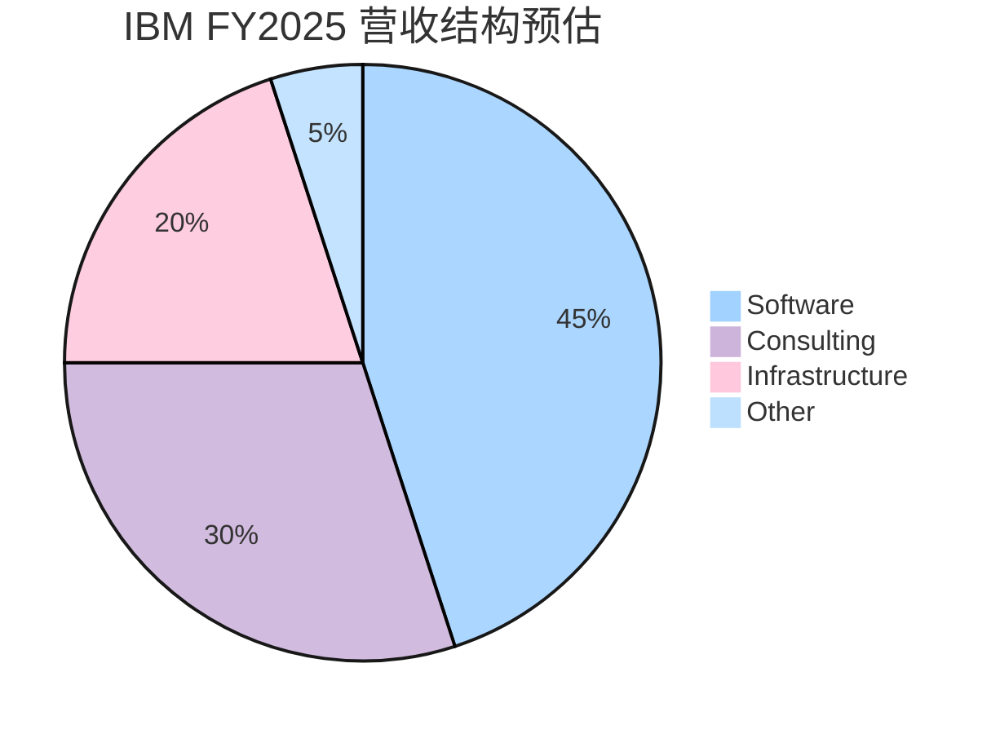
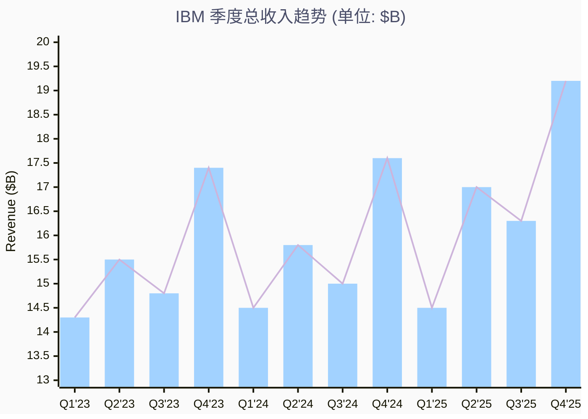
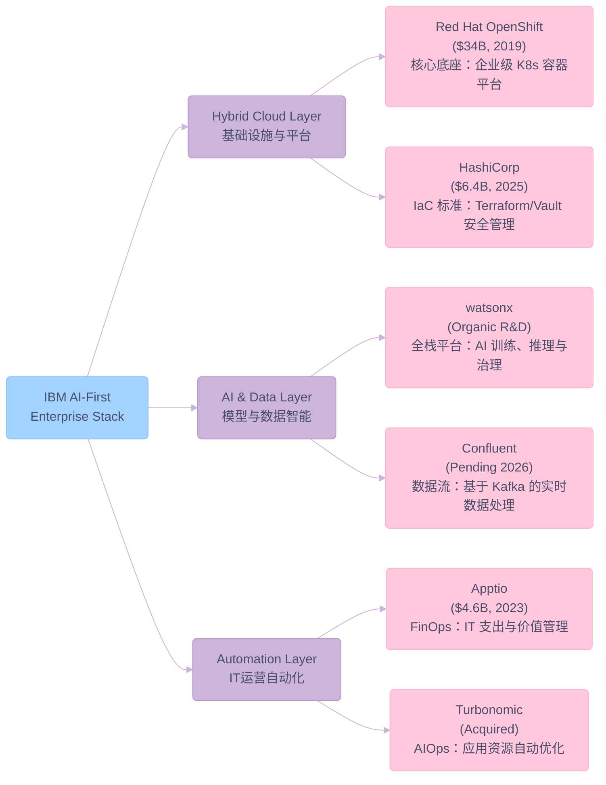
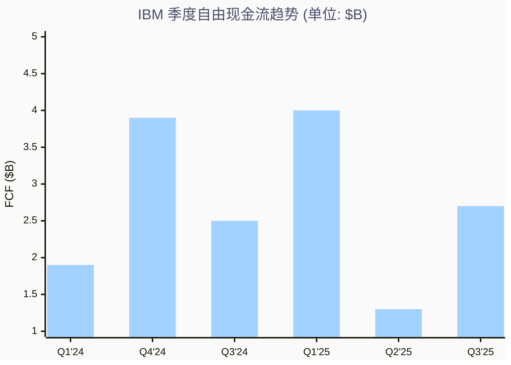

# IBM Q4 FY2025

> **报告日期**：2026-02-12 | **数据截至**：FY2025 Q4 (2026/01/28 发布)
> **股价**：$261.48 | **市值**：$242.4B | **52 周范围**：$164.15 - $265.72

---

## 一、核心摘要

IBM 正经历自 2020 年 Arvind Krishna 上任以来最具实质性的业务转型。公司从"传统硬件巨头"蜕变为以 **Software + AI（watsonx）+ Hybrid Cloud（Red Hat + HashiCorp）** 为核心的企业级平台公司。FY2025 年收入达 ~$65.9B，同比增长 ~5%（按固定汇率），Software 部门首次接近总收入的 50%，成为真正的利润引擎。

**核心投资亮点**：

- 🤖 **AI 商业化加速**：GenAI Book of Business 累计突破 $12.5B，watsonx 平台从"实验阶段"进入"规模化部署阶段"
- ☁️ **Hybrid Cloud 护城河加深**：$6.4B 收购 HashiCorp（2025 年初完成）+ Confluent 收购（预计 2026 年中完成），构建跨云基础设施堆栈
- 🖥️ **z17 大型机周期启动**：2025 年 6 月发布的 z17 搭载 Telum II 处理器，AI 推理性能较 z16 提升 50%，推动 Infrastructure 部门进入强周期
- 💰 **自由现金流强劲**：FY2025 预期 FCF ~$13.5B，支撑持续分红（季度 $1.67/股）和战略并购

**主要风险**：

- ⚠️ Consulting 部门增长承压，受宏观经济和联邦支出削减影响
- ⚠️ 收购整合风险（HashiCorp、Confluent 的协同效应仍需验证）
- ⚠️ AI 竞争加剧（Microsoft/Azure AI、AWS Bedrock、Google Vertex AI）

---

## 二、公司简介与业务架构

### 2.1 公司概况

| 项目 | 详情 |
|------|------|
| **公司名称** | International Business Machines Corporation |
| **成立时间** | 1911 年 |
| **总部** | One New Orchard Road, Armonk, NY 10504 |
| **CEO** | Arvind Krishna（2020 年 4 月上任） |
| **CFO** | James J. Kavanaugh（2018 年起任） |
| **员工数** | ~284,000 |
| **行业** | IT Services & Consulting |
| **主要交易所** | NYSE: IBM |

### 2.2 业务部门结构

**Key Insights:**

- 🏆 **Software 占比持续攀升**：从 FY2023 的 ~40% 增至 FY2025 的 ~45%，成为利润核心引擎
- 📈 **Consulting 稳中求变**：GenAI 咨询带来新增量，但传统联邦项目面临压力
- ⚠️ **Infrastructure 周期性强**：z17 新周期启动后 FY2025 下半年增速显著回升

#### 三大业务部门详解

**Software（软件）**：包括 Red Hat（OpenShift、Ansible、RHEL）、watsonx AI 平台、Automation（Apptio、Turbonomic）、Data & AI、Security（QRadar）、Transaction Processing（CICS、IMS）。FY2025 年增长 ~9%，是 IBM 转型的核心引擎。

**Consulting（咨询）**：包括 Business Transformation、Technology Consulting、Application Operations。帮助客户实施 AI 和混合云项目。AI 相关收入已占 Consulting 总收入的 10%+。

**Infrastructure（基础设施）**：包括 IBM Z 大型机（z17）、分布式基础设施（Power、Storage）、基础设施支持。z17 周期启动是 FY2025 下半年的重要增长驱动力。

---

## 三、12 个季度关键业务数据表格

### 3.1 季度收入与盈利趋势

| 季度 | 总收入 | YoY 增长 | 毛利润 | 毛利率 | Operating EPS | GAAP EPS (Diluted) | 自由现金流 |
|------|--------|----------|--------|--------|---------------|---------------------|-----------|
| **Q4 2025** | ~$19.2B | ~9.6% | — | — | $4.52 | — | — |
| **Q3 2025** | $16.3B | ~7% | $9.4B | 57.7% | $2.30 | $1.84 | $2.67B |
| **Q2 2025** | $17.0B | ~5% | $10.0B | 58.8% | $2.80 | $2.31 | $1.33B |
| **Q1 2025** | $14.5B | ~1% | $8.0B | 55.2% | $1.60 | $1.12 | $3.98B |
| **Q4 2024 (Actual)** | $17.38B | ~4% (CC) | - | - | $3.87 (Adj) | - | $3.4B (FY24 Q4) |
| **Q3 2024** | $15.0B | ~1.5% | $8.4B | 56.4% | $2.30 | -$0.36 | $2.46B |
| **Q2 2024** | $15.8B | ~4% | $8.9B | 56.6% | $2.43 | $1.96 | ~$2.0B |
| **Q1 2024** | $14.5B | ~3% | $7.7B | 53.5% | $1.68 | $1.72 | $1.9B |
| **Q4 2023** | $17.4B | ~4.1% | $10.3B | 59.2% | $3.87 | $3.55 | ~$3.3B |
| **Q3 2023** | $14.8B | ~4.6% | $8.0B | 54.4% | $2.20 | $1.84 | ~$2.0B |
| **Q2 2023** | $15.5B | ~3% | $8.5B | 54.8% | $2.18 | $1.72 | ~$1.8B |
| **Q1 2023** | $14.3B | ~4.5% | — | — | $1.36 | $1.36 | $1.3B |

> 注：Q4 2025 数据为初步报告，部分季度数据来自 SEC filings 和 earnings call snippets 的交叉验证。Q3 2024 GAAP EPS 为负主要因大额非经常性项目（含 HashiCorp 收购相关费用）。

### 3.2 营收趋势可视化

**Key Insights:**

- 🏆 **Q4 2025 创收入新高**：$19.2B，9.6% YoY 增长为十年来最强季度表现
- 📈 **增长加速明显**：从 2024 年的平均 ~2.4% YoY 提升至 2025 下半年的 7-10%
- ⚠️ **季节性明显**：Q4 为传统大单季，Q1 通常为全年低点

### 3.3 年度财务概览

| 指标 | FY2025 (预估) | FY2024 | FY2023 |
|------|---------------|--------|--------|
| **总收入** | ~$65.9B | $62.8B | $61.9B |
| **收入增长 (CC)** | ~5% | ~3% | ~3% |
| **毛利率** | ~57%+ | ~56.5% | ~55.5% |
| **Operating Pre-tax Margin** | 扩张 ~1pt | 扩张 ~0.5pt | 扩张 ~0.5pt |
| **自由现金流** | ~$13.5B | $12.7B | $11.2B |
| **Operating EPS** | ~$11.2+ | ~$10.2 | $9.62 |

---

## 四、12 个季度电话会议纪要汇总

### 4.1 季度电话会议关键信息一览

| 季度 | 日期 | 核心主题 | CEO 关键表态 | 指引/展望 |
|------|------|----------|-------------|-----------|
| **Q4 2025** | 2026/01/28 | AI 商业化加速，Software 14% 增长 | AI Book of Business 突破 $12B，watsonx 进入 Agentic AI 阶段 | FY2026 收入增长 >5%，FCF >$13.5B |
| **Q3 2025** | 2025/10/22 | 7% 收入增长，上调全年指引 | 创纪录 FCF，Software 持续两位数增长 | 上调 FY2025 收入预期 |
| **Q2 2025** | 2025/07/23 | z17 发布推动 infra 增长 11% | watsonx Orchestra 扩展至 150+ domain agents，z17 Telum II 处理器 | Operating EPS $2.80，15% 增长 |
| **Q1 2025** | 2025/04/23 | Software 9% 增长，beat 预期 | 联邦业务影响有限（<5% 总收入），Red Hat 消费模式信心充足 | FCF 指引 $13.5B，margin 扩张 >0.5pt |
| **Q4 2024** | 2025/01/22 | 营收 $17.38B (Miss)，Software 增长 3% | AI Book of Business >$3B (Lifetime)，Red Hat +10% | FY2025 FCF >$13.5B |
| **Q3 2024** | 2024/10/23 | Software 10% 增长，Red Hat 14% | GenAI 项目周期更长，预计 2025 年驱动增长 | M&A 聚焦 hybrid cloud、automation、data & AI |
| **Q2 2024** | 2024/07/24 | 超预期收入、盈利和现金流 | Software 8% 增长，Infrastructure 3% 增长 | 上调 Software 增长至高单位数，FCF >$12B |
| **Q1 2024** | 2024/04/24 | HashiCorp $6.4B 收购公告 | 战略收购加强 hybrid cloud 和 AI 布局 | FY2024 mid-single digit 收入增长 |
| **Q4 2023** | 2024/01/24 | FY2023 收入增长 3%，FCF $11.2B | watsonx book of business 从 Q3 到 Q4 翻倍 | FY2024 margin 扩张 ~0.5pt |
| **Q3 2023** | 2023/10/25 | $14.8B 收入，beat 预期 | Red Hat/Software 持续增长，FCF 为核心指标 | FY2023 CC 增长 3-5%，FCF ~$10.5B |
| **Q2 2023** | 2023/07/19 | $15.5B 收入，margin 扩张 | Consulting 6-8% 增长指引，生产力提升驱动利润 | FY2023 FCF ~$10.5B |
| **Q1 2023** | 2023/04/19 | $14.3B 收入，CC 增长 ~4.5% | Red Hat 续约周期加速，OpenShift/Ansible 增长强劲 | FY2023 CC 增长 3-5% |

### 4.2 Management Commentary 深度解读

#### Arvind Krishna 战略愿景演进（2023-2025）

**2023 年（Foundation Year）**— "Today's IBM"

- 定位：剥离 Kyndryl 后的"新 IBM"，聚焦高增长、高价值业务
- 战略重心：Hybrid Cloud + AI 双轮驱动，watsonx 平台首次发布（2023 年中）
- 关键指标：收入增长 3%，FCF $11.2B，自 2019 年以来最强现金流

**2024 年（Acceleration Year）**— "AI Everywhere"

- 定位：从 AI 实验到 AI 商业化的转折年
- 战略重心：$6.4B 收购 HashiCorp，完善 hybrid cloud 基础设施堆栈
- 关键举措：watsonx book of business 快速增长，GenAI 项目在 Consulting 部门上线
- Q3 2024 特殊事项：非经常性费用导致 GAAP 亏损，但 Operating EPS 仍 beat 预期

**2025 年（Inflection Year）**— "AI-First Enterprise"

- 定位：AI 商业化加速，Software 占比接近 50%
- 战略重心：z17 发布（Telum II + Spyre Accelerator）、HashiCorp 整合完成、watsonx 进入 Agentic AI
- 突破性成就：GenAI Book of Business >$12B，Q4 收入 $19.2B 创十年新高
- 新增战略：收购 Confluent，进军实时数据流处理

---

## 五、业务基本面深度分析

### 5.1 Software 部门：转型核心引擎

#### Red Hat — 混合云基石

Red Hat 是 IBM 在 2019 年以 $34B 收购的核心资产，如今已成为 IBM Software 部门增长的最大贡献者：

- **OpenShift**：全球领先的企业级 Kubernetes 平台，ARR for Hybrid Platform and Solutions 在 Q3 2024 达到 $14.9B，YoY +11%
- **Ansible**：IT 自动化平台，与 watsonx 深度集成，推动 AIOps
- **RHEL**（Red Hat Enterprise Linux）：企业 Linux 发行版，高续约率带来稳定的经常性收入

Red Hat 在 2025 年保持两位数增长（Q3 2024 报告 14% 增长），是 IBM Software 高增速的主要推动力。

#### watsonx — AI 商业化平台

watsonx 是 IBM 在 2023 年推出的企业 AI 平台，包含三大组件：

| 组件 | 功能 | 2025 年进展 |
|------|------|------------|
| **watsonx.ai** | AI 模型训练与推理 | 支持 Granite 系列模型，Agentic AI 能力 |
| **watsonx.data** | 数据管理与 lakehouse | 新版本提升 RAG 精度 40% |
| **watsonx.governance** | AI 治理与合规 | 企业级 AI 审计与风险管理 |

**watsonx Orchestra**：2025 年扩展至 150+ domain-specific agents，标志着 IBM 从"ChatBot AI"向"Agentic AI"的关键转型。

#### HashiCorp 整合 — Agentic Infrastructure

2025 年初完成的 $6.4B HashiCorp 收购为 IBM 带来了：

- **Terraform**：基础设施即代码（IaC）标准
- **Vault**：密钥管理与安全
- **Consul**：服务网格与网络管理
- **Project Infragraph**：连接 HashiCorp 基础设施数据与 watsonx AI 平台的创新项目

### 5.2 Consulting 部门：AI 驱动转型

Consulting 部门面临双重挑战：

1. **宏观经济压力**：企业 IT 预算审慎，部分项目延期
2. **联邦支出削减**：US Federal Consulting（<10% Consulting 收入，<5% IBM 总收入）受政府 DOGE 计划影响

但 AI 为 Consulting 带来新的增长点：

- AI 相关收入已占 Consulting 总收入的 **10%+**
- GenAI 项目周期更长、价值更高，预计 2025-2026 年持续放量
- 战略合作伙伴关系：SAP、AWS、Microsoft、Salesforce、Adobe

### 5.3 Infrastructure 部门：z17 强周期驱动

IBM Z 大型机遵循 ~3 年的产品周期：

| 产品 | 发布时间 | 处理器 | AI 能力 |
|------|---------|--------|---------|
| z15 | 2019 Q3 | z15 chip | 有限 |
| z16 | 2022 Q2 | Telum I | 专用 AI 推理加速器 |
| **z17** | **2025 Q2** | **Telum II** | **50% 更多 AI 推理 + Spyre AI 加速卡** |

z17 的关键创新：

- **Telum II 处理器**：第二代片上 AI 加速器，每天可处理 4,500 亿次 AI 推理操作
- **Spyre 加速器**：32 核 PCIe 卡，专为生成式 AI 设计，支持 watsonx Code Assistant for Z
- **z/OS 3.2**：支持硬件加速 AI、现代数据访问和混合云数据集成

Q2 2025 Infrastructure 增长 11%，其中 IBM Z 增长 67%，标志着 z17 强周期正式启动。

---

## 六、战略与并购分析

### 6.1 M&A 战略：构建 AI-First 企业堆栈

IBM 在 Arvind Krishna 领导下采取了高度纪律化的 M&A 策略：

**Key Insights:**

- 🏆 **收购与有机结合**：每次收购均与 IBM 现有平台产生协同，而非独立运行
- 📈 **从 Cloud 到 AI 的自然延伸**：Red Hat → HashiCorp → watsonx → Confluent 形成完整链路
- ⚠️ **整合执行风险**：HashiCorp 虽已完成收购，但 Confluent 仍在审批中（预计 2026 年中关闭）

### 6.2 生产力提升计划

IBM 的内部数字化转型同样引人注目：

- FY2024 末实现 $3.5B 年化生产力节省
- FY2025 目标提升至 ~$4.5B 年化节省
- 通过 AI 自动化内部流程（HR、财务、IT 运维）实现"AI 在 IBM 内部先行先试"

---

## 七、竞争格局分析

### 7.1 主要竞争对手对比

| 维度 | IBM | Microsoft/Azure | AWS | Google Cloud |
|------|-----|-----------------|-----|-------------|
| **Hybrid Cloud** | 🟢 Red Hat OpenShift + HashiCorp（最强） | 🟡 Azure Arc | 🟡 EKS/Outposts | 🟡 Anthos |
| **Enterprise AI** | 🟢 watsonx（治理+部署） | 🟢 Azure AI/Copilot（生态最广） | 🟡 Bedrock（模型多） | 🟡 Vertex AI |
| **AI 治理** | 🟢 watsonx.governance（领先） | 🟡 基础能力 | 🔴 较弱 | 🟡 基础能力 |
| **Consulting** | 🟢 规模化 AI 实施 | 🟡 通过合作伙伴 | 🟡 Professional Services | 🟡 有限 |
| **大型机** | 🟢 独家垄断 | N/A | N/A | N/A |
| **开源生态** | 🟢 Red Hat（Linux/K8s 核心贡献者） | 🟡 GitHub/VS Code | 🟡 有限 | 🟢 Kubernetes 创始者 |

### 7.2 IBM 的差异化竞争优势

1. **Hybrid Cloud 的"瑞士军刀"定位**：IBM 是唯一能在任何环境（公有云、私有云、on-premises、edge）提供统一管理平台的厂商
2. **AI 治理与合规领先**：watsonx.governance 在受监管行业（金融、医疗、政府）中具有绝对优势
3. **大型机不可替代性**：全球前 100 家银行中 44 家使用 IBM Z，替换成本极高
4. **垂直行业深度**：在金融、保险、电信、政府等行业拥有数十年的客户关系和行业知识

---

## 八、财务健康评估

### 8.1 资产负债表关键指标

| 指标 | Q3 2025 | Q4 2024 | Q3 2024 |
|------|---------|---------|---------|
| **总资产** | $146.3B | $137.2B | $134.3B |
| **总负债** | $118.3B | $109.8B | $109.8B |
| **股东权益** | $27.9B | $27.3B | $24.4B |
| **现金及等价物** | $11.6B | $13.9B | $13.2B |
| **总债务** | $66.6B | $58.4B | $60.1B |
| **净债务** | $51.5B | $41.0B | $43.4B |
| **Goodwill** | $67.4B | $60.7B | $61.1B |

> 注：Q3 2025 总资产/总负债上升主要因 HashiCorp 收购完成后的合并报表效应。

### 8.2 现金流趋势

**Key Insights:**

- 🏆 **Q1 2025 FCF $4.0B 创历史新高**（得益于强劲的运营现金流和有利的营运资金变动）
- 📈 **FY2025 FCF 预期 ~$13.5B**，较 FY2024 的 $12.7B 进一步增长
- ⚠️ **Q2 2025 FCF 受 Confluent 收购投资活动影响较低**

### 8.3 关键财务比率

| 指标 | 当前值 | 行业参考 |
|------|--------|---------|
| **P/E (Forward)** | ~22.5x | IT Services 平均 ~25x |
| **Debt-to-Equity** | ~2.4x | 较高，但 FCF 覆盖充足 |
| **Gross Margin** | ~57% | 持续改善中（FY2023: 55.5%） |
| **Dividend Yield** | ~2.6% | 连续 30 年增加分红 |
| **Free Cash Flow Yield** | ~5.6% | 优于同行 |
| **ROE** | ~30.5% | 高于行业平均 |

---

## 九、股价走势与市场分析

### 9.1 股价表现

| 时间范围 | 表现 |
|----------|------|
| **YTD 2026** | +11.8%（截至 2026/02） |
| **1 年** | +43.5%（从 $182 → $261） |
| **52 周高** | $265.72 |
| **52 周低** | $164.15 |
| **50 日均线** | $241.80 |
| **200 日均线** | $223.48 |

IBM 股价在 2024-2025 年经历了显著的重新评级：

- 2024 年初 ~$185 → 2024 年末 ~$220：市场开始认可 AI 转型故事
- 2025 年全年 ~$220 → $261：Software 占比提升 + z17 周期 + AI 商业化加速

### 9.2 分析师评级

| 机构 | 评级 | 目标价 | 日期 |
|------|------|--------|------|
| Barclays | Overweight | $275 | 2026/01 |
| Bernstein | Outperform | $275 | 2026/01 |
| BofA | Buy | $290 | 2025/10 |
| Evercore ISI | Outperform | $280 | 2025/10 |
| Morgan Stanley | Overweight | $265 | 2026/01 |
| Goldman Sachs | Neutral | $250 | 2025/10 |
| UBS | Neutral | $240 | 2025/07 |

**共识评级**：Buy（多数分析师看好）
**平均目标价**：~$270

### 9.3 机构持仓

| 机构 | 持股比例/市值 |
|------|-------------|
| **Vanguard Group** | 最大机构持股者 |
| **BlackRock** | 第二大持股者 |
| **State Street** | 前三大被动基金均重仓 |
| **机构持股总比例** | ~58% |
| **内部人持股** | ~0.07% |

---

## 十、风险分析

### 10.1 业务风险

**风险 1：Consulting 增长持续承压**

- 全球宏观经济不确定性导致企业 IT 项目延迟
- US Federal Consulting 受 DOGE 等政府支出削减计划影响
- 缓解因素：GenAI 相关项目增量弥补部分缺口

**风险 2：AI 竞争加剧**

- Microsoft（Azure AI/Copilot）、AWS（Bedrock）、Google（Vertex AI）均在企业 AI 领域快速扩张
- 开源 AI 模型（Meta Llama、Mistral、DeepSeek）降低企业部署门槛，尤其是 DeepSeek-R1 的低成本优势可能冲击高溢价咨询服务
- 缓解因素：IBM 在 AI 治理、合规和受监管行业有差异化优势

**风险 3：收购整合风险**

- HashiCorp ($6.4B) 和 Confluent（金额未披露）的整合需要时间
- 短期内对 margin 有稀释效应
- 缓解因素：IBM 历史上在 Red Hat 和 Apptio 整合中表现出色

### 10.2 财务风险

**风险 4：高负债率**

- 净债务 $51.5B，债务/权益比 ~2.4x
- 利息支出约 $500M/季度
- 缓解因素：FCF $13.5B+ 充分覆盖利息和分红支出

**风险 5：z17 周期过后增长放缓**

- z17 推动的 Infrastructure 增长可能在 2026-2027 年减速
- 缓解因素：Software 占比持续提升，降低对硬件周期的依赖

### 10.3 外部风险

**风险 6：地缘政治与关税**

- 全球业务分布广泛，受汇率波动和贸易政策影响
- 缓解因素：大部分收入来自软件和服务，受关税直接影响较小

---

## 十一、估值分析

### 11.1 相对估值

| 指标 | IBM | Accenture | Oracle | SAP |
|------|-----|-----------|--------|-----|
| **P/E (Forward)** | ~22.5x | ~28x | ~35x | ~40x |
| **EV/EBITDA** | ~16x | ~20x | ~25x | ~30x |
| **FCF Yield** | ~5.6% | ~3.5% | ~3.0% | ~2.5% |
| **Revenue Growth** | ~5% | ~6% | ~9% | ~10% |
| **Dividend Yield** | ~2.6% | ~1.6% | ~1.0% | ~0.8% |

IBM 在 IT 巨头中的估值处于偏低水平，反映了市场对其增长速度的折价。但随着 Software 占比提升和 AI 商业化加速，存在估值重估（re-rating）的空间。

### 11.2 Bull Case vs Bear Case

**Bull Case（$300+ 12 个月目标价）**：

- Software 占比突破 50%，驱动 P/E 向 25x+ 收敛
- watsonx Agentic AI 在受监管行业大规模部署
- z17 + Spyre Accelerator 带动 Infrastructure 超预期增长
- Confluent 整合成功，打开实时数据 + AI 新市场

**Bear Case（$200 12 个月目标价）**：

- Consulting 持续疲软拖累总收入增长
- AI 竞争加剧导致 watsonx 市场份额不及预期
- 宏观经济衰退导致企业 IT 预算大幅削减
- 收购整合不顺利，margin 持续被稀释

---

## 十二、投资洞察与结论

### 核心判断

IBM 正处于 **30 年来最佳战略位置**。Arvind Krishna 领导的转型已从"承诺阶段"进入"兑现阶段"：

1. **高质量增长引擎已确立**：Software（~45% 收入，~30% segment margin）+ AI（$12B+ book）构成可持续增长基础
2. **现金流优势突出**：FCF $13.5B+ 支撑分红增长、战略并购和债务偿还
3. **估值尚未完全反映转型成果**：Forward P/E ~22.5x 低于 Software 同行 30-40x，存在 re-rating 空间
4. **z17 强周期叠加 AI 加速**：2025-2026 年是 IBM 增长加速的最佳窗口期

### 投资者关注要点

- 📊 **下一个催化剂**：FY2026 Q1 财报（预计 2026 年 4 月），验证 z17 + AI 增长的持续性
- 🔍 **关键跟踪指标**：Software 收入增长率、watsonx Book of Business、Consulting Signings、FCF 趋势
- 💡 **潜在上行惊喜**：Confluent 整合后 watsonx 新功能发布、联邦 AI 合同中标

### 适合投资者类型

IBM 适合寻求 **稳健增长 + 分红收入 + AI 主题暴露** 的中长期投资者。它不是高增长的纯科技股，而是提供"价值+成长"混合回报的蓝筹 AI 基础设施标的。

---

> **免责声明**：本报告仅供研究参考，不构成投资建议。投资决策请基于个人风险承受能力和独立判断。
> **数据来源**：SEC EDGAR (10-K/10-Q)、Yahoo Finance、IBM Investor Relations、Brave Search、Earnings Call Transcripts（Motley Fool/Seeking Alpha/Yahoo Finance 等）
