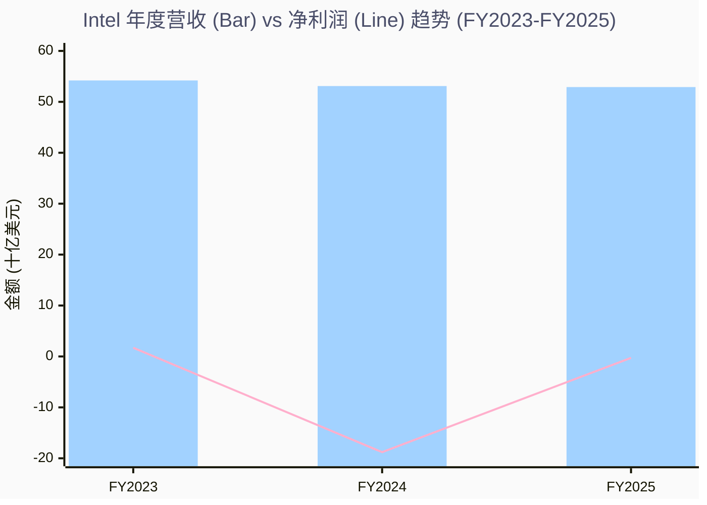
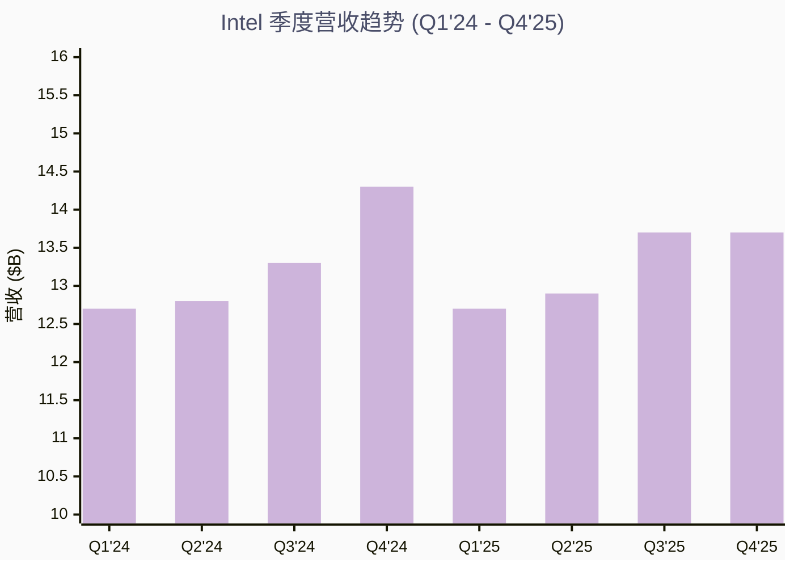
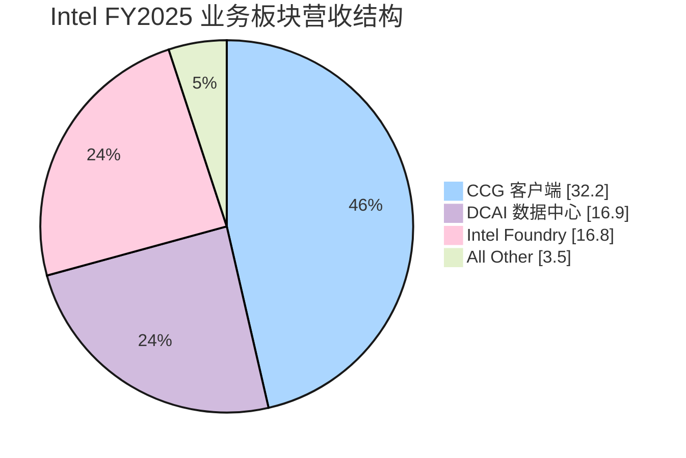
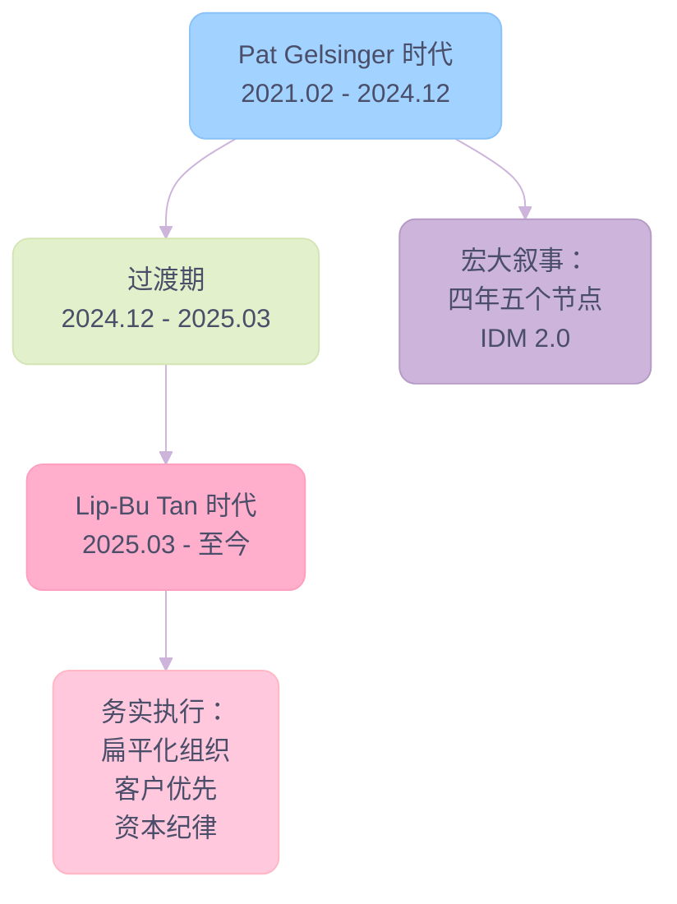

# Intel Q4 2025

> **分析日期**：2026年2月11日
> **数据来源**：SEC 10-K/10-Q 财报、Earnings Call Transcripts（Q1 2024 – Q4 2025）、Brave Search 公开资料
> **分析师**：AI Research Agent

---

## 核心摘要

Intel 正处于一场史诗级的企业转型之中。2025年3月，Lip-Bu Tan 接替 Pat Gelsinger 出任 CEO，标志着 Intel 从"工程师驱动的宏大叙事"转向"纪律严明、以客户为中心的执行文化"。经过10个月的治理，Intel 呈现以下关键态势：

**积极信号：**

- 🟢 **连续5个季度超指引**：Q4 2025 营收 $13.7B 达指引上限，non-GAAP EPS $0.15 远超指引 $0.08
- 🟢 **DCAI 爆发式增长**：Q4 2025 DCAI 营收 $4.7B，环比增长15%，创十年最快季度增长
- 🟢 **Custom ASIC 突破**：年化营收突破 $10亿 run rate，同比增长超50%
- 🟢 **资产负债表修复**：年末现金 $37.4B，全年偿还债务 $3.7B，NVIDIA $5B + SoftBank $2B 战略投资落地
- 🟢 **运营费用削减15%**：non-GAAP OpEx 从 ~$19.4B 降至 $16.5B
- 🟢 **Intel 18A 量产启动**：首款基于18A的产品（Panther Lake / Series 3）已开始出货

**风险信号：**

- 🔴 **产能瓶颈严峻**：Intel 7/10 产能紧张，Q1 2026 指引低于正常季节性
- 🔴 **Foundry 持续巨亏**：Q4 2025 Foundry 运营亏损 $2.5B，全年亏损 ~$9.5B
- 🔴 **全年营收微降**：FY2025 营收 $52.9B 同比下降0.4%，连续3年下滑
- 🔴 **14A 客户尚未锁定**：外部客户决策窗口在2026年下半年至2027上半年

**战略深度洞察 (Strategic Deep Insights)：**

1. 🧠 **"Lip-Bu Tan 效应" 是真实的**：与 Gelsinger 时代的"技术宏大叙事"不同，Tan 带来了 VC 视角的极致资本纪律。这不仅仅是削减成本，而是从根本上改变了 Foundry 的投资逻辑——从"建了产能等客户"转变为"有了客户再投产能"。这对长期由于 CapEx 过高导致的现金流失血是决定性的止损。
2. 🤖 **AI 并没有杀死 CPU，反而救了 DCAI**：市场此前误判 CPU 在 AI 时代的地位。随着 AI 推理规模扩大和 Agentic Workflows 的兴起，CPU 作为 Host Node 的不可替代性凸显。DCAI 的复苏证明了 CPU 是 AI 基础设施的关键组件，而非累赘。
3. 🤝 **Foundry 的真正挑战是信任赤字**：技术（18A/14A）已不再是最大瓶颈，最大的瓶颈是 Fabless 客户对 IDM 模式的天然不信任。Tan 作为一个拥有深厚 Fabless/EDA 背景的局外人，是目前唯一能够弥合这一信任赤字的人选。2026年下半年的客户决策窗口是 Intel 估值的"二元期权时刻"。
4. 💰 **估值逻辑重构**：随着 Nvidia 和 Softbank 的入局及美国政府的深度绑定，Intel 的 downside risk 已被锁定。现在的投资逻辑是：一个拥有稳定现金流的 Products 业务 + 一个具有巨大看涨期权（但也可能归零）的 Foundry 业务的组合。

---

## 一、公司概况

| 项目 | 详情 |
|------|------|
| 公司名称 | Intel Corporation |
| 股票代码 | NASDAQ: INTC |
| CIK | 0000050863 |
| 现任 CEO | Lip-Bu Tan（2025年3月上任） |
| CFO | David Zinsner |
| 总部 | Santa Clara, California |
| 行业 | Semiconductors & Related Devices |
| 核心业务 | x86 CPU、AI加速器、ASIC定制芯片、晶圆代工 |

### 业务架构

Intel 在2024年起实施 Internal Foundry Model，将业务重组为三大核心板块：

| 业务板块 | 说明 | FY2025 营收 |
|----------|------|-------------|
| **Intel Products** | 包括 CCG（客户端）、DCAI（数据中心与AI）、NEX（网络与边缘） | ~$46.1B |
| **Intel Foundry** | 晶圆制造、工艺研发、代工服务 | ~$16.8B |
| **All Other** | Mobileye、Altera（已部分剥离）、IMS | 逐季变化 |

> [!NOTE]
> Intel Products 与 Intel Foundry 之间存在大量内部交易，合并后营收约 $52.9B。Foundry 营收中大部分为内部转移定价。

---

## 二、三年财务纵览（FY2023 – FY2025）

### 年度损益表

| 指标 | FY2025 | FY2024 | FY2023 | 趋势 |
|------|--------|--------|--------|------|
| **总营收** | $52.9B | $53.1B | $54.2B | 📉 连续3年下降 |
| **营收成本** | $34.5B | $35.8B | $32.5B | 2024年因减值飙升 |
| **毛利润** | $18.4B | $17.3B | $21.7B | FY2024 创近年低点 |
| **毛利率** | 34.8% | 32.6% | 40.0% | FY2025 有所恢复 |
| **运营费用** | $20.6B | $29.0B | $21.6B | FY2024 含巨额减值 |
| **运营利润（亏损）** | ($2.2B) | ($11.7B) | $93M | FY2024 灾难性亏损 |
| **净利润（亏损）** | ($267M) | ($18.8B) | $1.7B | 大幅收窄亏损 |
| **摊薄 EPS** | -$0.06 | -$4.38 | $0.40 | 接近盈亏平衡 |

### 年度营收趋势图

**Key Insights:**

- 🏆 **亏损大幅收窄**：FY2025 净亏损仅 $267M，较 FY2024 的 $18.8B 改善98.6%
- 📉 **营收连续3年下滑**：$54.2B → $53.1B → $52.9B，累计降幅2.4%，主要受产能约束（非需求不足）
- ⚠️ **FY2024 灾难性减值**：$18.8B 净亏损主要由 Foundry 资产减值（~$16B）、重组费用（~$3B）和 Gaudi/Altera 减值推动

---

### 年度资产负债表

| 指标 | FY2025 | FY2024 | FY2023 |
|------|--------|--------|--------|
| **总资产** | $192.6B | $196.2B | $191.6B |
| **总负债** | $88.0B | $96.6B | $81.6B |
| **股东权益** | $104.6B | $99.6B | $110.0B |
| **现金及短期投资** | $37.4B | $24.1B | $25.0B |
| **长期负债** | $45.4B | $49.3B | $46.6B |

> **Key Insights**：FY2025 现金大幅增加至 $37.4B，得益于 NVIDIA $5B 投资、SoftBank $2B 投资、美国政府 CHIPS Act 拨款 $5.7B、以及 Altera 51% 股权出售给 Silver Lake（净现金 $4.4B）。同时偿还债务 $3.7B，净负债率改善。

---

### 年度现金流量

| 指标 | FY2025 | FY2024 | FY2023 |
|------|--------|--------|--------|
| **经营现金流** | $9.0B | $5.7B | $10.9B |
| **资本支出** | ($20.0B) | ($20.2B) | ($24.6B) |
| **投资活动现金流** | ($5.4B) | ($4.5B) | ($31.2B) |
| **融资活动现金流** | $8.9B | ($3.1B) | $19.5B |
| **自由现金流** | (~$-11.0B) | (~$-14.5B) | (~$-13.7B) |

> **Key Insights**：Intel 的资本支出仍然庞大（~$18-20B/年），主要投向晶圆厂建设和先进工艺设备。但 CapEx 已从 FY2023 峰值下降，2026年指引为"持平或略降"，且从空间建设转向设备购置。经调整自由现金流在 Q4 2025 首次转正（$2.2B）。

---

## 三、季度业绩追踪（Q1 2024 – Q4 2025）

### 季度损益总览

| 指标 | Q4'25 | Q3'25 | Q2'25 | Q1'25 | Q4'24 | Q3'24 | Q2'24 | Q1'24 |
|------|-------|-------|-------|-------|-------|-------|-------|-------|
| **营收** | $13.7B | $13.7B | $12.9B | $12.7B | $14.3B | $13.3B | $12.8B | $12.7B |
| **毛利润** | $4.9B | $5.2B | $3.5B | $4.7B | $5.6B | $2.0B | $4.5B | $5.2B |
| **毛利率** | 35.8% | 38.0% | 27.1% | 37.0% | 39.2% | 15.0% | 35.2% | 40.9% |
| **运营利润** | $580M | $683M | ($3.2B) | ($301M) | $412M | ($9.1B) | ($2.0B) | ($1.1B) |
| **净利润** | $258M | $207M | ($106M) | ($66M) | ($27M) | ($350M) | ($44M) | ($56M) |
| **Non-GAAP EPS** | $0.15 | $0.23 | ($0.10)¹ | ($0.19) | ($0.03) | ($0.46)² | $0.02 | $0.18 |

> ¹ Q2 2025 含 $1.9B 重组费用（裁员15%相关遣散费），若排除约为 $0.10
> ² Q3 2024 含 ~$16B Foundry 资产减值

### 季度营收趋势图

**Key Insights:**

- 🏆 **Q4 2024 为周期高点**：$14.3B，此后因产能约束未能突破
- 📈 **Q3-Q4 2025 稳定在 $13.7B**：连续两个季度持平，管理层明确表示"如果有足够产能，营收可以大幅超过当前水平"
- ⚠️ **Q1 2026 指引偏弱**：$11.7-12.7B，低于正常季节性，反映库存降至峰值40%的"hand to mouth"状态

---

## 四、业务板块深度分析

### 4.1 Client Computing Group (CCG) — 客户端计算

| 指标 | Q4'25 | Q3'25 | Q2'25 | Q1'25 | 趋势 |
|------|-------|-------|-------|-------|------|
| 营收 | $8.2B | $8.5B | ~$7.6B | ~$7.2B | 环比略降 |
| 同比 | -6.8% | — | — | — | Q4 受供应约束 |

**核心动态：**

1. **AI PC 驱动换机周期**：Q4 2025 AI PC 出货量环比增长16%，Intel Core Ultra Series 3（Panther Lake）已发布超200款笔记本设计
2. **产能优先级调整**：管理层将有限的产能从低端客户端转向高端客户端和数据中心，导致 CCG 总量环比下降
3. **Windows 11 刷新周期**：2025年 PC 消费 TAM 接近2.9亿台，连续两年增长
4. **Nova Lake 路线图**：2026年底推出下一代客户端处理器，结合性能优势与成本优化

> **Key Insights**：CCG 仍是 Intel 营收规模最大的业务（~60%），但利润率从 FY2024 的 34.77% 下降至 FY2025 的 28.91%，反映了 Lunar Lake 外包生产成本上升和 18A 早期良率成本。长期来看，Series 3 全面内制将恢复毛利率。

---

### 4.2 Data Center and AI (DCAI) — 数据中心与AI

| 指标 | Q4'25 | Q3'25 | Q2'25 | Q1'25 | 趋势 |
|------|-------|-------|-------|-------|------|
| 营收 | $4.7B | $4.1B | ~$3.8B | ~$3.5B | 📈 强劲上升 |
| 运营利润 | $1.3B | $1.0B | — | — | 利润率持续改善 |
| 运营利润率 | 26.4% | 23.4% | — | — | 📈 |

**核心动态：**

1. **传统服务器需求爆发**：AI 基础设施扩张带动 host node CPU 需求激增，Granite Rapids / Sapphire Rapids / Emerald Rapids 全面受益
2. **Custom ASIC 高速增长**：Q4 2025 ASIC 营收同比增长超50%、环比增长26%，年化 run rate 超 $10亿
3. **超大规模客户长期协议**：多家 hyperscaler 签署长期战略供应协议
4. **产品路线图简化**：聚焦16通道 Diamond Rapids，加速 Coral Rapids（重新引入多线程）

> **Key Insights**：DCAI 是 Intel 增长最快的业务板块，Q4 2025 环比增长15%创十年最佳。AI 推理和 agentic workload 的爆发使 CPU 在数据中心的角色不降反升。管理层预计2026年服务器 CPU TAM 将继续增长。这是 Intel 转型最重要的增长引擎。

#### 4.2.1 Intel AI 战略全景

Intel 的 AI 战略在 Lip-Bu Tan 时代发生了根本性转向——从 Gelsinger 时代试图在 GPU 训练赛道正面挑战 NVIDIA 的"全面出击"，转向了**以推理为中心、以定制化为壁垒、以 CPU 生态为根基**的差异化路线。

**AI 战略三大支柱：**

| 支柱 | 核心定位 | 关键产品/举措 | 状态 |
|------|----------|--------------|------|
| **CPU-as-AI-Host** | x86 CPU 作为 AI 数据中心的不可替代核心 | Xeon 6（Granite Rapids）、Diamond Rapids、NVLink 定制 Xeon | ✅ 量产 / 联合开发中 |
| **Custom ASIC** | 面向 hyperscaler 的定制加速器设计服务 | 专属 ASIC 组织（Srini Pather 领导）、Networking/Infra ASIC | ✅ Run rate >$1B |
| **推理专用 GPU** | 瞄准 AI inference 市场（避开训练赛道） | Crescent Island GPU（2026H2）、160GB HBM、Intel 18A 制造 | 🔄 研发中 |

**Gaudi 加速器演变轨迹：**

Intel 于2019年以 ~$2B 收购 Habana Labs 获得 Gaudi 训练加速器产品线。Gaudi 2 和 Gaudi 3 先后面世，在性价比上有竞争力（Signal65 测试显示 Gaudi 3 在 Llama2-13B 上性价比达 H100 的 2.3 倍），但未能赢得大规模商业采用。

- **Gaudi 3 生态落地**：IBM 成为首个部署 Gaudi 3 的主流云服务商（Frankfurt / Washington D.C. / Dallas），Dell 通过 PowerEdge XE9680 + Intel AI Factory 推出企业级一体解决方案
- **Gaudi 终局**：管理层已确认**不会有 Gaudi 4**，训练市场已被 NVIDIA 和 ASIC 深度锁定
- **战略转向**：推理专用 GPU "Crescent Island"（2026H2，160GB HBM）标志着 Intel 放弃与 NVIDIA 在训练赛道正面竞争，转向 AI inference 差异化

> [!NOTE]
> 2025年末市场传闻 Intel 正在洽谈收购 SambaNova Systems（企业级 AI inference 平台），如果属实，将为 Intel 提供成熟的 rack-scale 推理系统和企业客户基础，加速其在 AI inference 赛道的重新定位。

#### 4.2.2 NVIDIA-Intel 战略联盟深度解读

2025年9月18日，NVIDIA 与 Intel 宣布达成半导体行业史上最具里程碑意义的合作协议之一——**NVIDIA 以 $5B 投资 Intel 普通股，同时双方联合开发多代定制数据中心和 PC 产品**。2025年12月19日，FTC 正式批准该交易的反垄断审查，2026年1月完成资金交割。

**合作核心框架：**

| 维度 | 具体内容 |
|------|----------|
| **股权投资** | NVIDIA 以 $23.28/股购入 Intel 普通股，总投资 $5B |
| **数据中心联合开发** | Intel 为 NVIDIA AI 平台设计制造**定制 x86 CPU**，通过 **NVLink** 直连 NVIDIA 加速器（取代传统 PCIe），提供更高带宽、更低延迟的 CPU-GPU 通信 |
| **PC/客户端联合开发** | Intel 设计集成 **NVIDIA RTX GPU chiplet** 的 x86 SoC，通过 NVLink 实现 CPU-GPU 紧耦合，目标为 AI PC 市场 |
| **制造代工** | 分析师预期首批 Intel 代工的 NVIDIA 组件将在 **18A 节点**上实现，预计 2027 年初量产 |
| **首批产品时间线** | 首款"NVIDIA-Intel Inside"笔记本预计 **2026 年节假日季**上市；集成 NVLink 的定制数据中心 CPU 预计 **2027** 年量产 |

**战略意义深层解读：**

- **对 Intel**：这是 DCAI 重回 AI 主流的门票。通过成为 NVIDIA AI rack 的 host CPU 供应商，Intel 从被 AI 浪潮边缘化的风险中解脱。更重要的是，如果 NVIDIA 将部分芯片交由 Intel 18A/14A 制造，将是对 Intel Foundry 最有力的背书
- **对 NVIDIA**：获得 x86 生态的兼容性（补充 ARM Grace CPU），扩展 NVLink Fusion 生态覆盖面，同时在 AI PC 市场对 AMD 和 Apple 形成压力
- **对行业**：标志着半导体行业进入 **"AI 规模太大，没有公司能独立完成"** 的新合作时代

**CEO 关键表态：**

> *"这一历史性合作将 NVIDIA 的 AI 和加速计算技术栈与 Intel 的 CPU 和广袤的 x86 生态紧密耦合——两个世界级平台的融合。"*
> — **Jensen Huang**, NVIDIA CEO

> *"我们与 NVIDIA 的合作反映了一个根本认知：AI 革命需要 CPU 和 GPU 的深度协同，而非对立。"*
> — **Lip-Bu Tan**, Intel CEO

---

### 4.3 Intel Foundry — 晶圆代工

| 指标 | Q4'25 | Q3'25 | Q2'25 | Q1'25 | 趋势 |
|------|-------|-------|-------|-------|------|
| 营收 | $4.5B | $4.2B | ~$4.4B | ~$4.5B | 基本持平 |
| 运营亏损 | ($2.5B) | ($2.3B) | (~$3.1B) | (~$1.6B) | 仍在高位 |

**核心动态：**

1. **Intel 18A 量产里程碑**：首批 18A 产品已出货，这是"在美国本土开发和制造的最先进半导体工艺"
2. **良率持续改善**：Lip-Bu Tan 报告每月良率改善 7-8%，但仍低于其个人期望
3. **18AP PDK 1.0 交付**：向内外部客户交付18AP（18A增强版）的1.0 PDK
4. **14A 研发在轨**：简化工艺流程，PDK 已被客户视为"行业标准"，潜在客户积极接洽
5. **14A 客户决策窗口**：预计2026年下半年至2027年上半年
6. **EUV 晶圆占比飙升**：从2023年的不到1%增至2025年的超过10%
7. **高级封装突破**：EMIB/EMIB-T 获得客户早期预付款，反映行业基板供应紧张

> [!WARNING]
> Intel Foundry 的运营亏损仍然庞大（FY2025 累计约 $9.5B），且 14A 产能投资将"等到锁定客户后才启动"——这体现了 Lip-Bu Tan 的资本纪律，但也意味着 Foundry 盈利时间线可能延后至2028年之后。

---

### 4.4 业务板块营收结构（FY2023 – FY2025）

**Key Insights:**

- 🏆 **CCG 仍占主导**：客户端计算贡献46.4%营收（$32.2B），是 Intel 的基本盘
- 📈 **DCAI 占比提升**：数据中心与AI营收 $16.9B（24.3%），FY2024 为 $16.1B，增速领先
- ⚠️ **Foundry 营收内部化**：$16.8B 中绝大部分为内部转移定价，外部客户营收占比仍较低

| 板块 | FY2025 | FY2024 | FY2023 | 变化趋势 |
|------|--------|--------|--------|----------|
| CCG | $32.2B | $33.3B* | $33.3B* | 📉 微降（供应约束） |
| DCAI | $16.9B | $16.1B | $16.0B | 📈 稳步增长 |
| Intel Foundry | $16.8B | ~$18.0B | ~$18.9B | 📉 外部客户有限 |
| All Other | ~$3.5B | ~$5.0B | ~$4.5B | 📉 Altera 剥离 |

> *注：CCG/DCAI 含 NEX（网络与边缘），2025年合并报告口径有调整

---

## 五、八季度 Earnings Call 深度解读

### 季度财报深度复盘一览表 (Q1 2024 - Q4 2025)

| 季度 | 关键财务指标 (营收 / EPS) | 核心战略事件与里程碑 | CEO/CFO 关键语录 (Key Quotes) |
| :--- | :--- | :--- | :--- |
| **Q1 2024** *(Pat Gelsinger)* | **$12.7B** (+9% YoY) EPS $0.18 (超预期) | • **CHIPS Act**:宣布获超 $450亿 拟议补贴 • **AI PC**: 概念启动，预计全年出货4000万台 • **Gaudi 3**: 发布，目标营收超 $5亿 | **Pat Gelsinger**: "每一台 PC 最终都会成为 AI PC。" (AI PC 将驱动全行业升级周期) |
| **Q2 2024** *(至暗时刻)* | **$12.8B** (-1% YoY) EPS $0.02 (不及预期) | • **重组**: 裁员15% (约1.5万人), 暂停分红 • **OpEx削减**: 目标2025年降至 $17.5B • **Foundry**: 预计触底，推动盈亏平衡 | **Pat Gelsinger**: "这是艰难但必要的决定...我们不会轻视这些决定。" (承认盈利能力低于预期) |
| **Q3 2024** *(资产减值)* | **$13.3B** (+4% QoQ) GAAP EPS -$3.88 | • **巨额减值**: 计提 ~$16B Foundry 资产减值 • **分拆**: 宣布 Foundry 独立子公司化 • **AWS合作**: 达成数十亿美元长期协议 | **Pat Gelsinger**: "CPU 在数据中心 AI 计算中扮演关键角色，尤其是企业 AI。" (开始强调 CPU 在 AI 中的地位) |
| **Q4 2024** *(Gelsinger离任)* | **$14.3B** (超指引) 全年营收 $53.1B | • **创纪录**: 当年最高单季营收 • **EUV**: 晶圆占比从1%提升至>5% • **亏损**: Foundry 全年运营亏损超 $13B | **Mgmt**: "为客户的最紧迫挑战而创新，是创造股东价值的最可靠路径。" (强调客户服务) |
| **Q1 2025** *(Lip-Bu Tan上任)* | **$12.7B** (指引上限) Products $11.8B | • **新时代**: Lip-Bu Tan 首秀 • **资产变现**: Altera 51% 售予 Silver Lake ($9B估值) • **CapEx**: 下调至 $18B，启动扁平化改革 | **Lip-Bu Tan**: "我们的方法是扁平化组织...让我们能真正专注于正确的产品。" (强调工程文化回归) |
| **Q2 2025** *(重组阵痛)* | **$12.9B** (超指引) EPS ~$0.10 (Adj) | • **清理**: 含 $1.9B 重组费用 • **纪律**: "无客户不投产能"原则确立 • **组织**: 完成CEO直报审查 | **Lip-Bu Tan**: "我们有很多需要修复的地方...通过持续执行赢得他们的信任。" (直面挑战) |
| **Q3 2025** *(转折点)* | **$13.7B** (+6% QoQ) **GM 40%** (超指引) | • **现金流**: 增至 $30.9B (含NVDA/Softbank投资) • **DCAI**: +5% QoQ，企业需求回暖 • **Panther Lake**: 准备发布 | **Lip-Bu Tan**: "欢迎美国政府成为我们的重要合作伙伴...在 AI 革命早期阶段扮演更重要角色。" |
| **Q4 2025** *(执行加速)* | **$13.7B** (指引上限) EPS $0.15 (翻倍) | • **DCAI爆发**: +15% QoQ，创十年最快增速 • **ASIC**: Run rate >$10亿 • **FCF转正**: +$2.2B (当年首次) | **lip-Bu Tan**: "Hyperscaler 愿意签署长期协议...在我们锁定客户之前，不会投入 14A 大规模产能。" |

## 六、战略转型深度剖析

### 6.1 领导力变革

**Key Insights:**

- 🏆 **领导力风格质变**：从 Gelsinger 的"技术驱动宏大叙事"转向 Tan 的"资本纪律+客户优先"务实路线
- 📈 **执行文化重建**：扁平化组织、回归办公室、工程师优先，已驱动连续5季超指引
- ⚠️ **过渡风险**：Tan 的 VC 背景和关联交易争议（Rivos 等）可能带来治理挑战

| 维度 | Pat Gelsinger | Lip-Bu Tan |
|------|--------------|------------|
| **背景** | Intel 老将，技术极客 | Cadence CEO，VC投资人 |
| **核心理念** | "我们要做所有事" | "做客户需要的事" |
| **组织风格** | 多层级、复杂矩阵 | 扁平化、小团队 |
| **Foundry 策略** | 激进扩产能+争取客户 | 先拿客户订单，再投产能 |
| **资本策略** | 大举投资 | 纪律优先、效率提升 |
| **关键举措** | CHIPS Act、四年五节点 | 引入NVIDIA/SoftBank战略投资、裁员15%、重新规划产品路线图 |

### 6.2 Lip-Bu Tan 的五大战略支柱

1. **组织重构**：完成CEO直报组织全面审查，减少管理层级，从远程/混合办公转向回归办公室，"re-establish engineering-first mindset"

2. **产品路线图简化**：
   - 客户端：Series 3 (Panther Lake) → Nova Lake (2026末)
   - 服务器：聚焦16通道 Diamond Rapids，加速 Coral Rapids（恢复多线程）
   - AI/ASIC：大幅增加投入，利用 Cadence 经验扩展设计服务

3. **Foundry 资本纪律**："No capacity spend on 14A until we have customers secured"

4. **战略合作伙伴关系**：
   - NVIDIA $5B 投资 + 联合定制 Xeon（NVLink）
   - SoftBank $2B 投资
   - 美国政府 CHIPS Act $5.7B+
   - Silver Lake 收购 Altera 51%

5. **GPU 重新布局**（2026年2月最新消息）：
   - 确认将继续开发 GPU
   - 已聘请 GPU 首席架构师
   - 未来 GPU 产品线将使用 Intel 内部制造
   - 目标覆盖 AI 推理、agentic AI、physical AI 等新兴工作负载

---

## 七、美国产业政策与政府支持

Intel 是当前美国半导体产业政策的**最大受益者**，也是最深度绑定的企业。从 Biden 时代的 CHIPS Act 到 Trump 第二任期的战略股权投资，美国政府对 Intel 的扶持力度史无前例。

### 7.1 政策扶持全景

| 项目 | 金额 | 来源/机制 | 状态 |
|------|------|----------|------|
| **CHIPS Act 直接拨款** | $7.86B | 美国商务部（Biden 时期批准） | ✅ 已拨付 $2.2B，剩余转为股权 |
| **政府股权投资** | $8.9B | Trump 政府以普通股形式注入（$5.7B CHIPS + $3.2B Secure Enclave） | ✅ 2025年10月宣布 |
| **Secure Enclave 国防合同** | $3.2B | 美国国防部，安全半导体代工 | ✅ 执行中 |
| **25% 投资税收抵免** | 估值 $10B+ | CHIPS Act 附带条款 | ✅ 适用中 |
| **累计政府总投入** | **$11.1B+** | 拨款 + 股权 + 税收优惠 | 全美半导体企业最高 |

### 7.2 Trump 第二任期的芯片战略

Trump 政府对半导体政策采取了与 Biden 时期截然不同的方式——**从补贴转向股权投资**，同时配合关税工具和国防订单形成"三位一体"的扶持体系。

**三大政策工具：**

1. **股权换补贴**：将 CHIPS Act 未拨付的 $5.7B 拨款转化为政府直接持股 Intel 普通股，这意味着美国政府成为 Intel 的直接股东，利益深度绑定
2. **半导体关税框架**：2026年1月，Trump 签署行政命令，宣布可能对进口半导体及其衍生产品征收广泛关税，同时推出"关税抵消计划"激励国内制造。商务部和 USTR 被指示与相关国家谈判半导体贸易协定
3. **国防安全绑定**：Secure Enclave 计划确保 Intel 为美国国防部生产最先进制程的可信半导体，这一角色在地缘政治紧张局势下具有不可替代性

**政策影响深度分析：**

- **对 Intel 的利好**：$11.1B 的政策资金大幅降低了 Intel 的资本支出压力（Intel 规划的 $100B+ 美国投资中政府分摊约10%），同时政府持股构成了事实上的"国家队"背书，大幅降低了 bankruptcy risk
- **对竞争对手的影响**：TSMC 在亚利桑那的三座工厂虽获得 CHIPS Act 补贴，但 Trump 多次公开批评 TSMC "偷走了美国的芯片业务"，并以关税威胁施压。Samsung 在美国的投资规模远小于 Intel
- **政策反转风险**：CHIPS R&D 预算被 Commerce Secretary Howard Lutnick "收回" $7.4B（从 Natcast 半导体研发中心），重新定向至私营企业产品开发和股权投资，研发生态可能受损

> [!IMPORTANT]
> 美国政府对 Intel 的支持已超越传统产业补贴，进入"战略性国家冠军企业"模式。这为 Intel 提供了 TSMC 和 Samsung 不具备的**政策护城河**——但也意味着 Intel 的命运与美国政治周期和贸易政策深度绑定，增加了政策反转的尾部风险。

### 7.3 关键人物与政治动态

| 人物 | 角色 | 对 Intel 的影响 |
|------|------|----------------|
| **Trump** | 美国总统 | 2025年8月与 Lip-Bu Tan 会面后态度转向积极，推动 $8.9B 股权投资 |
| **Howard Lutnick** | 商务部长 | 主导将 CHIPS 资金从 R&D 转向企业股权投资，利好 Intel |
| **Michael Dell** | Dell CEO | 公开表态"行业需要强大的美国半导体产业，没有比 Intel 更重要的公司" |
| **Jensen Huang** | NVIDIA CEO | $5B 投资 Intel + 联合开发，为 Intel 提供行业最高级别的"信任背书" |

---

## 八、晶圆代工竞争格局：Intel vs TSMC vs Samsung

全球先进制程（sub-7nm）晶圆代工市场目前仅剩**三家玩家**：TSMC、Samsung、Intel。三者在技术路线、良率成熟度、市场份额和生态联盟上的差异，决定了未来5年全球半导体产业的竞争格局。

### 8.1 制程节点技术对比

| 维度 | TSMC | Samsung | Intel |
|------|------|---------|-------|
| **当前量产最先进节点** | N3E / N3P（3nm） | SF3（3nm GAA） | Intel 18A（~2nm 等效） |
| **2nm 量产时间线** | N2：2025H2 量产，2026 放量 | SF2：2025Q4 量产（良率30%） | 18A：2025H2 量产启动 |
| **下一代节点** | N2P（2026，背面供电）/ A16（2027） | SF2P（2026，高性能版） | 18A-P（2026H2）/ 14A（2028） |
| **关键技术差异** | 成熟的 FinFET → N2 开始 GAA | 率先采用 GAA（从 3nm 开始）但良率落后 | **首家量产背面供电（PowerVia）**，领先 TSMC ~1年 |
| **晶体管架构** | FinFET（至N3）→ Nanosheet GAA（N2） | MBCFET GAA（从 SF3 开始） | RibbonFET GAA + PowerVia |

### 8.2 良率与产能对比

| 维度 | TSMC | Samsung | Intel |
|------|------|---------|-------|
| **3nm 良率** | >80%（业界标杆） | ~60%（显著落后） | N/A（跳过3nm） |
| **2nm 良率现状** | N2 试产良率70%+（领先） | SF2 试产良率 ~30%（严重落后） | 18A 良率月改善 7-8%，尚未达标 |
| **2nm 月产能预期** | 200,000 WPM（2025-2026） | 50,000-100,000 WPM（2028目标） | 未披露，取决于客户锁定 |
| **EUV 成熟度** | High-NA EUV 研发领先 | 计划2025Q4引入 EUV 双重曝光 | EUV 晶圆占比从 <1%（2023）升至 >10%（2025） |

### 8.3 市场份额与客户生态

| 维度 | TSMC | Samsung | Intel Foundry |
|------|------|---------|---------------|
| **全球代工市场份额** | **~66%**（2025E，绝对统治） | ~12%（持续下滑） | <2%（外部客户极少） |
| **核心客户** | Apple、NVIDIA、AMD、Qualcomm、Broadcom | Qualcomm（部分）、IBM、自家 Exynos | AWS（Intel 3/18A）、NVIDIA（潜在 18A）、微软（18A） |
| **AI 芯片制造份额** | >90%（NVIDIA GPU、AMD MI 系列均由 TSMC 代工） | <5% | 接近 0（但 NVIDIA 合作可能改变局面） |
| **客户信任度** | ⭐⭐⭐⭐⭐ 行业标杆 | ⭐⭐⭐ 良率问题影响信任 | ⭐⭐ IDM 模式引发 fabless 客户天然不信任 |

### 8.4 Intel 的竞争优劣势总结

**Intel 的独特优势：**

1. 🟢 **PowerVia 背面供电先发优势**：Intel 18A 是全球首个量产背面供电技术的节点，领先 TSMC N2P 约一年。背面供电可提升 ~6% 性能并改善布线密度
2. 🟢 **美国本土制造的政策壁垒**：在地缘政治紧张背景下，Intel 是唯一能在美国本土提供最先进制程的代工厂——这对国防、关键基础设施客户有不可替代的价值
3. 🟢 **高级封装技术（EMIB/Foveros）**：业界领先的多芯片封装能力，已获客户预付款
4. 🟢 **x86 设计+制造一体化**：唯一同时拥有 x86 IP 和先进制程制造能力的公司，可提供从芯片设计到封装的全栈服务

**Intel 的核心劣势：**

1. 🔴 **市场份额几乎为零**：外部代工客户极少，TSMC 以 66% 份额形成压倒性生态优势
2. 🔴 **良率追赶中**：18A 良率仍在爬坡，距 TSMC 成熟节点的 80%+ 良率有显著差距
3. 🔴 **IDM 信任悖论**：fabless 客户担心 Intel 同时作为竞争对手和供应商的利益冲突
4. 🔴 **PDK 和设计生态不成熟**：TSMC 拥有几十年积累的 PDK、IP 库和设计参考流程，Intel 需要时间追赶
5. 🔴 **产能规模差距悬殊**：TSMC 先进节点月产能是 Intel 的数十倍，规模经济优势巨大

> **Key Insights**：Intel 在制程技术上并非没有亮点（PowerVia 领先、RibbonFET 架构先进），但**技术不等于商业成功**。Foundry 竞争的核心是 **良率 × 规模 × 生态信任** 的乘积，Intel 在三项中均大幅落后 TSMC。NVIDIA 的 $5B 投资和联合开发协议是 Intel Foundry 最重要的信任催化剂——如果 NVIDIA 真的将部分芯片交给 Intel 18A/14A 制造，这将是比任何技术突破都更有力的市场信号。

---

## 九、风险评估

### 风险因素

| 风险等级 | 风险类别 | 描述 |
|----------|----------|------|
| 🔴 **高** | 产能瓶颈 | Intel 7/10 老旧节点产能紧张，18A 良率仍在爬坡中，Q1 2026 将是供应谷底 |
| 🔴 **高** | Foundry 盈利遥遥无期 | 年亏损 ~$9.5B，14A 产能投资须等客户确认，盈利时间线可能在2028年后 |
| 🟡 **中高** | 竞争加剧 | AMD Zen 5/6 在服务器和客户端持续蚕食份额，ARM 生态在笔记本和数据中心崛起 |
| 🟡 **中高** | CEO 利益冲突 | Lip-Bu Tan 与多家 VC 投资组合公司存在关联交易争议（如 Rivos） |
| 🟡 **中** | 地缘政治 | 美国贸易政策（关税）的不确定性可能影响供应链和国际客户 |
| 🟡 **中** | 外部 Foundry 客户获取 | 14A 能否吸引 Tier 1 fabless 客户（如 Apple、Qualcomm）仍高度不确定 |
| 🟢 **低中** | 技术执行 | 18A 良率改善轨迹可预测（7-8%/月），但是否能在2026上半年达到量产标准存疑 |

---

## 十、投资视角

### Bull Case（乐观情景）

1. **AI 推理需求爆发**使传统 CPU TAM 持续扩张，DCAI 维持双位数增长
2. **18A 良率加速改善**，产能约束在2026年中期解除，带来营收爆发
3. **14A 获得 1-2 个 Tier 1 Foundry 客户**，验证 Intel 作为全球第三大代工厂的可行性
4. **Custom ASIC 业务**年化营收从 $1B 增至 $3-5B（2027-2028），成为新增长极
5. **GPU 重新布局**若成功，将在 AI inference 市场开辟第二战场
6. **美国政府持续支持**（CHIPS Act 资金、国防订单、关税保护），形成"政策护城河"

**Bull Case 目标价区间**：$30-40（基于2027年 EPS $1.00+ 的可能性）

### Bear Case（悲观情景）

1. **Foundry 外部客户获取失败**，14A 成为又一个"投资黑洞"
2. **AMD/ARM 持续侵蚀**客户端和数据中心份额，x86 生态衰退
3. **18A 良率改善不及预期**，Series 3 量产推迟，OEM 客户转投竞品
4. **OpEx 削减过度**伤害研发能力，类似2015-2020年的战略失误重演
5. **Lip-Bu Tan 的 VC 背景和关联交易**引发监管和治理风险
6. **美国贸易政策反转**或中国报复性措施影响全球出货

**Bear Case 目标价区间**：$15-18（Foundry 价值归零，仅按 Intel Products 估值）

---

## 十一、关键时间节点

| 时间 | 事件 | 重要性 |
|------|------|--------|
| 2026年 Q1 | Q1 2026 财报（供应谷底确认） | ⭐⭐⭐ |
| 2026年 Q2 | 供应改善、营收回升验证 | ⭐⭐⭐ |
| 2026年 H2 | **14A 客户决策窗口**（Foundry 命运转折点） | ⭐⭐⭐⭐⭐ |
| 2026年 H2 | **Investor Day**（Santa Clara 总部，完整战略路线图） | ⭐⭐⭐⭐ |
| 2026年 H2 | EMIB/EMIB-T 高级封装开始量产 | ⭐⭐⭐ |
| 2026年末 | Nova Lake 客户端处理器发布 | ⭐⭐⭐ |
| 2027年 H1 | 14A 客户决策窗口延续 | ⭐⭐⭐⭐ |
| 2028年 | 14A 量产开始 | ⭐⭐⭐⭐ |

---

## 十二、总结与核心判断

Intel 的转型之路充满了矛盾与张力：

**短期（2026年）**：Q1 2026 将是营收低点，产能约束限制了 $12B+ 的潜在需求。但 Lip-Bu Tan 展现了比前任更强的**执行纪律**和**资本效率**意识。如果 Q2 供应确实改善，下半年可能看到 $14B+ 季度营收。

**中期（2026-2027年）**：DCAI + Custom ASIC 的组合增长可能成为 Intel 的核心引擎。14A 客户获取将是决定 Intel Foundry 命运的关键——如果获得1-2个 Tier 1 客户，Intel 的估值逻辑将从"衰退中的 IDM"重新定价为"美国唯一的先进制程代工厂"。

**长期（2027+）**：Intel 面临的根本问题不是技术能力（18A/14A 工艺进展可圈可点），而是**商业模式的可持续性**——能否在同时运营 Products 和 Foundry 两个本质矛盾的业务时实现盈利。Lip-Bu Tan 的"先有客户再投产能"策略是正确的方向，但也意味着 Intel 在与 TSMC 的竞争中选择了一条更慢、更稳健的路。

> [!IMPORTANT]
> **投资者关注重点**：2026年下半年的 Investor Day 和 14A 客户宣布将是 Intel 投资论文的"moment of truth"。在此之前，Intel 更像一只"根据季度执行情况定价的 optionality 股票"，而非传统估值框架能覆盖的标的。

---

*本报告基于公开数据和 SEC 监管文件编写，不构成投资建议。所有前瞻性声明均基于截至2026年2月的市场信息。*
