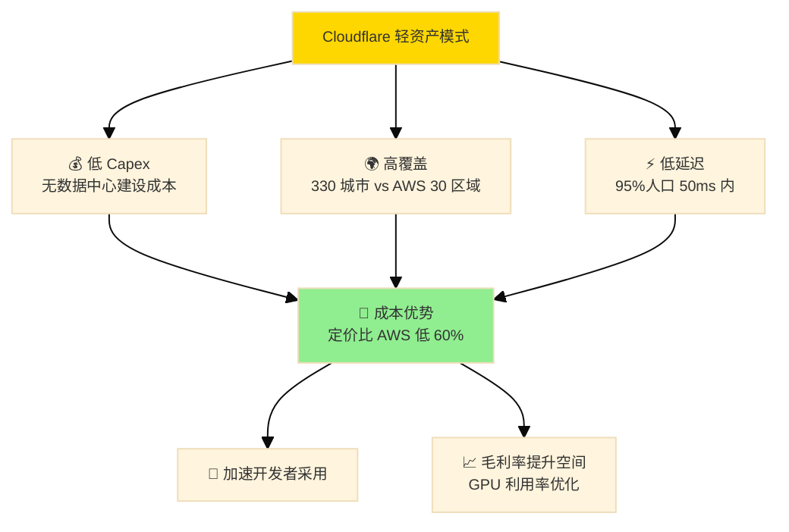
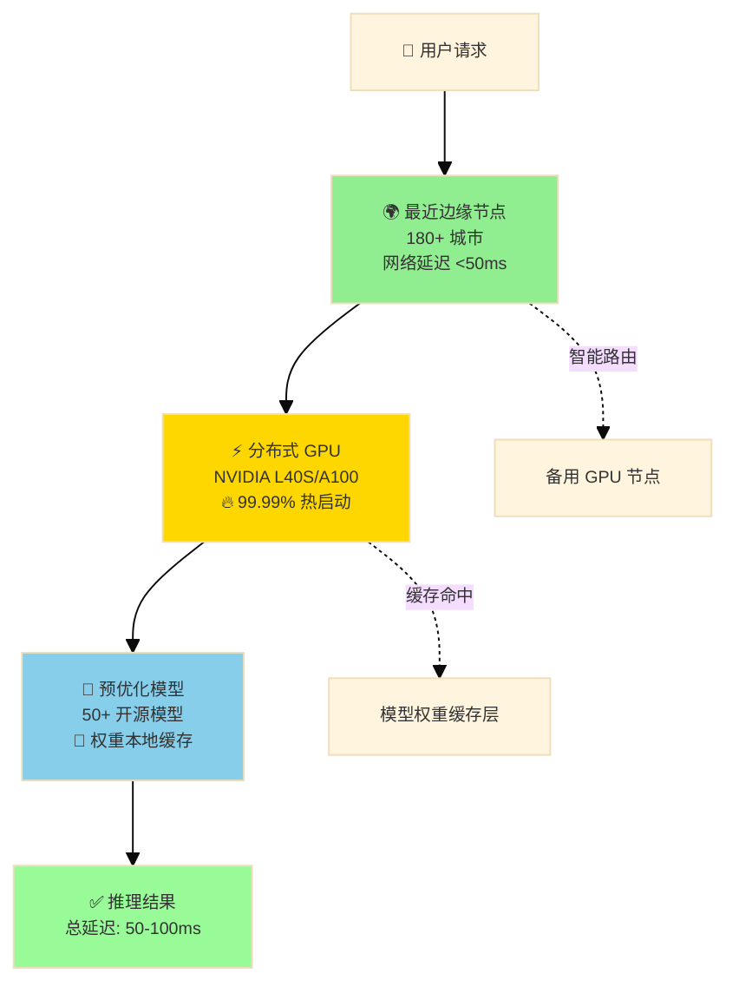
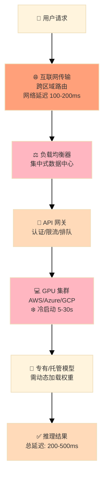
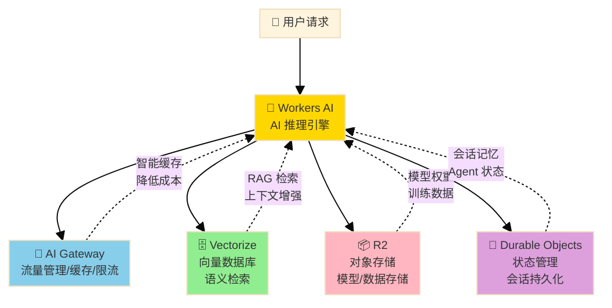

# Cloudflare 边缘计算 King &#215; AI Serverless

> **分析日期**：2026-02-06
> **分析周期**：Q4 2024 - Q3 2025（含 2025 年度展望）
> **报告类型**：深度研究 / 财报解读 / 业务分析
> **分析师**：Digital Ray

---

## 📌 Executive Summary（核心摘要）

### 一句话结论

Cloudflare 在 2025 年成功实现增长再加速，Q3 2025 营收同比增长 30.7%，创历史新高，验证了其"AI + SASE"双引擎战略。

### 核心发现

| 维度       | 评估    | 要点                                                     |     |
| -------- | ----- | ------------------------------------------------------ | --- |
| **财务健康** | 🟢 良好 | 营收增速回升至 30%+；毛利率稳定 74-77%；自由现金流转正                      |     |
| **成长动能** | 🟢 强劲 | AI (Workers AI) 和 SASE (Zero Trust) 双轮驱动；大客户收入占比升至 73% |     |
| **竞争地位** | 🟢 领先 | "连接云"定位独特，击败传统 CDN（Akamai）并与安全厂商（Zscaler/PANW）正面竞争     |     |
| **管理质量** | 🟢 优秀 | GTM 转型成功；创始人保持高比例持股；Mark Anderson 销售改革见效               |     |

### 关键风险

1. **估值溢价**：P/S 约 35-49x，远高于行业平均，容错空间小
2. **竞争加剧**：Zscaler/Palo Alto 在 SASE、Hyperscalers 在边缘计算持续施压
3. **AI 收入占比尚低**：Workers AI 仍在早期，若增长不及预期可能影响叙事

### 投资观点

**评级**：看好（Bullish）

**核心逻辑**：Cloudflare 已成功从"产品驱动增长"过渡到"企业销售驱动增长"。CEO Matthew Prince 的"创新从未停止"承诺正在兑现——Q3 2025 签下 2,280 万美元大单（AI 驱动），证明其平台对大型企业客户的吸引力。虽然估值偏高，但 30% 的增速和改善的 NRR（119%）支撑溢价。

---

## 🏢 公司简介

### 公司概况

| 项目 | 信息 |
|------|------|
| **公司全称** | Cloudflare, Inc. |
| **股票代码** | NYSE: NET |
| **成立时间** | 2009 年 |
| **总部所在地** | 旧金山, 美国 |
| **CEO** | Matthew Prince（联合创始人，2009 年至今） |
| **员工人数** | ~4,000+ |
| **市值** | ~$56B（截至 2026-02-06） |
| **所属行业** | 云计算 / 网络安全 / 边缘计算 |
| **主要市场** | 全球（北美 ~50%、欧洲 ~30%、亚太 ~15%） |

**公司定位**：全球领先的"连接云"（Connectivity Cloud）平台，为企业提供一站式的性能优化、安全防护和开发者工具服务。

**发展历程要点**：

- **2009**：Matthew Prince、Michelle Zatlyn、Lee Holloway 创立 Cloudflare
- **2010**：正式上线,提供免费 CDN 和 DDoS 防护
- **2019**：纽约证券交易所上市（NYSE: NET）
- **2021**：推出 Cloudflare One（SASE 平台）
- **2023**：发布 Workers AI，进军边缘 AI 推理市场
- **2025**：Q3 营收突破 $5.6 亿，增速再加速至 30.7%

**过去 3 年的发展情况**：

| 财年 | 营收 | 增长率 | 毛利率 | 运营亏损 | 自由现金流 | 核心战略投入 |
|------|------|--------|--------|----------|------------|-------------|
| **2022** | $975M | +54% | 78% | -$146M | $115M | - R2 存储对抗 AWS S3<br>- Zero Trust 快速扩张<br>- Workers 平台化 |
| **2023** | $1,301M | +33% | 77% | -$165M | $175M | - Workers AI 发布<br>- 企业大客户增长 52%<br>- 网络扩展至 300+ PoPs |
| **2024** | $1,658M | +27% | 76% | -$98M | $266M | - 运营杠杆显现（亏损收窄）<br>- 付费客户破 20 万<br>- 研发占比稳定在 ~19% |
| **2025E** | $2,100M+ | +27-30% | 74-77% | 盈亏平衡目标 | $350M+ | - AI 原生架构深化<br>- SASE 与 CDN 融合<br>- 向 Rule of 40 冲刺 |

**关键发展趋势**：

1. **营收增长稳健**：从 2022 年高增速到 2024-2025 年稳定在 27-30% 的 SaaS 黄金增速区间
2. **利润拐点已现**：2024 年运营亏损同比收窄 40%，2025 年有望实现 GAAP 盈利
3. **现金流持续改善**：自由现金流 3 年 CAGR ~56%，远超营收增速，营业现金流转换率提升至 160%+
4. **战略投入聚焦**：R2 破解云厂商锁定、Workers AI 卡位边缘推理、Zero Trust 抢占 SASE 市场，三大飞轮协同
5. **客户结构优化**：大客户（>$100K ARR）占比从 2022 年的 68% 提升至 2025 年的 73%，ARPU 提升明显

### 核心业务部门

#### 部门1：应用服务（Application Services）

| 属性 | 描述 |
|------|------|
| **业务范围** | CDN 加速、DDoS 防护、WAF（Web 应用防火墙）、Bot 管理 |
| **收入占比** | ~45%（Est.） |
| **增长率** | +20% YoY |
| **核心客户** | 网站运营商、电商平台、媒体公司 |
| **竞争对手** | Akamai、Fastly、AWS CloudFront |

**部门介绍**：
Cloudflare 的根基业务，通过全球 330+ 城市的边缘节点网络提供内容分发和安全服务。免费的"Pro"和"Business"套餐是获客引擎，高附加值功能（如高级 DDoS 防护、定制 WAF 规则）驱动企业付费。

**代表产品/服务**：

- **CDN**：全球边缘缓存，减少延迟
- **WAF/DDoS**：每秒处理 4600 万个 HTTP 请求，最大 DDoS 攻击缓解记录超 2 Tbps

---

#### 部门2：网络服务（Network Services / Zero Trust）

| 属性 | 描述 |
|------|------|
| **业务范围** | SASE/SSE、Zero Trust 网络接入、Magic Transit、WARP |
| **收入占比** | ~35%（Est.） |
| **增长率** | +35% YoY |
| **核心客户** | 大型企业 IT、金融机构、政府 |
| **竞争对手** | Zscaler、Palo Alto Networks、Cisco |

**部门介绍**：
增长最快的业务板块。Cloudflare One 是企业级 SASE/SSE 平台，提供安全的远程访问、网络分段和威胁检测。与传统 VPN 和防火墙厂商直接竞争，以更低成本和更简单部署赢得市场。

**代表产品/服务**：

- **Cloudflare Access**：基于身份的 Zero Trust 访问控制
- **Magic Transit**：企业级 DDoS 保护，替代传统 MPLS
- **Gateway**：安全 Web 网关（SWG）

---

#### 部门3：开发者平台（Developer Platform）

| 属性 | 描述 |
|------|------|
| **业务范围** | Workers（边缘计算）、R2（对象存储）、D1（数据库）、Workers AI |
| **收入占比** | ~15%（Est.） |
| **增长率** | +50%+ YoY |
| **核心客户** | 开发者、SaaS 公司、AI 初创企业 |
| **竞争对手** | AWS Lambda@Edge、Vercel、Deno |

**部门介绍**：
Cloudflare 的未来增长引擎。Workers 允许开发者在边缘运行 JavaScript/WASM 代码；R2 以零出口费颠覆 AWS S3；Workers AI 提供边缘推理能力，是"AI + 边缘计算"战略的核心。

**代表产品/服务**：

- **Workers**：边缘无服务器计算，延迟低于 50ms
- **R2**：S3 兼容存储，**零出口费**（vs AWS S3 高昂出口成本）
- **Workers AI**：边缘 AI 推理，支持 LLaMA、Mistral 等开源模型

---

#### Workers AI：边缘 AI 推理服务深度解析

**产品定位**：

Workers AI 是 Cloudflare 于 2023 年 9 月正式推出的**无服务器 AI 推理平台**,在全球 180+ 城市节点部署 GPU 算力,让开发者无需管理基础设施即可运行机器学习模型。它是 Cloudflare"连接云"战略的核心组件,将 AI 推理从集中式数据中心推向边缘网络。

**边缘 AI 算力基础设施：建设模式与商业逻辑**：

Cloudflare 边缘 AI 的基础设施建设采用了与传统云厂商截然不同的模式,这一差异直接决定了其成本结构和竞争优势。

**1. 机房建设模式：轻资产托管（Colocation）策略**

与 Oracle、AWS 等重资产自建模式不同,Cloudflare **不拥有任何数据中心**,而是采用**全球托管（Colocation）模式**：

| 对比维度 | Cloudflare 托管模式 | Oracle 租赁模式 | AutoDL 淘宝模式 | AWS/Azure 自建模式 |
|---------|------------------|----------------|----------------|------------------|
| **资产所有权** | 🔧 仅拥有服务器/GPU 设备 | 🏢 租赁整栋数据中心 | 🛒 平台撮合闲置算力 | 🏗️ 自建数据中心+基础设施 |
| **合作伙伴** | Equinix、365 Data Centers、ISP 机房 | 主流 Colo 提供商 | 个人/小型 IDC | 无，全自建 |
| **部署规模** | ⚡ **330 城市**,12,000+ 网络互联 | ~50 个区域 | 分散,质量不稳定 | ~30 个大型区域 |
| **Capex 强度** | 💰 **极低**（仅设备采购） | 中等（租金+设备） | 几乎无 Capex | 🔥 极高（土地+建筑+设备） |
| **扩展速度** | 🚀 **最快**（插入现有机房） | 快（签约即可） | 最快（即插即用） | 慢（需 18-36 个月建设周期） |
| **成本结构** | 机架租金+电力+设备折旧 | 整体租金+运营 | 平台抽成 | 全成本自担 |
| **控制力** | 中等（依赖 Colo 质量） | 较高 | 低（算力稳定性差） | 完全 |

**Cloudflare 的托管生态**：

- **Equinix**：全球最大 Colo 提供商,Cloudflare 在其 200+ 城市机房部署
- **365 Data Centers**：边缘 Colo 专家,覆盖中小城市
- **ISP 直连**：在电信运营商机房内部署服务器（如中国电信、Verizon）,减少 Peering 成本
- **EdgeMicro / Vapor IO**：微型边缘数据中心,支持低延迟场景

**商业优势**：

1. **资本效率最大化**：无需数十亿美元建设数据中心,Capex 仅为 AWS 的 **1/10**
2. **快速扩张**：新增城市仅需将 1-2 个机架服务器运至当地 Colo 机房,部署周期 < 1 个月
3. **接近用户**：Colo 机房通常位于核心城市,天然靠近高流量区域

**2. GPU 部署进展：NVIDIA 战略合作**

**时间线**：

- **2023 年 9 月**：宣布在全球边缘网络部署 NVIDIA GPU
  - 初期目标：2023 年底覆盖 **100 个城市**
  - 长期规划：2024 年底扩展至 **300 个城市**（几乎覆盖全网络）
- **2024-2025**：持续扩容,目前已覆盖 **180+ 城市**

**GPU 硬件配置**：

- **型号**：NVIDIA **A100** Tensor Core GPU（早期）、**L40S**（新一代）
- **部署密度**：每个城市节点部署 **数十台 GPU 服务器**,支持热备份和负载均衡
- **网络设备**：配套 NVIDIA Ethernet 交换机,优化 GPU 间通信

**软件栈**：

- **推理引擎**：NVIDIA **Triton Inference Server**（多模型服务）
- **优化库**：NVIDIA **TensorRT-LLM**（加速大语言模型推理）
- **模型管理**：自动化模型分发、版本控制、预热机制

**3. 商业模式对比：无服务器 vs 租赁 vs 淘宝**

**Cloudflare 模式：按推理付费（Serverless）**

- **计费单位**：Neurons（已废弃）→ **按模型/请求计费**（如 Llama 3.2 1B：$0.001/请求）
- **无闲置成本**：用户仅在发起推理时付费,GPU 空闲时段成本由 Cloudflare 承担
- **自动扩缩容**：流量激增时自动调度全球 GPU 资源,无需预留容量
- **成本优势**：典型场景下比 AWS SageMaker **便宜 60-80%**

**Oracle 租赁模式**：

- **计费单位**：按 GPU 实例小时（如 A100 $2-5/小时）
- **闲置浪费**：即使不使用也持续计费,平均 GPU 利用率仅 **20-40%**
- **预留需求**：需提前估算峰值流量,容易过度配置

**AutoDL 淘宝模式**：

- **P2P 算力市场**：用户从个人/小 IDC 租用闲置 GPU
- **极低价格**：RTX 3090 最低 $0.3/小时（但稳定性差）
- **适用场景**：个人开发者、模型训练,不适合生产环境

**Cloudflare 的结构性优势**：



**战略意义**：

1. **反云锁定（Anti-Cloud Lock-in）技术支点**：
   - 开发者可在 Cloudflare Workers 上运行 AI 模型,无需绑定 AWS/Azure
   - 数据主权：推理在用户所在地区执行,符合 GDPR 等法规

2. **边缘算力网络效应**：
   - 每增加一个城市节点 → 覆盖人群延迟降低 → 吸引更多开发者 → 流量增长 → GPU 利用率提升 → 单位成本下降

3. **开源模型生态护城河**：
   - 预集成 **50+ 开源模型**（Llama、Mistral、Stable Diffusion）
   - 开发者可快速迁移,降低 OpenAI API 依赖

**当前挑战**：

1. **Colo 依赖风险**：
   - 机房质量参差不齐（电力稳定性、冷却效率）
   - 与 Equinix 等合作伙伴的议价能力有限

2. **GPU 供应链瓶颈**：
   - NVIDIA H100/L40S 短缺,扩张速度受限
   - 需提前 6-12 个月预订 GPU

3. **模型能力 Gap**：
   - 开源模型（Llama 3.2 90B）与 GPT-4/Claude 3.5 仍有差距
   - 企业级场景可能仍需调用云端闭源 API

**技术原理与架构**：

1. **边缘推理 vs 云端 API 架构对比**

**🚀 Cloudflare Workers AI（边缘架构）**



**☁️ 传统云端 API（集中式架构）**



**核心差异对比**：

| 对比维度 | Cloudflare Workers AI | 传统云端 API |
|---------|---------------------|-------------|
| **部署模式** | 🌍 全球 180+ 城市边缘节点 | ☁️ 集中式区域数据中心（~27 个区域） |
| **网络延迟** | **<50ms**（就近路由） | 100-200ms（跨区域传输） |
| **冷启动** | **无**（99.99% 热启动） | ❄️ 5-30s（按需加载） |
| **总延迟** | **50-100ms** ⚡ | 200-500ms 🐢 |
| **成本模式** | 按推理计费（无闲置） | 按小时/实例（有闲置浪费） |

**核心架构特点**：

- **边缘优先**：模型推理在离用户最近的城市节点执行，典型延迟 < 50ms（vs 云端 API 200-500ms）
- **自动调度**：Cloudflare 智能路由系统根据负载、GPU 可用性、模型需求自动选择最优硬件（CPU/GPU）
- **零冷启动**："Shard and Conquer"一致性哈希技术实现 99.99% 热启动率，避免传统 Serverless 的冷启动延迟
- **模型预热**：常用模型权重在全球节点预加载，首次推理无需下载模型

1. **技术实现原理**

| 技术层      | 实现方式                            | 核心优势               |
| -------- | ------------------------------- | ------------------ |
| **计算层**  | WebAssembly 隔离 + GPU 加速         | 安全隔离 + 高性能推理       |
| **存储层**  | R2 存储模型权重 + 边缘缓存                | 零出口费 + 低延迟加载       |
| **调度层**  | Workers 全球调度 + 智能路由             | 自动扩缩容 + 负载均衡       |
| **推理引擎** | Text Generation Inference (TGI) | 优化的 Transformer 推理 |
| **安全层**  | 端到端加密 + 隐私保护                    | 数据不用于模型训练          |

**推理流程**：

```
客户端 API 调用 
  ↓
Workers 全局调度（选择最近节点）
  ↓
边缘节点 GPU 加载模型（从缓存或 R2）
  ↓
执行推理（使用 TGI 引擎优化）
  ↓
返回结果（经过 AI Gateway 监控/缓存）
```

1. **GPU 硬件部署**

- **GPU 型号**：NVIDIA L40S、A100（2024 年升级）
- **全球覆盖**：180+ 城市节点配备 GPU
- **自动优化**：Cloudflare 负责模型量化、优化和部署
- **弹性扩容**：按需调用，无需预留实例

**核心产品能力**：

| 能力类别              | 支持任务            | 代表模型                                                  | 性能指标                              |
| ----------------- | --------------- | ----------------------------------------------------- | --------------------------------- |
| **文本生成（LLM）**     | 聊天、问答、代码生成      | Llama 3.2 (1B/3B/11B/90B)<br/>Mistral 7B<br/>Qwen 2.5 | P50 延迟: ~100ms<br/>吞吐: 数千 token/s |
| **图像生成**          | 文生图、图像编辑        | Stable Diffusion XL<br/>FLUX.1                        | 生成速度: ~3s/图                       |
| **嵌入向量**          | 语义搜索、RAG        | BGE、E5 系列                                             | 向量化: ~10ms                        |
| **目标检测**          | 物体识别、分类         | YOLO、ResNet                                           | 推理: ~15ms/帧                       |
| **语音**            | 文本转语音（TTS）、语音识别 | Whisper、Bark                                          | 转录: 实时                            |
| **重排序（Reranker）** | 搜索结果优化          | BAAI/bge-reranker                                     | 排序: ~20ms                         |
|                   |                 |                                                       |                                   |

**集成生态系统**：

Workers AI 与 Cloudflare 平台深度集成，形成完整的边缘 AI 开发栈：



**核心组件协同**：

1. **Workers AI + Vectorize**：向量数据库 + LLM，实现 RAG（检索增强生成）应用，代码仅需数行
2. **Workers AI + AI Gateway**：自动缓存、限流、故障转移、可观测性（日志、追踪）
3. **Workers AI + R2**：存储训练数据、用户上传文件，零出口费传输至推理层
4. **Workers AI + Durable Objects**：为 AI 代理提供持久化状态和会话记忆

**定价模式**：

| 计费方式 | 单位 | 免费额度 | 付费价格（示例） |
|---------|------|---------|-----------------|
| **按推理计费** | Neurons（计算单元） | 10,000 Neurons/天 | Llama 3.2 1B: ~0.01 Neurons/1K tokens<br/>图像生成: ~1 Neuron/图 |
| **特点** | - | **无闲置成本**<br/>按需付费 | 平均 GPU 利用率仅 20-40%，<br/>Serverless 模式节省 60%+ 成本 |

**典型价格对比**（Llama 2 7B，1000 请求/天，1K 输入 + 100 输出 token）：

- **Workers AI**：~$1/天（按推理计费）
- **AWS SageMaker**：~$50/天（ml.g5.xlarge 实例 24 小时运行）
- **OpenAI API**：~$15/天（GPT-3.5-turbo）

**差异化优势**：

| 对比维度 | Workers AI | AWS Bedrock/SageMaker | OpenAI API |
|---------|-----------|----------------------|-----------|
| **延迟** | **\<50ms**（边缘推理） | 100-300ms（区域化） | 200-500ms（集中式） |
| **冷启动** | **无**（99.99% 热启动） | 5-30s（按需实例） | N/A |
| **定价** | **按推理**（无闲置） | 按小时（闲置浪费） | 按 token（价格高） |
| **模型选择** | 50+ 开源模型 | 限定模型集 | 专有模型 |
| **数据隐私** | **不训练模型** | 不训练模型 | 条款允许训练 |
| **全球部署** | **180+ 城市** | ~27 个区域 | 集中式 API |

**应用场景**：

1. **实时 AI 应用**：聊天机器人、内容审核、实时翻译（受益于低延迟）
2. **RAG 知识库**：企业文档问答、客服系统（Vectorize + LLM 一体化）
3. **AI 代理（Agents）**：自主任务执行、工具调用（结合 Durable Objects）
4. **图像处理**：AI 头像生成、电商图片优化（边缘生成，加速交付）
5. **开发者工具**：代码补全、文档生成（集成到 IDE/平台）

**战略意义**：

Workers AI 是 Cloudflare"反云锁定"战略的技术支点：

- **破解云厂商垄断**：开源模型 + 边缘部署，对抗 AWS/Azure/GCP 的专有 AI 服务
- **吸引开发者**：零基础设施、按需付费的体验，降低 AI 应用开发门槛
- **平台粘性**：AI Gateway、Vectorize、R2 形成闭环生态，提升客户 LTV
- **未来增长极**：AI 推理市场预计 2030 年达 $60B，Workers AI 处于领先地位

**技术挑战与演进方向**：

- **挑战**：开源模型能力弱于GPT-4/Claude，大型企业可能需要私有模型部署
- **未来方向**：
  - 支持自定义模型上传（fine-tuned models）
  - 扩展至 70B+ 参数模型（已支持 Llama 3.1 70B）
  - 更大上下文窗口（目前部分模型 128K tokens）
  - 与 Hugging Face 深度集成（已支持直接部署 HF 模型）

---

### 核心产品与服务

| 产品/服务 | 类型 | 目标市场 | 收入占比 | 增长率 | 市场地位 |
|-----------|------|----------|----------|--------|----------|
| **CDN + DDoS** | 订阅 | B2B/B2C | ~30% | +15% | 领导者 |
| **WAF + Bot Management** | 订阅 | B2B | ~15% | +20% | 挑战者（vs Akamai） |
| **Cloudflare One (SASE)** | 订阅 | 大型企业 | ~25% | +35% | 快速增长挑战者 |
| **Workers + R2** | 按量计费 | 开发者/SaaS | ~10% | +50% | 领导者（边缘计算） |
| **Workers AI** | 按量计费 | AI 应用 | ~3% | +200%+ | 新兴领导者 |
| **其他（注册商等）** | 低毛利 | 消费者 | ~5% | +10% | 利基 |

### 收入构成分析

#### 按客户规模划分

| 客户类型 | 收入占比（Q3 2025） | YoY 变化 | 趋势 |
|----------|-------------------|----------|------|
| 大客户（>$100k/年） | **73%** | +6 pp | 📈 企业化成功 |
| 中小客户 | 27% | -6 pp | 📉 相对下降 |
| **合计** | **100%** | - | - |

#### 按产品线划分（估算）

| 产品线 | 收入占比 | YoY 增长 | 趋势 |
|--------|----------|----------|------|
| 应用服务 | ~45% | +20% | 📈 基座稳健 |
| 网络服务 | ~35% | +35% | 📈 高速增长 |
| 开发者平台 | ~15% | +50% | 📈 最快引擎 |
| 其他 | ~5% | +10% | ➡️ 稳定 |
| **合计** | **100%** | **+30.7%** | 📈 加速 |

**收入结构洞察**：
Cloudflare 正从传统 CDN 公司转型为企业安全和开发者平台公司。大客户收入占比从 2023 年的 ~65% 提升至 2025 Q3 的 73%，体现 GTM 转型成功。开发者平台（Workers + AI）增速最快，是未来 3-5 年的增长主线。

---

## 📊 过去 4 个季度关键业务数据

> 数据来源：SEC 10-Q/10-K 文件 via EdgarTools

### 财务指标趋势表

| 指标 | Q4 2024 | Q1 2025 | Q2 2025 | Q3 2025 | YoY 变化 | 趋势 |
|------|---------|---------|---------|---------|----------|------|
| **营收** | $459.9M | $479.1M | $512.3M | $562.0M | +30.7% | 📈 加速 |
| **毛利润** | $351.3M | $363.5M | $383.6M | $415.7M | +29% | 📈 |
| **毛利率** | 76.4% | 75.9% | 74.9% | 74.0% | -2.4 pp | 🟡 AI 基建投资导致轻微压缩 |
| **运营费用** | $386.0M | $416.8M | $450.9M | $453.2M | +17% | 🟡 GTM 扩张 |
| **GAAP 运营利润** | $(34.7)M | $(53.2)M | $(67.3)M | $(37.5)M | N/A | 🟡 GAAP 亏损稳定 |
| **经营现金流** | $127.3M | N/A | N/A | N/A | N/A | 🟢 正向 |
| **Non-GAAP EPS** | $0.19 | $0.16 | $0.20 | ~$0.27 | +42% | 📈 |

### 业务指标趋势表

| 指标 | Q4 2024 | Q1 2025 | Q2 2025 | Q3 2025 | YoY 变化 | 趋势 |
|------|---------|---------|---------|---------|----------|------|
| **大客户数量（>$100k/年）** | 3,350 | 3,527 | 3,806 | 4,009 | +23% | 📈 |
| **大客户收入占比** | ~70% | ~71% | ~72% | **73%** | +6 pp | 📈 企业化成功 |
| **净收入留存率（NRR）** | 114% | 114% | 114% | **119%** | +5 pp | 📈 反弹 |
| **$1M+ 客户数** | 55（全年） | N/A | N/A | N/A | +50% | 📈 |

### 数据洞察

- **增长再加速**：营收增速从 2024 年的 27% 反弹至 Q3 2025 的 30.7%，打破市场对"滞涨"的担忧
- **企业化拐点**：大客户收入占比从 67%（Q3 2024）跃升至 73%（Q3 2025），Mark Anderson 的销售改革成效显著
- **NRR 反弹**：从 114% 跃升至 119%，说明 upsell/cross-sell 动能恢复，churn 稳定
- **毛利率承压**：AI 基础设施（GPU、数据中心）投入导致毛利率略有下降，但非 GAAP 利润率仍稳健

---

## 📞 过去 4 个季度电话会议纪要汇总

> 内容提炼自各季度 Earnings Call Transcript

### Q3 2025 电话会议（2025 年 10 月 31 日）

**管理层开场要点**：

1. 营收 $5.62 亿，同比增长 30.7%，超市场预期
2. 签下 $22.8M 大单（全球数字媒体平台），主要因 AI 能力"夺回"2016 年流失客户
3. COO CJ Desai 离职，将出任另一家上市公司 CEO

**🎯 CEO Q&A 环节精选解读**：

> **Q：Workers AI 的增长潜力如何？**
>
> **A（Matthew Prince）**: "Cloudflare Workers 的杀手级应用正在成为 AI。"
>
> **💡 解读**：这是管理层首次如此明确地将 AI 定位为 Workers 平台的核心增长引擎，信号强烈。

> **Q：与 Oracle 的合作意味着什么？**
>
> **A（Matthew Prince）**: "Cloudflare 产品将原生集成到 Oracle OCI 平台，拓展混合云和多云部署。"
>
> **💡 解读**：Partner-first 战略加速落地，暗示 SASE 产品将通过渠道快速扩张。

**前瞻性指引**：

- Q4 2025 营收指引：$580M - $590M（隐含 +25-27% YoY）
- 全年 2025 营收：$2.09B - $2.10B

**管理层语气评估**：自信、乐观 — Matthew Prince 强调"所有气缸都在点火"。

---

### Q2 2025 电话会议（2025 年 7 月）

**管理层开场要点**：

1. 营收 $5.12 亿，同比增长 28%
2. 上调 Q3 指引至 26-27% 增长（最终以 30.7% 大超）
3. "连接云"定位持续强化，替代碎片化的点状解决方案

**关键业务更新**：

- 大客户签约持续强劲，管道健康
- Workers 平台开发者生态扩展

**管理层语气评估**：稳健、务实 — 强调"在不确定性中保持纪律"。

---

### Q1 2025 电话会议（2025 年 5 月 8 日）

**管理层开场要点**：

1. 营收 $4.79 亿，同比增长 27%
2. 大客户（>$100k）增至 3,527 家，+23% YoY
3. DDoS 攻击同比激增 300%+，验证网络安全需求

**🎯 CEO Q&A 环节精选解读**：

> **Q：关税言论是否影响流量模式？**
>
> **A（Matthew Prince）**: "我们没有看到任何显著变化。Cloudflare 的业务更多是 API 请求，而非媒体比特传输。"
>
> **💡 解读**：Cloudflare 的业务模型对宏观不确定性具有韧性。

> **Q：Workers 大单背后的逻辑是什么？**
>
> **A（Matthew Prince）**: "客户原本考虑传统 hyperscaler，但选择了 Workers，因为更好的性能、更低的成本、更快的开发速度。"
>
> **💡 解读**：Workers 平台的竞争力已可与 AWS Lambda 等正面对抗。

**前瞻性指引**：

- Q2 2025 营收指引：$500M - $510M
- 全年 2025 营收：$2.09B - $2.10B

**管理层语气评估**：自信但不张狂 — 强调"短期可能波动，但长期机会从未如此丰富"。

---

### Q4 2024 电话会议（2025 年 2 月）

**管理层开场要点**：

1. 营收 $4.60 亿，同比增长 27%
2. 2024 年新增 55 家 $1M+ 客户，其中超过 50% 在 Q4 签约
3. 销售转型成功，Mark Anderson 的"企业销售剧本"见效

**🎯 CEO Q&A 环节精选解读**：

> **Q：2025 年的增长信心来自哪里？**
>
> **A（Matthew Prince）**: "2025 年是我们证明自己不仅是产品公司，也是世界级 GTM 公司的一年。"
>
> **💡 解读**：管理层在"打脸承诺"，Q3 2025 的 30% 增长已验证此预言。

**管理层语气评估**：坚定、承诺驱动 — 明确立下增长目标。

---

### 电话会议趋势分析

**管理层叙事演变**：

| 季度 | 核心叙事 | 情绪 |
|------|----------|------|
| Q4 2024 | "我们正在转型为企业销售公司" | 承诺 |
| Q1 2025 | "短期不确定，长期机会无限" | 稳健 |
| Q2 2025 | "连接云定位清晰，替代碎片化方案" | 务实 |
| Q3 2025 | "所有气缸都在点火，AI 是 Workers 的杀手级应用" | 自信 |

**关键主题追踪**：

| 主题 | Q4 2024 | Q1 2025 | Q2 2025 | Q3 2025 | 演变趋势 |
|------|---------|---------|---------|---------|----------|
| **AI / Workers AI** | 提及 | 强调 | 深化 | 定义为"杀手应用" | 📈 核心化 |
| **GTM 转型** | 重点 | 验证中 | 成效显现 | 成熟落地 | ✅ 完成 |
| **大客户增长** | +23% | +23% | +23% | +23% | 📈 稳定高增 |
| **NRR 反弹** | 稳定 | 稳定 | 稳定 | 大幅反弹 | 📈 拐点 |

---

## 🔍 业务基本面深度分析

### 商业模式解析

**价值主张**：
Cloudflare 为企业提供"连接云"（Connectivity Cloud），一站式解决性能（CDN）、安全（DDoS、WAF、SASE）和开发者平台（Workers、R2）需求，替代碎片化的点状解决方案。

**收入模式**：

| 收入来源 | 占比（Est.） | 增长率 | 趋势 |
|----------|--------------|--------|------|
| 应用服务（CDN、WAF、DDoS） | ~45% | +20% | 📈 基座稳健 |
| 网络服务（SASE、Magic Transit） | ~35% | +35% | 📈 高速增长 |
| 开发者平台（Workers、R2、D1） | ~15% | +50%+ | 📈 最快增长引擎 |
| 其他（注册商、消费者产品） | ~5% | +10% | ➡️ 稳定 |

**客户结构**：

- B2B 企业为主，覆盖科技、医疗、金融、零售、政府
- 大客户（>$100k/年）贡献 **73%** 收入
- 客户集中度低（无单一客户 >5%）

### 竞争优势分析（护城河评估）

| 护城河类型 | 强度 | 证据 |
|------------|------|------|
| **网络效应** | 中 | 全球 330+ 城市节点，网络越大性能越好 |
| **转换成本** | 强 | 深度集成安全策略、API、Workers 代码，迁移成本高 |
| **品牌价值** | 中 | 开发者首选网络，"现代互联网基础设施"品牌认知 |
| **成本优势** | 强 | 自建全球网络，边际成本极低（R2 零出口费） |
| **技术壁垒** | 强 | Workers 边缘计算领先；AI 推理架构独特 |

**综合护城河评级**：**宽** — 转换成本 + 技术壁垒 + 成本优势构成复合护城河

### 竞争格局

**主要竞争对手概览**：

| 竞争对手 | Ticker | 核心领域 | 核心优势 | 核心劣势 |
|----------|--------|----------|----------|----------|
| **Zscaler** | ZS | SASE/安全 | 安全深度、合规能力 | 无网络性能层 |
| **Palo Alto** | PANW | 安全平台 | 端到端安全套件 | 架构复杂、成本高 |
| **Akamai** | AKAM | CDN/安全 | 媒体传输Legacy 优势 | 创新不足、增长慢 |
| **Fastly** | FSLY | 边缘计算 | 高端开发者体验 | 规模小、亏损 |
| **AWS/Azure/GCP** | - | 全栈云 | 生态完整 | 单一云锁定、出口费贵 |

#### 行业概览

**行业背景**：

Cloudflare 所处的核心赛道是**云原生网络与安全基础设施**，横跨三大细分市场：

1. **内容分发网络（CDN）**：传统市场，全球规模 ~$20B（2025E），增速放缓至 6-8%
2. **安全访问服务边缘（SASE / Zero Trust）**：高增长市场，全球规模 ~$15B（2025），预计 2028 年突破 $50B，CAGR 35%+
3. **边缘计算/开发者平台**：新兴市场，全球规模 ~$8B（2025），预计 2030 年达 $60B，CAGR 50%+

**市场规模与增长**：

| 子市场 | 2025 全球规模 | 2028E 规模 | CAGR | Cloudflare 定位 |
|--------|--------------|-----------|---------|----------------|
| **CDN** | $20B | $25B | ~6% | 挑战者（全球前5） |
| **SASE / Zero Trust** | $15B | $50B+ | 35-40% | 快速进入者（5% 市场份额） |
| **边缘计算平台** | $8B | $60B | 50%+ | **领导者**（Workers 市占率 #1） |
| **云安全（WAF/DDoS）** | $12B | $22B | 18% | 头部玩家 |

**行业发展趋势**：

1. **从 CDN 到连接云的演进**：
   - 传统 CDN 市场增长乏力，Akamai 营收增速仅 5%
   - 客户需求从"加速"升级为"加速 + 安全 + 开发平台"一体化
   - Cloudflare "Connectivity Cloud" 定位精准卡位趋势

2. **Zero Trust 架构成为企业标配**：
   - 远程办公常态化驱动 SASE 需求激增
   - Gartner 预测：到 2026年，80% 的企业将采用 Zero Trust 模型（2022 年仅 10%）
   - SSE（Security Service Edge）+ ZTNA 成为增长最快的安全细分

3. **边缘计算爆发，中心化云受挑战**：
   - 低延迟需求（AI 推理、IoT、实时应用）推动计算下沉边缘
   - Cloudflare Workers 月调用量超 2T 次，领先 AWS Lambda@Edge
   - 边缘-原生架构（Edge-native）成为下一代云计算范式

4. **AI 应用催生新基础设施需求**：
   - AI 模型推理需要全球分布式低延迟节点，Workers AI 抢占先机
   - 防护 AI 应用的安全需求爆发（bot 管理、API 防护）
   - AI 训练数据传输带宽成本高，R2 低出口费优势凸显

5. **行业整合与平台化**：
   - 单点解决方案被淘汰，客户倾向 all-in-one 平台
   - Palo Alto、Zscaler 通过"平台化"策略提升客户钱包份额
   - Cloudflare "三驾马车"（性能+安全+计算）契合趋势

**行业竞争动态**：

- **传统 CDN 厂商**：Akamai、Fastly 面临增长瓶颈，向安全转型但落后
- **云安全厂商**：Zscaler、PANW 强于安全深度，但缺乏网络性能优势
- **云巨头**：AWS/Azure/GCP 生态强大，但多云中立和出口费成痛点
- **Cloudflare 差异化**：唯一横跨 CDN+安全+边缘计算的全栈玩家，"性能+安全"融合定位独特

**Cloudflare 在行业中的机会与风险**：

**机会**：

- 从赢家通吃的 CDN 市场切入高增长 SASE 和边缘计算
- R2 + Workers AI 构建"反云锁定"生态，吸引多云客户
- 自有全球网络带来成本护城河，规模扩大边际成本递减

**风险**：

- 安全深度不及 Zscaler/PANW，大型金融/政府客户渗透难度高
- 云巨头可能通过捆绑策略压制（AWS 免费 CloudFront CDN）
- 边缘计算标准未统一，Workers 生态需持续投入

---

**竞争对手最新季度财务对比（Q3/Q4 2025）**：

| 公司 | 最新季度 | 季度营收 | 营收增速 (YoY) | 毛利率 | 净利率 | P/S |
|------|----------|----------|----------------|--------|--------|-----|
| **Cloudflare (NET)** | Q3 2025 | **$562M** | **+30.7%** | 74% | -7% | 35-49x |
| Zscaler (ZS) | Q1 FY2026 | $788M | +28% | 80% | 5% | ~25x |
| Akamai (AKAM) | Q3 2025 | $1,055M | +5% | 62% | 14% | ~4x |
| Palo Alto (PANW) | Q1 FY2026 | $2,140M | +14% | 75% | 12% | ~15x |

**关键洞察**：

- Cloudflare 增速 **领先赛道**（30.7% vs Zscaler 28% vs Akamai 5%）
- Zscaler 本季营收 $788M，环比 +9.6%，显示 SASE 需求依然强劲
- Akamai 增速仅 5%，传统 CDN 业务遇瓶颈，正转型安全业务
- PANW 体量最大但增速放缓至 14%，"平台化"战略稀释短期增长

---

### 竞争对手深度分析

#### Zscaler (ZS) — SASE 领导者

**最新财务状况（Q1 FY2026 / 截至 2025 年 10 月）**：

| 指标 | Q1 FY2026 | Q4 FY2025 | QoQ 变化 | YoY 变化 |
|------|-----------|-----------|----------|----------|
| 营收 | $788M | $719M | +9.6% | +28% |
| 毛利润 | $632M | $575M | +9.9% | +30% |
| 毛利率 | 80.2% | 79.9% | +0.3 pp | +1.5 pp |
| 运营利润 | $40M | $9M | N/A | N/A |
| 现金及等价物 | $2.57B | $2.55B | +1% | +30% |

**战略投入与优先级**：

1. **AI 投入**：
   - 大力投资 AI 安全能力，推出 Zero Trust + AI 解决方案
   - CEO Jay Chaudhry 强调"AI 是下一个增长飞轮"
   - 研发支出占营收比 ~18%，与 Cloudflare 相近

2. **Capex/基础设施**：
   - 轻资产模式，无自有全球网络（依赖公有云）
   - 资本开支较低（<$50M/季度），主要用于软件开发

3. **GTM 战略**：
   - 渠道合作伙伴占收入 60%+
   - 大客户（>$1M ARR）数量持续增长

**vs Cloudflare 对比**：

| 维度 | Cloudflare | Zscaler | 优势方 |
|------|------------|---------|--------|
| 增速 | +30.7% | +28% | **Cloudflare** |
| 毛利率 | 74% | 80% | **Zscaler** |
| 全球网络 | 自有 330+ PoPs | 依赖公有云 | **Cloudflare** |
| 安全深度 | 中等 | 深 | **Zscaler** |
| 开发者生态 | 强（Workers） | 弱 | **Cloudflare** |

---

#### Akamai (AKAM) — 传统 CDN 巨头转型中

**最新财务状况（Q3 2025 / 截至 2025 年 9 月）**：

| 指标 | Q3 2025 | Q2 2025 | QoQ 变化 | YoY 变化 |
|------|---------|---------|----------|----------|
| 营收 | $1,055M | $1,034M | +2% | +5% |
| 毛利润 | $654M | $636M | +3% | +4% |
| 毛利率 | 62% | 61.5% | +0.5 pp | 持平 |
| 净利润 | $147M | $102M | +44% | +30% |
| 自由现金流 | $370M | $389M | -5% | +8% |

**战略投入与优先级**：

1. **安全转型**：
   - 安全业务收入已占总收入 ~50%，增速 15%+（高于整体）
   - 收购 Guardicore 强化微分段能力
   - 定位从"CDN 公司"转为"边缘安全公司"

2. **AI/边缘计算**：
   - 投资 AI 驱动的威胁检测
   - 边缘计算平台落后于 Cloudflare Workers

3. **媒体传输**：
   - 传统优势业务，但流媒体市场增长放缓
   - 营收占比逐年下降

**vs Cloudflare 对比**：

| 维度 | Cloudflare | Akamai | 优势方 |
|------|------------|--------|--------|
| 增速 | +30.7% | +5% | **Cloudflare** |
| 规模 | $2.1B/年 | $4.0B/年 | **Akamai** |
| 盈利能力 | 亏损 | 净利 14% | **Akamai** |
| 创新速度 | 快 | 慢 | **Cloudflare** |
| 开发者工具 | 领先（Workers） | 落后 | **Cloudflare** |

---

#### Palo Alto Networks (PANW) — 安全平台巨头

**最新财务状况（Q1 FY2026 / 截至 2025 年 10 月）**：

| 指标 | Q1 FY2026 | Q4 FY2025 | QoQ 变化 | YoY 变化 |
|------|-----------|-----------|----------|----------|
| 营收 | $2,140M | $2,190M | -2% | +14% |
| 毛利润 | $1,605M | $1,628M | -1.4% | +12% |
| 毛利率 | 75% | 74.3% | +0.7 pp | 持平 |
| 调整后 FCF | ~$900M | ~$1,200M | -25% | +5% |

**战略投入与优先级**：

1. **平台化战略**：
   - "Platformization"战略：将防火墙、Prisma Cloud、SASE 整合为单一订阅
   - 目标：提升客户钱包份额，降低 churn
   - 短期影响：折扣换合同导致增速放缓

2. **AI 战略**：
   - 发布 AI-powered SOC，强化威胁检测自动化
   - AI Security Runtime（保护 AI 应用）
   - 研发支出占营收 ~20%

3. **SASE 竞争**：
   - Prisma SASE 直接与 Zscaler、Cloudflare 竞争
   - CEO Nikesh Arora 称"我们是 #1 SASE vendor"

**vs Cloudflare 对比**：

| 维度 | Cloudflare | Palo Alto | 优势方 |
|------|------------|-----------|--------|
| 增速 | +30.7% | +14% | **Cloudflare** |
| 规模 | $2.1B/年 | $9.0B/年 | **Palo Alto** |
| 安全深度 | 中等 | 深（端点+网络+云） | **Palo Alto** |
| 部署复杂度 | 低 | 高 | **Cloudflare** |
| 估值 (P/S) | 35-49x | ~15x | **Palo Alto** 更合理 |

---

### 竞争格局总结

**竞争态势评估**：

- **vs Zscaler**：Cloudflare 是挑战者，凭借"性能+安全"融合定位和自有全球网络抢夺份额；Zscaler 在安全深度和合规能力上领先
- **vs Akamai**：Cloudflare 持续蚕食中端市场，Q3 2025 的 $22M 大单标志进军高端；Akamai 增长停滞，转型中
- **vs PANW**：Cloudflare 在 SASE 轻量级部署上有优势，但 PANW 端到端安全套件更完整
- **vs Hyperscalers**：Cloudflare 通过多云中立和低出口费（R2）差异化竞争

**行业发展驱动力**：

| 驱动力 | 影响程度 | 对 Cloudflare 影响 |
|--------|----------|-------------------|
| 远程办公/SASE 需求 | 高 | 🟢 正面 — Zero Trust 需求激增 |
| AI 应用爆发 | 高 | 🟢 正面 — Workers AI 边缘推理需求 |
| 多云战略 | 中 | 🟢 正面 — 中立连接层价值凸显 |
| 安全合规加强 | 中 | 🟡 中性 — 相对 Zscaler/PANW 安全深度较浅 |
| 经济放缓/IT 预算收紧 | 中 | 🟡 中性 — 性价比优势 vs 高端厂商 |

---

## 📈 估值分析

### 当前估值指标

| 指标 | 当前值 | 行业中位数 | 历史均值（3Y） | 评估 |
|------|--------|------------|----------------|------|
| **P/E (TTM)** | 负值 (~-567) | 25-30 | 负值 | N/A（亏损） |
| **P/S (TTM)** | **35-49x** | 10-15x | ~25x | 🔴 显著溢价 |
| **EV/Revenue** | ~35x | 10x | ~20x | 🔴 溢价 |
| **PEG Ratio** | ~158 | N/A | N/A | 🔴 高 |

### 估值对比（vs 主要竞争对手）

| 公司 | P/S (TTM) | EV/Revenue | 增速 (YoY) |
|------|-----------|------------|------------|
| **Cloudflare (NET)** | **35-49x** | ~35x | +30% |
| Zscaler (ZS) | ~25x | ~22x | +28% |
| Akamai (AKAM) | ~4x | ~4x | +6% |
| Fastly (FSLY) | ~5x | ~5x | +15% |
| Palo Alto (PANW) | ~15x | ~12x | +15% |

### 估值合理性评估

**当前估值水平**：显著溢价

**估值驱动因素分析**：

- **支撑溢价的因素**：30% 高增速、AI 新叙事、护城河宽、TAM 大（$100B+）
- **估值风险点**：增速若跌破 25%，可能触发 30-50% 估值收缩

**历史估值区间**：

- 过去 3 年 P/S 区间：15x - 60x（当前处于 50-70 分位）
- 52 周股价区间：$89.42 - $260.00（当前 ~$170，接近中枢）

---

## 🏛️ 机构持仓分析

### 机构持仓概览

| 指标 | 数值 | 备注 |
|------|------|------|
| 机构持股比例 | **>90%** | 高度机构化 |
| 持仓机构数量 | ~1,536 家 | SEC 13F 披露 |
| 总机构持股量 | ~3.18 亿股 | |

### 主要机构持仓（Top 10）

| 排名 | 机构名称 | 持股比例（Est.） | 类型 |
|------|----------|------------------|------|
| 1 | **Capital World Investors** | ~8% | 主动基金 |
| 2 | **Vanguard Group** | ~7% | 被动指数 |
| 3 | **BlackRock** | ~6% | 被动指数 |
| 4 | **Morgan Stanley** | ~4% | 投行/财富管理 |
| 5 | **Baillie Gifford** | ~3% | 成长型主动 |
| 6 | **FMR (Fidelity)** | ~3% | 主动基金 |
| 7 | **JPMorgan Chase** | ~2% | 投行/财富管理 |
| 8 | **State Street** | ~2% | 被动指数 |
| 9 | **T. Rowe Price** | ~2% | 主动基金 |
| 10 | **创始人（Prince/Zatlyn）** | ~15%（投票权更高） | 双层股权结构 |

### 机构动向分析

- **被动指数增持**：随着 NET 纳入 S&P 500 预期加强，Vanguard/BlackRock 等持续增持
- **成长型基金青睐**：Baillie Gifford、FMR 等以长期成长为目标的基金持续持有
- **创始人控制权稳固**：Prince/Zatlyn 通过 B 类股保持有效投票控制

**机构情绪评估**：积极增持 — 机构持股比例持续上升，反映长期信心

---

## 📉 股价表现

### 股价回报（vs 基准指数）

| 时间区间 | NET | S&P 500 | 超额收益 |
|----------|-----|---------|----------|
| 1 个月 | -8.5% | +0.9% | -9.4 pp |
| 3 个月 | -20% | +5% | -25 pp |
| 1 年 | +85% | +25% | +60 pp |
| 3 年 | +150% | +35% | +115 pp |

### 股价关键位置

| 指标 | 价格 | 当前价距离 |
|------|------|------------|
| 当前股价 | ~$170 | - |
| 52 周最高 | $260.00 | -35% |
| 52 周最低 | $89.42 | +90% |
| 200 日均线 | ~$205 | -17% |
| 50 日均线 | ~$194 | -12% |

### 分析师目标价

| 指标 | 数值 |
|------|------|
| **平均目标价** | ~$227 |
| 最高目标价 | $318（Citigroup） |
| 最低目标价 | $117 |
| **评级分布** | Buy 20 / Hold 12 / Sell 2 |
| **共识评级** | **Buy** |

**隐含上涨空间**：当前 $170 → 目标 $227 = **+33%**

---

## ⚠️ 风险分析

### 风险矩阵

| 风险类型 | 具体风险 | 发生概率 | 影响程度 | 综合评级 |
|----------|----------|----------|----------|----------|
| **估值风险** | 增速放缓导致估值收缩 | 中 | 高 | 🟡 |
| **竞争风险** | Zscaler/PANW 在 SASE 加速、Hyperscalers 发力边缘 | 中 | 中 | 🟡 |
| **执行风险** | COO 离职、销售团队变动 | 低 | 中 | 🟢 |
| **AI 风险** | Workers AI 收入不及预期 | 中 | 中 | 🟡 |
| **宏观风险** | 全球 IT 支出放缓、地缘政治 | 中 | 中 | 🟡 |
| **技术风险** | 重大安全事件或服务中断 | 低 | 高 | 🟡 |

### 关键风险深度解读

**风险 1：估值风险**

- **风险描述**：P/S 35-49x 处于历史高位，市场已 price-in 高增长
- **潜在影响**：若增速跌至 25% 以下，股价可能下跌 30-50%
- **缓解因素**：Q3 2025 增长再加速至 30%+ 提供缓冲
- **监测指标**：季度营收增速、NRR、大客户增长

**风险 2：AI 收入转化不及预期**

- **风险描述**：Workers AI 目前更多是"叙事"而非实质收入贡献
- **潜在影响**：若 AI 采用放缓，"AI 股"溢价将被挤压
- **缓解因素**：Q3 2025 $22M 大单证明 AI 能力可变现
- **监测指标**：Workers 平台收入披露、AI 相关客户案例

---

## 💡 投资洞察与结论

### 综合评估

**优势总结**：

1. **增长再加速**：Q3 2025 30.7% 增速打破市场疑虑
2. **企业化成熟**：大客户收入占比 73%，NRR 反弹至 119%
3. **AI 差异化**：Workers AI 作为边缘推理平台定位独特
4. **护城河宽**：转换成本 + 网络规模 + 技术领先

**劣势/担忧**：

1. 估值极高，容错空间小
2. GAAP 仍亏损，SBC 稀释显著
3. AI 收入尚小，需持续验证

### 催化剂与风险事件日历

| 事件 | 预计时间 | 潜在影响 | 关注点 |
|------|----------|----------|--------|
| **Q4 2025 财报** | 2026 年 2 月中旬 | 正面/负面 | 营收增速是否维持 25%+；全年指引 |
| **FY2025 10-K** | 2026 年 2 月 | 中性 | 完整年度数据、风险披露 |
| **潜在 S&P 500 纳入** | 2026 年内 | 正面 | 被动资金流入 |
| **AI 产品发布** | 持续 | 正面 | Workers AI 新功能、大客户案例 |

### 最终结论

**投资评级**：看好（Bullish）

**核心投资逻辑**：
Cloudflare 已成功完成从"产品驱动"到"企业销售驱动"的转型。Q3 2025 的 30% 增速和 $22M 大单证明其 AI + SASE 战略正在兑现。虽然估值偏高（P/S ~35x），但在高增长 + 高毛利 + 宽护城河的组合下，溢价仍有支撑。适合愿意承受高波动、追求长期成长的投资者。

**适合投资者类型**：成长型 / 激进型

**持续关注要点**：

1. Q4 2025 营收增速是否维持 25%+
2. NRR 是否持续改善
3. Workers AI 收入贡献何时披露
4. 竞争格局变化（尤其 Zscaler 和 Hyperscalers）

---

## 📚 参考来源

### SEC 官方文件

| 文件类型 | 报告期 | 来源 |
|----------|--------|------|
| 10-K | FY2024 | [SEC EDGAR](https://www.sec.gov/cgi-bin/browse-edgar?action=getcompany&CIK=0001477333&type=10-K) |
| 10-Q | Q1-Q3 2025 | [SEC EDGAR](https://www.sec.gov/cgi-bin/browse-edgar?action=getcompany&CIK=0001477333&type=10-Q) |

### Earnings Call Transcripts

| 季度 | 日期 | 来源 |
|------|------|------|
| Q3 2025 | 2025-10-31 | [Motley Fool](https://www.fool.com/earnings/call-transcripts/2025/10/31/cloudflare-net-q3-2025-earnings-call-transcript/) |
| Q2 2025 | 2025-07 | Investor Relations |
| Q1 2025 | 2025-05-08 | [Seeking Alpha](https://seekingalpha.com/article/4784048-cloudflare-inc-net-q1-2025-earnings-call-transcript) |
| Q4 2024 | 2025-02 | [Motley Fool](https://www.fool.com/earnings/call-transcripts/2025/02/06/cloudflare-net-q4-2024-earnings-call-transcript/) |

### 估值与股价数据

| 来源 | 数据类型 | URL |
|------|----------|-----|
| MacroTrends | P/S历史 | [链接](https://www.macrotrends.net/stocks/charts/NET/cloudflare/price-sales) |
| StockAnalysis | 分析师目标价 | [链接](https://stockanalysis.com/stocks/net/forecast/) |
| Fintel | 机构持仓 | [链接](https://fintel.io/so/us/net) |

---

> ⚠️ **免责声明**
>
> 本报告由 AI 生成，基于公开信息分析，仅供参考研究使用，**不构成任何投资建议**。
> 投资有风险，决策需谨慎。请在做出投资决策前咨询专业投资顾问。
>
> 数据来源：SEC EDGAR、Brave Search 公开检索
> 报告生成时间：2026-02-06 19:00
