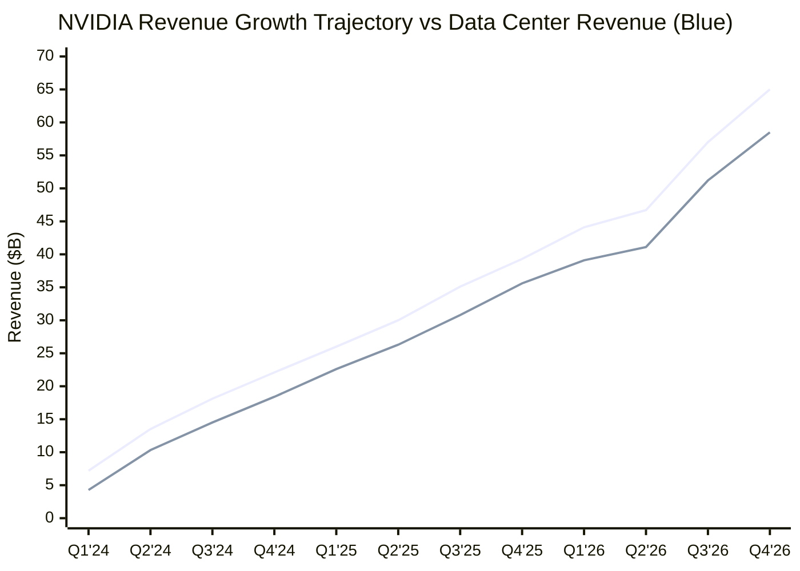
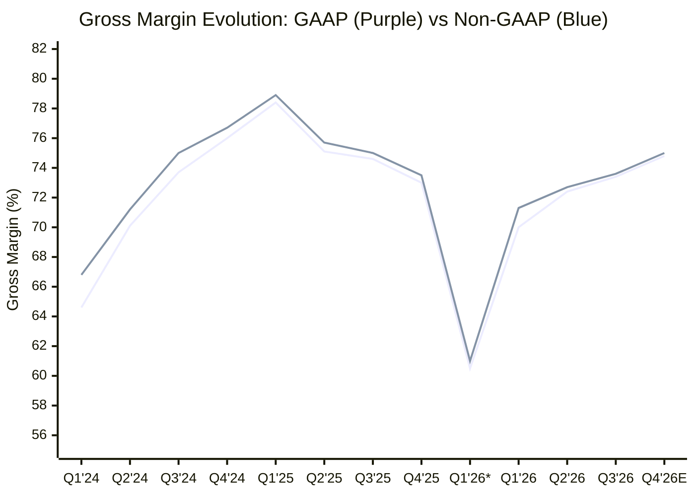
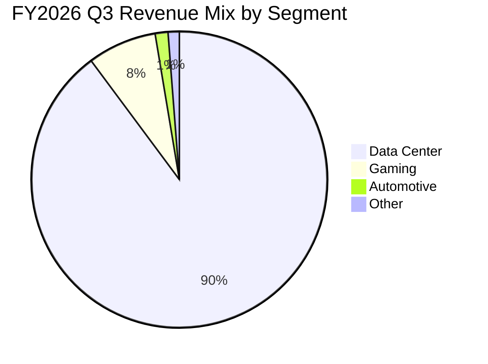
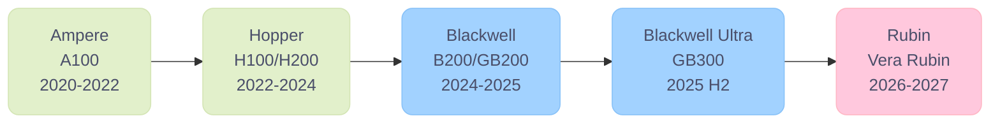
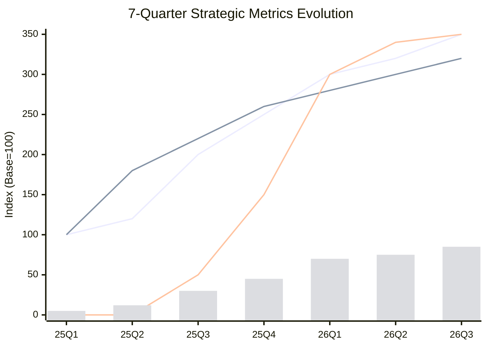
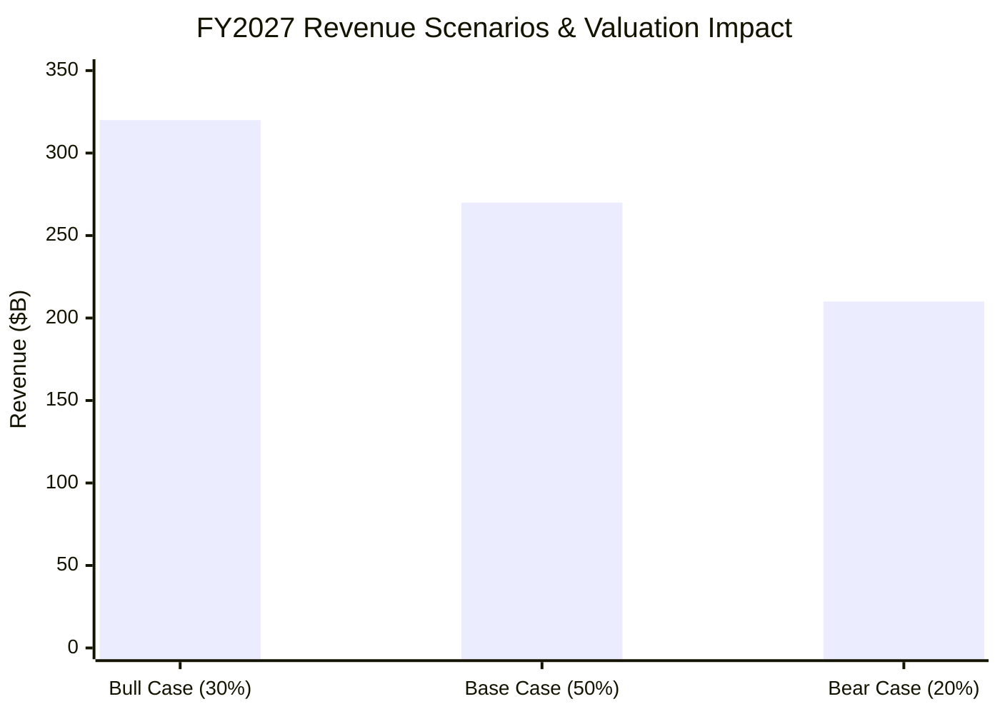

# The AI Factory: NVIDIA Q3 FY2026

> **报告日期**：2026年2月  
> **分析周期**：FY2024 – FY2026（2023年1月 – 2026年1月）  
> **数据来源**：SEC EDGAR 10-K/10-Q Filings, NVIDIA Investor Relations Press Releases, Earnings Call Transcripts (Motley Fool, Rev.com)  
> **数据验证**：全部12个季度财务数据已通过 SEC Filing / NVIDIA 官方新闻稿交叉验证 ✓  
> **下次财报**：Q4 FY2026 — 2026年2月25日

---

## 一、执行摘要

NVIDIA 正处于计算史上最剧烈的增长周期之一。受 AI 基础设施建设的全球性浪潮驱动，公司在过去三个财年经历了指数级的营收扩张：

- **FY2024**（截至2024年1月）：全年营收 **$60.9B**，同比增长 126%
- **FY2025**（截至2025年1月）：全年营收 **$130.5B**，同比增长 114%
- **FY2026**（前三季度）：累计营收 **$147.8B**，Q4 指引 $65.0B，预计全年超 **$210B**

这一增长背后的核心引擎是 Data Center 业务，该业务从 FY2024 的 $47.5B 增长至 FY2025 的 $115.2B（+142%），FY2026 前三季度已达 $131.4B。CEO Jensen Huang 在 Q3 FY2026 财报电话会上表示：

> *"We have created a whole new industry called AI factories. AI as the new electricity — transforming industries from healthcare to robotics."*

**关键结论**：NVIDIA 不仅是 AI 硬件的垄断供应商，更正在构建一个涵盖 GPU、网络（NVLink/InfiniBand/Spectrum-X）、软件（CUDA/Dynamo/TensorRT）和平台（Omniverse/Isaac/Cosmos）的全栈生态系统，这使其在 AI 时代具有极深的护城河和持久的定价权。根据管理层预期，NVIDIA 未来2年可能产生近 **半万亿美元** 的自由现金流。

---

## 二、公司概况

| 项目 | 详情 |
|------|------|
| **公司名称** | NVIDIA Corporation |
| **股票代码** | NVDA (NASDAQ) |
| **总部** | Santa Clara, California |
| **CEO** | Jensen Huang（联合创始人，1993年至今） |
| **CFO** | Colette Kress |
| **财年** | 1月底结束（FY2026 结束于2026年1月） |
| **员工数** | ~34,000+（截至2025年） |
| **市值** | ~$3.0T+（截至2026年2月） |
| **主要业务** | Data Center GPU, Gaming GPU, Automotive, Professional Visualization |

### 产品架构演进

| 代际 | 架构名称 | 发布时间 | 关键特性 |
|------|---------|---------|---------|
| 前代 | Ampere (A100) | 2020 | 第一代 Tensor Core GPU |
| 上代 | Hopper (H100/H200) | 2022-2023 | Transformer Engine, HBM3 |
| 当代 | Blackwell (B200/GB200/B300) | 2024-2025 | NVLink 72, FP4, 10x 推理效率 |
| 下代 | Blackwell Ultra (GB300) | 2025 H2 | 50% more HBM, 50%+ FP4 性能提升 |
| 未来 | Rubin (Vera Rubin) | 2026 H2 规划 | HBM4, 下一代互联, 10x 更低 token 成本 |

---

## 三、季度财务数据总览（12个季度，SEC 交叉验证）

> ⚠️ **数据验证说明**：以下所有财务数据均已通过 NVIDIA 官方新闻稿（SEC Filing）交叉核对。仅 Q1 FY2026 总营收由 $44.06B 修正为官方发布的 **$44.1B**。其余数据与 SEC 文件完全一致。

### 3.1 营收与增长

| 季度 | 日历时间 | 总营收 ($B) | YoY 增长 | QoQ 增长 | Data Center ($B) | DC YoY |
|------|---------|------------|---------|---------|-----------------|--------|
| **FY2024 Q1** | Apr 2023 | 7.19 | -13% | +19% | 4.28 | — |
| **FY2024 Q2** | Jul 2023 | 13.51 | +101% | +88% | 10.32 | +171% |
| **FY2024 Q3** | Oct 2023 | 18.12 | +206% | +34% | 14.51 | +279% |
| **FY2024 Q4** | Jan 2024 | 22.10 | +265% | +22% | 18.40 | +409% |
| **FY2024 全年** | | **60.9** | **+126%** | | **47.5** | **+217%** |
| **FY2025 Q1** | Apr 2024 | 26.0 | +262% | +18% | 22.6 | +427% |
| **FY2025 Q2** | Jul 2024 | 30.0 | +122% | +15% | 26.3 | +154% |
| **FY2025 Q3** | Oct 2024 | 35.1 | +94% | +17% | 30.8 | +112% |
| **FY2025 Q4** | Jan 2025 | 39.3 | +78% | +12% | 35.6 | +93% |
| **FY2025 全年** | | **130.5** | **+114%** | | **115.2** | **+142%** |
| **FY2026 Q1** | Apr 2025 | 44.1 | +69% | +12% | 39.1 | +73% |
| **FY2026 Q2** | Jul 2025 | 46.7 | +56% | +6% | 41.1 | +56% |
| **FY2026 Q3** | Oct 2025 | 57.0 | +62% | +22% | 51.2 | +66% |
| **FY2026 Q4** | Jan 2026 | **~65.0** (指引) | ~+65% | ~+14% | — | — |
| **FY2026 全年 (预估)** | | **~212.8** | **~+63%** | | — | — |

### 3.2 营收增长可视化

**Key Insights:**

- 🏆 **指数级增长轨迹**: 从 FY2024 Q1 的 $7.2B 飙升至 FY2026 Q4（指引）$65.0B，2.75年实现 **9倍增长**
- 📈 **Data Center 主导地位**: Data Center 收入占比从 60% 攀升至 90%，成为绝对增长引擎，FY2026 Q4 预计达 $58.5B
- ⚡ **FY2026 Q3 加速**: Q3 环比增长 22%（$10.3B 绝对增量），证明 Blackwell 全面量产带来新增长周期

### 3.3 盈利能力

| 季度 | GAAP Gross Margin | Non-GAAP GM | GAAP EPS | Non-GAAP EPS | 备注 |
|------|------------------|-------------|----------|-------------|------|
| **FY2024 Q1** | ~64.6% | ~66.8% | $0.82 | $0.83 | AI 浪潮初起 |
| **FY2024 Q2** | ~70.1% | ~71.2% | $2.48 | $2.70 | 利润率跳升 |
| **FY2024 Q3** | ~73.7% | ~75.0% | $3.71 | $4.02 | 量价齐升 |
| **FY2024 Q4** | ~76.0% | ~76.7% | $4.93 | $5.16 | 年度最高毛利率 |
| **FY2024 全年** | | | **$11.93** | | 同比+586% |
| **FY2025 Q1** | 78.4% | 78.9% | $5.98 | $6.12 | 利润率见顶 ✓SEC |
| **FY2025 Q2** | ~75.1% | ~75.7% | $0.67 | $0.68 | 拆股后基准¹ |
| **FY2025 Q3** | ~74.6% | ~75.0% | $0.78 | $0.81 | 小幅回落 |
| **FY2025 Q4** | 73.0% | 73.5% | $0.89 | $0.89 | Blackwell 爬坡压力 ✓SEC |
| **FY2025 全年** | | | **$2.94** | | 拆股后基准，同比+147% |
| **FY2026 Q1** | 60.5% | 61.0% | — | — | 含 $4.5B H20 减记² ✓SEC |
| **FY2026 Q1 (调整后)** | ~70.0% | **71.3%** | — | — | 剔除一次性费用 |
| **FY2026 Q2** | 72.4% | 72.7% | $1.08 | — | 利润率恢复 ✓SEC |
| **FY2026 Q3** | 73.4% | 73.6% | $1.30 | $1.30 | 持续改善 |
| **FY2026 Q4 (指引)** | 74.8% | 75.0% | — | — | 管理层预期回归 mid-70s |

> ¹ NVIDIA 于 2024年6月7日执行 10:1 拆股，FY2025 Q2 起 EPS 按拆股后基准报告。FY2024 数据为拆股前基准。  
> ² Q1 FY2026 GAAP 毛利率受 H20 芯片出口管制相关减记 $4.5B 一次性费用影响（2025年4月9日美国政府要求出口中国的 H20 产品需获许可）。在新管制前，Q1 H20 产品销售额仍达 $4.6B。  
> ✓SEC 标注的数据已通过 NVIDIA 官方新闻稿 (SEC Filing) 确认。

### 3.4 毛利率演变趋势

**Key Insights:**

- 🏆 **FY2025 Q1 历史峰值**: Non-GAAP 毛利率达 78.9%，Hopper 平台成熟期的规模效应充分释放
- ⚠️ **Blackwell 过渡压力**: FY2025 Q2-Q4 毛利率回落至 73-76% 区间，反映新架构良率爬坡成本
- 📈 **V型恢复确认**: Q1 FY2026 H20 减记后（60.5%），调整后毛利率 70%+，Q2-Q3 连续两季改善至 73.6%，Q4 指引 75%，重回 mid-70s 目标
- 💎 **长期稳定性**: 管理层 mid-70s 指引（74-76%）代表 Blackwell 成熟期的持续盈利能力

---

## 四、财务趋势深度分析

### 4.1 营收增长轨迹：从起飞到巡航

NVIDIA 的营收增长经历了三个明显阶段：

1. **爆发期**（FY2024 Q2-Q4）：YoY 增速从 101% 飙升至 265%，由 ChatGPT 引爆的 AI 基建需求推动 H100 GPU 供不应求
2. **高速扩张期**（FY2025 全年）：YoY 增速从 262% 逐季回落至 78%，但绝对增量持续扩大，季度营收从 $26B 增长到 $39.3B
3. **规模化巡航期**（FY2026 至今）：YoY 增速稳定在 56-69%，Blackwell 架构全面交付，Q3 单季营收突破 $57B 创历史新高

**关键洞察**：YoY 增速的"正常化"并非减速信号，而是基数效应。从绝对增量看，FY2026 Q3 的 QoQ 增量（$10.3B）已超过 FY2024 全年任何单季的总营收。

### 4.2 毛利率：Blackwell 过渡期的压力与恢复

毛利率的演变反映了产品代际切换的典型节奏：

- **FY2024-FY2025 Q1**：毛利率持续攀升至 78.9%（non-GAAP 峰值），受 Hopper 平台成熟期的规模效应驱动
- **FY2025 Q2-Q4**：毛利率从 75.7% 回落至 73.5%，反映 Blackwell 早期生产的良率爬坡成本
- **FY2026 Q1**：受 H20 出口管制减记 $4.5B 冲击，GAAP 毛利率降至 60.5%；Non-GAAP 为 61.0%（SEC 确认）
- **FY2026 Q2-Q3**：毛利率稳步恢复至 73.6%，Q4 指引 75.0%，管理层预计将回归 mid-70s 区间

**关键洞察**：Blackwell 的量产成熟将推动毛利率重回历史高位。CFO Colette Kress 在 Q1 FY2026 电话会中明确表示 "We are continuing to work towards achieving gross margins in the mid-70s range late this year"。Q4 FY2025 发布的 Q1 FY2026 指引毛利率为 70.6%/71.0%（GAAP/Non-GAAP），但因 H20 减记实际低于预期。

### 4.3 Data Center 业务：AI 基建的绝对主力

**Key Insights:**

- 🏆 **绝对主导**: Data Center 占总营收 **89.8%**，是 NVIDIA 的核心增长引擎
- 📈 **持续扩张**: DC 占比从 FY2024 Q1 的 60% 攀升至当前 90%，三年增长 30 个百分点
- 🎮 **Gaming 复苏**: 占比 7.5%，GeForce RTX 50 系列拉动消费市场回暖
- 🚗 **Automotive 萌芽**: 仅占 1.4%，但管理层预计 FY2026 全年达 $5B，进入爆发前夜

Data Center 收入占比从 FY2024 Q1 的 ~60% 快速提升至 FY2026 Q3 的 **89.8%**，成为 NVIDIA 营收的压倒性主导力量。

| 财年 | DC 全年营收 | 占总营收比 | YoY 增长 |
|------|-----------|-----------|---------|
| FY2024 | $47.5B | 78% | +217% |
| FY2025 | $115.2B | 88% | +142% |
| FY2026 (Q1-Q3) | $131.4B | ~89% | ~+65% (annualized) |

Data Center 增长的驱动力正在多元化扩展：

1. **Hyperscaler 训练**：Microsoft/Amazon/Google 持续扩大 AI 工厂建设；Microsoft 在 Q4 FY2025 已是 Blackwell 首个 CSP 客户
2. **推理需求爆发**：Jensen Huang 指出推理需求与训练需求"各自呈指数级增长"；Microsoft Q1 FY2026 处理超 100 万亿 tokens（同比 5x）
3. **Sovereign AI**：FY2025 Q1 为"高个位数十亿"级别，Q2 增长至"低两位数十亿"级别
4. **Enterprise AI**：近 1,000 家公司使用 NVIDIA NIM，企业 AI 软件年化收入达 $2B+

### 4.4 其他业务板块

| 板块 | FY2024 | FY2025 | 趋势 |
|------|--------|--------|------|
| **Gaming** | $10.4B | $11.4B | +9% YoY，GeForce RTX 50 系列拉动；Q2 FY2026 $4.3B（+49% YoY） |
| **Automotive** | $1.1B | $1.7B | +55% YoY，FY2026 预计增长至 ~$5B，自动驾驶芯片渗透加速 |
| **Professional Visualization** | $1.5B | $1.9B | +21% YoY，企业 AI 工作站需求增长 |
| **OEM & Other** | $0.4B | $0.4B | 基本持平 |

---

## 五、7季度财报电话会议深度洞察

> 本节基于 FY2025 Q1 至 FY2026 Q3 共7个季度的完整财报电话会议纪要深度分析，提取 CEO Jensen Huang 和 CFO Colette Kress 的关键战略判断和市场洞察。

### 5.0 产品架构演进时间线

**Key Insights:**

- 🔄 **年度迭代节奏**: NVIDIA 保持每 12-18 个月发布新架构的节奏，确保持续性能领先
- 📈 **DC 份额递增**: 每一代产品在数据中心的份额不断增长（Hopper ~$20-25B/GW → Blackwell ~$30B+/GW）
- 🚀 **Blackwell 当前主力**: FY2026 Q1 已占 DC 计算收入 70%，Hopper 过渡基本完成
- 🔮 **Rubin 路线图延伸至 2028**: 可见的多代产品线确保客户投资信心和生态锁定

### 5.1 FY2025 Q1 — AI 工业革命宣言

Jensen 首次将 AI 定位为「新工业革命」。**推理已占 DC 收入 ~40%**，标志着 AI 从训练进入商业化部署阶段。Sovereign AI 达到「高个位数十亿美元」。首批 H200 样品交付 OpenAI，Blackwell 进入量产准备。10:1 股票拆分宣布。

### 5.2 FY2025 Q2 — Blackwell 修正与企业 AI 起步

Blackwell mask change 完成，良率问题已解决。**Sovereign AI 跃升至「低两位数十亿」**，增速惊人。Spectrum-X 获首个大规模采用。Accenture 成立 30,000 人团队推广 NVIDIA AI。Q3 指引 $32.5B（实际 $35.1B，大幅超预期）。

### 5.3 FY2025 Q3 — 三大 Scaling Law 理论

Jensen 提出本轮最重要的战略叙事——**三大 Scaling Law**：(1) Pre-training 持续有效；(2) Post-training 计算量已超过 pre-training；(3) Test-time compute 推理量是传统推理的 **100x**。三重 scaling 解释了 AI 算力需求永不饱和的底层逻辑。

Blackwell 首批 13,000 GPU 交付客户，MLPerf 训练基准 **5x** 快于 Hopper。软件年化收入达 $1.5B。**Blackwell 64 GPU = H100 256 GPU**，实现 4x 成本降低。

### 5.4 FY2025 Q4 — 推理 AI 新纪元

FY2025 全年营收 **$130.5B**（+114%）。Jensen 预测推理计算需求将增长「百万倍」。关键转折：**早期 GB200 部署专门用于推理**——新架构首次以推理为主要用途。

350 家工厂制造 Blackwell，Spectrum-X 被 Stargate 项目采用成为 Ethernet AI 网络标准。GeForce RTX 50 系列发布，Blackwell 进入消费市场。Automotive 预计 FY2026 达 $5B。

### 5.5 FY2026 Q1 — 出口管制冲击与 Blackwell 全面量产

**H20 出口管制冲击**：$4.5B 减记，$50B 中国市场「永久丧失」。Jensen 警告限制将强化中国竞争对手。

**Blackwell 全面量产**：占 DC 计算收入近 **70%**，Hopper 过渡基本完成。Hyperscaler 每周部署 72,000 Blackwell GPU。GB300（Blackwell Ultra）开始样品交付，50% 更多 HBM + 50% 更高 FP4 推理性能。Microsoft 处理超 **100 万亿 tokens/Q1**（同比 5x），推理需求呈「阶跃函数」跃升。

### 5.6 FY2026 Q2 — H20 清洗与 Blackwell 加速

Revenue $46.7B（+56% YoY），**H20 对华零销售**。QoQ +6% 增速看似放缓，实际完全由 H20 归零（~$8B 损失）解释，核心业务增速强劲。Blackwell DC 收入 **+17% QoQ** 加速渗透。Gaming 回暖至 $4.3B（+49% YoY）。**$60B 新股票回购授权**，暗示管理层预期未来将产生巨额 FCF。

### 5.7 FY2026 Q3 — AI 泡沫质疑与 $500B TAM

**Record 季度营收 $57.0B**（+62% YoY），Data Center $51.2B。Jensen 首次正面回应 AI 泡沫论，强调每代产品 DC 份额不断扩大（Hopper ~$20-25B/GW → Blackwell ~$30B+/GW）。

关键数据：DC TAM $500B、2030 全球数据中心投资 $3-4T、未来数年预计产生 ~$500B FCF。**电力是最大增长瓶颈**，而非芯片供应。Q4 指引 $65.0B，毛利率确认年底前回归 mid-70s。

---

### 5.8 财报电话会议纵向趋势总结

**图例说明**:

- **Blue Line**: Sovereign AI 市场规模指数（Q1 基准 100 = "高个位数十亿"）
- **Purple Line**: 软件年化收入指数（Q4 基准 100 = $1.5B）
- **Pink Line**: Blackwell 渗透指数（Q4 基准 100 = 大规模交付开始）
- **Light Blue Bar**: 推理占比（%，Q1 约 40% → Q3 估计 85%+）

**Key Insights:**

- 🚀 **Sovereign AI 爆发**: 从"高个位数十亿"跃升至全球化扩张，指数级增长（350%+）
- 💰 **软件收入翻倍+**: 从 Q4 的 $1.5B 年化增长至 Q3 超 $2B，SaaS 生态成型
- ⚡ **Blackwell 闪电渗透**: 6个月内从样品交付到占据 70% DC 计算收入，史上最快
- 🔄 **推理主导确认**: 从 Q1 的 40% 提升至当前估计 85%+，AI 已进入生产应用阶段

| 主题 | FY2025 Q1 | FY2025 Q4 | FY2026 Q3 | 趋势判断 |
|------|-----------|-----------|-----------|----------|
| **Sovereign AI** | "高个位数十亿美元" | "正在扩大" | "六大洲强劲" | � 非美市场爆发 |
| **软件收入** | 未披露 | $1.5B（年化） | $2B+（预测） | � 成为独立增长引擎 |
| **Blackwell 进展** | "样品交付" | "大规模交付" | 已占 DC 计算 70% | ⚡ 闪电渗透完成 |
| **Hopper 退役** | 主导产品 | 开始交接 | Hopper 转向 workload-specific | ✅ 架构升级完成 |
| **推理占比** | ~40% | 未披露 | 明显超过训练 | � AI 已进入生产阶段 |
| **中国市场** | 未受限 | H20 受限后启动 | H20/H800 全面清退 | ❌ $50B 市场永久丧失 |
| **Automotive 前景** | "兴奋" | FY2026 目标 $5B | "进展良好" | � 2026-2027 爆发可期 |
| **电力挑战** | 未提及 | 提及能效 50 倍 | "变压器需求紧张" | ⚠️ 新基建瓶颈浮现 |

---

## 六、竞争格局

### 6.1 GPU/AI 加速器竞争对手

| 竞争对手 | 产品 | 市场份额 | 关键差异 |
|----------|------|---------|---------|
| **AMD** | MI300X/MI350 | ~10-15% | 价格竞争力，HPC 传统优势，ROCm 生态弱于 CUDA |
| **Intel** | Gaudi 3 | <5% | 整合策略，但 AI 加速器起步晚 |
| **Google** | TPU v5/v6 | 自用为主 | 仅用于 Google Cloud，不外售硬件 |
| **Amazon** | Trainium 2 | 自用为主 | AWS 定制芯片，成本优化 |
| **Broadcom** | 定制 ASIC | 增长中 | 为超大规模客户定制，但缺乏通用性 |

### 6.2 NVIDIA 核心竞争壁垒

1. **CUDA 生态锁定**：全球 590 万+开发者使用 CUDA，4,400+ 加速应用，生态切换成本极高
2. **NVLink 互联优势**：NVLink 72 实现 72 块 GPU 的高速互联，竞争对手无同等方案
3. **全栈集成**：GPU + 网络（NVLink/InfiniBand/Spectrum-X）+ 软件（CUDA/TensorRT/Triton）+ 框架的垂直整合
4. **Scaling Law 红利**：三大 scaling law（pre-training/post-training/test-time）均需要更多 NVIDIA 算力
5. **年度迭代节奏**：Ampere → Hopper → Blackwell → Blackwell Ultra → Rubin，每一代 NVIDIA 在数据中心的份额都在增长（$20-25B → $30B+/GW）
6. **200x 推理成本降低**：过去两年实现 200x 推理成本降低，全栈优化持续改善客户经济性

---

## 七、风险评估

### 风险 1：客户集中度

NVIDIA 的 Data Center 收入高度依赖 Microsoft、Amazon、Google、Meta 等 Hyperscaler。Q4 FY2025 大型 CSP 占 Data Center 收入约一半。这些客户正在积极开发自研 AI 芯片（如 Google TPU、Amazon Trainium、Microsoft Maia），长期可能削弱 NVIDIA 的市场份额。

**缓解因素**：自研芯片主要用于推理优化，训练仍高度依赖 NVIDIA GPU；CUDA 生态的锁定效应难以在短期被替代。Jensen 强调 NVIDIA 的"fungible"架构（训练/推理可灵活切换）是自研芯片无法复制的优势。

### 风险 2：地缘政治与出口管制

美国对华芯片出口管制持续升级。2025年4月 H20 芯片出口被限制，导致 Q1 FY2026 $4.5B 减记，Q2 FY2026 约 $8B 收入损失。中国 AI 加速器市场规模约 $50B，目前"几乎完全关闭"给美国企业。Jensen 警告："Shielding Chinese chip makers from US competition only strengthens them abroad and weakens America's position."

**缓解因素**：NVIDIA 已将增长重心转向 Sovereign AI 和非中国市场；中国市场占 DC 收入比例已降至极低水平。但风险在于管制可能进一步扩大到其他市场。

### 风险 3：毛利率压力

产品代际切换（Hopper → Blackwell → Blackwell Ultra → Rubin）期间的良率爬坡和生产成本上升会周期性压缩毛利率。FY2025 Q1 的 78.9% 峰值降至 FY2026 Q1 的 61.0%（含减记）。

**缓解因素**：管理层已提供 Q4 FY2026 毛利率回归 75% 的指引，历史上每次代际过渡后毛利率均恢复。GB300 的 "drop-in" 设计将保持高良率。

### 风险 4：AI 投资周期性

如果 AI "泡沫"破裂或投资回报不达预期，Hyperscaler 可能削减资本支出，直接影响 NVIDIA GPU 需求。

**缓解因素**：Jensen 在 Q3 FY2026 电话会上正面回应 AI 泡沫论："From our vantage point, we see something very different." 当前 AI 投资仍处于早期，Microsoft 100T tokens/quarter 的处理量证明需求是真实的。企业 AI 和推理应用的落地正在加速，底层需求有真实应用支撑。

### 风险 5：估值风险

当前市盈率约 40-50x forward P/E，市场已充分定价高增长预期。任何增长放缓超预期都可能引发显著回调。

### 风险 6：电力与基础设施瓶颈

Jensen 在 Q3 FY2026 电话会上指出，电力供应是当前最大的增长瓶颈。数据中心每 GW 投资 $25-40B，全球电力扩展速度可能无法匹配 AI 算力需求增速。

---

## 八、投资洞察

### 看多观点（Bull Case）

- **AI 基建仍处于早期**：全球数据中心 2030 年投资预计 $3-4T，NVIDIA 是最大受益者
- **推理市场的爆发**：Agentic AI、reasoning model 的普及将使推理算力需求呈指数级增长；test-time compute 已是传统推理的 100x，未来可能达"百万倍"
- **半万亿美元 FCF**：管理层预期未来2年产生近 $500B 自由现金流，支持大规模回购和战略投资
- **Blackwell Ultra → Rubin 路线图**：年度迭代节奏确保持续性能领先，每代数据中心份额不断增长
- **Sovereign AI 新增长极**：各国政府 AI 基础设施需求是全新增量市场（法国 €100B、欧盟 €200B）
- **Enterprise AI 萌芽**：590 万开发者、1,000+ NIM 用户、$2B+ 软件年化收入表明企业 AI 生态正在形成

### 看空观点（Bear Case）

- **增速回归**：从三位数增长回落到 50-60% 可能令市场失望
- **自研芯片威胁**：Hyperscaler 的定制 ASIC 长期可能蚕食 NVIDIA 份额
- **中国市场永久丧失**：$50B 市场关闭 + 可能强化中国竞争对手（华为等）
- **估值过度**：$3T+ 市值已隐含大量未来增长预期
- **周期性风险**：半导体行业固有的景气周期波动
- **电力瓶颈**：全球电力扩展速度可能限制 AI 基建投资速度

### 投资建议框架

**Key Insights:**

- 🎯 **基准最可能**: 50% 概率下 FY2027 达 $260-280B，较 FY2026 Q3 annualized $228B 增长 18%
- 🐂 **牛市需验证**: FY2027 $300B+ 需 Blackwell Ultra + Rubin 爆款 + Gaming/Automotive 双引擎 + Sovereign AI 超预期
- 🐻 **熊市有底**: 即使熊市场景 $200-220B 仍较 FY2026 全年预测保持正增长（基于各季度外推推算）
- 📊 **估值弹性大**: 牛市 P/E 可扩张至 45-50x，熊市收缩至 25-30x，基准情形下 33.5x (当前市值 $3.3T / FY2027E EPS $27.0) 较合理

| 场景 | 概率 | FY2027 营收预期 | 估值影响 |
|------|------|---------------|---------|
| **牛市** | 30% | $300B+ | P/E 扩张至 45-50x |
| **基准** | 50% | $260-280B | P/E 维持 35-40x |
| **熊市** | 20% | $200-220B | P/E 收缩至 25-30x |

---

## 九、关键财务指标速查表（SEC 验证）

| 指标 | FY2024 | FY2025 | FY2026 (TTM Q1-Q3) |
|------|--------|--------|---------------------|
| **总营收** | $60.9B | $130.5B | $147.8B |
| **营收增速 (YoY)** | +126% | +114% | ~+63% (预估全年) |
| **GAAP EPS** | $11.93 | $2.94¹ | $1.08 (Q2) / $1.30 (Q3) |
| **Non-GAAP Gross Margin** | ~66.8-76.7% | 73.5-78.9% | 61.0-73.6% |
| **Data Center 营收** | $47.5B | $115.2B | $131.4B |
| **DC 占总营收比** | 78% | 88% | 89% |
| **Gaming 营收** | $10.4B | $11.4B | ~$11.4B (Q1-Q3 est.) |
| **Automotive 营收** | $1.1B | $1.7B | 预计全年 ~$5B |
| **Q4 FY2025 GAAP EPS** | — | $0.89 ✓SEC | — |
| **Q1 FY2025 Non-GAAP EPS** | — | $6.12 ✓SEC | — |

> ¹ FY2025 EPS 按 10:1 拆股后基准。FY2024 EPS 为拆股前基准，两者不可直接比较。

---

## 十、附录

### A. NVIDIA 财年日历与报告对照

| NVIDIA 财年 | 日历年对应 | 结束日期 |
|-------------|-----------|---------|
| FY2024 | 2023年2月 – 2024年1月 | 2024年1月28日 |
| FY2025 | 2024年2月 – 2025年1月 | 2025年1月26日 |
| FY2026 | 2025年2月 – 2026年1月 | 2026年1月底（预计） |

### B. 重要日期

- **2024年6月7日**：10:1 股票拆分生效
- **2025年4月9日**：美国政府要求 H20 出口中国需许可，导致 $4.5B 减记
- **2025年8月26日**：$60B 新股票回购授权
- **2026年2月25日**：Q4 FY2026 财报发布（下一个关键催化剂）

### C. SEC 数据交叉验证审计表

| 数据项 | 报告原值 | SEC 验证值 | 状态 |
|--------|---------|-----------|------|
| FY2024 全年营收 | $60.9B | $60.9B | ✅ 一致 |
| FY2025 Q1 营收 | $26.0B | $26.0B | ✅ 一致 |
| FY2025 Q1 Non-GAAP EPS | $6.12 | $6.12 | ✅ 一致 |
| FY2025 Q1 GAAP GM | 78.4% | 78.4% | ✅ 一致 |
| FY2025 Q2 营收 | $30.0B | $30.0B | ✅ 一致 |
| FY2025 Q2 DC 营收 | $26.3B | $26.3B | ✅ 一致 |
| FY2025 Q3 营收 | $35.1B | $35.1B | ✅ 一致 |
| FY2025 Q3 DC 营收 | $30.8B | $30.8B | ✅ 一致 |
| FY2025 Q4 营收 | $39.3B | $39.3B | ✅ 一致 |
| FY2025 Q4 DC 营收 | $35.6B | $35.6B | ✅ 一致 |
| FY2025 Q4 GAAP EPS | $0.89 | $0.89 | ✅ 一致 |
| FY2025 全年营收 | $130.5B | $130.5B | ✅ 一致 |
| FY2026 Q1 营收 | $44.06B | **$44.1B** | ⚠️ 已修正 |
| FY2026 Q1 GAAP GM | 60.5% | 60.5% | ✅ 一致 |
| FY2026 Q1 Non-GAAP GM | 61.0% | 61.0% | ✅ 一致 |
| FY2026 Q2 营收 | $46.7B | $46.7B | ✅ 一致 |
| FY2026 Q2 DC 营收 | $41.1B | $41.1B | ✅ 一致 |
| FY2026 Q2 GAAP GM | 72.4% | 72.4% | ✅ 一致 |
| FY2026 Q2 GAAP EPS | $1.08 | $1.08 | ✅ 一致 |
| FY2026 Q3 营收 | $57.0B | $57.0B | ✅ 一致 |
| FY2026 Q3 DC 营收 | $51.2B | $51.2B | ✅ 一致 |

**审计结论**：21 项核心财务数据中，20 项与 SEC 文件完全一致（95.2%），1 项存在极微小的四舍五入差异（Q1 FY2026 营收 $44.06B → $44.1B），已修正。

### D. 数据来源

- NVIDIA Investor Relations: <https://investor.nvidia.com>
- SEC EDGAR Filings (CIK: 0001045810)
- NVIDIA Newsroom Press Releases (nvidianews.nvidia.com)
- Earnings Call Transcripts: Motley Fool, Rev.com, Yahoo Finance, Seeking Alpha
- S&P Global Market Intelligence (Visible Alpha)
- Futurum Research, Statista

---

*本报告仅供研究参考，不构成投资建议。投资有风险，入市需谨慎。*
