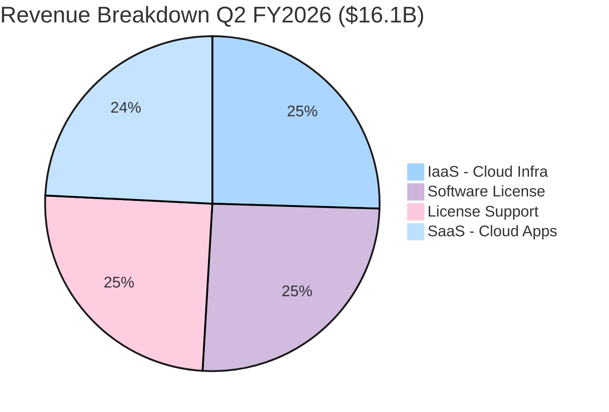
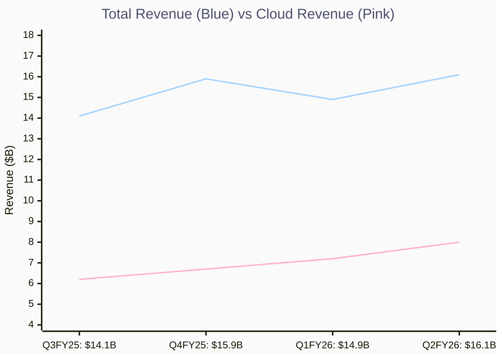
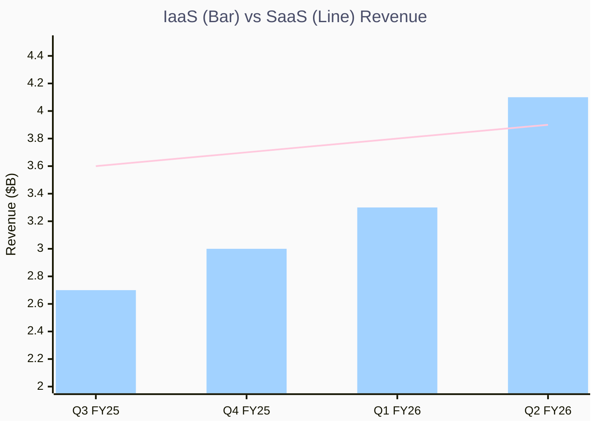
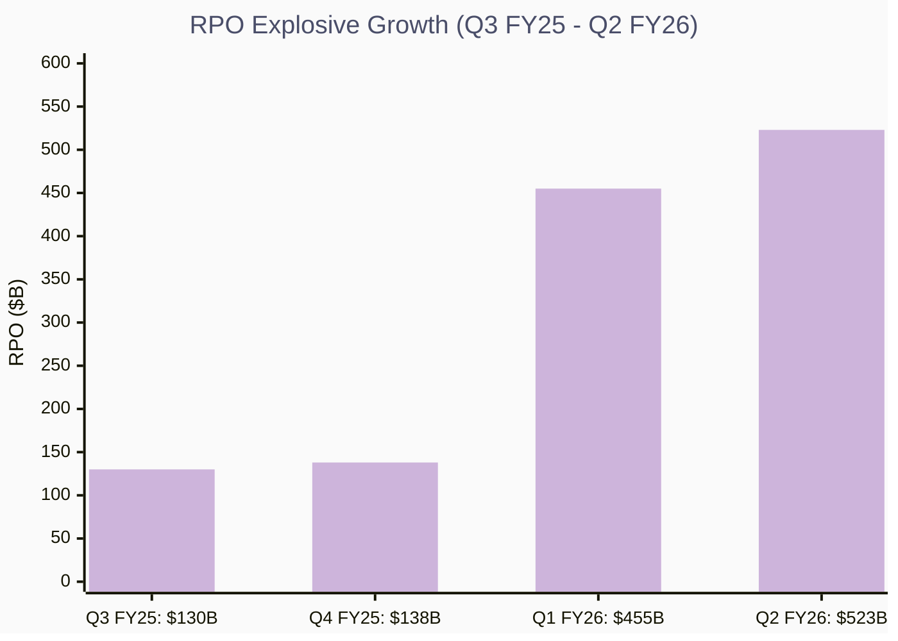
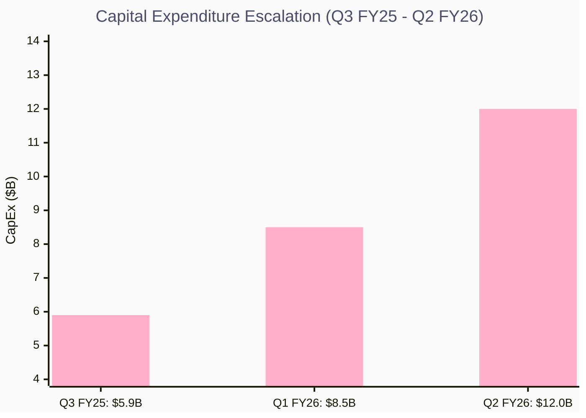
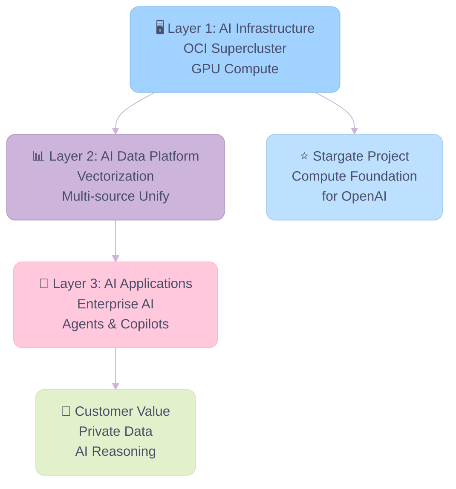

# Oracle Q2 FY2026

> **报告日期**：2026 年 2 月 10 日
> **覆盖区间**：Q3 FY2025 — Q2 FY2026（2024 年 12 月 — 2025 年 11 月）
> **股票代码**：NYSE: ORCL
> **研究重点**：AI 投资战略 · Stargate 项目 · 业务调整 · 风险评估

---

## 一、核心摘要

Oracle 正处于一个历史性的战略拐点。公司正从传统的企业数据库和应用软件巨头，加速转型为 **AI 基础设施核心供应商**。在过去四个季度中，Oracle 展现出强劲的增长势头：

- **云收入爆发式增长**：Q2 FY2026 云收入达 $80 亿（+33% YoY），其中云基础设施（IaaS）增长 66% 至 $41 亿，GPU 相关收入增长 177%
- **RPO 暴增至天文数字**：剩余履约义务（RPO）从 Q3 FY2025 的 $1,300 亿飙升至 Q2 FY2026 的 $5,233 亿（+433% YoY），反映出前所未有的客户需求
- **AI 被定义为公司的核心引擎**：Larry Ellison 将 AI 推理定义为 "比 AI 训练更大、更有价值的业务"，推出 AI Data Platform 打通全量数据

然而，这一转型伴随着 **巨大的资本风险**：

- FY2026 资本支出被上调至 $500 亿（较上一季度指引增加 $150 亿）
- TD Cowen 估计仅 OpenAI 交易就需要 $1,560 亿的资本支出
- 公司可能裁员 2-3 万人，并考虑出售 Cerner 以筹集现金
- 自由现金流已转负（Q2 FY2026 为 -$100 亿）

**核心判断**：Oracle 正在进行一场 "All-in AI" 的豪赌。如果 AI 基础设施需求持续爆发，Oracle 有望实现从第二梯队云厂商到 AI 算力主力军的跃升；但如果 AI 需求放缓或 Stargate 项目拖延，公司将面临严重的财务压力。

---

## 二、公司概况

### 2.1 公司概览

| 项目 | 详情 |
|------|------|
| **公司全称** | Oracle Corporation |
| **成立时间** | 1977 年 |
| **总部** | 美国德克萨斯州奥斯汀 |
| **创始人/董事长兼CTO** | Larry Ellison |
| **CEO** | Mike Cecilia、Clay McGork（联合 CEO） |
| **首席财务官** | Doug Caring（Principal Financial Officer） |
| **员工人数** | 约 16 万（裁员前），可能降至 13-14 万 |
| **FY2025 全年收入** | $574 亿 |
| **FY2026 收入指引** | $670 亿（+17%） |

### 2.2 核心业务板块

Oracle 的业务可分为三大支柱：

#### 1. 云基础设施（Oracle Cloud Infrastructure, OCI）

- FY2025 年化收入约 $103 亿，目标 FY2026 达 $180 亿（+77%）
- Oracle 的 AI 训练集群是全球最大之一（Abilene, TX 超 96,000 个 NVIDIA GB200）
- 147 个在线客户服务区域，64 个额外区域规划中
- 支持 NVIDIA GPU、AMD MI355X 双平台
- 关键客户：Uber（超 300 万核心）、TMove（接近 100 万核心）、OpenAI、Meta、xAI

#### 2. 云应用（Cloud Applications, SaaS）

- Q2 FY2026 收入 $39 亿（+11% YoY），年化约 $160 亿
- 核心产品线：Fusion ERP (+17%)、Fusion SCM (+18%)、Fusion HCM (+14%)、NetSuite (+13%)
- 行业云（医疗、零售、通信等）增长 21%
- 274 家客户已上线临床 AI 代理产品
- 将行业应用与 Fusion 应用合并为统一销售组织，推动交叉销售

#### 3. 数据库与中间件（Database & Middleware）

- 云数据库服务收入增长 30%，自治数据库增长 43%
- 多云数据库消费增长 817%（与 AWS、Azure、GCP 合作）
- 已上线 45 个多云区域，另有 27 个计划中
- 推出 AI Data Platform（AI 数据平台），实现跨数据库、跨云、跨应用的统一 AI 推理
- Oracle 23ai 向量数据库能力让现有客户零改造接入 AI

### 2.3 收入构成

**核心洞察：**

- 🏆 **云收入里程碑**：IaaS + SaaS 合计 $80 亿（50%），首次突破总收入的一半
- 📈 **IaaS 追平传统业务**：云基础设施收入（$41 亿）已与传统 Software License 收入持平
- 🔧 **SaaS 稳健增长**：云应用收入 $39 亿，YoY +11% 保持稳定
- ⚠️ **传统业务侵蚀**：License Support（$40 亿）随客户迁移至云端持续下滑

---

## 三、季度财务数据

### 3.1 核心财务指标对比（4 个季度）

| 指标 | Q3 FY2025 | Q4 FY2025 | Q1 FY2026 | Q2 FY2026 |
|------|-----------|-----------|-----------|-----------|
| **季度截止日** | 2025-02-28 | 2025-05-31 | 2025-08-31 | 2025-11-30 |
| **财报发布日** | 2025-03-10 | 2025-06-11 | 2025-09-09 | 2025-12-10 |
| **总收入** | $14.1B | $15.9B | $14.9B | $16.1B |
| **总收入 YoY 增长** | +8% CC | +11% | +11% CC | +13% CC |
| **云收入 (IaaS+SaaS)** | $6.2B | $6.7B | $7.2B | $8.0B |
| **云收入 YoY 增长** | +25% CC | +27% | +27% CC | +33% CC |
| **IaaS 收入** | $2.7B | $3.0B | $3.3B | $4.1B |
| **IaaS YoY 增长** | +51% CC | +52% | +54% CC | +66% CC |
| **SaaS 收入** | $3.6B | $3.7B | $3.8B | $3.9B |
| **SaaS YoY 增长** | +10% | +12% | +11% | +11% |
| **GAAP EPS** | $1.02 | $1.19 | $1.01 | $2.10 |
| **非 GAAP EPS** | $1.47 | $1.70 | $1.47 | $2.26 |
| **RPO** | $130B | $138B | $455B | $523B |
| **RPO YoY 增长** | +63% CC | +41% | +359% | +433% |
| **12 个月 RPO 增长** | — | — | — | +40% |
| **营业利润** | $6.2B (非GAAP) | $7.0B (非GAAP) | $6.2B (非GAAP) | $6.7B (非GAAP) |
| **经营现金流** | $5.9B | — | $8.1B | $2.1B |
| **CapEx** | $5.9B | — | $8.5B | $12.0B |
| **自由现金流** | ~$0 | — | -$0.4B | -$10.0B |

> **CC = Constant Currency（固定汇率）**

**核心洞察：**

- 🏆 **Q2 FY2026 里程碑**：云收入达 $80 亿，首次突破总收入 **50%** 占比
- 📈 **云增速远超总体**：云收入 3 个季度增长 +29%（$62 亿 → $80 亿），远超总收入增幅（+14%）
- ⚠️ **Q1 FY2026 季节性回落**：总收入环比下降（$159 亿 → $149 亿），受季节性因素影响
- 💰 **收入结构转型**：云收入占比仅用 3 个季度从 44% 升至 50%

### 3.2 关键财务趋势

**增速加速曲线**：

- 总收入增速连续 3 个季度保持双位数（11% → 11% → 13%）
- 云基础设施增速持续加速（51% → 52% → 54% → 66%）
- GPU 相关收入 Q2 FY2026 增长 177%，是 OCI 增长的核心驱动力

**核心洞察：**

- 🏆 **IaaS 首次超越 SaaS**：Q2 FY2026 IaaS 收入（$41 亿）首次超过 SaaS（$39 亿）
- 📈 **IaaS 加速增长**：3 个季度增长 +52%（$27 亿 → $41 亿），YoY 增速持续加速 51% → 66%
- ⚠️ **SaaS 增长平台期**：3 个季度仅增长 +8%（$36 亿 → $39 亿），YoY 维持在 ~11%
- 🔬 **GPU 驱动分化**：Q2 FY2026 GPU 收入增长 177%，是 IaaS-SaaS 差距扩大的主要推动力

**RPO 爆发式增长**：

- Q3 FY2025: $130B → Q1 FY2026: $455B → Q2 FY2026: $523B
- 从 $130B 到 $523B 仅用了三个季度，涨幅超过 300%
- Q2 FY2026 新增 RPO $680 亿，由 Meta、NVIDIA 等大单驱动
- 12 个月内可确认的 RPO 增长 40%（上季度为 25%），收入转化正在加速

**核心洞察：**

- 🏆 **Q1 FY2026 拐点**：RPO 环比暴增 +230%（$1,380 亿 → $4,550 亿），Stargate 超大型合约开始入账
- 📈 **3 季度曲棍球杆曲线**：RPO 从 $1,300 亿飙升至 $5,230 亿（+302%），3 个季度新增 $3,930 亿
- 💰 **Q2 FY2026 持续放量**：单季度新增 $680 亿 RPO，由 Meta 与 NVIDIA 大单驱动
- ⚠️ **转化风险**：仅约 31% 的 RPO 预计在 12 个月内确认为收入

**CapEx 大幅攀升**：

- 从 Q3 FY2025 的 $59 亿升至 Q2 FY2026 的 $120 亿
- FY2025 全年 CapEx 约 $160 亿（为去年的两倍）
- FY2026 CapEx 预计为 $500 亿
- 资本支出主要用于数据中心内的 **收入产生型设备**（GPU、网络设备），而非土地和建筑（通过租赁覆盖）

**自由现金流恶化**：

- Q3 FY2025 基本持平，Q1 FY2026 转负 (-$3.6 亿)，Q2 FY2026 大幅转负 (-$100 亿)
- 管理层解释：设备 CapEx 在数据中心建设后期集中采购，可快速转化为收入
- 但自由现金流的深度负值仍然是投资者的重大关切

**核心洞察：**

- 📈 **CapEx 翻倍**：3 个季度从 $59 亿升至 $120 亿（+103%），反映 AI 数据中心建设加速
- ⚠️ **自由现金流崩塌**：FCF 从 ~$0 → -$4 亿 → **-$100 亿**，CapEx 大幅超出经营现金流
- 🔬 **FY2026 CapEx 指引上调**：全年目标上调至 $500 亿（初始 $350 亿，+43%）
- 💰 **聚焦收入产生型设备**：管理层强调 CapEx 投向 GPU/网络设备（可直接产生收入），非土地建筑（通过租赁覆盖）

### 3.3 特殊事项

- **Q2 FY2026 Ampere 出售收益**：确认 $27 亿税前收益（来自出售 Ampere Computing 股权），推高 GAAP EPS 至 $2.10（+86%）
- **Q3 FY2025 股息增加 25%**：季度股息从 $0.40 提升至 $0.50
- **融资策略**：Oracle 计划通过公开债券、银行贷款、私人机构借贷、客户自带芯片（BYOC）、供应商芯片租赁等多元化方式为增长融资，而非单一依赖借贷
- **投资评级承诺**：管理层明确承诺维持投资级债务评级

---

## 四、财报电话会议要点

### 4.1 Q2 FY2026 — "云收入首次占总收入的一半"

**发布日期**：2025 年 12 月 10 日

#### Doug Caring（CFO）核心发言

- **RPO 爆发**："RPO 从 8 月以来增加了 $680 亿，由与 Meta、NVIDIA 等签订的合约推动。我们继续让客户 backlog 多元化"
- **FY2027 收入上调**："基于新增 RPO 可快速变现，我们现在预计 FY2027 将增加 $40 亿的额外收入"
- **融资灵活性**："客户可自带芯片安装在我们的数据中心，供应商可选择租赁而非出售芯片——这些选项让 Oracle 的实际借款远低于大多数人的模型预测"

#### Clay McGork（联合 CEO / 基础设施负责人）核心发言

- **Abilene 超级集群**："我们在德州 Abilene 的超级集群正按计划推进，超过 96,000 个 NVIDIA GB200 正在交付"
- **AMD 入场**："我们本季度开始向客户交付 AMD MI 355 容量"
- **基础设施可替代性**："将容量从一个客户转移到另一个客户只需要几个小时。新客户通常在 2-3 天内就能开始消费算力"
- **Marketplace 爆发**："市场消费增长 89%，由 Broadcom 和 Palo Alto 等合作伙伴推动"

#### Larry Ellison（董事长兼 CTO）核心发言

- **"AI 推理将比 AI 训练更大"**："用公共数据训练 AI 模型是历史上最大、增长最快的业务。用私有数据进行 AI 推理将是一个更大、更有价值的业务"
- **AI Data Platform 战略**："我们构建了 AI 数据湖仓，将所有数据——Oracle 数据库、Oracle 应用、其他数据库、任何云的对象存储、甚至自定义应用——统一为 AI 模型可推理的格式"
- **统一查询愿景**："你可以提出一个问题，AI 模型会跨越所有数据仓库找到答案，不管数据存储在哪里。这是一个真正独特的主张"

#### Q3 FY2026 展望

| 指标 | 固定汇率 | 美元 |
|------|---------|------|
| 云收入增长 | 37%-41% | 40%-44% |
| 总收入增长 | 16%-18% | 19%-21% |
| 非 GAAP EPS | $1.64-$1.68 (+12-14%) | $1.70-$1.74 (+16-18%) |

---

### 4.2 Q1 FY2026 — "股价单日暴涨 30%"

**发布日期**：2025 年 9 月 9 日

#### 关键要点

- **RPO 从 $138B 暴增至 $455B**（+359% YoY），标志着 Stargate 等超大型合约开始入账
- **云基础设施 FY2026 年收入目标 $180 亿**（较 FY2025 的 $103 亿增长 77%）
- **FY2030 云基础设施收入目标 $1,440 亿**——一个 14 倍增长的远期愿景
- Oracle 的股价在财报发布后单日飙升约 30%，创下历史新高
- 经营现金流 $81 亿（+10% YoY），但 CapEx $85 亿使自由现金流略转负

---

### 4.3 Q4 FY2025 — "为 FY2026 加速做准备"

**发布日期**：2025 年 6 月 11 日

#### 关键要点

- 总收入 $159 亿（+11%），云收入 $67 亿（+27%），IaaS $30 亿（+52%）
- RPO 达 $1,380 亿（+41%），其中云 RPO 增长超 90%，占总 RPO 的 80% 以上
- 多云数据库收入从 Q3 到 Q4 暴增 115%（环比）
- 23 个多云数据中心在线，47 个在建
- Cloud@Customer 收入增长 104% YoY
- 管理层预计 FY2026 云增长率将从 FY2025 的 24% 加速至 **超过 40%**
- CEO Safra Catz 预计 FY2027 增长率将达到 **约 20%**

---

### 4.4 Q3 FY2025 — "RPO $130B 里还没有 Stargate"

**发布日期**：2025 年 3 月 10 日

#### Larry Ellison 谈 Stargate

**Q: Oracle 在 Stargate 中的独特价值是什么？**

> "实际上很简单。我们的能力在于以比竞争对手更快、更经济的技术构建这些巨大的 AI 集群。这是一种技术优势——如果运行更快且按小时付费，成本就更低。这种技术优势转化为经济优势，让我们赢得大量大型交易。"

**Q: Stargate 作为关联方交易如何计入财务？**

> CEO Safra Catz："不会以任何特殊方式流入我们的财务。他们会与我们签订合约，直接入账。我会在合约完全确定后向你们解释。它不会让你们的工作变得更难——只是数字会更大。"

#### 其他亮点

- OCI 年化收入 $106 亿，消费收入增长 57%
- GPU 消费收入是去年的 3.5 倍
- 签约 $480 亿合同（单季度创纪录），其中不包含 Stargate
- 与 AMD 签署数十亿美元合约，建设 30,000 个 MI355X GPU 集群
- CrowdStrike、Palo Alto 等 4 家顶级云安全公司决定迁移到 OCI
- 股息提升 25%（$0.40 → $0.50/季度）

---

## 五、AI 战略与 Stargate 深度解析

### 5.1 Oracle 的 AI 三层战略

Oracle 的 AI 战略可以用三个层次来理解：

#### Layer 1: AI 基础设施

- **OCI 超级集群**：Abilene TX 超过 96K NVIDIA GB200，全球最大的 AI 训练集群之一
- **双芯片战略**：同时支持 NVIDIA GPU 和 AMD MI355X
- **定价优势**：Larry Ellison 声称 OCI 运行速度更快、成本更低（"如果运行更快且按小时付费，你的成本就更低"）
- **700+ AI 客户**，包括大多数大型模型提供商
- Q2 FY2026 GPU 容量较 Q1 增加 50%

#### Layer 2: AI Data Platform

这是 Oracle 最具差异化的 AI 战略层：

- **Oracle 23ai 向量数据库**：将现有 Oracle 数据库数据自动向量化，使 AI 模型可以理解和推理
- **AI Lake House**：统一来自 Oracle 数据库、Oracle 应用、MongoDB、Snowflake、对象存储、自定义应用等所有数据源
- **多步推理（Multi-step Reasoning）**：AI 模型可以跨所有数据仓库回答单个查询
- **数据私有性**：所有推理在客户的数据环境中完成，保持数据私有和安全

**战略意义**：Oracle 拥有全球最大的企业级私有数据库安装基数。通过 AI Data Platform，每一个现有数据库客户都成为 AI 推理的潜在客户，这是一个 **巨大的存量变现机会**。

#### Layer 3: AI 应用

- **临床 AI 代理**：274 家医疗客户已上线
- **AI 驱动的 EHR**：全新 AI 基础门诊电子健康记录系统获得美国监管批准
- **企业 AI Agents**：TIM Brasil 案例——AI 代理实现 18% 更快的问题解决、16% 客户满意度提升、30% 更快的服务时间
- AI 与 Fusion/Industry 应用深度集成（"built-in, not bolted on"）

### 5.2 Stargate 项目深度解析

#### 项目概览

| 维度 | 详情 |
|------|------|
| **项目名称** | Stargate |
| **核心合作方** | OpenAI、SoftBank、Oracle、MGX |
| **总投资规模** | 最高 $5,000 亿（至 2029 年） |
| **首期投资** | $1,000 亿 |
| **发起日期** | 2025 年 1 月（总统公告） |
| **Oracle 角色** | 数据中心建设与运营、AI 算力供应商 |
| **合同性质** | 关联方交易（Larry Ellison 参与双方） |
| **数据中心选址** | 德克萨斯（Abilene）、新墨西哥、俄亥俄、密歇根、威斯康星 |
| **容量目标** | 4.5 GW 扩展 |

#### Oracle 在 Stargate 中的角色

1. **算力底座供应商**：Oracle 负责建设和运营 Stargate 的数据中心设施和 AI 算力集群
2. **技术优势持有者**：OCI 的裸金属虚拟化和液冷技术使其 AI 集群运行更快、更经济
3. **容量交付商**：Q2 FY2026 交付接近 400 MW 的数据中心容量
4. **多合约模式**：Stargate 的合约将以标准方式流入 Oracle 的财务报表

#### Stargate 对 Oracle 财务的影响

##### 已体现的影响

- **RPO 暴增**：从 Q4 FY2025 的 $138B 到 Q1 FY2026 的 $455B，增量主要来自 Stargate 及相关大型 AI 合约
- **Q2 FY2026 新增 $680 亿 RPO**，由 Meta、NVIDIA 合约驱动

##### 预期影响

- **FY2027 额外 $40 亿收入**（管理层已确认上调）
- 由于 Stargate 合约对应的容量大多已 "近期可用"，RPO 到收入的转化速度正在加快
- FY2026 CapEx 较 Q1 指引上调 $150 亿（总计 $500 亿）

#### 资本需求与挑战

TD Cowen 的分析师测算：

- 仅 OpenAI 交易（$3,000 亿合约）就需要约 **$1,560 亿的资本支出**
- Oracle 在 2025 年底发行了 **$180 亿债券**
- FY2026 计划融资 **$450-500 亿**
- 部分美国银行开始 **撤出 AI 数据中心融资**，增加了融资的不确定性

---

## 六、业务调整

### 6.1 大规模裁员计划

根据 TD Cowen 2026 年 1 月底发布的研究报告：

| 项目 | 详情 |
|------|------|
| **裁员规模** | 20,000 — 30,000 人 |
| **预期现金流节省** | $80-100 亿/年 |
| **背景** | 为 AI 数据中心扩建筹资 |
| **先例** | 2025 年底已裁员约 10,000 人（$16 亿重组费用） |
| **影响** | 将是 Oracle 近年来最大规模裁员 |

### 6.2 Cerner 出售讨论

- Oracle 2022 年以 **$283 亿**收购 Cerner（医疗 IT 公司）
- TD Cowen 报告指出 Oracle 正在评估 **出售 Cerner** 以释放流动性
- 出售将注入大量一次性现金，缓解债务市场的融资压力
- **潜在风险**：出售 Cerner 可能被解读为 "卖血为 AI 输血"，影响投资者对管理层战略判断力的信心
- 不过也有分析师认为这可能是 "核心聚焦"（聚焦 AI 基础设施而非医疗 IT）

### 6.3 销售组织重组

- Q2 FY2026：将行业应用（Hospitality、Healthcare、Retail 等）销售团队与 Fusion 应用团队合并为 **统一销售组织**
- 目标：推动 "One Oracle" 战略对话，提升交叉销售
- 管理层称：客户从本地迁移到云会带来 **3-5 倍年收入提升**
- 已开始看到更大规模、更多组件的交易

### 6.4 Ampere Computing 出售

- Q2 FY2026 确认 $27 亿税前收益（出售 Ampere Computing 股权）
- 此举释放了流动性，同时标志着 Oracle 在自研 ARM 芯片方面的战略调整

---

## 七、竞争格局

### 7.1 云基础设施竞争定位

| 维度 | Oracle OCI | AWS | Azure | GCP |
|------|-----------|-----|-------|-----|
| **IaaS 增速** | 66% | ~17% | ~33% | ~35% |
| **AI 训练集群** | 96K GB200 | ✓ | ✓ | ✓ |
| **多云数据库** | ✓（+817%） | 部分 | 部分 | 部分 |
| **定价模式** | 一致性低价 | 按需 | 按需 | 按需 |
| **Cloud@Customer** | ✓（+104%） | Outposts | Stack/HCI | Distributed |
| **企业数据库优势** | 极强 | 弱 | 中 | 中 |

**Oracle 的差异化优势**：

1. **速度与成本**：OCI 的裸金属架构让 AI 工作负载运行更快、成本更低
2. **云+数据库+应用三位一体**：唯一同时拥有顶级数据库、企业应用和云基础设施的厂商
3. **Dedicated Region & Alloy**：3 机架即可部署完整 OCI——对主权云、合规市场极具吸引力
4. **多云开放**：与 AWS、Azure、GCP 全面合作，而非对抗

**Oracle 的劣势**：

1. **绝对规模差距**：在整体云市场份额仍然远小于 AWS/Azure
2. **生态系统成熟度**：开发者工具、第三方服务数量不及三大云
3. **品牌认知**：许多开发者仍将 Oracle 视为 "传统数据库公司" 而非 "AI 云原生"

### 7.2 AI 基础设施竞争

在 AI 训练/推理基础设施这一细分赛道，Oracle 的竞争对手不再只是传统云厂商，还包括：

- **CoreWeave**：专注 AI 的 "neo-cloud" 独角兽
- **Lambda Labs**：GPU 云服务提供商
- **xAI Colossus**：Elon Musk 自建的超级集群

Clay McGork 在 Q2 FY2026 电话会议中指出："我们与 AI neo-cloud 的区别在于，我们拥有基础设施和应用的独特组合，这使我们与其他超云提供商区分开来。"

---

## 八、风险分析

### 8.1 ⚠️ 高优先级风险

#### 风险 1：资本支出与融资风险

- **风险描述**：FY2026 CapEx $500 亿、Stargate 总需 $1,560 亿的资本支出远超 Oracle 的历史水平和现金生成能力
- **表现**：自由现金流已转负（Q2 FY2026: -$100 亿），$180 亿债券已发行
- **恶化因素**：部分美国银行撤出 AI 数据中心融资，"美国和亚洲银行之间的情绪差异是 Oracle 超大规模野心的第一个严重财务摩擦信号"
- **管理层回应**：多元化融资（BYOC、芯片租赁）、承诺维持投资级评级、仅在满足盈利要求时才扩展
- **严重性**：🔴 高

#### 风险 2：RPO 到收入的转化风险

- **风险描述**：$5,233 亿的 RPO 中，仅约 31% 预计在 12 个月内确认为收入。剩余的是长期合约，可能受客户财务状况、技术变化、竞争等因素影响
- **表现**：RPO 增速（+433%）远超收入增速（+13%），存在巨大的 "期望差距"
- **关键问题**：如果核心客户（如 OpenAI）的商业化进展不及预期，或 AI 模型技术路线发生重大变化，大量 RPO 可能延迟甚至无法转化为收入
- **严重性**：🔴 高

#### 风险 3：客户集中度风险

- **风险描述**：RPO 的暴增高度依赖少数大客户（OpenAI/Stargate、Meta、NVIDIA）
- **表现**：Q2 FY2026 新增 $680 亿 RPO 的主要驱动力是 Meta 和 NVIDIA
- **Clay McGork 已回应**：容量从一个客户转移到另一个客户 "只需几个小时"，基础设施具有高度可替代性
- **严重性**：🟡 中高

### 8.2 🟡 中等优先级风险

#### 风险 4：Stargate 关联方交易风险

- **风险描述**：Larry Ellison 同时参与 Oracle（董事长）和 Stargate（联合发起人）两方，构成关联方交易
- **影响**：可能引发公司治理质疑和 SEC 审查
- **管理层回应**：Safra Catz 表示 Stargate 合约将以标准方式入账，不会有特殊处理

#### 风险 5：裁员与人才风险

- **风险描述**：如果裁员 20,000-30,000 人（占总员工的 12-19%），可能影响执行能力
- **CIO 报告指出**："大规模裁员可能影响公司执行基础设施计划的能力"
- **BYOC 模式需要重新谈判现有合同**，裁员可能减少完成此工作的人力

#### 风险 6：AI 需求可持续性风险

- **风险描述**：当前 AI 基础设施需求处于历史高位，但 AI 行业仍处于早期，需求的可持续性尚未得到验证
- **Anthropic 新工具等竞争**也在分流需求（Forbes 2026 年 2 月报道导致全球软件股抛售，包括 Oracle）

#### 风险 7：技术路线变化风险

- **风险描述**：如果 AI 模型训练/推理的技术路线发生根本性变化（例如从 GPU 密集型转向更高效的架构），Oracle 的大规模 GPU 集群投资可能面临贬值风险

### 8.3 🟢 较低优先级风险

#### 风险 8：Cerner 战略风险

- 若出售 Cerner，Oracle 将退出 $280 亿的医疗 IT 投资，可能被市场解读为 "战略失误"
- 但也可能被视为 "战略聚焦"，集中资源在 AI 基础设施

#### 风险 9：汇率风险

- Oracle 是全球化业务，Q3 FY2026 预计汇率将对收入产生 2-3% 的正面影响
- 管理层始终以固定汇率报告，实际结果可能因汇率波动而异

---

## 九、投资洞察

### 9.1 核心投资逻辑

**看多逻辑（Bull Case）**：

1. **AI 基础设施的前三名**：Oracle 已证明自己是 AI 计算基础设施的领先提供商之一。OCI 增速 66% 超过所有超云竞争对手
2. **RPO = 未来收入的可见性**：$5,233 亿的 RPO 提供了极高的收入可见性，即使仅 31% 在 12 个月内确认，也意味着约 $1,622 亿的近期可确认收入
3. **AI Data Platform 是 "第二增长曲线"**：利用现有数据库安装基数实现 AI 推理变现，是一个低增量成本、高毛利的业务
4. **从 SaaS 到 AI Agent 的升级**：274 家医疗客户的临床 AI 代理已上线，证明 AI 可以渗透到应用层
5. **管理层 FY2030 目标**：云基础设施收入从 $103 亿到 $1,440 亿（14 倍），如果达成，意味着 Oracle 的估值体系将彻底重塑

**看空逻辑（Bear Case）**：

1. **自由现金流深度负值**：Q2 FY2026 -$100 亿的自由现金流是一个严峻的信号
2. **"建造它们就会来" 的赌注**：$500 亿/年的 CapEx 押注在持续爆发的 AI 需求上，如果 AI 冬天来临，这将是灾难性的
3. **关联方交易与公司治理**：Larry Ellison 同时坐在 Oracle 和 Stargate 两方的利益冲突
4. **裁员信号**：20,000-30,000 人的裁员暗示管理层自身也意识到现金流的紧迫性
5. **估值已经很高**：股价在 Q1 FY2026 后暴涨 30%，许多乐观假设已被定价

### 9.2 关键监测指标

| 指标 | 为什么重要 | 健康区间 |
|------|-----------|---------|
| **12 个月 RPO 增长率** | 代表近期收入转化速度 | >30% 为强健 |
| **IaaS 增速** | AI 基础设施核心指标 | >50% |
| **自由现金流** | 反映现金消耗 vs 生成 | 回正为关键转折 |
| **CapEx 占收入比** | 投资强度 | <70% |
| **债务/EBITDA** | 杠杆水平 | <4x 维持评级 |
| **GPU 利用率** | 产能是否被消化 | >90% |
| **Stargate 进展** | 合约转化实际建设 | 按季度追踪 |

### 9.3 催化剂与风险事件时间线

| 时间 | 事件 | 影响 |
|------|------|------|
| **2026 年 3 月** | Q3 FY2026 财报 | 验证 37-41% 云增长指引 |
| **2026 年上半年** | 裁员执行 | 关注规模与影响范围 |
| **2026 年中** | Cerner 出售决策 | 出售价格 vs 收购价格 |
| **2026 年中** | Stargate 首个大型数据中心交付 | 验证建设时间表 |
| **2026 年 6 月** | Q4 FY2026 / 全年 FY2026 | 验证 $670 亿收入目标 |
| **2026 年全年** | $450-500 亿融资执行 | 关注利率和投资评级 |
| **2027 年** | FY2027 收入目标验证 | +$40 亿额外收入是否兑现 |

---

## 十、结论

Oracle 正在进行企业史上最激进的战略转型之一。从一个以数据库和企业应用为核心的 Enterprise Software 公司，转变为一个以 AI 基础设施为增长引擎、以数据资产为护城河的 **AI Infrastructure & Intelligence Platform**。

**Stargate 不仅仅是一个项目，它代表了 Oracle 的战略方向**——成为全球最大的 AI 算力提供商之一。Oracle 的独特优势在于它不仅提供算力（OCI），还掌握着全球最大的企业私有数据库（Oracle Database），并通过 AI Data Platform 将两者打通，创造一个其他云厂商难以复制的 "数据 + 算力 + AI" 闭环。

然而，这条路充满风险。$500 亿/年的资本支出、深度负值的自由现金流、潜在的大规模裁员和资产出售——所有这些都表明 Oracle 正在以极高的杠杆率押注未来。投资者需要持续关注：

1. **RPO 的真实转化速度**（12 个月 RPO 增速是否持续 >30%）
2. **自由现金流何时回正**（这是验证 "CapEx 能快速转化为收入" 的关键证据）
3. **Stargate 的实际建设进度**（而非合同金额）
4. **AI 需求的持续性**（是否出现任何 "AI 冬天" 的迹象）

**底线**：Oracle 的 AI 转型是一个 **高风险、高回报** 的赌注。如果 AI 时代的需求持续增长，Oracle 有望成为这一时代的核心基础设施提供商；如果不是，公司将面临严重的财务和战略困境。

---

## 数据来源

- Oracle Corporation Investor Relations
- Oracle Q3 FY2025 Earnings Call Transcript (March 10, 2025)
- Oracle Q4 FY2025 Press Release (June 11, 2025)
- Oracle Q1 FY2026 Press Release (September 9, 2025)
- Oracle Q2 FY2026 Earnings Call Transcript (December 10, 2025)
- TD Cowen Research Note (January 29, 2026)
- CNBC: "Oracle soars 30% on cloud growth projections" (September 9, 2025)
- The Register: "Oracle may slash jobs to keep AI datacenter plans" (January 29, 2026)
- CIO: "Oracle may slash up to 30,000 jobs to fund AI data-center expansion" (February 2, 2026)
- Futurum Group: Oracle Q4 FY2025 Analysis

---

> **免责声明**：本报告仅供研究参考，不构成投资建议。投资有风险，决策需谨慎。
