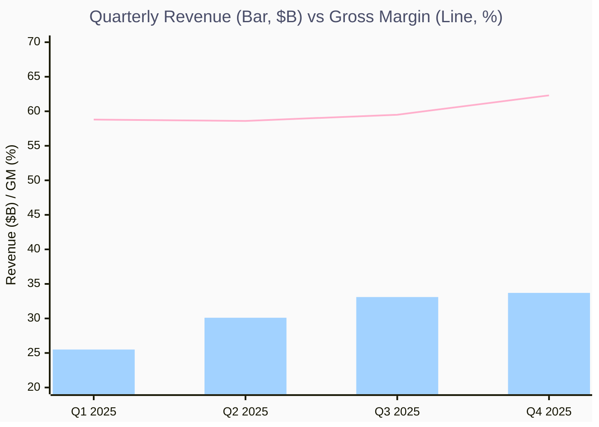
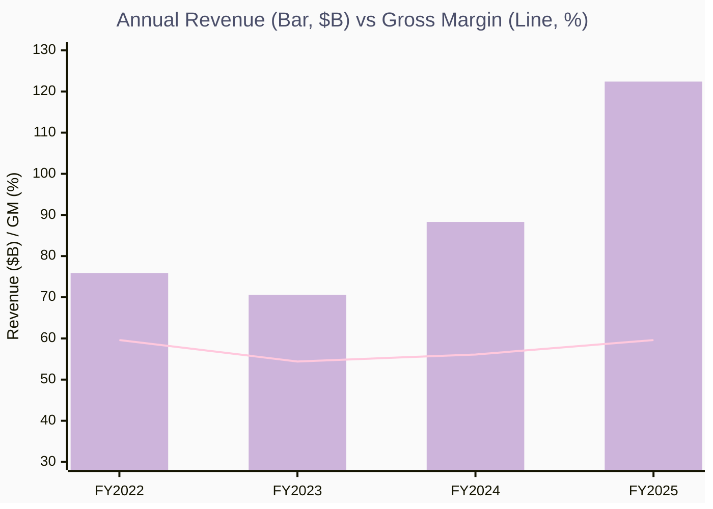
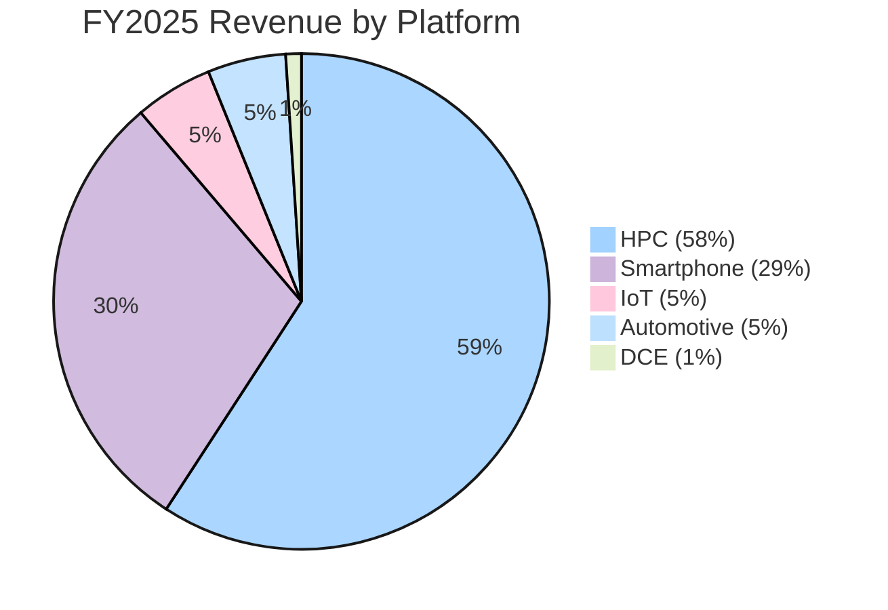
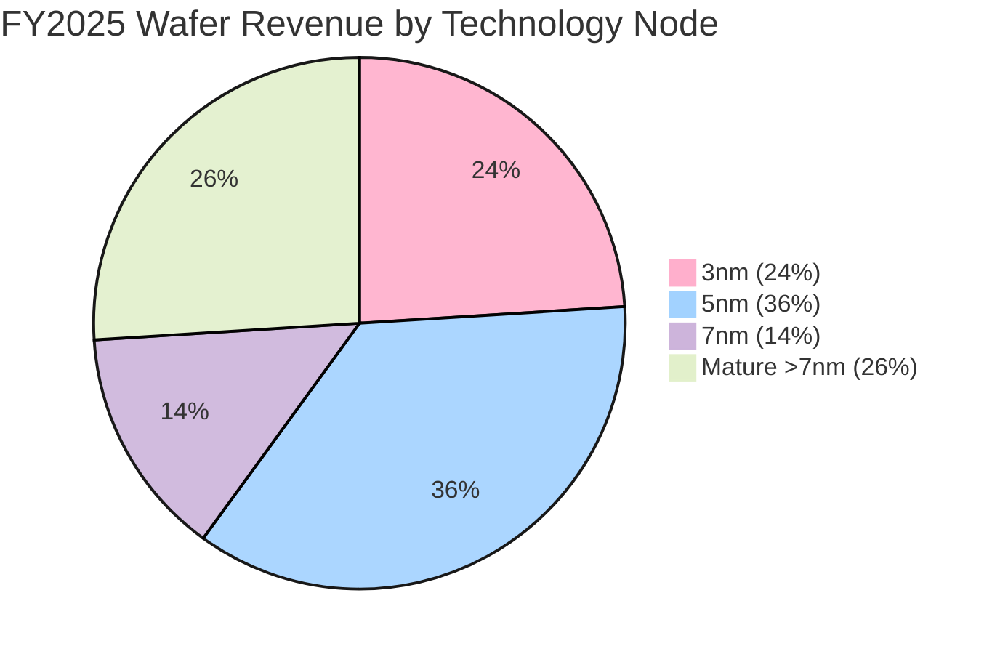
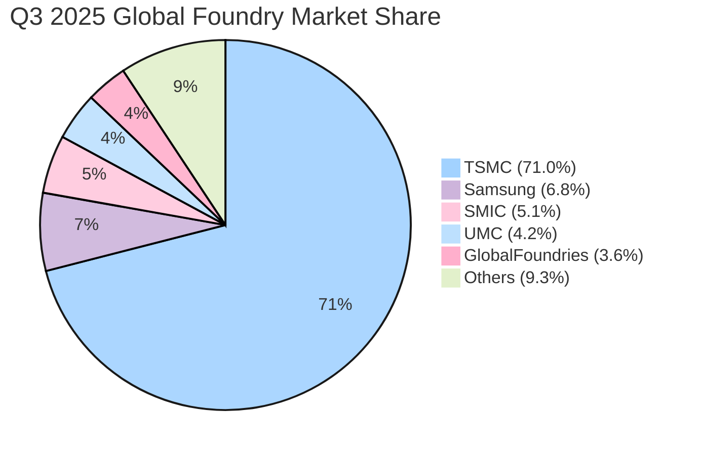
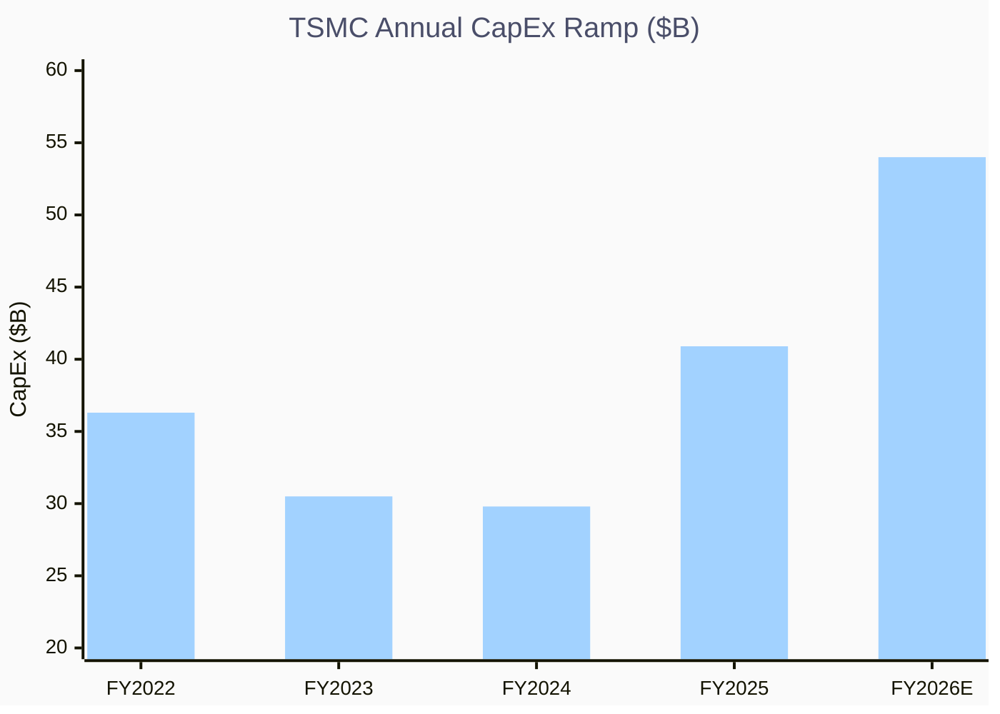
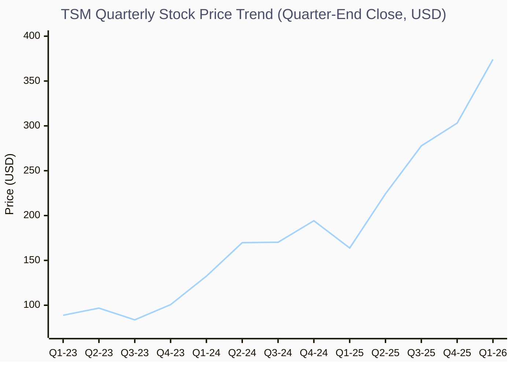

# TSM Q4 2025

> **报告日期**：2026 年 2 月 12 日 | **数据截止至**：2026 年 1 月 15 日（Q4 2025 财报）  
> **当前股价**：$374.09 | **市值**：$1.94T | **52 周区间**：$134.02 - $379.58

---

## 📋 执行摘要

台积电（TSMC）是全球最大的半导体专业代工厂，2025 年市场份额达到 **71%**（Q3 2025, TrendForce），遥遥领先第二名三星（6.8%）。公司在 AI 时代迎来了前所未有的结构性增长机遇：

- **FY2025 营收增长 35.9% YoY**（USD 计），HPC 平台贡献 58% 营收并增长 48% YoY
- **毛利率攀升至 62.3%**（Q4 2025），运营利润率 54%，均为历史新高区间
- **AI 相关收入 5 年 CAGR 指引中高 50%+**（2024-2029），CEO 魏哲家明确表示"TSMC 晶圆供应是瓶颈"
- **2026 资本开支 $52-56B**，大幅高于 2025 年的 $40.9B，70-80% 投向先进制程
- **N2（2nm）** 已于 Q4 2025 量产，良率良好，2026 年快速爬坡，A16 预计 2H 2026 量产

**投资论点核心**：TSMC 正处于 AI 基础设施超级周期的绝对中心位置。其技术领先、客户锁定、产能瓶颈形成了罕见的"定价权 + 增长 + 壁垒"三重优势。风险主要集中在地缘政治和估值溢价。

---

## 🏢 公司概览

### 基本信息

| 项目         | 详情                                                     |
| ---------- | ------------------------------------------------------ |
| **公司全称**   | Taiwan Semiconductor Manufacturing Company Limited     |
| **Ticker** | TSM (NYSE ADR) / 2330.TW                               |
| **成立年份**   | 1987                                                   |
| **总部**     | 台湾新竹                                                   |
| **CEO**    | 魏哲家 (C.C. Wei)，董事长兼 CEO                                |
| **CFO**    | 黄仁昭 (Wendell Huang)                                    |
| **员工数**    | ~76,000+                                               |
| **行业**     | Semiconductors（半导体代工 / Foundry）                        |
| **主要客户**   | Apple、NVIDIA、AMD、Qualcomm、Broadcom、MediaTek、Intel (部分) |

### 商业模式

TSMC 开创了 **Pure-Play Foundry Model**（纯晶圆代工模式）—— 不设计、不销售自有品牌的芯片，专注为全球 500+ 客户提供芯片制造服务。这一模式消除了与客户的竞争，构建了深度信任关系，是公司 30 余年持续增长的核心。

**核心价值链**：

1. **前端制造**（Front-End）：晶圆代工，从 N3/N5/N7 先进制程到成熟制程
2. **先进封装**（Advanced Packaging）：CoWoS、InFO、SoIC 等 3D/2.5D 封装技术
3. **技术研发**：持续推进制程微缩（N2、A16）和架构创新（Nanosheet、SPR）

---

## 📊 财务分析

### 过去 4 个季度关键业务数据

| 指标 | Q1 2025 | Q2 2025 | Q3 2025 | Q4 2025 |
|------|---------|---------|---------|---------|
| **营收 (USD)** | $25.5B | $30.1B | $33.1B | $33.7B |
| **营收增速 (QoQ)** | - | +17.8% | +10.1% | +1.9% |
| **营收增速 (YoY)** | +41.6% | +40.0% | +39.0% | +22% |
| **毛利率** | 58.8% | 58.6% | 59.5% | 62.3% |
| **运营利润率** | 48.5% | 49.6% | 50.6% | 54.0% |
| **EPS (TWD)** | 13.94 | 16.54 | 17.44 | 19.50 |
| **EPS (USD ADR)** | ~$2.18 | ~$2.55 | ~$2.82 | $3.14 |
| **HPC 营收占比** | ~53% | 60% | 57% | 55% |
| **Smartphone 占比** | ~27% | 27% | 30% | 32% |
| **先进制程占比 (≤7nm)** | ~73% | ~73% | 74% | 77% |
| **3nm 占比** | ~18% | ~22% | 23% | 28% |

**Key Insights:**

- 🏆 **营收稳步攀升**：Q1→Q4 季度营收从 $25.5B 增长至 $33.7B，全年增量 $8.2B (+32%)
- 📈 **毛利率跳升**：Q4 毛利率 62.3% 创近年新高，较 Q2 低点反弹 3.7ppts，受益于成本优化和汇率利好
- ⚠️ **3nm 定价权体现**：3nm 占比从 18% 攀升至 28%，先进节点 ASP 持续上行驱动毛利率改善

### 年度财务趋势（FY2022-2025）

| 指标 | FY2022 | FY2023 | FY2024 | FY2025 |
|------|--------|--------|--------|--------|
| **营收 (USD)** | $75.9B | $70.6B | $88.3B | ~$122.4B |
| **营收增速 (YoY)** | +42.6% | -7.0% | +25.1% | +35.9% |
| **毛利润** | $45.2B | $38.4B | $49.5B | ~$73B |
| **毛利率** | 59.6% | 54.4% | 56.1% | ~59.6% |
| **运营利润率** | 49.5% | 42.6% | 45.6% | ~50.7% |
| **研发投入** | ~$5.6B | ~$5.8B | ~$6.0B | ~$6.4B |
| **资本开支** | $36.3B | $30.5B | $29.8B | $40.9B |
| **ROE** | 39.8% | 26.4% | 30.3% | 35.4% |

**Key Insights:**

- 🏆 **V 型反转**：FY2023 行业下行期营收 -7%，FY2024-2025 连续两年强劲反弹（+25.1%、+35.9%），AI 需求驱动的上行周期确立
- 📈 **$122B 里程碑**：FY2025 营收突破 $120B 大关，4 年间近乎翻倍（FY2022: $75.9B）
- ⚠️ **利润率回归**：毛利率从 FY2023 低点 54.4% 回升至 59.6%，ROE 从 26.4% 恢复至 35.4%

### 营收平台结构（FY2025 全年）

| 平台 | FY2025 营收占比 | YoY 增速 | 趋势分析 |
|------|----------------|---------|----------|
| **HPC（高性能计算）** | 58% | +48% | 🔥 AI/数据中心芯片需求爆发式增长，核心增长引擎 |
| **Smartphone** | 29% | +11% | 📱 Apple A 系列/M 系列 + 安卓旗舰 SoC 稳健增长 |
| **IoT** | 5% | +15% | 📡 边缘 AI 和智能设备需求回暖 |
| **Automotive** | 5% | +34% | 🚗 汽车芯片自主化 + ADAS 需求，增速亮眼 |
| **DCE** | 1% | 持平 | 📉 数字消费电子持续疲软 |

**Key Insights:**

- 🏆 **HPC 绝对主导**：高性能计算占比 58%，YoY +48%，AI 加速器/数据中心芯片是核心引擎
- 📈 **汽车芯片高速增长**：Automotive +34% YoY，ADAS 和车载 AI 推理需求加速渗透
- ⚠️ **结构转型完成**：TSMC 已从周期型半导体公司转变为 AI 驱动的结构性增长平台

### 技术节点结构（FY2025 全年）

| 制程节点 | FY2025 营收占比 | 对比 FY2024 | 趋势 |
|---------|----------------|------------|------|
| **3nm (N3)** | 24% | 18% → 24% | ⬆️ 快速爬坡，Apple/NVIDIA/AMD 采用 |
| **5nm (N5)** | 36% | 37% → 36% | ➡️ 成熟稳定，仍是最大营收来源 |
| **7nm (N7)** | 14% | 14% → 14% | ➡️ 稳定，成熟应用支撑 |
| **先进制程合计 (≤7nm)** | 74% | 69% → 74% | ⬆️ 先进制程占比持续攀升 |
| **成熟制程 (>7nm)** | 26% | 31% → 26% | ⬇️ 占比收缩但绝对值仍增长 |

**Key Insights:**

- 🏆 **5nm 仍是营收支柱**：N5 贡献 36% 营收，得益于 Apple A/M 系列和 AMD 产品的大量采用
- 📈 **3nm 快速爬坡**：从 FY2024 的 18% 跃升至 24%，是增长最快的节点
- ⚠️ **先进制程占比 74%**：≤7nm 合计贡献近四分之三营收，较 FY2024 的 69% 提升 5ppts

### 资产负债表与现金流

| 指标 | Q4 2025 / FY2025 |
|------|------------------|
| **现金及有价证券** | TWD 3.1T (~$98B) |
| **总资产** | ~$190B |
| **经营性现金流** | ~$55B (est.) |
| **资本开支** | $40.9B |
| **自由现金流** | ~$14B |
| **现金股利** | 持续稳定增长，每季派息 |

> **💡 Key Insight**：尽管 $40.9B 的资本开支创历史新高，TSMC 仍保持正自由现金流。$98B 的现金储备为 2026 年 $52-56B 的资本开支计划提供充裕资金。

---

## 🎙️ 财报电话会议精华

### Q4 2025 财报电话会议（2026.01.15）

| 主题 | CEO 魏哲家核心观点 |
|------|-------------------|
| **2026 展望** | 2025 年 AI 需求强劲，2026 年将进一步加速。全年收入指引中 30% 增长（USD） |
| **AI 需求** | "TSMC 晶圆供应是瓶颈（bottleneck），不是电力供应"。客户的客户（CSP）已提前 5-6 年规划电力 |
| **CapEx 逻辑** | $52-56B 投入对应 2028-2029 年产能，2026-2027 年靠提升生产效率弥补供需缺口 |
| **定价策略** | "Strategic, not opportunistic"—战略性定价而非机会主义。每个新节点价格上升是常态 |
| **Intel 竞争** | "我们不害怕。竞争对手需要 2-3 年开发技术 + 1-2 年量产爬坡，我们有 30 年竞争经验" |
| **Arizona 扩张** | 第一座工厂已量产（Q4 2024），良率接近台湾。第二座工厂已建成，2H 2027 量产（提前）。第三座已开工，第四座申请许可中。刚购置第二块大面积土地 |
| **N2 进展** | N2 于 Q4 2025 在新竹和高雄同时量产，良率良好。N2P（增强版）2H 2026 量产，A16（SPR）2H 2026 量产 |
| **长期利润率** | 长期毛利率指引 56%+（穿越周期），ROE 高 20%+ |
| **AI CAGR** | AI 相关营收 5 年 CAGR **中高 50%**（2024-2029），上调此前 mid-40s 指引 |

> **💡 Key Insight**：Q4 电话会是 TSMC 近年来最 bullish 的一次。AI CAGR 从 mid-40s 上调至 mid-to-high 50s，Arizona 提前量产，长期利润率指引首次给出 56%+ 的底线。CC Wei 直言"我们的困扰是供需缺口"——这是极度强势的需求信号。

### Q3 2025 财报电话会议（2025.10.16）

| 主题 | 核心观点 |
|------|---------|
| **前端后端都紧** | "AI 相关的前端和后端产能都非常紧张，我们正全力缩小差距" |
| **CoWoS 产能** | CoWoS 产能继续扩张但仍无法满足需求。CC Wei: "我们还在非常努力地工作" |
| **Moore's Law 2.0** | 客户说 Moore's Law 已死，CC Wei 解读为"不再只靠芯片技术，要整个系统性能"，TSMC 前后端封装全面配合 |
| **中国 AI 出口管控** | 已在全年展望中考虑出口管制影响。中国政府也在劝阻采购美国芯片 |
| **产能规划** | TSMC 现在不仅与客户沟通，还直接与客户的客户（CSP）交流，评估 AI 应用场景需求 |
| **Token 增长** | Token 消费量指数级增长（约每 3 个月翻倍），远超芯片产能增速 |

### Q2 2025 财报电话会议（2025.07.17）

| 主题 | 核心观点 |
|------|---------|
| **营收亮点** | 营收 $30.1B，环比 +17.8%，HPC 占比达全年最高的 60% |
| **N2 爬坡** | N2 前两年营收贡献将高于 N3 和 N5 同期，受智能手机和 HPC 双重推动 |
| **海外工厂** | 美国 = 先进制程，日本 = 特殊工艺（CMOS 传感器/汽车），德国 = 特殊工艺 |
| **毛利率压力** | GM 略降至 58.6%，受汇率不利和海外工厂稀释影响。海外稀释早期 2-3%，后期 3-4% |
| **GigaFab 灵活性** | TSMC 利用 GigaFab 集群在节点间灵活调配产能，如将 N5 转化为 N3 |

### Q1 2025 财报电话会议（2025.04.17）

| 主题 | 核心观点 |
|------|---------|
| **关税担忧** | CC Wei: "我们只求公平对待（fair treatment）"，TSMC 未直接参与美台政府谈判 |
| **CoWoS 改善** | CoWoS 供需差距已略有改善，但仍紧张 |
| **Arizona 加速** | 第二座工厂加速推进，第三座工厂建设加快 |
| **H20 出口禁令** | 已在全年展望中考虑对中国的 H20 禁令影响 |
| **全年指引** | 维持 2025 资本开支 $38-42B，全年营收增长 mid-30s%（USD） |

---

## 🔍 深度分析与洞察

### 护城河评估

| 护城河类型 | 强度 | 证据 |
|------------|------|------|
| **技术壁垒** | 🔴 极强 | N2/A16 量产领先竞争对手 2-3 年。3nm 良率和性能远超三星。CoWoS 先进封装独步全球 |
| **转换成本** | 🔴 极强 | 客户设计一款先进芯片需 2-3 年，量产爬坡再需 1-2 年。从 TSMC 切换至竞争对手意味着 3-5 年的时间成本 |
| **规模经济** | 🔴 极强 | 71% 的市场份额带来无与伦比的规模效应。更多客户 → 更多 R&D 分摊 → 更好的良率 → 更多客户的正循环 |
| **网络效应** | 🟡 中强 | EDA 工具链、IP 库和设计生态高度围绕 TSMC PDK 优化，形成间接网络效应 |
| **品牌价值** | 🟢 强 | "Trusted Technology and Capacity Provider"品牌深入人心，客户将 TSMC 视为战略合作伙伴而非供应商 |

**综合护城河评级**：🏰 **极宽（Very Wide Moat）**  
TSMC 拥有半导体行业最宽的护城河。技术领先 + 转换成本 + 规模经济构成了几乎不可逾越的竞争壁垒。在先进制程（≤5nm）领域，TSMC 是事实上的垄断者。

### 竞争格局与行业分析

#### 全球晶圆代工市场份额（2025 年）

| 排名 | 公司 | Q1 2025 | Q2 2025 | Q3 2025 | 核心制程 | 核心优势 |
|------|------|---------|---------|---------|---------|---------|
| 1 | **TSMC** | 67.6% | 70.2% | **71.0%** | N2/N3/N5/N7 | 先进制程绝对领先，良率最优 |
| 2 | Samsung | 7.7% | 7.3% | 6.8% | 3nm GAA | IDM 模式，存储器协同 |
| 3 | SMIC | 6.0% | 5.1% | 5.1% | 28nm/14nm | 中国政策扶持，成熟制程价格优势 |
| 4 | UMC | 4.7% | 4.4% | 4.2% | 28nm/22nm | 成熟制程利基市场稳健 |
| 5 | GlobalFoundries | 4.2% | 3.9% | 3.6% | 14nm/22nm | 专注差异化工艺（RF-SOI、FD-SOI） |

> **来源**：TrendForce (2025 Q1-Q3)

**行业集中度**：

- **CR1**：71%（TSMC）—— 极度集中
- **CR3**：82.9%（TSMC + Samsung + SMIC）
- **CR5**：89.7%
- **趋势**：集中度持续上升，TSMC 份额从 Q1 67.6% 攀升至 Q3 71%，竞争对手整体份额下滑

**Key Insights:**

- 🏆 **绝对垄断**：TSMC 以 71% 份额独占市场，是第二名三星的 10.4 倍
- 📈 **集中度上升**：TSMC 份额从 Q1 67.6% → Q3 71.0%，一年内增长 3.4ppts
- ⚠️ **追赶者失速**：Samsung 从 7.7% 降至 6.8%，先进制程良率劣势导致客户持续流失

#### 竞争对手分析

##### Samsung Foundry

- **市场份额**：6.8%（Q3 2025），逐季下滑
- **技术现状**：3nm GAA 制程已量产，但良率远低于 TSMC。高通、NVIDIA 等关键客户已逐步将高端芯片转至 TSMC
- **结构性劣势**：IDM 模式导致与客户存在潜在竞争关系（Exynos 与高通竞争），降低客户信任
- **2nm 进展**：计划 2025-2026 推出，但市场普遍对其量产良率持观望态度

##### Intel Foundry Services (IFS)

- **外部代工收入**：极小（$0.9B FY2024）
- **技术路线**：Intel 18A（≈2nm）计划 2025 量产，获美国政府 CHIPS Act 大量补贴
- **CC Wei 回应**："不怕竞争。技术复杂度意味着竞争对手需要 2-3 年开发 + 1-2 年量产。" Intel 短期内无法对 TSMC 构成实质威胁
- **政治因素**：美国总统对 Intel 进展表示满意，提及 NVIDIA 和 Apple 可能与 Intel Foundry 合作，但 CC Wei 认为这不会改变竞争格局

##### GlobalFoundries (GFS)

- **市场份额**：3.6%（Q3 2025），聚焦成熟和差异化制程
- **战略定位**：2018 年放弃先进制程竞赛，专注 RF-SOI、FD-SOI 等特殊工艺
- **与 TSMC 关系**：不在先进制程领域直接竞争，互补性较强

#### 竞争格局综合评估

| 维度 | TSMC vs 行业 | 分析要点 |
|------|-------------|---------|
| **收入规模** | 🥇 绝对领先 | 营收是第二名三星代工的 10 倍以上 |
| **增长速度** | 🥇 大幅领先 | FY2025 增长 35.9%，远超行业平均 |
| **盈利能力** | 🥇 显著领先 | 毛利率 60%+ 在 Foundry 行业无人可及 |
| **技术水平** | 🥇 代际领先 | N2/A16 量产领先三星和 Intel 2-3 年 |
| **客户质量** | 🥇 顶级 | Apple、NVIDIA、AMD、Qualcomm 等全球最优质客户 |
| **估值水平** | 溢价 | P/E 35.6x，反映 AI 超级周期的增速溢价 |

### 增长驱动力分析

**当前核心增长引擎**：

1. **AI 基础设施超级周期** 🔥🔥🔥
   - AI 加速器（NVIDIA、AMD、Broadcom 自研 ASIC）对先进制程和 CoWoS 的需求指数级增长
   - Token 消费量每 ~3 个月翻倍（CC Wei 引述），对算力需求的增速远超产能扩张速度
   - 数据中心 CapEx 从 $600B 增长至 $3-4T（Jensen Huang 5 年预测），TSMC 作为唯一能大规模供应先进制程的厂商直接受益
   - AI CAGR 指引从 mid-40s% 上调至 **mid-to-high 50s%**（2024-2029）

2. **先进制程定价权持续提升** 🔥🔥
   - 每个新节点（N3→N2→A16）单位晶圆价格上升
   - 混合 ASP 已连续两年增长约 20%
   - "Earning our value" 战略：定价提升覆盖了工具、设备、材料和人工成本的通胀

3. **先进封装（CoWoS / InFO / SoIC）** 🔥🔥
   - CoWoS 从单一产品发展为系列（CoWoS-S、CoWoS-L、CoWoS-R）
   - 成为 AI 芯片不可或缺的工艺环节，TSMC 在此领域具有近乎垄断地位
   - 产能持续翻倍扩张但仍供不应求

**潜在增长机会**：

1. **Automotive 半导体渗透加速**（FY2025 +34% YoY）
   - ADAS/自动驾驶、电动汽车功率 IC、车载 AI 推理芯片
2. **Edge AI / On-device AI**
   - 智能手机、PC、IoT 设备端侧推理需求推动 N3/N5 用量
3. **全球制造布局创造新客户机会**
   - Arizona、熊本、德累斯顿的布局有助于吸引对供应链韧性有要求的客户

**增长可持续性评估**：🔴 **高** —— AI 基础设施建设处于早期阶段（CC Wei: "We are just in the early stage of AI application"），数据中心投资周期预计持续至 2029-2030 年以上。TSMC 作为唯一能满足先进制程需求的代工厂，结构性增长确定性极高。

---

## 📈 估值分析

### 当前估值指标

| 指标 | 当前值 | 评估 |
|------|--------|------|
| **P/E (TTM)** | 35.6x | 高于历史均值，但增速支撑 |
| **Forward P/E** | 23.3x | 考虑 2026 年增长后估值合理 |
| **P/S (TTM)** | ~15.9x | 反映 60%+ 毛利率的高品质营收 |
| **PEG Ratio** | ~1.0x | 基于 ~36% 增速，PEG≈1 属合理区间 |
| **Dividend Yield** | 0.90% | 低但稳定增长 |
| **EV/EBITDA** | ~22.8x | 处于行业偏高位置 |
| **Beta** | 1.30 | 波动性略高于市场 |

### 估值合理性评估

**当前估值水平**：⚖️ **轻微溢价但合理**

- **支撑溢价的因素**：AI 超级周期下 35%+ 营收增速、60%+ 毛利率、71% 市场份额垄断地位、AI CAGR 50%+ 的长期指引
- **估值风险点**：地缘政治风险折价（台海紧张）、CapEx 大幅增加可能压制短期 FCF、海外工厂拖累利润率
- **Forward P/E 23.3x** 在考虑 2026 年 30%+ 增速后，PEG 接近 1.0，估值并不过高

---

## 💰 股东回报分析

### 资本配置策略

**管理层资本配置优先级**（CFO 黄仁昭 Q4 2025 电话会明确阐述）：

1. **技术研发投入**：过去 5 年 R&D 累计 $30B，确保制程领先
2. **产能资本开支**：过去 5 年 CapEx 累计 $167B，2026 年 $52-56B 创历史新高
3. **稳定增长的现金分红**：承诺每季度和每年持续稳定增加每股股息
4. **全球布局投资**：Arizona、熊本、德累斯顿等海外 fab 建设

### 股息历史

| 年份 | 每股股息 (USD ADR) | 趋势 |
|------|-------------------|------|
| 2023 | ~$1.84 | ⬆️ |
| 2024 | ~$2.62 | ⬆️ |
| 2025 | ~$3.34 (est.) | ⬆️ |

- **股息率**：0.90%（以当前价计算）
- **特点**：低收益率但高增速的"成长型分红"

---

## ⚠️ 风险因素

### 风险 1：地缘政治与台海紧张 🔴 高风险

- 台海局势是 TSMC 的最大系统性风险。虽然 Arizona、熊本、德累斯顿的全球布局正在降低集中度，但台湾仍贡献 80%+ 的产能
- 美中科技竞争持续升级，出口管制政策的不确定性影响客户计划
- **缓释因素**：TSMC 已加速全球布局，Arizona 的 giga-fab 集群规划可在未来提供 30% 的 N2+ 产能

### 风险 2：AI CapEx 周期性风险 🟡 中等风险

- 若 AI ROI 证伪或 CSP（云服务商）削减资本开支，TSMC 可能面临产能过剩
- **缓释因素**：CC Wei 指出 token 消费量指数级增长，且 CSP 已提前 5-6 年规划电力基础设施，短期内削减概率低
- TSMC 500+ 客户的多元化基础也降低了对单一终端市场的依赖

### 风险 3：海外工厂利润率稀释 🟡 中等风险

- **早期阶段**：毛利率稀释 2-3%
- **后期阶段**：毛利率稀释 3-4%
- **N2 爬坡影响**：2026 全年 N2 爬坡将稀释毛利率 2-3 个百分点
- **缓释因素**：TSMC 通过生产效率提升、跨节点产能优化、定价策略等方式对冲，FY2025 实际海外稀释仅 1-2%（低于此前 2-3% 指引）

### 风险 4：资本开支激增与 FCF 压力 🟡 中等风险

- 2026 年 $52-56B 的 CapEx 占比极高，对自由现金流构成压力
- **缓释因素**：$98B 的现金储备充裕，且更高 CapEx 对应 2028-2029 年的更大营收规模

**Key Insights:**

- 🏆 **投资加速**：FY2026E CapEx $52-56B（取中值 $54B），较 FY2024 几乎翻倍
- 📈 **产能对应 2028-2029**：CC Wei 明确表示新建晶圆厂需 2-3 年，当前投资锁定未来 3 年增长
- ⚠️ **FCF 承压**：短期自由现金流受压，但 $98B 现金储备提供充足缓冲

### 风险 5：客户集中度 🟠 低中风险

- Apple（占营收约 25%+）和 NVIDIA（占比快速提升）为最大客户
- **缓释因素**：500+ 客户基础，HPC 客户群体正在扩展（Google TPU、Amazon Trainium、Microsoft Maia 等 ASIC 项目均由 TSMC 代工）

---

## 📈 股价走势综合分析

### 过去 3 年股价走势

> **数据来源**：Yahoo Finance | **区间**：2023 Q1 – 2026 Q1 | **季末收盘价 (USD ADR)**

**Key Insights:**

- 🏆 **3 年涨幅 321%**：从 Q1-23 的 $88.8 攀升至 Q1-26 的 $374.1，年化回报率 ~62%
- 📈 **两大加速拐点**：① Q1-24→Q2-24（$132→$170，+28%，AI 叙事形成共识）② Q2-25→Q3-25（$224→$278，+24%，Q3 财报超预期）
- ⚠️ **回撤可控**：最大回撤 Q4-24→Q1-25（$194→$164，-16%），受关税担忧和获利了结影响，随后 V 型修复

### 近期表现

| 时间区间 | 涨跌幅 | 驱动因素 |
|---------|--------|---------|
| **1 个月** | +12.4% | Q4 财报大幅超预期，AI CAGR 上调 |
| **3 个月** | +16.8% | 先进制程需求持续验证，N2 量产 |
| **6 个月** | +29.5% | AI 超级周期叙事强化 |
| **1 年** | +67.2% | 从 $223 区间启动的 AI 主题行情 |

### 分析师评级

| 评级 | 数量 |
|------|------|
| **Strong Buy** | 6 |
| **Buy** | 11 |
| **Hold** | 1 |
| **Sell** | 0 |

**近期目标价调整**：

- **Barclays**: 上调至 **$450**（Overweight）
- **TD Cowen**: 上调至 **$370**（Buy）→ 已超越
- **JPMorgan / Morgan Stanley / Goldman Sachs / Citibank / UBS**：均在 Q4/Q3 财报后维持看涨立场

### 主要机构持仓

| 机构 | 持股比例 |
|------|---------|
| **FMR, LLC (Fidelity)** | 1.41% |
| **JPMORGAN CHASE & CO** | 0.94% |
| **BlackRock Inc.** | 显著持仓 |
| **Van Eck Associates** | 显著持仓 |

> **注**：TSM 作为 ADR，机构持仓比例相对分散，但全球顶级机构广泛配置。

---

## 🎯 投资结论

### Bull Case 🐂（乐观情景）

1. **AI 超级周期持续 5-10 年**：数据中心 CapEx 从 $600B 增至 $3-4T，TSMC 作为唯一先进制程供应商享受全部增量
2. **定价权持续提升**：N2/A16 单价显著高于 N3，混合 ASP 年增 15-20%
3. **毛利率上行**：生产效率提升 + 高利用率 + 定价覆盖成本通胀，长期 GM 维持 58-62%
4. **目标价**：$450-500（Forward P/E 25-30x × 2026E EPS ~$16-18）

### Bear Case 🐻（悲观情景）

1. **AI ROI 证伪引发 CapEx 削减**：CSP 大幅缩减 AI 投资，TSMC 面临产能利用率下降
2. **地缘政治黑天鹅**：台海严重紧张导致供应链恐慌
3. **Intel Foundry 崛起**：Intel 18A 意外成功 + 美国政策倾斜，分流部分客户
4. **下行目标**：$250-280（回归 P/E 20-22x × 保守 EPS ~$13）

### 综合投资评级

> **⭐⭐⭐⭐⭐ Strong Buy（强烈买入）**

**核心理由**：

TSMC 是当今全球最具战略价值的科技公司之一。在 AI 基础设施超级周期中，它不是"受益者之一"——它是 **唯一且不可替代的存在**。71% 的市场份额、2-3 年的技术代差、与全球顶级科技公司的深度绑定，使其护城河在半导体行业乃至整个科技领域中都属于顶级。

尽管 P/E 35.6x 看似不低，但 Forward P/E 23.3x（基于 2026 增长）和 PEG ≈1.0 表明当前估值合理。AI CAGR 50%+ 的五年增长指引、管理层极度自信的资本配置，以及"供需缺口正在扩大而非收窄"的行业现实，均支撑更高的估值。

**关键关注点**：地缘政治风险是无法忽视的 tail risk，投资者需对此有清醒认识，可通过仓位管理和对冲策略管理风险。

---

## 📚 参考来源

| 来源 | 内容 | 链接 |
|------|------|------|
| TSMC IR | Q4 2025 Earnings Call Transcript | [investor.tsmc.com](https://investor.tsmc.com/english/quarterly-results/2025/q4) |
| TSMC IR | Q3 2025 Earnings Call Transcript | [investor.tsmc.com](https://investor.tsmc.com/english/quarterly-results/2025/q3) |
| TSMC IR | Q2 2025 Earnings Call Transcript | [investor.tsmc.com](https://investor.tsmc.com/english/quarterly-results/2025/q2) |
| TSMC IR | Q1 2025 Earnings Call Transcript | [investor.tsmc.com](https://investor.tsmc.com/english/quarterly-results/2025/q1) |
| TrendForce | Foundry Market Share Rankings Q1-Q3 2025 | [marklapedus.substack.com](https://marklapedus.substack.com/p/tsmc-gains-foundry-share-but-others) |
| SEC EDGAR | TSMC 20-F Annual Filing | [SEC EDGAR](https://www.sec.gov/cgi-bin/browse-edgar?action=getcompany&CIK=0001046179) |
| Yahoo Finance | TSM Stock Data, Analyst Ratings | [Yahoo Finance](https://finance.yahoo.com/quote/TSM/) |
| Insider Monkey | Q4 2025 Full Transcript | [insidermonkey.com](https://www.insidermonkey.com/blog/taiwan-semiconductor-manufacturing-company-limited-nysetsm-q4-2025-earnings-call-transcript-1675955/) |
| The Motley Fool | Q3 2025 Full Transcript | [fool.com](https://www.fool.com/earnings/call-transcripts/2025/10/17/tsmc-tsm-q3-2025-earnings-call-transcript/) |

---

> *本报告基于公开信息编制，仅供投研参考，不构成投资建议。投资者应结合个人风险偏好和投资目标做出独立判断。*
