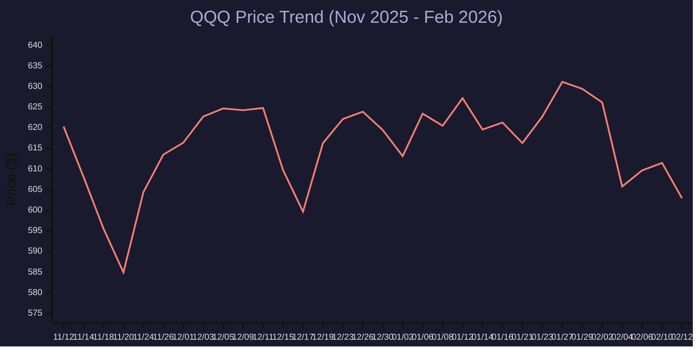

# QQQ 股价走势与驱动因素分析 (2025Q4 - 2026Q1)

## 1. Executive Summary (执行摘要)

过去三个月（2025.11 - 2026.02），**Invesco QQQ Trust (QQQ)** 经历了明显的波动。在 1 月下旬创下约 $635 的历史新高后，由于对“AI 资本开支回报率（ROI）”的担忧重燃以及对美联储降息预期的重新调整，该指数在 2 月初面临大幅回调。

目前交易价格在 **$603** 左右，QQQ 正在测试关键支撑位。“七巨头（Magnificent 7）”之间的分化加剧，投资者变得越来越挑剔，这与 2024-2025 年的广泛反弹形成了鲜明对比。

---

## 2. Price Trend Analysis (股价走势分析)

下图展示了 QQQ 从 2025 年 11 月中旬到 2026 年 2 月中旬的价格走势。

> [!TIP]
> **Key Technical Levels (关键技术位)**:
>
> * **Resistance (阻力位)**: **$630 - $635**。2026 年 1 月下旬曾测试该位置，但未能有效突破。
> * **Support (支撑位)**: **~$600**。这是一个关键的心理和技术底部。该指数在 12 月中旬曾在此止跌反弹，目前（2026 年 2 月）正再次测试该位置。
> * **Trend (趋势)**: 中性/盘整。在 $600 至 $630 之间区间震荡。

---

## 3. Key Driving Factors (主要驱动因素)

### 3.1. The AI Capex & ROI Debate (AI 资本开支与回报焦虑)

2026 年 1 月下旬，**微软 (Microsoft)** 和 **Meta** 的财报指引强调了针对 AI 基础设施的大规模资本开支（Capex）增长。

*   **影响 (Impact)**：虽然这证实了对 AI 的长期需求强劲（利好 NVDA/硬件），但市场对利润率和自由现金流的短期影响反应消极。
*   **结果 (Result)**：避险情绪引发了从 1 月 28 日高点（$633）到 2 月低点的大幅抛售。市场要求看到这些巨额投资转化为收入变现的更明确证据。

### 3.2. Monetary Policy & Fed Outlook (货币政策预期)

*   **FOMC 1 月 28 日会议**：美联储维持利率不变，这在很大程度上符合预期（“无风波”）。然而，关于 2026 年降息的基调变得更加谨慎。
*   **经济 (Economy)**：近期报告中指出的“劳动力数据疲软”表明经济正在降温，但并未崩溃。这使得“软着陆”的叙事得以延续，但依然脆弱。
*   **收益率 (Yields)**：近期收益率曲线（10年期 vs 2年期）的陡峭化反映了市场对“利率更高更久”或“降息放缓”机制的调整，给纳斯达克 100 指数中的高估值成长股带来了压力。

### 3.3. Magnificent 7 Dispersion (巨头分化)

“七巨头”之间的相关性在 2025 年第四季度/2026 年第一季度已经破裂。

*   **谷歌 (GOOGL)**：在 2025 年末表现出色，受 Gemini 更新和搜索业务韧性的推动。
*   **特斯拉 (TSLA)** & **苹果 (AAPL)**：表现出更大的波动性。
*   **英伟达 (NVDA)**：仍然是关键枢纽。市场正屏息以待其即将发布的 Q4 财报（预计 2 月下旬），这将为整个半导体板块确立方向。

---

## 4. Conclusion & Outlook (结论与展望)

QQQ 目前正处于**关键关口**（测试 $600 支撑位）。

*   **看涨情形 (Bull Case)**：如果 NVDA 财报超出预期并提供强劲指引，且通胀数据允许美联储在第二季度发出降息信号，QQQ 可能会反弹并测试 $635 高点。
*   **看跌情形 (Bear Case)**：如果“AI ROI”担忧加剧，或宏观数据显示经济放缓加剧（衰退担忧取代软着陆），跌破 $600 可能打开通往 $580 的大门。

**策略 (Strategy)**：密切关注 **$600 支撑位**。目前趋势为盘整，等待下一个主要催化剂（可能是 NVDA 财报或下一次 CPI 数据）。
