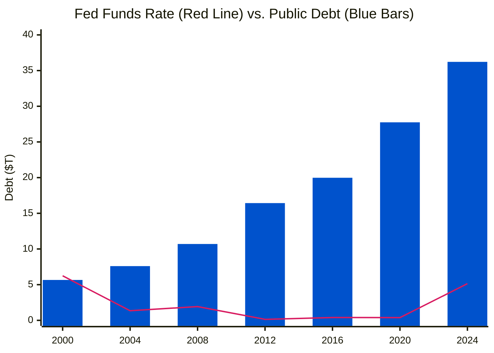
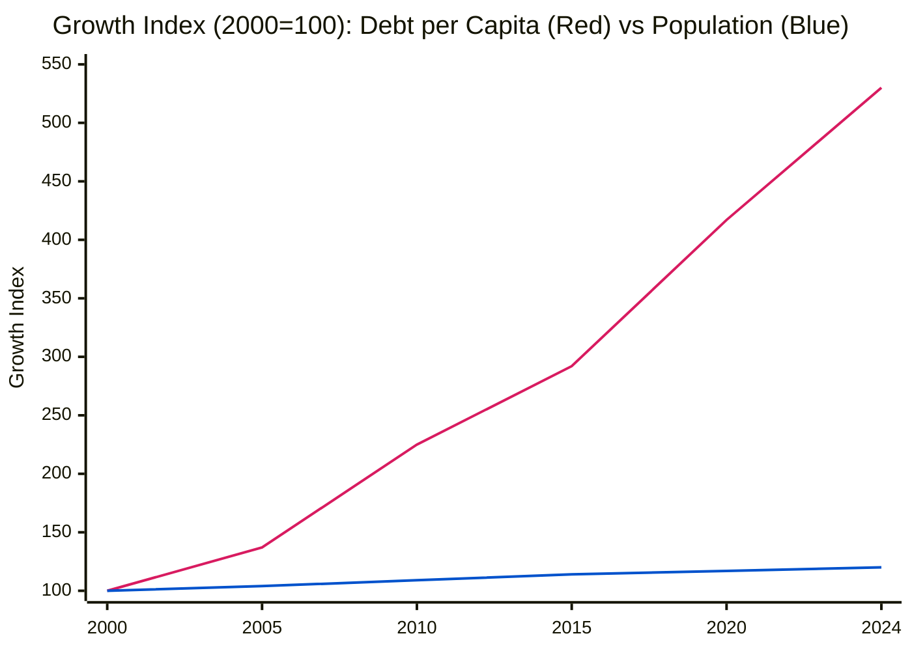
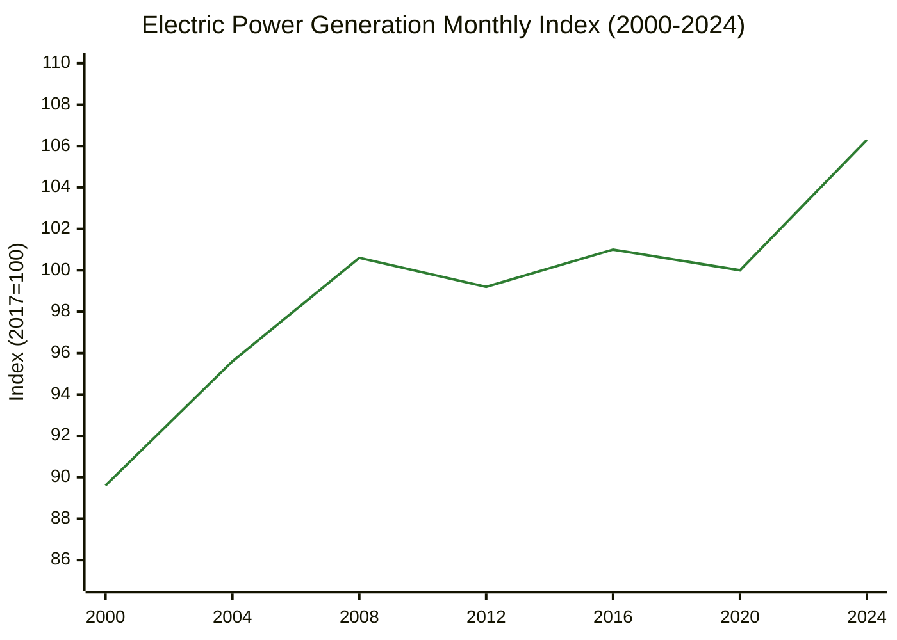

# US Macro Trends Deep Dive (2000-2024)

## Executive Summary

This report analyzes 25 years of US macroeconomic data, revealing a critical divergence between **fiscal health** and **economic activity**.

* **The Debt Spiral**: Total Public Debt has exploded **6.4x** from $5.6T (2000) to **$36.2T (2024)**. Debt per Capita now exceeds **$106,000**, posing a systemic risk as interest rates normalize.
* **Interest Rate Regime Change**: After a decade of ZIRP (Zero Interest Rate Policy), the Fed Funds Rate has structurally reset to **>5%**. The US is now servicing a record debt load at the highest rates in 15 years.
* **The Energy Renaissance**: Assessment of power generation reveals a **"Lost Decade" (2005-2020)** where efficiency canceled out growth. However, **since 2021**, a new secular bull market in energy demand has emerged, driven by AI data centers, industrial onshoring, and EVs.

## 1. Annual Data Summary (2000-2024)

| Year | Fed Funds Rate (%) | Population (Millions) | Total Public Debt ($ Trillions) | Debt per Capita ($) | Power Gen Index (2017=100) |
| :--- | :--- | :--- | :--- | :--- | :--- |
| **2000** | 6.24% | 282.4 | $5.66 | $20,050 | 89.6 |
| **2001** | 3.89% | 285.2 | $5.94 | $20,837 | 89.4 |
| **2002** | 1.67% | 288.0 | $6.41 | $22,245 | 92.0 |
| **2003** | 1.13% | 290.6 | $7.00 | $24,079 | 93.7 |
| **2004** | 1.35% | 293.3 | $7.60 | $25,902 | 95.6 |
| **2005** | 3.21% | 296.0 | $8.17 | $27,603 | 98.3 |
| **2006** | 4.96% | 298.8 | $8.68 | $29,048 | 98.7 |
| **2007** | 5.02% | 301.7 | $9.23 | $30,591 | 101.3 |
| **2008** | 1.93% | 304.5 | $10.70 | $35,134 | 100.6 |
| **2009** | 0.16% | 307.2 | $12.31 | $40,071 | 97.6 |
| **2010** | 0.18% | 309.8 | $14.03 | $45,266 | 101.5 |
| **2011** | 0.10% | 312.3 | $15.22 | $48,745 | 101.0 |
| **2012** | 0.14% | 314.7 | $16.43 | $52,213 | 99.2 |
| **2013** | 0.11% | 317.1 | $17.16 | $54,103 | 100.2 |
| **2014** | 0.09% | 319.6 | $18.14 | $56,763 | 101.2 |
| **2015** | 0.13% | 322.1 | $18.92 | $58,744 | 101.0 |
| **2016** | 0.40% | 324.6 | $19.98 | $61,541 | 101.0 |
| **2017** | 1.00% | 326.9 | $20.49 | $62,696 | 100.0 |
| **2018** | 1.83% | 328.8 | $21.97 | $66,832 | 103.7 |
| **2019** | 2.16% | 330.5 | $23.20 | $70,198 | 102.5 |
| **2020** | 0.38% | 331.8 | $27.75 | $83,618 | 100.0 |
| **2021** | 0.08% | 332.5 | $29.62 | $89,073 | 102.1 |
| **2022** | 1.68% | 334.4 | $31.42 | $93,966 | 104.8 |
| **2023** | 5.02% | 337.1 | $34.00 | $100,852 | 103.7 |
| **2024** | 5.14% | 340.2 | $36.22 | $106,459 | 106.3 |
| *2025* | *4.21%* | *--* | *--* | *--* | *--* |

*Data Sources: FRED (Series: FEDFUNDS, POPTHM, GFDEBTN, IPG2211S).*

## 2. Visual Analysis

### A. Interest Rates vs. National Debt (Fiscal Squeeze)

> [!NOTE] Key Insight
> **The Fiscal Vise:** In 2008, rates fell as debt rose (easy money). Today, **both** rates and debt are high. This implies interest payments will consume an unprecedented share of the federal budget.

*(High Contrast: **Red Line** = Interest Rate, **Blue Bars** = Total Debt)*

### B. The Divergence: Population vs. Debt per Capita

> [!WARNING] Structural Imbalance
> While the population grows linearly (~20% total), the debt burden per citizen grows exponentially (~430% total). Each American is now responsible for 5x more debt than in 2000.

*(**Red / Top Line**: Debt per Capita Growth | **Blue / Bottom Line**: Population Growth)*

### C. Power Generation: The AI Breakout

> [!TIP] Investment Signal
> The flatline in power generation (2005-2020) is over. The recent uptick to **106.3** signals a new regime of energy intensity, likely correlated with the proliferation of Data Centers and AI compute.

*(**Green Line**: US Electricity Generation Index. Note the sharp recovery post-2020.)*

## 3. Era Context Analysis

* **2000-2008: The Leverage Cycle**
  * Post-9/11 wars and tax cuts initiated the debt climb. Rates were cut to 1% to save the economy, inflating the housing bubble.
* **2009-2016: The ZIRP Trap**
  * The "Silent Accumulation" phase. Debt doubled ($12T → $20T) while rates stayed near zero. The economy became addicted to cheap money.
* **2020-2024: The Great Inflation**
  * Pandemic stimulus unleashed wildly inflationary forces. The Fed was forced to hike rates (0% → 5.25%) into a massive debtor economy, creating a fragile equilibrium.
* **Forward Outlook (2025+)**
  * With power demand hitting new highs (AI/EVs) and debt service costs crowding out discretionary spending, the macro environment favors **hard assets**, **energy infrastructure**, and **companies with strong free cash flow**.
