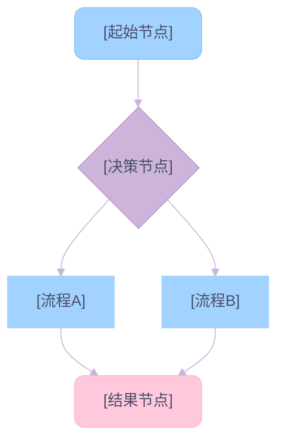
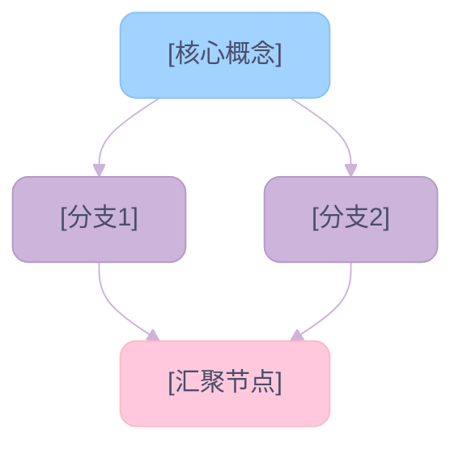
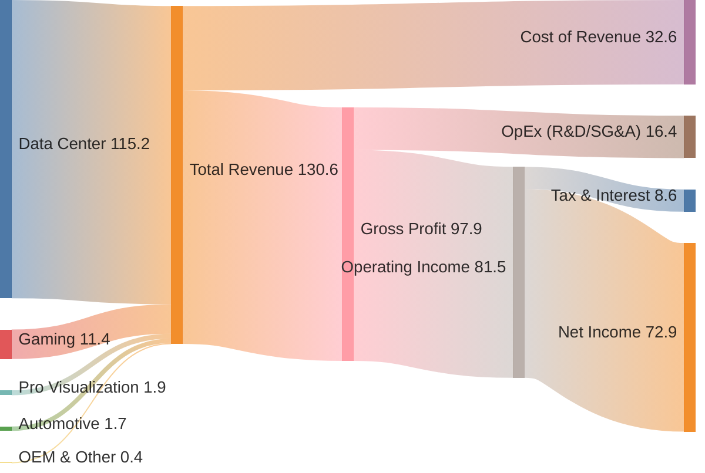

# Mermaid Chart（Mermaid 图表生成）

## 功能概述

基于 **Healing Dream（治愈梦幻风）** 设计系统生成高品质 Mermaid 图表。统一的柔和配色、圆角节点和透光质感，让图表既专业又赏心悦目。

## 使用时机

**使用此技能**：

- 📈 **时间序列数据**（≥3 个数据点）→ 折线图 / 柱状图
- 🥧 **结构占比**（2-8 个分段）→ 饼状图
- 🔀 **流程 / 决策 / 架构**（≤12 个节点）→ 流程图
- 🧩 **概念关系 / 逻辑结构** → 概念图
- 🔄 **多维对比**（2-4 个指标）→ 多线折线图
- 🌊 **资金/能源流向**（如财报营收、成本项到净利润的过程拆解）→ 桑基图

**不要使用**：

- 单一数值 → 直接文字回答
- 复杂多维（>5 维度）→ Markdown 表格更合适
- 数据点 <3 → 文字说明即可

---

## 设计系统：Healing Dream

### 调色板

```
主色系：
  '#A2D2FF'  清透青 — 主流程 / 核心
  '#CDB4DB'  淡奶紫 — 决策节点 / 连线
  '#FFC8DD'  蜜桃粉 — 结果 / 终点
  '#BDE0FE'  冰雪蓝 — 辅助流程
  '#FFAFCC'  樱花粉 — 增长 / 强调
  '#E2F0CB'  薄荷绿 — 次要 / 其他

文字与背景：
  '#4A4E69'  深薰衣草灰 — 文字色
  '#FAFAFA'  极浅灰 — 背景色
```

### 布局约束

- **目标宽度**：720px，优先纵向布局 `graph TD`
- **换行**：节点文本每 15-20 字符用 `<br/>` 换行
- **横向限制**：同层级横向节点 ≤5 个
- **圆角**：所有节点 `rx:10, ry:10`

### 标准 classDef（流程图 / 概念图通用）

```mermaid
classDef start fill:#A2D2FF,stroke:#89C2F8,stroke-width:1px,color:#4A4E69,rx:10,ry:10
classDef process fill:#CDB4DB,stroke:#B59BC5,stroke-width:1px,color:#4A4E69,rx:10,ry:10
classDef result fill:#FFC8DD,stroke:#FFB7C5,stroke-width:1px,color:#4A4E69,rx:10,ry:10
classDef decision fill:#E2F0CB,stroke:#D4E5B5,stroke-width:1px,color:#4A4E69,rx:10,ry:10
classDef accent fill:#FFAFCC,stroke:#FF9FBF,stroke-width:1px,color:#4A4E69,rx:10,ry:10
```

---

## 执行流程

### 第 1 步：识别图表类型

| 数据特征 | 推荐图表 | Mermaid 语法 |
|----------|----------|-------------|
| 时间序列趋势 | 折线图 | `xychart-beta` + `line` |
| 分类数值对比 | 柱状图 | `xychart-beta` + `bar` |
| 结构占比 | 饼状图 | `pie` |
| 流程/决策/架构 | 流程图 | `graph TD` 或 `graph LR` |
| 概念关系 | 概念图 | `graph TD` + classDef |
| 资金/能源流向 | 桑基图 | `sankey-beta` |

### 第 2 步：应用 Healing Dream 主题配置

**折线图 / 柱状图** — 使用 `xyChart` 主题变量：

```mermaid
%%{init: {
  'theme':'base',
  'themeVariables': {
    'xyChart': {
      'plotColorPalette': '#A2D2FF, #CDB4DB, #FFC8DD',
      'backgroundColor': '#FAFAFA',
      'titleColor': '#4A4E69'
    }
  }
}}%%
```

**饼状图** — 使用 `pie1`-`pie8` 主题变量：

```mermaid
%%{init: {
  'theme':'base',
  'themeVariables': {
    'pie1': '#A2D2FF', 'pie2': '#CDB4DB',
    'pie3': '#FFC8DD', 'pie4': '#BDE0FE',
    'pie5': '#FFAFCC', 'pie6': '#E2F0CB',
    'pie7': '#F8BBD0', 'pie8': '#DCEDC8',
    'pieStrokeWidth': '2px',
    'pieOuterStrokeColor': '#ffffff',
    'pieOpacity': '0.9'
  }
}}%%
```

**流程图 / 概念图** — 使用 `primaryColor` 系列主题变量：

```mermaid
%%{init: {
  'theme':'base',
  'themeVariables': {
    'primaryColor': '#A2D2FF',
    'primaryTextColor': '#4A4E69',
    'primaryBorderColor': '#A2D2FF',
    'lineColor': '#CDB4DB',
    'secondaryColor': '#FFC8DD',
    'tertiaryColor': '#CDB4DB',
    'nodePadding': 10
  }
}}%%
```

**桑基图** — 使用 `sankey` 主题变量：

```mermaid
%%{init: {
  'theme':'base',
  'themeVariables': {
    'sankey': {
      'nodeColor': '#A2D2FF',
      'linkColor': '#CDB4DB',
      'nodeTextColor': '#4A4E69'
    }
  }
}}%%
```

### 第 3 步：填充数据，生成图表

- 仅使用真实数据，严禁虚构数值
- 数值保留 1-2 位小数，金额单位统一（B/M/K）
- 时间序列从旧到新排列
- 饼图按数值从大到小排序，超过 8 段合并为 "Others"

### 第 4 步：附加 Key Insights

每个图表后必须跟随：

```markdown
**Key Insights:**
- 🏆 **[关键点]**: [数据] + [解释]
- 📈 **[趋势]**: [数据] + [解释]
- ⚠️ **[风险/关注]**: [数据] + [解释]
```

---

## 图表模板

### 折线图 — 柔和趋势

```mermaid
%%{init: {
  'theme':'base',
  'themeVariables': {
    'xyChart': {
      'plotColorPalette': '#A2D2FF, #CDB4DB, #FFC8DD',
      'backgroundColor': '#FAFAFA',
      'titleColor': '#4A4E69'
    }
  }
}}%%
xychart-beta
    title "[图表标题]"
    x-axis ["Label1", "Label2", "Label3", "Label4"]
    y-axis "[单位]" [最小值] --> [最大值]
    line [val1, val2, val3, val4]
```

> **X 轴格式**：`"YYYYQN:Value+Unit"`（如 `"2024Q2:80.2B"`）
> **Y 轴范围**：留 15% 余量，不强制从 0 开始

### 柱状图 — 梦幻对比

```mermaid
%%{init: {
  'theme':'base',
  'themeVariables': {
    'xyChart': {
      'plotColorPalette': '#CDB4DB',
      'backgroundColor': '#FAFAFA',
      'titleColor': '#4A4E69'
    }
  }
}}%%
xychart-beta
    title "[图表标题]"
    x-axis ["Label1", "Label2", "Label3", "Label4"]
    y-axis "[单位]" [最小值] --> [最大值]
    bar [val1, val2, val3, val4]
```

### 多系列图表规则

#### 规则 1：多系列遮挡防护

Mermaid `xychart-beta` **不支持分组柱状图**（grouped bar），多个 `bar` 系列会堆叠遮挡。当需要同时展示两个指标时：

| 场景 | 解决方案 | 示例 |
|------|----------|------|
| 2 个对比指标（量级相近） | 一个用 `bar`，一个用 `line` | IaaS (Bar) vs SaaS (Line) |
| 2 条趋势线 | 均用 `line`，通过颜色区分 | Total Revenue vs Cloud Revenue |
| 单一指标逐期变化 | 仅用 `bar` | RPO 季度增长 |

```mermaid
xychart-beta
    title "Metric A (Bar) vs Metric B (Line)"
    x-axis ["Q1", "Q2", "Q3", "Q4"]
    y-axis "Unit" min --> max
    bar [a1, a2, a3, a4]
    line [b1, b2, b3, b4]
```

> ⚠️ **严禁** 在同一图表中使用 2 个以上的 `bar` 系列

#### 规则 2：标题内嵌图例标注

`xychart-beta` 无原生图例（legend）支持。**多系列图表必须在标题中标注每个系列的图形类型或颜色**，使读者无需猜测：

| 图表类型 | 标题格式 | 示例 |
|----------|---------|------|
| Bar + Line 混合 | `"指标A (Bar) vs 指标B (Line)"` | `"IaaS (Bar) vs SaaS (Line) Revenue"` |
| 多条折线 | `"指标A (Color) vs 指标B (Color)"` | `"Total Revenue (Blue) vs Cloud Revenue (Pink)"` |
| 单系列 | 无需标注，正常标题即可 | `"RPO Explosive Growth"` |

> 颜色名称取自 `plotColorPalette` 的顺序：第 1 色、第 2 色、第 3 色
> 常用颜色映射：`#A2D2FF` = Blue, `#CDB4DB` = Purple, `#FFC8DD` = Pink, `#FFAFCC` = Rose, `#BDE0FE` = Light Blue, `#E2F0CB` = Mint

### 饼状图 — 糖果渐变


### 流程图 — 治愈系流转



> **节点数** ≤12，**文本换行**每 15-20 字符 `<br/>`，**连线色** `#CDB4DB`

### 概念图 — 朦胧美学



### 桑基图 — 资金流向

桑基图非常适合展示公司财报中的资金流向（如 Revenue -> Gross Profit -> Net Income）。以下是基于英伟达 FY2025 财报数据的可视化。



> **格式**：每行 `Source, Target, Value`，纯英文标签，`sankey-beta` 后必须空行

---

## 禁止事项

- ❌ 使用纯黑色 `#000000` 或锐利工业色
- ❌ 折线图 >3 条线
- ❌ 饼图 >8 分段
- ❌ 流程图 >12 节点
- ❌ Y 轴强制从 0 开始（除非数据需要）
- ❌ Key Insights 无数据支撑
- ❌ 虚构数值
- ❌ 桑基图数据行使用中文标签、双/单引号包裹或行内注释（`%%`）

## 🚫 语法安全与保留字 (Syntax Safety & Reserved Keywords)

Mermaid 解析器对特定关键字非常敏感。**严禁**将以下保留字用作 `id`、`class` 名或 `subgraph` 名，否则会导致渲染崩溃：

- `end` (最常见错误：`classDef end ...` 或 `id:::end`)
- `subgraph`
- `classDef`
- `style`
- `click`
- `callback`
- `graph`
- `flowchart`

**安全命名规范**：

- ❌ `classDef end fill:red`
- ✅ `classDef result fill:red`
- ✅ `classDef endpoint fill:red`

**节点 ID 命名**：

- 避免使用纯数字 ID（如 `1-->2`），建议使用字母开头 `N1-->N2`
- 特殊字符（`()`, `[]`, `{}`, `""`）必须在双引号字符串内：`id["Label (Text)"]`

## 错误处理

| 问题 | 解决方案 |
|------|----------|
| 中文标签显示乱码 | 用双引号包裹所有含中文的标签，如 `["中文标签"]` |
| 特殊字符导致解析失败 | 转义括号 `()` → 用引号包裹节点文本 `["text (note)"]` |
| 饼图分段过多 | 合并小分段为 "Others"，保持 ≤8 段 |
| 流程图过于复杂 | 拆分为多个子图，或提升抽象层级减少节点 |
| xychart 不渲染 | 确认使用 `xychart-beta` 语法（仍为 beta 阶段） |
| sankey 不渲染 | `sankey-beta` 后必须空一行再写数据；数据行禁用中文、引号和 `%%` 注释 |
