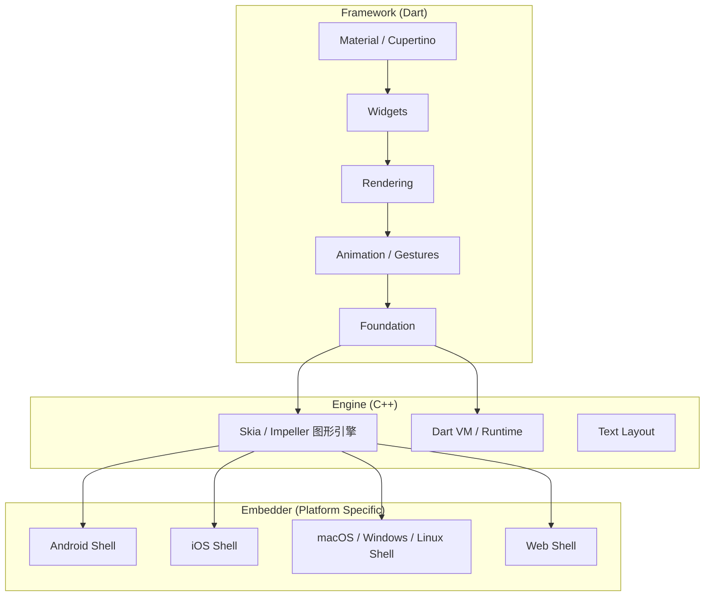
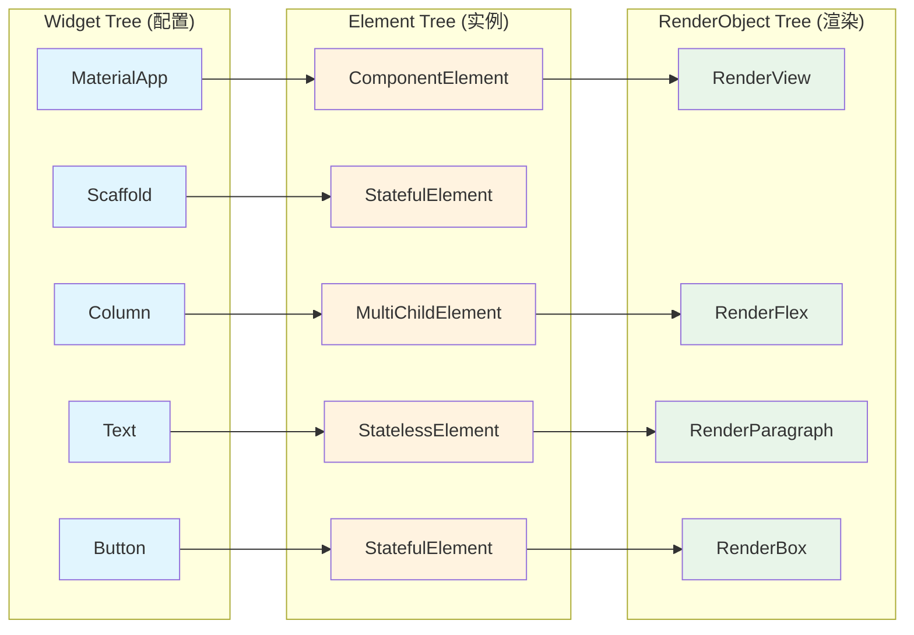
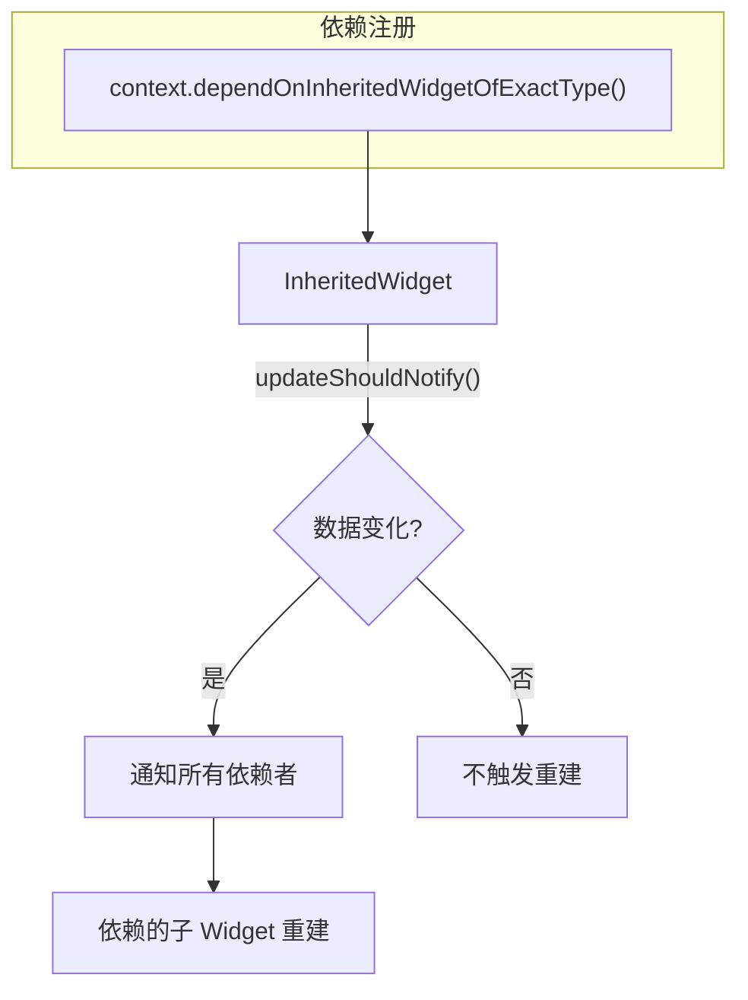

# Flutter 零基础入门教程

本教程专为具备 C++/Java/Python 或 Web 开发背景的资深工程师设计，旨在帮助你利用已有的编程知识，快速从零掌握 Flutter 开发，并达到生产环境要求的水平。

---

## 1. 学习路线图 (Learning Roadmap)

### 第一阶段：Dart 语言与 Flutter 基础（1-2 周）

* **目标**：掌握 Dart 语法，理解 Flutter 的声明式 UI 编程模型。
* **核心知识点**：
  * Dart 基础（变量、函数、类、异步编程）。
  * Flutter 环境搭建与工具链（DevTools）。
  * Widget 基础概念（Stateless vs Stateful）。
  * 基础布局（Row, Column, Container）。
* **验收标准**：能够搭建环境，运行 "Hello World"，并修改计数器示例应用，理解每一行代码的含义。

### 第二阶段：构建 UI 与 交互（2-3 周）

* **目标**：能够还原复杂的高保真 UI 设计，处理用户交互。
* **核心知识点**：
  * 高级布局（Stack, ListView, GridView）。
  * 导航与路由（Navigator 1.0 vs 2.0/Router）。
  * 表单输入与校验。
  * 主题与样式（ThemeData）。
  * 常用 Material/Cupertino 组件。
* **验收标准**：完成一个包含列表页、详情页和表单提交功能的静态应用。

### 第三阶段：状态管理与架构设计（2-3 周）

* **目标**：掌握应用级状态管理，设计可维护的代码架构。
* **核心知识点**：
  * Widget 树、Element 树、RenderObject 树原理。
  * 状态管理方案对比（Provider, Riverpod, Bloc）。
  * 网络请求（Dio, JSON 序列化）。
  * 本地存储（SharedPreferences, SQLite/Drift）。
* **验收标准**：完成一个完整的 CRUD 应用，包含网络 API 调用和本地缓存，使用 Riverpod 或 Bloc 管理状态。

### 第四阶段：进阶与生产实战（1-2 周）

* **目标**：掌握原生功能调用、性能优化及自动化流程。
* **核心知识点**：
  * Platform Channels（调用 Native API）。
  * 动画与手势。
  * 性能分析与优化（Frame timing, Memory）。
  * 单元测试与集成测试。
  * CI/CD 配置。
* **验收标准**：能够独立开发并打包发布一个具有原生功能的商业级 App。

---

## 2. 核心架构与概念

### 2.1 Flutter 架构设计原理

Flutter 与传统的混合开发框架（如 React Native, Cordova）有着本质区别。

* **自带渲染引擎**：Flutter 使用 C++ 编写的 Skia（或最新的 Impeller）图形引擎直接绘制 UI，**不依赖**系统的原生 OEM 控件（WebView 或系统原生组件）。这意味着在 iOS 和 Android 上能获得几乎完全一致的视觉效果。

#### Flutter 三层架构图



* **架构分层**：
    1. **Framework (Dart)**: 开发者主要工作层。包含 Material/Cupertino 风格库、Widget、渲染、动画、手势等。
    2. **Engine (C++)**: 负责光栅化、合成、低级渲染、Dart 虚拟机（Dart VM）管理。
    3. **Embedder (Platform Specific)**: 负责将 Flutter 引擎"嵌入"到各个平台（Android/iOS/Web/Desktop），处理线程管理、原生插件通信等。

### 2.2 Dart 语言核心特性（对比 Java）

* **AOT (Ahead-of-Time) & JIT (Just-in-Time)**:
  * **开发时 (JIT)**: 支持 **Hot Reload (热重载)**，极速调试，无需重新编译。
  * **发布时 (AOT)**: 编译成原生机器码（ARM/x86），启动快，性能高。
* **空安全 (Null Safety)**:
  * Dart 默认变量不可为空。
  * `String? name;` (可空) vs `String name;` (不可空)。
  * 这消除了 Java 中常见的 `NullPointerException` 隐患。
* **异步编程 (Async/Await)**:
  * Dart 是单线程模型（Event Loop），没有 Java 那种抢占式多线程共享内存的复杂性。
  * 耗时操作使用 `Future` 和 `Stream`。
  * 语法类似于 JavaScript 的 `async/await`，比 Java 的 `CompletableFuture` 更易读。

    ```dart
    // Dart 异步示例
    Future<String> fetchUser() async {
      await Future.delayed(Duration(seconds: 1)); // 模拟网络请求
      return "Ray";
    }
    ```

#### Mixin（混入）

Mixin 是 Dart 中用于代码复用的强大机制，类似于 Java 接口的默认方法，但更加灵活。**Java 工程师请注意**：Dart 不支持多继承，但可以通过 `with` 关键字混入多个 Mixin。

```dart
// 定义一个 Mixin
mixin Logger {
  void log(String message) {
    print('[LOG] $message');
  }
}

mixin Analytics {
  void trackEvent(String event) {
    print('[ANALYTICS] $event');
  }
}

// 使用多个 Mixin
class MyService with Logger, Analytics {
  void doSomething() {
    log('Service started'); // 来自 Logger
    trackEvent('service_start'); // 来自 Analytics
  }
}
```

#### Extension Methods（扩展方法）

扩展方法允许你为现有类添加新方法，而无需修改原类或创建子类。这与 Kotlin 的扩展函数非常相似。

```dart
// 为 String 类添加扩展方法
extension StringExtensions on String {
  String capitalize() {
    if (isEmpty) return this;
    return '${this[0].toUpperCase()}${substring(1)}';
  }
  
  bool get isEmail => contains('@') && contains('.');
}

// 使用扩展方法
void main() {
  print('hello'.capitalize()); // 输出: Hello
  print('test@email.com'.isEmail); // 输出: true
}
```

### 2.3 声明式 UI 编程 (Declarative UI)

* **Java/Android (命令式)**:
    `textView.setText("Hello");` -> 先获取对象引用，再修改其属性。
* **Flutter (声明式)**:
    `return Text("Hello");` -> UI 是状态的函数：`UI = f(State)`。
    **当状态改变时，Flutter 会重建 Widget 树**。你不需要（也不能）手动修改 Widget 的属性，而是创建一个新的 Widget 实例来替换旧的。

### 2.4 深入理解"三棵树"

理解这三棵树是成为 Flutter 高手的关键：



1. **Widget 树**: **配置信息**。你可以无限次创建和销毁 Widget，它们非常轻量级，只是不可变的配置描述。
2. **Element 树**: **实例化对象**。Element 是 Widget 在树中的实例，负责维护树的结构和状态。
3. **RenderObject 树**: **渲染引擎**。负责实际的布局（Layout）和绘制（Paint）。只有当布局发生变化时，才会修改 RenderObject。

**关键点**：`setState()` 触发 Widget 树重建，但 Flutter 会通过 Diff 算法复用 Element 和 RenderObject，从而保证高性能。

#### BuildContext 的本质

> **BuildContext 就是 Element！** 这是理解 Flutter 的关键。

每个 Widget 的 `build(BuildContext context)` 方法中的 `context` 参数，实际上就是当前 Widget 对应的 Element。通过它，你可以：

* 向上查找祖先 Widget（`context.findAncestorWidgetOfExactType<T>()`）
* 获取 InheritedWidget 中的数据（`Theme.of(context)`, `MediaQuery.of(context)`）
* 获取 Navigator、Scaffold 等（`Navigator.of(context)`, `Scaffold.of(context)`）

```dart
@override
Widget build(BuildContext context) {
  // context 向上查找最近的 Theme
  final theme = Theme.of(context);
  
  // context 向上查找 MediaQuery 获取屏幕尺寸
  final screenWidth = MediaQuery.of(context).size.width;
  
  return Container(
    color: theme.primaryColor,
    width: screenWidth * 0.8,
  );
}
```

#### Key 的作用与使用场景

Key 是 Flutter 用来标识 Widget 身份的机制。**什么时候需要使用 Key？**

| Key 类型 | 使用场景 |
|----------|----------|
| `ValueKey` | 当 Widget 有唯一的业务 ID 时（如用户 ID、商品 ID） |
| `ObjectKey` | 当 Widget 关联一个复杂对象时 |
| `UniqueKey` | 每次都需要强制重建的场景 |
| `GlobalKey` | 需要跨 Widget 访问状态或执行方法时（谨慎使用，性能开销大） |

```dart
// 常见错误：列表项没有 Key，重排序时状态错乱
ListView.builder(
  itemCount: items.length,
  itemBuilder: (context, index) {
    // ❌ 没有 Key，如果列表重排序，状态会错乱
    return ListTile(title: Text(items[index]));
    
    // ✅ 使用 ValueKey
    return ListTile(
      key: ValueKey(items[index].id),
      title: Text(items[index].name),
    );
  },
)
```

### 2.5 响应式编程与状态管理

* **Ephemeral State (短时状态)**: 仅在单个 Widget 内部使用的状态（如 `Switch` 的开关、`TextField` 的输入）。使用 `StatefulWidget` 和 `setState()` 即可。
* **App State (应用状态)**: 需要在多个页面或组件间共享的状态（如用户信息、购物车、主题配置）。需要使用专门的状态管理库。

#### 状态管理的底层原理：InheritedWidget

所有状态管理库（Provider, Riverpod, Bloc）的底层都是基于 `InheritedWidget`。理解它是理解状态管理的关键。



```dart
// 简化的 InheritedWidget 示例
class UserProvider extends InheritedWidget {
  final User user;
  
  const UserProvider({
    required this.user,
    required Widget child,
  }) : super(child: child);
  
  // 子 Widget 通过这个方法获取数据
  static User of(BuildContext context) {
    final provider = context.dependOnInheritedWidgetOfExactType<UserProvider>();
    return provider!.user;
  }
  
  @override
  bool updateShouldNotify(UserProvider oldWidget) {
    return user != oldWidget.user; // 数据变化时通知依赖者
  }
}

// 使用
class ProfilePage extends StatelessWidget {
  @override
  Widget build(BuildContext context) {
    final user = UserProvider.of(context); // 自动订阅变化
    return Text(user.name);
  }
}
```

---

## 3. 常用组件库实战

### 3.1 基础组件 (Basic Widgets)

#### 布局与容器

* **Container**: 类似于 Web 的 `div`，用于设置 margin, padding, background, border。
* **Row / Column**: 类似于 Flexbox 布局。`MainAxisAlignment` (主轴) 和 `CrossAxisAlignment` (交叉轴) 是高频属性。
* **Stack**: 类似于 CSS 的 `absolute` 定位，允许组件堆叠。

**代码示例：个人信息卡片**

```dart
import 'package:flutter/material.dart';

class UserCard extends StatelessWidget {
  final String name;
  final String role;

  const UserCard({Key? key, required this.name, required this.role}) : super(key: key);

  @override
  Widget build(BuildContext context) {
    return Container(
      padding: EdgeInsets.all(16),
      decoration: BoxDecoration(
        color: Colors.white,
        borderRadius: BorderRadius.circular(12),
        boxShadow: [
          BoxShadow(color: Colors.black12, blurRadius: 10, offset: Offset(0, 5)),
        ],
      ),
      child: Row(
        children: [
          CircleAvatar(
            backgroundColor: Colors.blueAccent,
            child: Text(name[0], style: TextStyle(color: Colors.white)),
          ),
          SizedBox(width: 16), // 间距
          Column(
            crossAxisAlignment: CrossAxisAlignment.start,
            children: [
              Text(name, style: TextStyle(fontSize: 18, fontWeight: FontWeight.bold)),
              Text(role, style: TextStyle(color: Colors.grey[600])),
            ],
          ),
        ],
      ),
    );
  }
}
```

### 3.2 高级组件 (Advanced Widgets)

#### 列表渲染

* **ListView.builder**: 高性能列表，按需构建（类似于 Android RecyclerView）。

```dart
ListView.builder(
  itemCount: items.length,
  itemBuilder: (context, index) {
    return ListTile(
      title: Text(items[index].title),
      subtitle: Text("Item $index"),
    );
  },
)
```

#### Sliver 系列组件

Sliver 是 Flutter 中实现复杂滚动效果的核心。`CustomScrollView` 允许你组合多种 Sliver 组件。

```dart
CustomScrollView(
  slivers: [
    // 可折叠的 AppBar
    SliverAppBar(
      expandedHeight: 200,
      pinned: true,
      flexibleSpace: FlexibleSpaceBar(
        title: Text('Sliver Demo'),
        background: Image.network('https://example.com/header.jpg', fit: BoxFit.cover),
      ),
    ),
    // 网格布局
    SliverGrid(
      gridDelegate: SliverGridDelegateWithFixedCrossAxisCount(crossAxisCount: 2),
      delegate: SliverChildBuilderDelegate(
        (context, index) => Card(child: Center(child: Text('Item $index'))),
        childCount: 20,
      ),
    ),
    // 列表
    SliverList(
      delegate: SliverChildBuilderDelegate(
        (context, index) => ListTile(title: Text('List Item $index')),
        childCount: 10,
      ),
    ),
  ],
)
```

#### 动画 (Animations)

Flutter 动画分为 **隐式动画** 和 **显式动画**。

**隐式动画**（推荐入门）：使用 `AnimatedXxx` 系列组件，自动处理过渡效果。

```dart
AnimatedContainer(
  duration: Duration(milliseconds: 300),
  curve: Curves.easeInOut,
  width: _isExpanded ? 200 : 100,
  height: _isExpanded ? 200 : 100,
  color: _isExpanded ? Colors.blue : Colors.red,
  child: Center(child: Text('Tap me')),
)
```

**显式动画**（完全控制）：使用 `AnimationController` + `Tween`。

```dart
class _MyAnimatedWidgetState extends State<MyAnimatedWidget>
    with SingleTickerProviderStateMixin {
  late AnimationController _controller;
  late Animation<double> _animation;

  @override
  void initState() {
    super.initState();
    _controller = AnimationController(
      duration: Duration(seconds: 2),
      vsync: this,
    );
    _animation = Tween<double>(begin: 0, end: 300).animate(
      CurvedAnimation(parent: _controller, curve: Curves.easeInOut),
    );
    _controller.forward();
  }

  @override
  void dispose() {
    _controller.dispose(); // ⚠️ 必须释放
    super.dispose();
  }

  @override
  Widget build(BuildContext context) {
    return AnimatedBuilder(
      animation: _animation,
      builder: (context, child) {
        return Container(
          width: _animation.value,
          height: _animation.value,
          color: Colors.blue,
        );
      },
    );
  }
}
```

#### 导航 (Navigation)

* 建议使用 **GoRouter** (官方推荐封装包) 替代原生的 `Navigator.push`，更适合处理 Deep Linking 和 Web 路由。

---

## 4. 开发规范与最佳实践

### 4.1 目录结构 (Project Structure)

推荐 **Feature-first** (按功能分层) 而不是 Layer-first (按技术分层)。

```text
lib/
├── src/
│   ├── features/
│   │   ├── authentication/
│   │   │   ├── data/ (Repositories, Data Sources)
│   │   │   ├── domain/ (Models, Entities)
│   │   │   ├── presentation/ (Widgets, State Controllers)
│   │   ├── products/
│   │   ├── cart/
│   ├── common_widgets/ (通用 UI 组件)
│   ├── utils/ (帮助类)
│   ├── constants/ (颜色, 字符串)
├── main.dart
```

### 4.2 状态管理方案选择

| 方案 | 学习曲线 | 适用场景 | 特点 |
|------|----------|----------|------|
| **Provider** | ⭐ 简单 | 初学者/小型项目 | 官方推荐入门，基于 InheritedWidget |
| **Riverpod** | ⭐⭐ 中等 | 推荐/中大型项目 | Provider 重写版，编译时安全，无需 Context |
| **Bloc** | ⭐⭐⭐ 较陡 | 企业级/严格架构 | 强制单向数据流，状态可追踪，团队协作首选 |
| **GetX** | ⭐ 简单 | 快速原型 | 功能多但"魔法"多，不推荐大型项目 |

### 4.3 性能优化要点

* **const 构造函数**: 尽可能使用 `const` 定义 Widget（如 `const Text("Title")`）。这告诉 Flutter 这些组件不需要重新构建，极大优化性能。
* **避免在 build 方法中进行耗时计算**: `build` 方法可能会被频繁调用（每秒 60 次），保持其逻辑极简。
* **使用 Flutter DevTools**:
  * 查看 "Highlight Repaints" 检查是否有多余的重绘。
  * 使用 "Memory" 视图检测内存泄漏（特别是 StreamSubscription 未取消订阅）。

### 4.4 测试策略

Flutter 提供三种级别的测试：

```dart
// 1. 单元测试 (Unit Test) - test/unit/
import 'package:test/test.dart';

void main() {
  test('Counter increments', () {
    final counter = Counter();
    counter.increment();
    expect(counter.value, 1);
  });
}
```

```dart
// 2. Widget 测试 (Widget Test) - test/widget/
import 'package:flutter_test/flutter_test.dart';

void main() {
  testWidgets('MyWidget shows title', (WidgetTester tester) async {
    await tester.pumpWidget(MyWidget(title: 'Hello'));
    expect(find.text('Hello'), findsOneWidget);
    
    await tester.tap(find.byType(ElevatedButton));
    await tester.pump(); // 触发重建
    expect(find.text('Clicked'), findsOneWidget);
  });
}
```

```dart
// 3. 集成测试 (Integration Test) - integration_test/
import 'package:integration_test/integration_test.dart';

void main() {
  IntegrationTestWidgetsFlutterBinding.ensureInitialized();

  testWidgets('Full app flow', (tester) async {
    app.main();
    await tester.pumpAndSettle();
    
    await tester.tap(find.text('Login'));
    await tester.pumpAndSettle();
    
    expect(find.text('Welcome'), findsOneWidget);
  });
}
```

### 4.5 GitHub Actions CI/CD 配置

```yaml
# .github/workflows/flutter.yml
name: Flutter CI/CD

on:
  push:
    branches: [ main ]
  pull_request:
    branches: [ main ]

jobs:
  build:
    runs-on: ubuntu-latest
    steps:
      - uses: actions/checkout@v4
      
      - name: Setup Flutter
        uses: subosito/flutter-action@v2
        with:
          flutter-version: '3.19.0'
          channel: 'stable'
      
      - name: Install dependencies
        run: flutter pub get
      
      - name: Analyze
        run: flutter analyze
      
      - name: Run tests
        run: flutter test --coverage
      
      - name: Upload coverage
        uses: codecov/codecov-action@v3
        with:
          files: coverage/lcov.info

  build-android:
    needs: build
    runs-on: ubuntu-latest
    steps:
      - uses: actions/checkout@v4
      - uses: subosito/flutter-action@v2
      - run: flutter build apk --release
      - uses: actions/upload-artifact@v3
        with:
          name: android-release
          path: build/app/outputs/flutter-apk/app-release.apk

  build-ios:
    needs: build
    runs-on: macos-latest
    steps:
      - uses: actions/checkout@v4
      - uses: subosito/flutter-action@v2
      - run: flutter build ios --release --no-codesign
```

### 4.6 常用类库推荐

* **网络**: `dio` (强大，支持拦截器), `http` (简单)。
* **序列化**: `json_serializable` (代码生成), `freezed` (强大的不可变数据类 + Union Types)。
* **本地存储**: `shared_preferences` (轻量键值对), `drift` (SQLite ORM), `isar` (高性能 NoSQL)。
* **图片加载**: `cached_network_image`。

### 4.7 学习资源

* [Flutter 官方文档](https://flutter.dev/docs) (最权威，必读)
* [Flutter Widget of the Week](https://www.youtube.com/playlist?list=PLjxrf2q8roU23XGwz3Km7sQZFTdB996iG) (YouTube 官方系列，每个视频 1 分钟介绍一个组件)
* [Pub.dev](https://pub.dev/) (官方包仓库)

---

## 5. macOS 应用开发入门

Flutter 支持构建原生 macOS 桌面应用。本章将引导你完成从环境配置到打包发布的完整流程。

### 5.1 环境准备

**系统要求**：

* macOS 10.14 (Mojave) 或更高版本
* Xcode 14 或更高版本
* CocoaPods (用于依赖管理)

**启用 macOS 桌面支持**：

```bash
# 检查 Flutter 是否已启用 macOS 支持
flutter doctor

# 如果未启用，运行以下命令
flutter config --enable-macos-desktop

# 验证
flutter devices
# 应该能看到 macOS (desktop) 设备
```

### 5.2 创建与运行 macOS 应用

```bash
# 创建新项目（包含 macOS 支持）
flutter create --platforms=macos my_macos_app

# 为现有项目添加 macOS 支持
cd existing_project
flutter create --platforms=macos .

# 运行 macOS 应用
flutter run -d macos

# 热重载仍然生效！
```

### 5.3 macOS 特有配置

#### 目录结构

```text
macos/
├── Runner/
│   ├── AppDelegate.swift          # 应用入口
│   ├── Assets.xcassets/           # 图标资源
│   ├── Base.lproj/
│   │   └── MainMenu.xib           # 菜单栏配置
│   ├── Configs/
│   │   ├── AppInfo.xcconfig       # 应用信息
│   │   └── Debug.xcconfig
│   ├── Info.plist                 # 应用配置
│   ├── DebugProfile.entitlements  # 开发权限
│   └── Release.entitlements       # 发布权限
├── Runner.xcodeproj/
└── Runner.xcworkspace/
```

#### Info.plist 常用配置

```xml
<!-- macos/Runner/Info.plist -->
<dict>
    <!-- 应用名称 -->
    <key>CFBundleName</key>
    <string>My App</string>
    
    <!-- Bundle ID -->
    <key>CFBundleIdentifier</key>
    <string>com.example.myapp</string>
    
    <!-- 最低 macOS 版本 -->
    <key>LSMinimumSystemVersion</key>
    <string>10.14</string>
</dict>
```

#### Entitlements 权限配置

macOS 应用默认运行在沙盒中，需要显式声明所需权限：

```xml
<!-- macos/Runner/Release.entitlements -->
<?xml version="1.0" encoding="UTF-8"?>
<!DOCTYPE plist PUBLIC "-//Apple//DTD PLIST 1.0//EN" "...">
<plist version="1.0">
<dict>
    <!-- 沙盒 (App Store 必须) -->
    <key>com.apple.security.app-sandbox</key>
    <true/>
    
    <!-- 网络访问 -->
    <key>com.apple.security.network.client</key>
    <true/>
    
    <!-- 读取用户文件 -->
    <key>com.apple.security.files.user-selected.read-only</key>
    <true/>
    
    <!-- 读写用户文件 -->
    <key>com.apple.security.files.user-selected.read-write</key>
    <true/>
</dict>
</plist>
```

> **重要**：如果你的应用需要访问网络，必须添加 `com.apple.security.network.client` 权限，否则网络请求会静默失败！

### 5.4 平台特定 UI 适配

#### 使用 macos_ui 包

[macos_ui](https://pub.dev/packages/macos_ui) 提供了原生 macOS 风格的 Widget，让你的应用看起来更像原生 Mac 应用。

```yaml
# pubspec.yaml
dependencies:
  macos_ui: ^2.0.0
```

```dart
import 'package:macos_ui/macos_ui.dart';

class MyMacApp extends StatelessWidget {
  @override
  Widget build(BuildContext context) {
    return MacosApp(
      title: 'My macOS App',
      theme: MacosThemeData.light(),
      darkTheme: MacosThemeData.dark(),
      home: MacosWindow(
        sidebar: Sidebar(
          minWidth: 200,
          builder: (context, scrollController) {
            return SidebarItems(
              items: [
                SidebarItem(label: Text('Home'), leading: MacosIcon(CupertinoIcons.home)),
                SidebarItem(label: Text('Settings'), leading: MacosIcon(CupertinoIcons.gear)),
              ],
              currentIndex: 0,
              onChanged: (index) {},
            );
          },
        ),
        child: ContentArea(
          builder: (context, scrollController) {
            return Center(child: Text('Content Area'));
          },
        ),
      ),
    );
  }
}
```

#### 窗口管理

```dart
import 'package:window_manager/window_manager.dart';

void main() async {
  WidgetsFlutterBinding.ensureInitialized();
  
  // 初始化窗口管理器
  await windowManager.ensureInitialized();
  
  WindowOptions windowOptions = WindowOptions(
    size: Size(1280, 720),
    minimumSize: Size(800, 600),
    center: true,
    backgroundColor: Colors.transparent,
    titleBarStyle: TitleBarStyle.hidden, // 隐藏原生标题栏
  );
  
  windowManager.waitUntilReadyToShow(windowOptions, () async {
    await windowManager.show();
    await windowManager.focus();
  });
  
  runApp(MyApp());
}
```

### 5.5 打包与分发

#### 构建 Release 版本

```bash
# 构建 macOS 应用
flutter build macos --release

# 输出位置
# build/macos/Build/Products/Release/YourApp.app
```

#### 代码签名与公证 (Notarization)

从 macOS Catalina (10.15) 开始，未经公证的应用会被 Gatekeeper 阻止运行。

```bash
# 1. 签名应用
codesign --deep --force --verify --verbose \
  --sign "Developer ID Application: Your Name (TEAM_ID)" \
  build/macos/Build/Products/Release/YourApp.app

# 2. 创建 ZIP 用于公证
ditto -c -k --keepParent \
  build/macos/Build/Products/Release/YourApp.app \
  YourApp.zip

# 3. 提交公证
xcrun notarytool submit YourApp.zip \
  --apple-id "your@email.com" \
  --password "app-specific-password" \
  --team-id "TEAM_ID" \
  --wait

# 4. Staple 公证票据
xcrun stapler staple build/macos/Build/Products/Release/YourApp.app
```

#### 创建 DMG 安装包

使用 [create-dmg](https://github.com/create-dmg/create-dmg) 工具：

```bash
brew install create-dmg

create-dmg \
  --volname "My App Installer" \
  --window-pos 200 120 \
  --window-size 600 400 \
  --icon-size 100 \
  --icon "YourApp.app" 150 190 \
  --app-drop-link 450 185 \
  "YourApp-Installer.dmg" \
  "build/macos/Build/Products/Release/"
```

### 5.6 与原生 Swift/Objective-C 代码交互

使用 **Platform Channels** 调用原生 macOS API：

```dart
// Flutter 端 (Dart)
import 'package:flutter/services.dart';

class NativeBridge {
  static const platform = MethodChannel('com.example.app/native');
  
  static Future<String> getMacOSVersion() async {
    try {
      final String version = await platform.invokeMethod('getMacOSVersion');
      return version;
    } on PlatformException catch (e) {
      return 'Failed: ${e.message}';
    }
  }
}
```

```swift
// macOS 端 (Swift) - macos/Runner/AppDelegate.swift
import Cocoa
import FlutterMacOS

@NSApplicationMain
class AppDelegate: FlutterAppDelegate {
  override func applicationDidFinishLaunching(_ notification: Notification) {
    let controller = mainFlutterWindow?.contentViewController as! FlutterViewController
    
    let channel = FlutterMethodChannel(
      name: "com.example.app/native",
      binaryMessenger: controller.engine.binaryMessenger
    )
    
    channel.setMethodCallHandler { (call, result) in
      if call.method == "getMacOSVersion" {
        let version = ProcessInfo.processInfo.operatingSystemVersionString
        result(version)
      } else {
        result(FlutterMethodNotImplemented)
      }
    }
    
    super.applicationDidFinishLaunching(notification)
  }
}
```

---

> **恭喜！** 完成本教程后，你已经具备了使用 Flutter 开发生产级移动端和 macOS 桌面应用的能力。建议继续阅读 [Flutter 官方文档](https://flutter.dev/docs) 深入学习高级主题。
