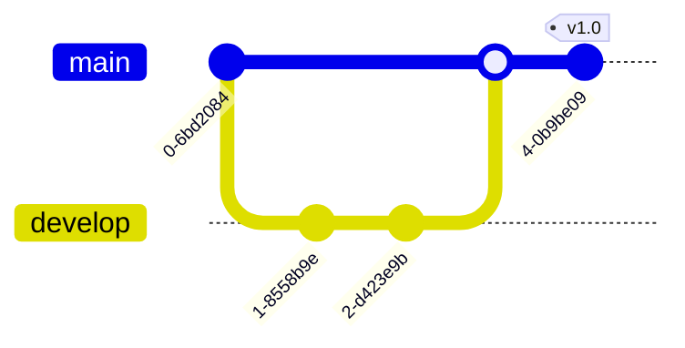

# Markdown 语法标记完全指南

这份指南涵盖了标准 Markdown 语法以及 Obsidian 特有的扩展语法。

## 1. 基础格式 (Basic Formatting)

| 效果 | 语法 | 示例 |
| :--- | :--- | :--- |
| **加粗** | `**文本**` | **重要内容** |
| *斜体* | `*文本*` | *强调内容* |
| ~~删除线~~ | `~~文本~~` | ~~已废弃~~ |
| ==高亮== | `==文本==` | ==关键点== (Obsidian 特有) |
| `行内代码` | `` `文本` `` | `print("Hello")` |

## 2. 标题 (Headers)

```markdown
# 一级标题 (H1)
## 二级标题 (H2)
### 三级标题 (H3)
#### 四级标题 (H4)
##### 五级标题 (H5)
###### 六级标题 (H6)
```

## 3. 列表 (Lists)

### 无序列表
- 项目 1
- 项目 2
  - 子项目 A
  - 子项目 B

### 有序列表
1. 第一步
2. 第二步
3. 第三步

### 任务列表 (Checklists)
- [ ] 待办任务
- [x] 已完成任务
- [/] 进行中 (部分主题支持)

## 4. 引用与标注 (Blockquotes & Callouts)

### 普通引用
> 这是一个普通的引用块。
> 可以多行。

### Obsidian 标注 (Callouts)
Obsidian 支持多种类型的标注块，语法如下：

```markdown
> [!NOTE] 笔记
> 这是一个标准的笔记块。

> [!TIP] 技巧
> 这里放一些实用技巧。

> [!IMPORTANT] 重要
> 关键信息，务必注意。

> [!WARNING] 警告
> 潜在的风险或问题。

> [!ERROR] 错误
> 错误信息或失败案例。

> [!TODO] 待办
> 需要处理的事项。
```

**支持的类型还包括**：`INFO`, `SUCCESS`, `QUESTION`, `FAILURE`, `DANGER`, `BUG`, `EXAMPLE`, `QUOTE`.

## 5. 链接与图片 (Links & Images)

### 链接
- **外部链接**: `[Google](https://google.com)`
- **内部链接 (WikiLink)**: `[[文件名]]` 或 `[[文件名|显示文本]]`
- **引用特定段落**: `[[文件名#标题]]` 或 `[[文件名^块ID]]`

### 图片
- **插入图片**: ``
- **插入内部图片**: `![[图片名.png]]`
- **调整大小**: `![[图片名.png|100]]` (宽度调整为 100px)

## 6. 代码块 (Code Blocks)

使用三个反引号 \`\`\` 包裹代码，并指定语言：

```python
def hello():
    print("Hello, World!")
```

```javascript
console.log("Hello, World!");
```

## 7. 表格 (Tables)

```markdown
| 标题 1 | 标题 2 | 标题 3 |
| :--- | :---: | ---: |
| 左对齐 | 居中 | 右对齐 |
| 内容 A | 内容 B | 内容 C |
```

## 8. 数学公式 (Math/LaTeX)

使用 MathJax 渲染数学公式。

- **行内公式**: `$E = mc^2$`
- **独立公式块**:

```math
\sum_{i=1}^n a_i = 0
```

## 9. 脚注 (Footnotes)

这是一个脚注引用[^1]。

[^1]: 这是脚注的内容说明。

## 10. 高级图表 (Mermaid)

Obsidian 原生支持 Mermaid，可用于绘制流程图、时序图、甘特图等。以下是按场景分类的常用图表。

### 10.1 软件工程 (UML & Git)

**类图 (Class Diagram)** - 用于架构设计


**时序图 (Sequence Diagram)** - 用于 API 交互分析


**实体关系图 (ER Diagram)** - 用于数据库设计


**Git 分支图 (Gitgraph)** - 用于版本控制流程


### 10.2 商业与财务分析 (Business & Finance)

**XY 图表 (XY Chart)** - 用于营收对比或股价趋势


**时间轴 (Timeline)** - 用于投资历程或公司大事记


**饼图 (Pie Chart)** - 用于预算或市场份额


**象限图 (Quadrant Chart)** - 用于 SWOT 分析或优先级排序


### 10.3 项目管理与思维导图

**甘特图 (Gantt Chart)** - 用于项目进度


**思维导图 (Mindmap)** - 用于头脑风暴


### 10.4 常见图表渲染问题与修复 (Troubleshooting)

Mermaid 对语法格式非常敏感，特别是**空格**和**换行符**。以下是针对 Obsidian 环境的特定修复指南：

**1. 桑基图 (Sankey Diagram)**
*   **核心错误**：`Parse error ... Expecting 'NEWLINE', got 'DQUOTE'` 或 `Expecting 'NEWLINE', got 'ALPHA'`
    *   **根本原因**：Mermaid 解析器要求 `sankey-beta` 关键字后必须紧跟一个**空行**，否则会将第一行数据误判为配置指令。
    *   **✅ 解决方案**：**在 `sankey-beta` 关键字和第一行数据之间必须插入一个空行**。
*   **正确语法 (Syntax)**：
    *   **基本格式**：`Source, Target, Value` (逗号分隔)。
    *   **引号 (Quotes)**：**非必须**。即使节点名称包含空格（如 `Data Center`）或特殊字符（如 `&`, `/`, `(`），只要不包含英文逗号 `,`，通常**不需要**使用双引号。
    *   **示例**：`OEM & Other, Total Revenue, 0.4` 是完全合法的。
*   **避坑指南**：
    *   ❌ **不要**在 `sankey-beta` 后直接写数据。
    *   ❌ **不要**在数据行中使用行内注释（如 `%%`），这可能干扰解析。
    *   ⚠️ 如果节点名称中必须包含英文逗号 `,`，则**必须**使用双引号包裹该节点名称，例如 `"Revenue, Net", Cash, 100`。

**2. 象限图 (Quadrant Chart)**
*   **错误现象**：`Lexical error on line X`
*   **修复方法**：
    *   **强制引号**：轴标签和数据点名称建议始终使用双引号 `""` 包裹，特别是包含中文时。
    *   **示例**：`x-axis "低紧急度" --> "高紧急度"`

**3. 通用建议**
*   **换行符**：确保文件使用统一的换行符（推荐 LF）。
*   **代码块结构**：代码块首行指令（如 `sankey-beta`）后建议紧跟换行。

### 10.5 Mermaid 图表主题与样式配置 (Theming & Configuration)

Mermaid 允许通过 `%%{init: { ... }}%%` 指令来自定义图表的外观，包括主题、字体、颜色和边框等。

#### 1. 全局主题设置
Mermaid 提供 5 种内置主题，可通过 `theme` 属性直接调用：

*   **`default`**: 默认主题，通常为柔和的绿色调，适合大多数浅色背景。
*   **`base`**: 基础主题，样式最少，自定义程度最高，适合作为 CSS 覆盖的起点。
*   **`dark`**: 深色主题，专为黑色或深灰色背景设计，文字和线条反白，适合夜间模式。
*   **`forest`**: 森林主题，以绿色为主色调，风格清新自然。
*   **`neutral`**: 中性主题，黑白灰配色，简洁专业，适合打印或正式文档。

**语法示例**:


#### 2. 自定义颜色与样式变量
你可以覆盖特定的主题变量来调整颜色、边框、字体和背景。

**常用变量速查表**:

| 类别        | 变量名                   | 说明                            |
| :-------- | :-------------------- | :---------------------------- |
| **基础颜色**  | `primaryColor`        | 主色调（节点背景、活动状态等）               |
|           | `secondaryColor`      | 次要色调（部分图表的次级元素）               |
|           | `tertiaryColor`       | 第三色（通常用于内部填充）                 |
|           | `mainBkg`             | 画布整体背景色                       |
| **文本与字体** | `textColor`           | 主要文本颜色                        |
|           | `fontSize`            | 字体大小 (如 `16px`)               |
|           | `fontFamily`          | 字体族 (如 `"arial, sans-serif"`) |
| **边框与线条** | `lineColor`           | 连线颜色                          |
|           | `nodeBorder`          | 节点边框颜色                        |
|           | `clusterBkg`          | 子图（Subgraph）背景色                       |
|           | `clusterBorder`       | 子图边框颜色                        |
|           | `titleColor`          | 标题颜色                          |
| **其他**    | `edgeLabelBackground` | 连线标签背景色                       |
|           | `arrowheadColor`      | 箭头颜色                          |

**示例：完全自定义配色的流程图**


#### 3. 针对特定节点的样式 (classDef)
在流程图 (Flowchart) 中，你可以定义 CSS 类并应用到特定节点，实现更精细的控制。


#### 4. 调整宽高与边距 (Flowchart)
虽然 Mermaid 自动计算布局，但通过 `useMaxWidth` 可以控制是否缩放。


### 10.6 实战案例：英伟达 (Nvidia) FY2025 财报桑基图

桑基图非常适合展示公司财报中的资金流向。以下是基于英伟达 FY2025 (截至 2025年1月) 财报数据的可视化。

**数据亮点**：
*   **Data Center** 业务贡献了约 88% 的收入 ($115.2B)。
*   **净利润率** 极高，从经营利润 ($81.5B) 到净利润 ($72.9B) 的转化效率惊人。


## 11. 分割线 (Horizontal Rules)

使用三个或更多的 `-`, `*`, 或 `_`：

---
***
___
