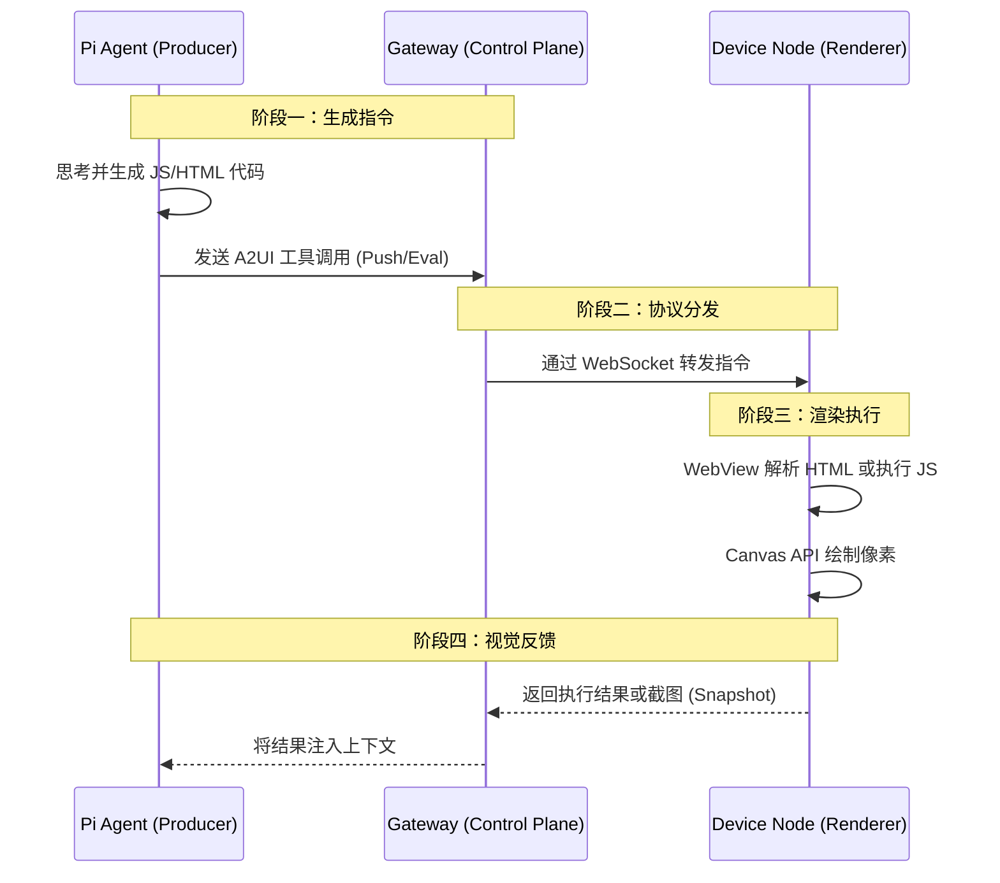

# OpenClaw Canvas 与 A2UI 技术原理深度解析

> **摘要**：本文档整合了 OpenClaw 的架构设计与 Web Canvas 的底层技术原理，旨在深度解析 AI Agent 如何通过 "Agent-to-UI" (A2UI) 协议，利用标准的 Web 技术栈实现从"文本交互"到"视觉交互"的范式转变。

---

## 一、 核心概念：Agent 的视觉工作区

在传统的 AI 交互中，Agent 仅存在于终端（CLI）或聊天窗口（Chat）中，输出仅限于文本。**OpenClaw Canvas** 打破了这一限制，它为 Agent 提供了一个**基于 Web 标准的可视化工作区（Workspace）**。

这个工作区本质上是一个受控的浏览器环境（WebView），Agent 可以像全栈工程师一样，通过编写代码来操控这个界面，绘制图表、渲染 UI、甚至开发简单的游戏。

### 1.1 技术分层模型

理解 OpenClaw Canvas 的运作机制，需要将其分为两层：

1.  **基础设施层 (The Container)**：基于 **Web Canvas & DOM** 技术。这是"画布"本身的材质，决定了能画什么。
2.  **协议控制层 (The Protocol)**：即 **A2UI (Agent-to-UI)**。这是 Agent 的"画笔"，决定了怎么画。

---

## 二、 基础设施层：Web Canvas 技术基石

OpenClaw 的 Canvas 并非重新发明的轮子，而是构建在成熟的 Web 标准之上，特别是 HTML5 Canvas 技术。

### 2.1 什么是 Web Canvas？
HTML5 `<canvas>` 是一个允许通过 JavaScript 脚本进行动态图形渲染的位图（Bitmap）容器。与保留 DOM 结构的 SVG 不同，Canvas 采用**即时模式（Immediate Mode）**渲染。

*   **无状态特性**：一旦像素被绘制，浏览器就不再保留图形的结构信息。
*   **高性能**：由于不涉及 DOM 操作，Canvas 极其适合处理成千上万个动态对象（如实时数据流、粒子效果）。

### 2.2 为什么 Agent 需要 Web Canvas？
对于 AI Agent 而言，Web Canvas 提供了完美的输出介质：
*   **灵活性**：Agent 可以生成代码绘制任意形状，而不受限于预定义的 UI 组件库。
*   **跨平台**：无论是 macOS、iOS 还是 Android，只要有 WebView，就能以相同的方式渲染。
*   **生态复用**：Agent 可以直接利用现有的 JavaScript 生态（如 D3.js, Chart.js, Three.js）在 Canvas 上工作。

---

## 三、 协议控制层：A2UI (Agent-to-UI) 架构

A2UI 是连接 **Agent（大脑）** 与 **Canvas（屏幕）** 的桥梁。它定义了一套标准化的 JSON 协议，使得 Agent 能够远程控制分布在不同设备上的渲染节点。

### 3.1 架构组件与数据流



### 3.2 核心能力详解

A2UI 协议通过 `canvas` 工具集暴露给 Agent，主要包含以下四种操作模式：

#### 1. 动态执行 (Eval) —— 核心能力
这是 A2UI 最强大的功能。Agent 发送一段 JavaScript 代码，Node 在 WebView 的上下文中执行它。
*   **原理**：利用 WebView 的 `evaluateJavaScript` 接口。
*   **场景**：Agent 编写一段调用 `CanvasRenderingContext2D` 的代码，在屏幕上画出一个股票 K 线图。
*   **示例**：
    ```json
    {
      "tool": "canvas",
      "action": "eval",
      "code": "const ctx = document.getElementById('c').getContext('2d'); ctx.fillStyle='red'; ctx.fillRect(10,10,100,100);"
    }
    ```

#### 2. 内容推送 (Push)
Agent 直接推送 HTML 片段或纯文本。
*   **原理**：利用 DOM 操作（如 `document.body.innerHTML = ...`）。
*   **场景**：快速显示 Markdown 报告、状态更新。

#### 3. 视觉反馈 (Snapshot)
Agent 请求获取当前的屏幕截图。
*   **原理**：调用 WebView 或系统的截图 API，返回 Base64 图片。
*   **意义**：这赋予了 Agent "视觉"。Agent 绘制完图表后，可以通过截图来"看"自己画得对不对，从而进行自我修正。

#### 4. 导航 (Navigate)
将 Canvas 指向特定的 URL。
*   **场景**：Agent 需要浏览外部网页文档，或者加载托管在本地服务器上的复杂 Web 应用。

---

## 四、 实际工作流案例：Agent 如何画图？

让我们通过一个具体的例子，看 OpenClaw 如何结合 Web Canvas 和 A2UI 完成任务。

**用户指令**："画一个正弦波示意图。"

1.  **思考 (Thinking)**：Agent (Pi) 接收指令，检索内部知识库，知道需要使用 HTML5 Canvas API。
2.  **编码 (Coding)**：Agent 生成如下 JavaScript 代码：
    ```javascript
    const canvas = document.createElement('canvas');
    canvas.width = 400; canvas.height = 200;
    document.body.appendChild(canvas);
    const ctx = canvas.getContext('2d');
    ctx.beginPath();
    for(let x=0; x<400; x++) {
      let y = 100 + 50 * Math.sin(x * 0.05);
      ctx.lineTo(x, y);
    }
    ctx.stroke();
    ```
3.  **封装 (Wrapping)**：Agent 将上述代码封装进 A2UI 的 `canvas.eval` 工具调用中。
4.  **传输 (Transport)**：Gateway 将指令通过 WebSocket 推送到用户的 iPad (Node)。
5.  **渲染 (Rendering)**：iPad 上的 OpenClaw App (WebView) 执行代码，利用底层的 Web Canvas 引擎在屏幕上绘制出正弦波。
6.  **反馈 (Feedback)**：Agent 调用 `canvas.snapshot`，iPad 截图回传，Agent 确认图像已生成。

---

## 五、 平台差异与安全性

### 5.1 平台支持
由于依赖 WebView，不同平台的表现略有差异：
*   **macOS**：功能最全，支持后台渲染和系统级录屏。
*   **iOS**：受限于 Apple 的沙箱机制，Canvas 渲染通常需要 App 在前台运行（WKWebView 限制）。
*   **Android**：支持标准的 WebView 渲染。

### 5.2 安全性考量
A2UI 本质上是一个**远程代码执行（RCE）**通道，因此存在风险：
*   **XSS 风险**：`eval` 操作允许执行任意 JS。虽然运行在沙箱化的 WebView 中，但 Agent 生成的代码如果包含恶意外部脚本引用，仍可能造成数据泄露。
*   **防护策略**：
    *   **沙箱隔离**：Canvas 运行环境与宿主文件系统隔离。
    *   **权限控制**：用户可以在 `tools.deny` 中禁用 `canvas` 工具，或限制其网络访问能力。

---

## 六、 总结

OpenClaw Canvas 是 **Web Canvas 图形技术** 与 **Agent 编排能力** 的完美结合。

*   **Web Canvas** 提供了底层的、高性能的绘图引擎。
*   **A2UI** 提供了上层的、结构化的控制协议。

这种架构使得 AI Agent 不再局限于文本处理，而是能够像人类工程师一样，利用 Web 技术栈构建丰富、动态的视觉界面，为数据分析、教育演示和交互式应用开辟了新的可能性。
