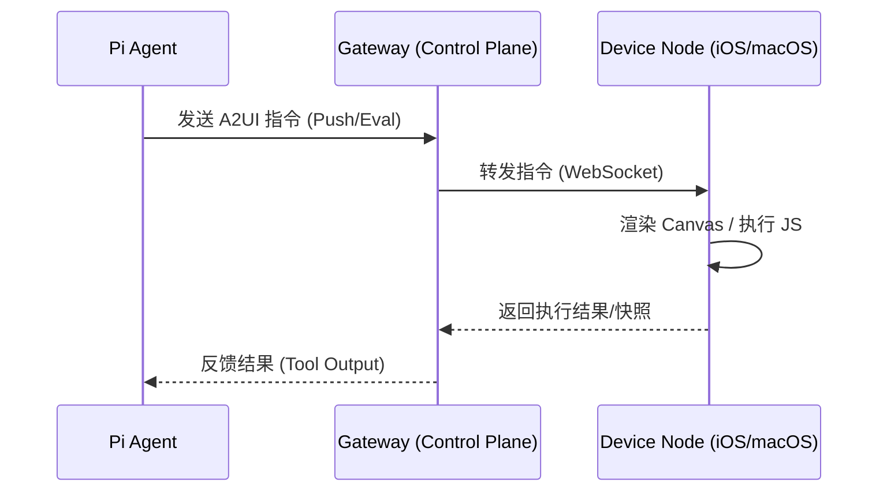

# OpenClaw Canvas A2UI 技术原理详解

> **文档日期**: 2026-02-02  
> **关联项目**: [[OpenClaw 深度调研报告]]  
> **技术领域**: Agent UI, WebSocket, Visualization

---

## 1. 概述

**Canvas** 是 OpenClaw 生态系统中用于实现 "Agent-Driven UI" (代理驱动界面) 的核心可视化工作区。它突破了传统 AI 代理仅能通过文本（Chat）交互的限制，允许代理在独立的画布上通过视觉元素、代码渲染和动态内容与用户进行交互。

**A2UI (Agent-to-UI)** 是支撑 Canvas 运行的底层通信协议，定义了代理（Agent）如何向前端界面（UI）推送内容、控制渲染以及接收反馈的标准接口。

## 2. 技术架构

Canvas 的架构设计遵循 OpenClaw 的 "Gateway-Node" 分布式模型，由控制平面、渲染端和生产端三部分组成。

### 2.1 架构组件

| 组件 | 角色 | 职责 | 技术实现 |
|------|------|------|----------|
| **Gateway** | Host (宿主) | 托管 Canvas 服务，处理 HTTP/WS 请求 | 运行于端口 `18793` (`http://<host>:18793/canvas`) |
| **Nodes** | Renderer (渲染器) | 在用户设备上实际显示 Canvas 界面 | macOS (Webview/Native), iOS (WKWebView), Android |
| **Agents** | Producer (生产者) | 生成 UI 内容并通过协议推送 | Pi Agent / LLM 通过工具调用生成 A2UI 指令 |

### 2.2 数据流向



---

## 3. A2UI 协议与能力

A2UI 协议主要通过 `canvas` 工具集暴露给代理，支持以下核心能力：

### 3.1 内容推送 (Push)
代理可以直接向 Canvas 推送文本或 HTML 片段，实现界面的实时更新。

- **指令**: `canvas a2ui push`
- **用途**: 显示像 Markdown 渲染、状态更新、图表等静态或半动态内容。

### 3.2 动态执行 (Eval)
允许代理在 Canvas 的上下文中执行 JavaScript 代码，实现高度动态的交互逻辑。

- **指令**: `canvas.eval`
- **参数**: `{"code": "..."}`
- **场景**: 绘制复杂图表（如 D3.js）、执行前端逻辑计算、操作 DOM 元素。

### 3.3 视觉反馈 (Snapshot)
代理可以随时获取 Canvas 当前的视觉状态（截图），用于验证渲染结果或进行多模态分析。

- **指令**: `canvas.snapshot`
- **机制**: 节点截取当前 Canvas 视图并回传图像数据。

### 3.4 导航控制 (Navigate)
控制 Canvas 加载特定的 URL，使其充当受控浏览器窗口。

- **指令**: `canvas.navigate`
- **参数**: `{"url": "https://..."}`

---

## 4. 平台支持与限制

Canvas 功能依赖于 Node 设备的本地能力（Capabilities），不同平台的实现存在差异：

### 4.1 macOS Node
- **能力**: 完整支持。
- **特性**: 支持屏幕录制、系统级通知与 Canvas 联动。
- **运行环境**: 桌面窗口环境，性能最强。

### 4.2 iOS Node
- **能力**: 支持 Canvas (WKWebView)。
- **限制**: 
  - **前台运行限制**: Canvas 命令通常需要 App 处于前台运行状态。
  - **系统限制**: 受限于 iOS 沙箱，无法进行系统级屏幕录制（仅限 App 内 Snapshot）。

### 4.3 Android Node
- **能力**: 支持 Canvas 渲染。
- **特性**: 支持位置服务与 Canvas 联动。

---

## 5. 开发者指南

### 5.1 CLI 调用示例
开发者可以通过 OpenClaw CLI 直接调试 A2UI 指令：

```bash
# 1. 向指定节点的 Canvas 推送文本
openclaw nodes canvas a2ui push --node <NodeID> --text "Hello from A2UI"

# 2. 在 Canvas 中执行 JavaScript (例如打印日志)
openclaw nodes invoke --node "<NodeName>" --command canvas.eval \
  --params '{"code":"console.log(\"Hello World\");"}'

# 3. 让 Canvas 导航到指定网页
openclaw nodes invoke --node "<NodeName>" --command canvas.navigate \
  --params '{"url":"https://example.com"}'

# 4. 获取当前 Canvas 截图
openclaw nodes invoke --node "<NodeName>" --command canvas.snapshot
```

### 5.2 Agent 工具定义
在 Agent 的工具链中，Canvas 操作通常被封装为以下工具定义（JSON Schema 简化版）：

```json
{
  "name": "canvas",
  "description": "Control the visual canvas workspace",
  "input_schema": {
    "type": "object",
    "properties": {
      "action": { "enum": ["push", "eval", "navigate", "snapshot"] },
      "content": { "type": "string", "description": "Text content or JS code" },
      "url": { "type": "string" }
    }
  }
}
```

---

## 6. 安全性考量

虽然 Canvas 被标记为 **低风险 (Low Risk)** 工具，但仍需注意以下安全边界：

1. **XSS 风险**: 由于支持 `canvas.eval` 执行任意 JS，需确保 Agent 生成的代码不包含恶意外部脚本加载逻辑。
2. **内容隔离**: Canvas 运行在沙箱化的 Webview 中，理论上无法直接访问宿主文件系统，除非通过特定的 Bridge 接口。
3. **权限控制**: 在 `tools.deny` 列表中添加 `canvas` 可完全禁用此功能。

---

## 7. 总结

Canvas A2UI 是 OpenClaw 区别于传统 CLI/Chatbot 的关键特性。它将 AI 的输出能力从"字符流"扩展到了"像素流"和"交互流"，为构建复杂的数据分析面板、实时监控仪表盘和交互式教学应用提供了基础设施支持。
