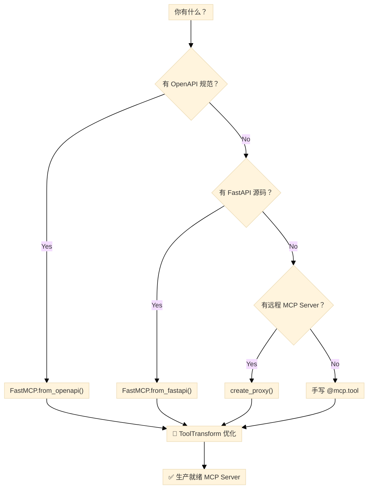

# API 映射到 MCP：FastMCP 2.0 编程指南

> **文档日期**：2026-02-10
> **适用版本**：FastMCP 2.0+（`pip install fastmcp`）
> **前置阅读**：[FastMCP 深度调研报告](FastMCP%20深度调研报告.md)
> **官方文档**：[gofastmcp.com](https://gofastmcp.com)

---

## 目录

1. [总览：三种 API → MCP 映射路径](#一总览三种-api--mcp-映射路径)
2. [路径一：从 OpenAPI 规范生成 MCP Server](#二路径一从-openapi-规范生成-mcp-server)
3. [路径二：从 FastAPI 应用生成 MCP Server](#三路径二从-fastapi-应用生成-mcp-server)
4. [路径三：代理远程 MCP Server](#四路径三代理远程-mcp-server)
5. [工具变换：优化 LLM 交互体验](#五工具变换优化-llm-交互体验)
6. [Server 组合与多源聚合](#六server-组合与多源聚合)
7. [端到端实战案例](#七端到端实战案例)
8. [AI Agent 映射决策树](#八ai-agent-映射决策树)
9. [最佳实践清单](#九最佳实践清单)

---

## 一、总览：三种 API → MCP 映射路径

FastMCP 2.0 提供三种将现有 API 自动转换为 MCP Server 的方式：

| 路径 | 入口方法 | 输入源 | 适用场景 |
|------|----------|--------|----------|
| **OpenAPI** | `FastMCP.from_openapi()` | OpenAPI 3.x JSON/YAML 规范 | 任何 HTTP API（无需源码） |
| **FastAPI** | `FastMCP.from_fastapi()` | FastAPI `app` 对象 | Python FastAPI 项目（有源码） |
| **代理** | `create_proxy()` | 远程 MCP Server URL | 转发/聚合已有 MCP Server |



> [!TIP]
> 无论选择哪条路径，最终都建议通过 **ToolTransform** 优化自动生成的工具定义，使其更适合 LLM 调用。

---

## 二、路径一：从 OpenAPI 规范生成 MCP Server

### 2.1 基本用法

只需一个 OpenAPI 规范（dict）和一个配置好的 `httpx.AsyncClient`：

```python
import httpx
from fastmcp import FastMCP

# 1. 加载 OpenAPI 规范
import json
with open("openapi.json") as f:
    openapi_spec = json.load(f)

# 2. 配置 HTTP 客户端（指向目标 API）
client = httpx.AsyncClient(base_url="https://api.example.com")

# 3. 一行生成 MCP Server
mcp = FastMCP.from_openapi(
    openapi_spec=openapi_spec,
    client=client,
    name="My API Server"
)

if __name__ == "__main__":
    mcp.run()
```

**默认行为**：所有 API 端点均转换为 MCP **Tool**。

### 2.2 路由映射规则（RouteMap）

使用 `RouteMap` 精确控制每个端点映射为哪种 MCP 组件：

```python
from fastmcp import FastMCP
from fastmcp.server.openapi import RouteMap, MCPType

mcp = FastMCP.from_openapi(
    openapi_spec=spec,
    client=client,
    route_maps=[
        # GET + 路径参数 → ResourceTemplate（动态数据查询）
        RouteMap(
            methods=["GET"],
            pattern=r".*\{.*\}.*",
            mcp_type=MCPType.RESOURCE_TEMPLATE
        ),
        # GET 无路径参数 → Resource（静态数据读取）
        RouteMap(
            methods=["GET"],
            pattern=r".*",
            mcp_type=MCPType.RESOURCE
        ),
        # 排除内部管理端点
        RouteMap(
            methods=["GET", "POST", "PUT", "DELETE"],
            pattern=r"^/internal/.*",
            mcp_type=MCPType.EXCLUDE
        ),
        # POST/PUT/DELETE → Tool（默认行为，可省略）
    ],
)
```

**RouteMap 参数说明**：

| 参数 | 类型 | 说明 |
|------|------|------|
| `methods` | `list[str]` | HTTP 方法列表，如 `["GET"]`, `["POST", "PUT"]` |
| `pattern` | `str` | 路径正则表达式，匹配 API 路径 |
| `tags` | `set[str]` | 按 OpenAPI tag 匹配路由 |
| `mcp_type` | `MCPType` | 目标 MCP 类型 |
| `mcp_tags` | `set[str]` | 为生成的组件添加自定义标签 |

**MCPType 枚举值**：

| 值 | 说明 |
|----|------|
| `MCPType.TOOL` | 可执行操作（LLM 可调用） |
| `MCPType.RESOURCE` | 静态数据端点（固定 URI） |
| `MCPType.RESOURCE_TEMPLATE` | 动态数据端点（含路径参数） |
| `MCPType.EXCLUDE` | 从 MCP Server 中排除 |

> [!IMPORTANT]
> `RouteMap` 按顺序匹配，**第一个匹配的规则生效**。把更具体的规则放在前面！

### 2.3 自定义路由映射函数（route_map_fn）

当 `RouteMap` 无法满足复杂逻辑时，使用自定义函数：

```python
from fastmcp.server.openapi import HTTPRoute, MCPType

def custom_route_mapper(route: HTTPRoute, default_type: MCPType) -> MCPType:
    """
    自定义路由映射逻辑。
    
    Args:
        route: HTTP 路由信息（method, path, tags, operationId 等）
        default_type: RouteMap 匹配后的默认类型
    
    Returns:
        最终的 MCPType
    """
    # 基于 operationId 的特殊处理
    if route.operation_id and "analytics" in route.operation_id:
        return MCPType.TOOL  # 分析类操作即使是 GET 也要暴露为 Tool
    
    # 基于 tag 的过滤
    if "deprecated" in (route.tags or []):
        return MCPType.EXCLUDE
    
    # 其他情况使用默认值
    return default_type

mcp = FastMCP.from_openapi(
    openapi_spec=spec,
    client=client,
    route_maps=[...],           # 先经过 RouteMap
    route_map_fn=custom_route_mapper,  # 再经过自定义函数
)
```

### 2.4 组件名称控制（mcp_names）

自动生成的工具名来源于 OpenAPI `operationId`，可能冗长。用 `mcp_names` 重命名：

```python
mcp = FastMCP.from_openapi(
    openapi_spec=spec,
    client=client,
    mcp_names={
        "list_users__with_pagination": "user_list",
        "create_user__admin_required": "create_user",
        "get_user_details__admin_required": "user_detail",
    }
)
```

**命名规则**（自动应用）：

- **Slugified**：空格和特殊字符 → 下划线
- **截断**：最长 56 字符
- **去重**：重名自动追加数字后缀

### 2.5 高级组件自定义（mcp_component_fn）

在组件生成后进一步修改其属性：

```python
from fastmcp.server.openapi import (
    HTTPRoute,
    OpenAPITool,
    OpenAPIResource,
    OpenAPIResourceTemplate,
)

def customize_components(
    route: HTTPRoute,
    component: OpenAPITool | OpenAPIResource | OpenAPIResourceTemplate,
) -> None:
    """在组件创建后自定义其属性。直接修改 component，无需返回值。"""
    
    # 为所有组件添加统一标签
    component.tags.add("openapi")
    
    # 按类型定制描述
    if isinstance(component, OpenAPITool):
        component.description = f"🔧 {component.description} (via API)"
    if isinstance(component, OpenAPIResource):
        component.description = f"📊 {component.description}"
        component.tags.add("data")

mcp = FastMCP.from_openapi(
    openapi_spec=spec,
    client=client,
    mcp_component_fn=customize_components,
)
```

### 2.6 认证配置

```python
import httpx

# Bearer Token
client = httpx.AsyncClient(
    base_url="https://api.example.com",
    headers={"Authorization": "Bearer your-token"}
)

# API Key
client = httpx.AsyncClient(
    base_url="https://api.example.com",
    headers={"X-API-Key": "your-api-key"}
)

# OAuth2（httpx 的 Auth 机制）
from httpx import BasicAuth
client = httpx.AsyncClient(
    base_url="https://api.example.com",
    auth=BasicAuth(username="user", password="pass")
)

mcp = FastMCP.from_openapi(openapi_spec=spec, client=client)
```

### 2.7 标签系统

```python
# 全局标签（所有组件）
mcp = FastMCP.from_openapi(
    openapi_spec=spec,
    client=client,
    tags={"api-v2", "production", "external"}
)

# 按路由标签（通过 RouteMap）
mcp = FastMCP.from_openapi(
    openapi_spec=spec,
    client=client,
    route_maps=[
        RouteMap(
            methods=["POST"],
            pattern=r".*",
            mcp_type=MCPType.TOOL,
            mcp_tags={"write-operation", "api-mutation"}
        ),
    ],
)
```

---

## 三、路径二：从 FastAPI 应用生成 MCP Server

### 3.1 基本转换

```python
from fastapi import FastAPI
from fastmcp import FastMCP

# 已有的 FastAPI 应用
app = FastAPI(title="E-commerce API")

@app.get("/products")
def list_products(category: str | None = None):
    """List all products with optional filtering."""
    ...

@app.get("/products/{product_id}")
def get_product(product_id: int):
    """Get a specific product by ID."""
    ...

@app.post("/products")
def create_product(name: str, price: float):
    """Create a new product."""
    ...

# ✅ 一行转换
mcp = FastMCP.from_fastapi(app=app)

if __name__ == "__main__":
    mcp.run()
```

**默认行为**：所有 FastAPI 路由均转为 MCP **Tool**。工具名格式为 `{函数名}_{路径}_{方法}`，如 `list_products_products_get`。

### 3.2 自定义路由映射

`from_fastapi` 支持与 `from_openapi` 完全相同的 `RouteMap` 配置：

```python
from fastmcp import FastMCP
from fastmcp.server.openapi import RouteMap, MCPType

mcp = FastMCP.from_fastapi(
    app=app,
    route_maps=[
        # GET + 路径参数 → ResourceTemplate
        RouteMap(
            methods=["GET"],
            pattern=r".*\{.*\}.*",
            mcp_type=MCPType.RESOURCE_TEMPLATE
        ),
        # GET → Resource
        RouteMap(
            methods=["GET"],
            pattern=r".*",
            mcp_type=MCPType.RESOURCE
        ),
        # POST/PUT/DELETE → Tool（默认）
    ],
)

# 映射结果：
# GET /products        → Resource
# GET /products/{id}   → ResourceTemplate
# POST /products       → Tool
# PUT /products/{id}   → Tool
# DELETE /products/{id} → Tool
```

### 3.3 混合使用：FastAPI 路由 + 手动工具

转换后的 MCP Server 仍可添加自定义工具：

```python
mcp = FastMCP.from_fastapi(app=app)

# 在自动生成的基础上追加手写工具
@mcp.tool
def search_products(query: str, max_price: float = None) -> list[dict]:
    """Search products by keyword with optional price filter.
    
    This provides a more LLM-friendly search interface than
    the raw API endpoints.
    """
    # 自定义实现
    ...
```

### 3.4 认证配置

通过 `httpx_client_kwargs` 传递认证头：

```python
mcp = FastMCP.from_fastapi(
    app=app,
    httpx_client_kwargs={
        "headers": {
            "Authorization": "Bearer secret-token",
        }
    }
)
```

### 3.5 FastAPI vs OpenAPI 路径对比

| 维度 | `from_fastapi()` | `from_openapi()` |
|------|-------------------|-------------------|
| **输入** | FastAPI `app` 对象 | OpenAPI spec dict |
| **需要源码** | ✅ 是 | ❌ 否 |
| **底层机制** | 从 app 提取 OpenAPI → 内部调用 `from_openapi` | 直接使用 OpenAPI spec |
| **HTTP 客户端** | 自动创建（ASGI 内存传输） | 需手动配置 `httpx.AsyncClient` |
| **适用场景** | Python 项目快速原型 | 任何语言的 HTTP API |
| **生产建议** | 适合原型验证 | 复杂 API 首选 |

> [!WARNING]
> 官方文档建议：`from_fastapi()` 和 `from_openapi()` 非常适合**快速原型验证（bootstrapping）**。但对于复杂 API，**手动策划的 MCP 工具通常能提供更好的 LLM 体验**。自动生成 → ToolTransform 优化 → 逐步替换为手写工具，是推荐的渐进式路径。

---

## 四、路径三：代理远程 MCP Server

### 4.1 基本代理

```python
from fastmcp.server import create_proxy

# 将远程 HTTP MCP Server 代理到本地 stdio
proxy = create_proxy("http://example.com/mcp", name="MyProxy")

if __name__ == "__main__":
    proxy.run()  # 默认 stdio 传输
```

### 4.2 传输桥接

```python
from fastmcp.server import create_proxy

# HTTP → stdio（远程服务 → 本地 Claude Desktop）
http_proxy = create_proxy(
    "http://example.com/mcp/sse",
    name="HTTP-to-stdio"
)
http_proxy.run()  # stdio

# stdio → HTTP（本地脚本 → 远程网络服务）
local_proxy = create_proxy(
    "local_server.py",
    name="stdio-to-HTTP"
)
local_proxy.run(transport="http", host="0.0.0.0", port=8080)
```

### 4.3 多源聚合

```python
from fastmcp.server import create_proxy

config = {
    "mcpServers": {
        "weather": {
            "url": "https://weather-api.example.com/mcp",
            "transport": "http"
        },
        "calendar": {
            "url": "https://calendar-api.example.com/mcp",
            "transport": "http"
        }
    }
}

# 创建统一代理，工具自动加前缀：
#   weather_get_forecast
#   calendar_add_event
composite = create_proxy(config, name="Composite")
```

### 4.4 会话隔离

```python
from fastmcp.server import create_proxy

# 默认：每个请求创建独立的后端会话（推荐）
proxy = create_proxy("backend_server.py")

# Client A 调用工具 → 隔离会话
# Client B 调用工具 → 不同会话
# 无上下文泄漏
```

---

## 五、工具变换：优化 LLM 交互体验

自动生成的工具往往命名冗长、参数含糊。**ToolTransform** 让你在不修改原始代码的前提下优化工具定义。

### 5.1 ToolTransform（服务器级别）

对已注册的工具进行批量变换：

```python
from fastmcp import FastMCP
from fastmcp.server.transforms import ToolTransform
from fastmcp.tools.tool_transform import ToolTransformConfig

mcp = FastMCP("Server")

@mcp.tool
def verbose_internal_data_fetcher(query: str) -> str:
    """Fetches data from the internal database."""
    return f"Results for: {query}"

# 重命名工具 + 优化描述
mcp.add_transform(ToolTransform({
    "verbose_internal_data_fetcher": ToolTransformConfig(
        name="search",
        description="Search the database.",
    )
}))

# 客户端看到的是 "search"，而非原始冗长名称
```

### 5.2 Tool.from_tool()（创建前变换）

在注册前变换工具，支持参数级操作：

```python
from fastmcp import FastMCP
from fastmcp.tools import Tool, tool
from fastmcp.tools.tool_transform import ArgTransform

@tool
def search(q: str, limit: int = 10) -> list[str]:
    """Search for items."""
    return [f"Result {i} for {q}" for i in range(limit)]

# 变换参数名和描述
better_search = Tool.from_tool(
    search,
    name="find_items",
    description="Find items matching your search query.",
    transform_args={
        "q": ArgTransform(
            name="query",
            description="The search terms to look for.",
        ),
    },
)

mcp = FastMCP("Server")
mcp.add_tool(better_search)
```

### 5.3 参数变换选项（ArgTransform）

| 属性 | 类型 | 说明 |
|------|------|------|
| `name` | `str` | 重命名参数 |
| `description` | `str` | 参数描述 |
| `default` | `Any` | 默认值 |
| `default_factory` | `Callable` | 动态默认值 |
| `hide` | `bool` | 从 LLM 隐藏此参数 |
| `required` | `bool` | 是否必填 |
| `type` | `type` | 覆盖类型 |
| `examples` | `list` | 示例值 |

### 5.4 隐藏敏感参数

```python
from fastmcp.tools.tool_transform import ArgTransform
import uuid

transform_args = {
    # 隐藏 API Key（使用固定值）
    "api_key": ArgTransform(hide=True, default="secret-key"),
    
    # 隐藏 request_id（每次动态生成）
    "request_id": ArgTransform(
        hide=True,
        default_factory=lambda: str(uuid.uuid4())
    ),
}
```

> [!TIP]
> `hide=True` 的参数对 LLM 完全不可见，但调用时会自动注入默认值。非常适合认证凭据、跟踪 ID 等内部参数。

### 5.5 自定义变换函数（transform_fn）

在工具外层包装业务逻辑（如输入校验、结果格式化）：

```python
from fastmcp import FastMCP
from fastmcp.tools import Tool, tool
from fastmcp.tools.tool_transform import forward, ArgTransform

@tool
def divide(a: float, b: float) -> float:
    """Divide a by b."""
    return a / b

# 包装函数：添加除零检查 + 重命名参数
async def safe_divide(numerator: float, denominator: float) -> float:
    if denominator == 0:
        raise ValueError("Cannot divide by zero")
    # forward() 调用原始工具
    return await forward(numerator=numerator, denominator=denominator)

safe_division = Tool.from_tool(
    divide,
    name="safe_divide",
    transform_fn=safe_divide,
    transform_args={
        "a": ArgTransform(name="numerator"),
        "b": ArgTransform(name="denominator"),
    },
)

mcp = FastMCP("Server")
mcp.add_tool(safe_division)
```

**关键**：`forward()` 是 FastMCP 提供的函数，用于在 `transform_fn` 内调用原始工具，自动处理参数名映射。

### 5.6 变换的执行顺序

```
Provider 原始工具 → [Transform A] → [Transform B] → 客户端看到的工具
```

多个 Transform 按添加顺序依次执行：

```python
from fastmcp.server.providers import FastMCPProvider
from fastmcp.server.transforms import Namespace, ToolTransform
from fastmcp.tools.tool_transform import ToolTransformConfig

provider = FastMCPProvider(server)
provider.add_transform(Namespace("api"))     # 第一步：加前缀
provider.add_transform(ToolTransform({       # 第二步：重命名
    "api_verbose_name": ToolTransformConfig(name="short"),
}))

# 流程："verbose_name" → "api_verbose_name" → "short"
```

---

## 六、Server 组合与多源聚合

### 6.1 mount() 组合子服务器

```python
from fastmcp import FastMCP

# 按领域拆分子服务器
user_server = FastMCP("Users")
@user_server.tool
def list_users() -> list:
    ...

order_server = FastMCP("Orders")
@order_server.tool
def create_order(user_id: str, items: list) -> dict:
    ...

# 组合为统一服务器
main = FastMCP("E-Commerce Platform")
main.mount(user_server, prefix="users")    # → users_list_users
main.mount(order_server, prefix="orders")  # → orders_create_order
```

### 6.2 组合自动生成的服务器

```python
import httpx
from fastmcp import FastMCP

# 从不同 API 各生成一个 MCP Server
with open("users_api.json") as f:
    users_spec = json.load(f)
users_mcp = FastMCP.from_openapi(
    openapi_spec=users_spec,
    client=httpx.AsyncClient(base_url="https://users-api.example.com"),
    name="Users"
)

with open("orders_api.json") as f:
    orders_spec = json.load(f)
orders_mcp = FastMCP.from_openapi(
    openapi_spec=orders_spec,
    client=httpx.AsyncClient(base_url="https://orders-api.example.com"),
    name="Orders"
)

# 组合
main = FastMCP("Platform")
main.mount(users_mcp, prefix="users")
main.mount(orders_mcp, prefix="orders")

# 添加自定义聚合工具
@main.tool
def get_user_orders(user_id: str) -> dict:
    """Get a user's information and their orders in one call."""
    ...
```

### 6.3 Namespace 变换

```python
from fastmcp.server.transforms import Namespace

mcp = FastMCP("Server")

@mcp.tool
def greet(name: str) -> str:
    return f"Hello, {name}!"

mcp.add_transform(Namespace("v1"))
# 工具名变为: v1_greet
```

---

## 七、端到端实战案例

### 案例：将电商 REST API 转为 LLM 友好的 MCP Server

**场景**：你有一个产品管理 REST API，需要让 AI Agent 能够查询和管理产品。

```python
import json
import httpx
from fastmcp import FastMCP
from fastmcp.server.openapi import RouteMap, MCPType
from fastmcp.server.transforms import ToolTransform
from fastmcp.tools.tool_transform import ToolTransformConfig, ArgTransform

# === 步骤 1：加载 OpenAPI 规范 ===
with open("ecommerce_openapi.json") as f:
    spec = json.load(f)

# === 步骤 2：配置 HTTP 客户端 ===
client = httpx.AsyncClient(
    base_url="https://api.shop.example.com",
    headers={"Authorization": "Bearer prod-token-xxx"}
)

# === 步骤 3：路由映射 ===
mcp = FastMCP.from_openapi(
    openapi_spec=spec,
    client=client,
    name="E-Commerce MCP",
    route_maps=[
        # 产品列表 → Resource（稳定数据，可缓存）
        RouteMap(
            methods=["GET"],
            pattern=r"^/products$",
            mcp_type=MCPType.RESOURCE
        ),
        # 产品详情 → ResourceTemplate
        RouteMap(
            methods=["GET"],
            pattern=r"^/products/\{.*\}$",
            mcp_type=MCPType.RESOURCE_TEMPLATE
        ),
        # 排除内部端点
        RouteMap(
            methods=["GET", "POST", "PUT", "DELETE"],
            pattern=r"^/(internal|health|metrics)/.*",
            mcp_type=MCPType.EXCLUDE
        ),
    ],
    # 重命名冗长的 operationId
    mcp_names={
        "list_products_with_filters": "list_products",
        "get_product_by_id": "get_product",
        "create_new_product": "create_product",
    },
    # 全局标签
    tags={"ecommerce", "v2"},
)

# === 步骤 4：ToolTransform 优化 ===
mcp.add_transform(ToolTransform({
    "create_product": ToolTransformConfig(
        description=(
            "Create a new product in the catalog. "
            "Requires name, price (USD), and category."
        ),
    ),
}))

# === 步骤 5：添加聚合工具 ===
@mcp.tool
async def search_products(
    query: str,
    category: str | None = None,
    max_price: float | None = None,
    limit: int = 10,
) -> list[dict]:
    """Search products by keyword with optional filters.
    
    Args:
        query: Search keywords (e.g., 'wireless keyboard')
        category: Filter by category (e.g., 'Electronics')
        max_price: Maximum price in USD
        limit: Max results to return (default 10)
    """
    params = {"q": query, "limit": limit}
    if category:
        params["category"] = category
    if max_price:
        params["max_price"] = max_price
    
    response = await client.get("/products/search", params=params)
    return response.json()["results"]

# === 步骤 6：运行 ===
if __name__ == "__main__":
    mcp.run()
```

---

## 八、AI Agent 映射决策树

以下决策流程帮助 AI Agent 自动选择最优映射路径：

```
输入：用户提供的 API 接口信息

1. 解析输入类型
   ├── OpenAPI spec (JSON/YAML)  → 路径一
   ├── FastAPI app 源码           → 路径二
   ├── MCP Server URL            → 路径三
   └── 普通 Python 函数           → @mcp.tool 手动注册

2. 确定路由映射策略
   ├── GET + 无路径参数  → Resource
   ├── GET + 有路径参数  → ResourceTemplate
   ├── POST/PUT/DELETE   → Tool
   └── 内部/管理端点     → Exclude

3. 命名优化
   ├── operationId 冗长  → mcp_names 重命名
   ├── 参数名不直观      → ArgTransform 重命名
   └── 缺少描述          → ToolTransformConfig 补充

4. 安全处理
   ├── 认证凭据          → httpx headers / ArgTransform(hide=True)
   ├── 敏感端点          → MCPType.EXCLUDE
   └── 速率限制          → 中间件

5. 验证
   └── fastmcp dev server.py → Inspector 交互测试
```

---

## 九、最佳实践清单

### 映射策略

- [x] **GET 端点优先映射为 Resource/ResourceTemplate**，而非 Tool
- [x] **写操作（POST/PUT/DELETE）映射为 Tool**
- [x] **内部/管理端点用 `MCPType.EXCLUDE` 排除**
- [x] **路由规则按从特殊到通用的顺序排列**

### 命名规范

- [x] 工具名使用 `snake_case`，尽量简洁（如 `search_products` 而非 `list_products_with_filters_v2`）
- [x] 参数名对 LLM 有语义（`query` 而非 `q`）
- [x] 每个工具的 `description` 必须清晰说明用途和参数

### 安全

- [x] 认证凭据通过 `httpx` headers 或 `ArgTransform(hide=True)` 注入
- [x] 敏感端点不暴露给 LLM
- [x] 使用中间件实现速率限制和访问控制

### LLM 优化

- [x] 自动生成后**必须**用 ToolTransform 优化工具描述
- [x] 参数添加 `description` 和 `examples`
- [x] 单一职责：每个工具做一件事
- [x] 提供聚合工具（一次调用完成多步操作）

### 渐进式演进

```
Phase 1: from_openapi() / from_fastapi() → 快速原型
Phase 2: ToolTransform 优化 → 提升 LLM 体验
Phase 3: 手动策划关键工具 → 生产级质量
```

---

## 参考来源

| # | 来源 | 链接 |
|---|------|------|
| 1 | FastMCP OpenAPI 集成 | [gofastmcp.com/integrations/openapi](https://gofastmcp.com/integrations/openapi) |
| 2 | FastMCP FastAPI 集成 | [gofastmcp.com/integrations/fastapi](https://gofastmcp.com/integrations/fastapi) |
| 3 | FastMCP Tool Transformation | [gofastmcp.com/servers/transforms/tool-transformation](https://gofastmcp.com/servers/transforms/tool-transformation) |
| 4 | FastMCP Transforms Overview | [gofastmcp.com/patterns/tool-transformation](https://gofastmcp.com/patterns/tool-transformation) |
| 5 | FastMCP Proxy Provider | [gofastmcp.com/servers/proxy](https://gofastmcp.com/servers/proxy) |
| 6 | FastMCP Tools | [gofastmcp.com/servers/tools](https://gofastmcp.com/servers/tools) |
| 7 | FastMCP GitHub | [github.com/jlowin/fastmcp](https://github.com/jlowin/fastmcp) |
