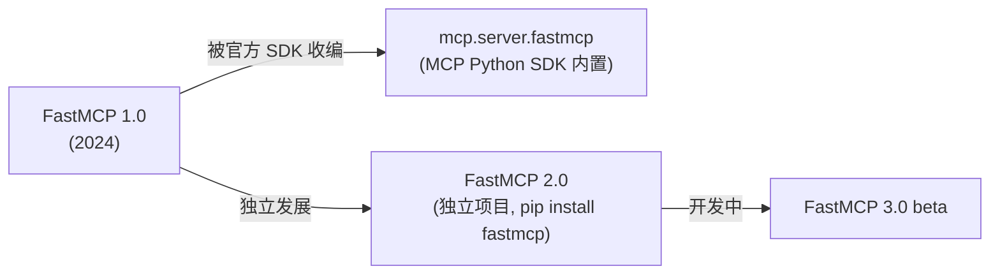

# FastMCP 深度调研报告

> **调研日期**：2026-02-10
> **官方仓库**：[jlowin/fastmcp](https://github.com/jlowin/fastmcp)
> **官方文档**：[gofastmcp.com](https://gofastmcp.com)
> **PyPI**：[fastmcp](https://pypi.org/project/fastmcp/)
> **当前版本**：v2.x（稳定）/ v3.0.0-beta（开发中）

---

## 一、FastMCP 是什么

FastMCP 是 **Python 生态中构建 MCP（Model Context Protocol）Server 和 Client 的标准框架**。它提供高层抽象的 Pythonic API，让开发者只需关注业务逻辑，协议层（序列化、错误处理、传输、合规）全部由框架自动处理。

### 核心定位

| 维度 | 说明 |
|------|------|
| **本质** | MCP Python SDK 的高层封装框架 |
| **类比** | 相当于 MCP 协议的 "FastAPI"——用装饰器定义工具，自动生成 schema |
| **口号** | *"The fast, Pythonic way to build MCP servers and clients"* |
| **规模** | 日均下载量超 100 万次，约 70% 的 MCP Server（跨语言）由某版本的 FastMCP 驱动 |

### 历史演进



- **FastMCP 1.0（2024）**：被 Anthropic 采纳，整合进官方 MCP Python SDK（`from mcp.server.fastmcp import FastMCP`）
- **FastMCP 2.0（2025）**：独立维护，大幅扩展功能——Server 组合、代理、OpenAPI/FastAPI 生成、认证、部署工具、客户端库
- **FastMCP 3.0（beta）**：进一步架构迭代

> [!IMPORTANT]
> `mcp.server.fastmcp`（SDK 内置）= FastMCP 1.0。独立安装的 `pip install fastmcp` = FastMCP 2.x 版本，功能远超 SDK 内置版。

---

## 二、为什么选择 FastMCP

### 与 MCP Python SDK 低级 API 对比

| 维度 | MCP Python SDK (Low-Level `Server()`) | FastMCP (`FastMCP()`) |
|------|---------------------------------------|------------------------|
| **定义工具** | 手写 `@server.list_tools()` + JSON Schema | `@mcp.tool` 装饰器自动推断 |
| **类型处理** | 手动 schema 定义 | 自动从 Python 类型提示生成 |
| **错误处理** | 手动构建错误响应 | 内置 `ToolError`，自动遮蔽内部错误 |
| **代码量** | 多 3-5x 样板代码 | 极简 |
| **组合 / 代理** | 无原生支持 | 内置 `mount()` / `as_proxy()` |
| **认证** | 需自行实现 | 内置 Google / GitHub / Azure / Auth0 等 |
| **适用场景** | 需要最大控制力、极端定制 | 快速开发、生产部署 |

**推荐策略**：优先使用 FastMCP，只有当抽象阻碍了特定需求（如运行时动态注册工具）时，才降级到 Low-Level API。

---

## 三、核心概念

MCP 协议定义了三种核心原语（Primitives），FastMCP 对每种都提供了装饰器：

### 3.1 Tools（工具）

**LLM 可调用的函数**——执行操作、查询外部系统。

```python
from fastmcp import FastMCP

mcp = FastMCP("Calculator 🧮")

@mcp.tool
def add(a: int, b: int) -> int:
    """Add two numbers together."""
    return a + b

@mcp.tool
async def fetch_weather(city: str) -> dict:
    """Fetch current weather for a city."""
    # async 函数同样支持
    return {"city": city, "temp": 22}
```

**工作原理**：

- 函数名 → 工具名
- 类型提示 → JSON Schema 参数定义
- docstring → 工具描述（LLM 用来理解用途）

### 3.2 Resources（资源）

**暴露数据给 LLM**——类似 REST API 的 GET 端点。

```python
@mcp.resource("config://app/settings")
def get_settings() -> dict:
    """Return application settings."""
    return {"theme": "dark", "language": "zh-CN"}

# 资源模板（动态路径）
@mcp.resource("users://{user_id}/profile")
def get_profile(user_id: str) -> dict:
    return load_user_profile(user_id)
```

### 3.3 Prompts（提示模板）

**可复用的 LLM 提示模板**——引导模型行为。

```python
from fastmcp.prompts.prompt import PromptMessage, TextContent

@mcp.prompt
def code_review(code: str, language: str = "python") -> list[PromptMessage]:
    """Review code and suggest improvements."""
    return [
        PromptMessage(
            role="user",
            content=TextContent(
                type="text",
                text=f"Review this {language} code:\n\n{code}"
            )
        )
    ]
```

---

## 四、进阶特性

### 4.1 Server 组合（Composition）

通过 `mount()` 将多个 MCP Server 组合成一个，实现模块化架构：

```python
# 子服务器
math_server = FastMCP("Math")
@math_server.tool
def multiply(a: int, b: int) -> int:
    return a * b

# 父服务器
main_server = FastMCP("Main")
main_server.mount(math_server, prefix="math")

# 客户端调用时工具名为: math_multiply
```

### 4.2 代理 / 网关（Proxy）

一个 FastMCP Server 可以作为另一个 Server 的前端代理：

```python
from fastmcp import FastMCP, Client
from fastmcp.client.auth import BearerAuth

client = Client(
    "https://api.example.com/mcp/sse",
    auth=BearerAuth(token="your-token")
)
proxy = FastMCP.as_proxy(client, name="API Gateway")
proxy.run()
```

### 4.3 中间件（Middleware）

在请求链路中插入横切关注点：

```python
parent = FastMCP("Parent")
parent.add_middleware(AuthenticationMiddleware("token"))

child = FastMCP("Child")
child.add_middleware(LoggingMiddleware())

@child.tool
def protected_tool() -> str:
    return "secure data"

parent.mount(child, prefix="secure")
# 请求 secure_protected_tool 时，依次经过 Parent 中间件 → Child 中间件
```

### 4.4 企业级认证

内置常见 OAuth 提供商集成：

- Google
- GitHub
- Azure AD
- Auth0
- WorkOS

### 4.5 传输方式

| 传输 | 说明 | 适用场景 |
|------|------|----------|
| **stdio** | 标准输入输出 | 本地集成（Claude Desktop 等） |
| **SSE** | Server-Sent Events over HTTP | 远程连接、Web 部署 |
| **Streamable HTTP** | 新一代 HTTP 传输 | 现代生产部署 |

### 4.6 OpenAPI / FastAPI 集成

可以直接从现有 OpenAPI 规范或 FastAPI 应用自动生成 MCP Server——无需重写业务逻辑。

### 4.7 工具变换（Tool Transformation）

可以在不修改原始工具代码的情况下，对工具进行变换（重命名、添加前缀、修改参数等）。

---

## 五、最佳实践

### 5.1 项目结构

```
my_mcp_server/
├── server.py          # FastMCP 实例 + 入口
├── tools/
│   ├── __init__.py
│   ├── math_tools.py  # 按领域拆分工具
│   └── data_tools.py
├── resources/
│   └── config.py
├── prompts/
│   └── templates.py
└── pyproject.toml
```

### 5.2 工具设计原则

1. **清晰的函数签名** —— 使用具体类型提示（`int`, `str`, `list[str]`），不用 `Any`
2. **详细的 docstring** —— 这是 LLM 理解工具用途的唯一依据
3. **单一职责** —— 每个工具做一件事，LLM 更容易正确选择
4. **优雅的错误处理** —— 使用 `ToolError` 返回用户友好的错误信息

```python
from fastmcp.exceptions import ToolError

@mcp.tool
def get_user(user_id: str) -> dict:
    """Retrieve user information by their unique ID.
    
    Args:
        user_id: The unique identifier for the user (e.g., 'usr_12345')
    
    Returns:
        User profile including name, email, and role.
    """
    user = db.find_user(user_id)
    if not user:
        raise ToolError(f"User '{user_id}' not found")  # LLM 可见的错误
    return user
```

### 5.3 异步优先

当工具涉及 I/O 操作（网络请求、数据库查询、文件读写）时，使用 `async def`：

```python
@mcp.tool
async def search_documents(query: str, limit: int = 10) -> list[dict]:
    """Search documents by keyword."""
    async with httpx.AsyncClient() as client:
        response = await client.get(f"{API}/search", params={"q": query, "limit": limit})
        return response.json()["results"]
```

### 5.4 测试

FastMCP 内置测试工具——使用 MCP Inspector 进行交互式调试：

```bash
# 启动 MCP Inspector（Web 调试界面）
fastmcp dev server.py

# 访问 http://127.0.0.1:6274 进行交互测试
```

也可以用 Client 编写自动化测试：

```python
from fastmcp import Client

async def test_add_tool():
    async with Client(mcp) as client:
        result = await client.call_tool("add", {"a": 2, "b": 3})
        assert result == 5
```

### 5.5 部署

```bash
# 本地开发（stdio 模式，搭配 Claude Desktop）
python server.py

# 远程部署（SSE/HTTP 模式）
fastmcp run server.py --transport sse --host 0.0.0.0 --port 8000
```

**Claude Desktop 配置示例**（`claude_desktop_config.json`）：

```json
{
  "mcpServers": {
    "my-server": {
      "command": "uv",
      "args": ["run", "server.py"]
    }
  }
}
```

### 5.6 Server 组合最佳实践

- **按领域拆分**：每个子 Server 负责一个业务域
- **统一认证层**：在 Parent Server 添加 Auth 中间件
- **前缀命名规范**：使用语义化前缀（`db_`, `api_`, `file_`）

---

## 六、典型使用场景

| 场景 | 说明 |
|------|------|
| **数据库查询** | 将 SQL 查询暴露为工具，LLM 可自然语言查数据 |
| **API 网关** | 将现有 REST API 代理为 MCP Server |
| **文件系统** | 让 LLM 读写本地或远程文件 |
| **知识库检索** | 结合 RAG，暴露向量搜索工具 |
| **DevOps 自动化** | CI/CD 操作、容器管理、日志查询 |
| **内部工具平台** | 多个微服务的 MCP Server 组合为统一入口 |

---

## 七、快速开始

### 安装

```bash
# 推荐使用 uv（更快）
uv pip install fastmcp

# 或 pip
pip install fastmcp
```

### 最小可运行示例

```python
# server.py
from fastmcp import FastMCP

mcp = FastMCP("My First Server 🚀")

@mcp.tool
def greet(name: str) -> str:
    """Greet someone by name."""
    return f"Hello, {name}! Welcome to MCP."

@mcp.resource("info://server/status")
def server_status() -> dict:
    """Return server status information."""
    return {"status": "running", "version": "1.0.0"}

if __name__ == "__main__":
    mcp.run()
```

```bash
# 运行
python server.py

# 调试（启动 Inspector Web UI）
fastmcp dev server.py
```

---

## 八、总结

| 方面 | 结论 |
|------|------|
| **成熟度** | ⭐⭐⭐⭐⭐ — MCP Python 生态事实标准 |
| **易用性** | ⭐⭐⭐⭐⭐ — 装饰器 + 类型提示，零样板代码 |
| **生产就绪** | ⭐⭐⭐⭐ — 内置认证、部署、中间件 |
| **社区** | ⭐⭐⭐⭐ — Discord 社区活跃，日下载 100 万+ |
| **文档** | ⭐⭐⭐⭐ — 官方文档清晰，教程丰富 |

**一句话总结**：如果你用 Python 构建 MCP Server，FastMCP 是唯一推荐。它让你只写业务逻辑，MCP 协议的一切复杂性由框架处理。

---

## 参考来源

| # | 来源 | 类型 | 链接 |
|---|------|------|------|
| 1 | FastMCP GitHub | 官方仓库 | [github.com/jlowin/fastmcp](https://github.com/jlowin/fastmcp) |
| 2 | FastMCP 官方文档 | 官方文档 | [gofastmcp.com](https://gofastmcp.com) |
| 3 | PyPI - fastmcp | 包管理 | [pypi.org/project/fastmcp](https://pypi.org/project/fastmcp/) |
| 4 | MCP 官方 - Build Server | 官方教程 | [modelcontextprotocol.io](https://modelcontextprotocol.io/docs/develop/build-server) |
| 5 | DataCamp Tutorial | 教程 | [datacamp.com](https://www.datacamp.com/tutorial/building-mcp-server-client-fastmcp) |
| 6 | Firecrawl Tutorial | 教程 | [firecrawl.dev](https://www.firecrawl.dev/blog/fastmcp-tutorial-building-mcp-servers-python) |
| 7 | MCPCat Guide | 教程 | [mcpcat.io](https://mcpcat.io/guides/building-mcp-server-python-fastmcp/) |
| 8 | Real Python MCP | 教程 | [realpython.com](https://realpython.com/python-mcp/) |
| 9 | Kelen - FastMCP vs SDK | 对比分析 | [en.kelen.cc](https://en.kelen.cc/posts/fastmcp) |
| 10 | Reddit 社区讨论 | 社区 | [r/mcp](https://www.reddit.com/r/mcp/comments/1i282ii/fastmcp_vs_server_with_python_sdk/) |
