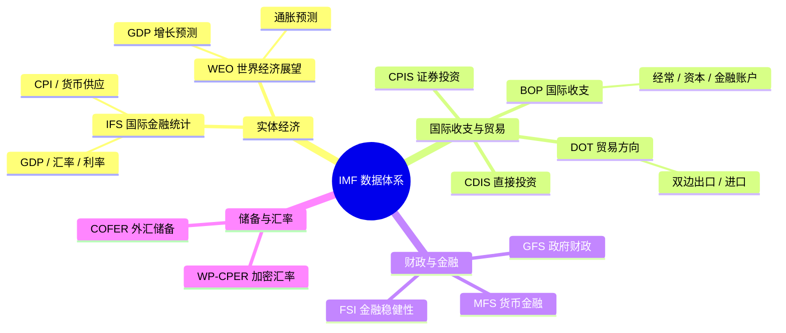
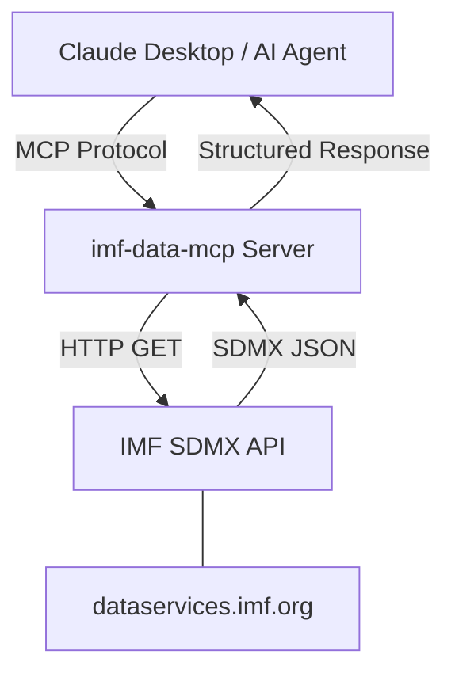

# AI Agent 集成 IMF Data 完全指南

> **调研日期**: 2026-02-11
> **调研员**: Digital Ray
> **调研目标**: 评估 IMF Data MCP Server 在财经分析和 AI Agent 应用中的价值
> **数据来源**: IMF Data Portal, GitHub, 海关总署, Reuters, CNBC

---

## 一、IMF 数据体系概述

**国际货币基金组织 (IMF)** 拥有 190 个成员国，其数据体系是全球宏观经济和金融统计数据的核心来源。数据门户已升级至 [data.imf.org](https://data.imf.org/en)，通过 **SDMX** 标准协议提供数据访问。

### 1.1 数据覆盖范围

IMF 数据体系覆盖五大核心领域：

- **宏观经济指标** — GDP、通胀率、失业率、汇率
- **国际收支与贸易** — 进出口数据、资本流动、国际投资头寸
- **财政与货币政策** — 政府财政收支、货币供应量、利率
- **金融稳健性** — 银行资本充足率、不良贷款率
- **外汇储备** — 全球外汇储备货币构成

### 1.2 核心数据集关系概念图



### 1.3 IMF 数据集完整清单

| 数据集 | 全称 | 核心内容 | 频率 |
| --- | --- | --- | --- |
| **IFS** | International Financial Statistics | 汇率、利率、货币供应量、GDP、CPI | 月/季 |
| **WEO** | World Economic Outlook | 全球经济预测，1980 年至今+未来 5 年 | 半年 |
| **BOP** | Balance of Payments | 经常账户、资本账户、金融账户 | 季/年 |
| **DOT** | Direction of Trade Statistics | 双边贸易数据（出口、进口） | 月/季 |
| **GFS** | Government Finance Statistics | 政府收支、债务、资产负债表 | 年度 |
| **MFS** | Monetary and Financial Statistics | 央行、商业银行资产负债表 | 月度 |
| **FSI** | Financial Soundness Indicators | 银行资本充足率、不良贷款率 | 季度 |
| **CDIS** | Coordinated Direct Investment Survey | 跨境 FDI 头寸 | 年度 |
| **CPIS** | Coordinated Portfolio Investment Survey | 跨境证券投资头寸 | 半年 |
| **COFER** | Currency Composition of FX Reserves | 全球外汇储备货币构成 | 季度 |
| **CPI** | Consumer Price Index | 各经济体消费者价格指数 | 月度 |
| **LS** | Labor Statistics | 就业率、失业率、劳动参与率 | 月/季 |

### 1.4 MCP Server 支持的数据集

[imf-data-mcp](https://github.com/c-cf/imf-data-mcp) 是社区驱动的开源项目，将 IMF 免费数据 API 封装为 MCP Server，使 LLM 可直接查询宏观经济数据。

| 属性 | 详情 |
| --- | --- |
| **作者** | C. Chu ([c-cf](https://github.com/c-cf)) |
| **License** | Apache 2.0 |
| **语言** | Python 3.10+ |
| **安装** | `uvx imf-data-mcp` |

MCP Server 暴露 **10 个 Tools**，覆盖 8 个核心数据集 + 2 个辅助工具：

| Tool | 功能 | 对应数据集 |
| --- | --- | --- |
| `fetch_ifs_data` | 国际金融统计 | IFS |
| `fetch_dot_data` | 贸易方向统计 | DOT |
| `fetch_bop_data` | 国际收支数据 | BOP |
| `fetch_cdis_data` | 跨境直接投资 | CDIS |
| `fetch_cpis_data` | 跨境证券投资 | CPIS |
| `fetch_gfsmab_data` | 政府财政统计 | GFS |
| `fetch_mfs_data` | 货币与金融统计 | MFS |
| `fetch_fsi_data` | 金融稳健性指标 | FSI |
| `list_indicators` | 列举可用指标 | DataMapper |
| `list_countries` | 列举可用国家 | DataMapper |

> [!IMPORTANT]
> WEO（世界经济展望）数据目前 **未被封装为专用 Tool**，需通过 CompactData API 手动访问。WEO 是 IMF 最具价值的前瞻性预测数据源。

### 1.5 与其他财经数据源的对比

| 对比维度 | IMF | FRED | World Bank | OECD |
| --- | --- | --- | --- | --- |
| 数据覆盖 | 全球 190 国 | 美国为主 | 全球发展指标 | 38 个成员国 |
| 独特优势 | 预测 (WEO)、外储 (COFER)、收支 (BOP) | 高频实时数据 | 贫困、教育、健康 | 政策评估 |
| API 认证 | ❌ 无需 Key | ✅ 需 Key | ❌ 无需 | ❌ 无需 |
| MCP 封装 | ✅ | ✅ | ❌ | ❌ |
| 更新频率 | 月/季/年 | 日/周/月 | 年度为主 | 月/季 |

---

## 二、使用案例

### 案例 1：中国经济指标监控

**目标**: 监控中国核心经济指标，与其他经济体对比。

**所需 Tools**: `fetch_ifs_data`, `list_indicators`, `list_countries`

**核心指标**:

| 指标 | IFS 代码 | 频率 |
| --- | --- | --- |
| 名义 GDP (本币) | `NGDP_XDC` | 季度 |
| 实际 GDP 增速 | `NGDP_R_K_IX` | 季度 |
| CPI 指数 | `PCPI_IX` | 月度 |
| 政策利率 | `FPOLM_PA` | 月度 |
| USD/CNY 汇率 | `ENDA_XDC_USD_RATE` | 月度 |
| 货币供应 M2 | `FMB_XDC` | 月度 |
| 外汇储备 | `RAFA_USD` | 月度 |

**分析维度**: 中国 vs 美国 vs 欧元区 vs 日本 GDP 趋势、CPI 通胀路径分歧、货币政策方向差异。

### 案例 2：新兴市场风险评估

**目标**: 构建基于 IMF 数据的新兴市场风险评分系统。

**所需 Tools**: `fetch_fsi_data`, `fetch_bop_data`, `fetch_gfsmab_data`

| 风险类别 | 指标来源 | 权重 |
| --- | --- | --- |
| 金融风险 | FSI: 不良贷款率、资本充足率 | 30% |
| 外部风险 | BOP: 经常账户/GDP、短期外债 | 25% |
| 财政风险 | GFS: 债务/GDP、财政赤字率 | 25% |
| 通胀风险 | IFS: CPI 年化变动率 | 20% |

### 案例 3：中国 2025 年进出口贸易深度分析

**目标**: 利用 DOT/BOP/IFS 数据，全面分析中国 2025 年贸易表现与长期结构演变。

**所需 Tools**: `fetch_dot_data`, `fetch_bop_data`, `fetch_ifs_data`

#### 2025 年贸易总量

| 指标 | 数值 (RMB) | 数值 (USD) | 同比 |
| --- | --- | --- | --- |
| 进出口总值 | 45.47 万亿 | $6.36 万亿 | +3.8% |
| 出口总值 | 26.99 万亿 | $3.77 万亿 | +6.1% |
| 进口总值 | 18.48 万亿 | $2.58 万亿 | +0.5% |
| **贸易顺差** | **8.51 万亿** | **$1.189 万亿** | **+20%** |

> [!IMPORTANT]
> 2025 年中国贸易顺差首次突破 **1 万亿美元**，月度顺差 7 次超过 $1000 亿（2024 年仅 1 次）。

#### 贸易伙伴结构变化

| 伙伴 | 2025 出口增速 | 趋势 | 备注 |
| --- | --- | --- | --- |
| 东盟 | +13.4% | ↑ 第一大 | 首次突破万亿美元 |
| 欧盟 | +8.4% | ↑ 第二大 | 日均贸易 >150 亿元 |
| 美国 | **-20%** | ↓ 第三大 | 连续 9 月下滑，关税影响 |
| 非洲 | +25.8% | ↑↑ | 增速最快区域 |
| "一带一路" | +6.3% | 占 51.9% | 进出口 23.6 万亿元 |

**核心趋势**: 对美贸易大幅萎缩，但通过市场多元化成功转移至东盟、欧盟、非洲等替代市场，总出口仍创历史新高。

#### 出口商品类目结构 (2025)

| 出口类目 | 2025 占比 | 同比增速 |
| --- | --- | --- |
| **机电产品** | **60%+** (首次突破) | +8.7% |
| 高新技术产品 | ~24% | +13.2% |
| 集成电路 | ~5% | +24.7% |
| 汽车 | ~3.6% | +14.3% |
| 工业机器人 | - | +48.7% |
| 传统劳动密集型 | ↓ | -4.2% |

#### 出口结构长期演变 (2000→2025)

| 时期 | 出口总额 | 全球份额 | 结构特征 |
| --- | --- | --- | --- |
| **2000** | $2490 亿 | ~4% | 纺织、鞋靴、玩具为主 |
| **2010** | $1.58 万亿 | ~10% | 机电超 50%，成为最大出口国 |
| **2020** | $2.73 万亿 | ~15% | 疫情推动防疫+电子激增 |
| **2025** | $3.77 万亿 | ~16% | 机电首破 60%，IC/汽车/机器人爆发 |

25 年 CAGR 约 **11.7%**，从 **"衬衫换飞机"** 转型为 **"芯片+汽车+机器人"**。

### 案例 4：AI Agent 集成场景

三类核心 Agent 模式：

1. **经济分析 Agent** — 定期调用 `fetch_ifs_data` 监控主要经济体核心指标，结合 WEO 预测评估偏离程度
2. **投资研究 Agent** — 综合 FSI（金融稳健性）+ BOP（资本流动）+ DOT（贸易依赖度），输出国家风险评分
3. **自动报告 Agent** — 定期生成标准化经济监控报告，自动交叉引用多个数据集

**Claude Desktop 自然语言示例**:

- *"查询中国 2020-2025 年的 GDP 增长率"*
- *"获取美国和中国的双边贸易数据"*
- *"比较 G7 国家的公共债务占 GDP 比率"*

---

## 三、最佳实践

### 3.1 技术架构



- **服务端**: Python，使用 `mcp` SDK，stdio 传输
- **数据层**: HTTP 调用 IMF SDMX REST API
- **依赖**: `mcp` SDK + `httpx`/`requests`
- **兼容**: macOS / Linux / Windows，Apple Silicon 完全兼容

### 3.2 API 接口参考

**Base URL**: `http://dataservices.imf.org/REST/SDMX_JSON.svc/`

| 接口 | 路径 | 用途 |
| --- | --- | --- |
| Dataflow | `/Dataflow` | 列举所有可用数据集 |
| DataStructure | `/DataStructure/{DB}` | 获取数据集结构定义 |
| CompactData | `/CompactData/{DB}/{key}` | 查询时间序列数据 |
| DataMapper | 内部 API | 指标和国家列表 |

**查询语法**: `CompactData/{数据集}/{频率}.{国家}.{指标}?startPeriod=&endPeriod=`

- 多值用 `+` 连接: `M.CN+US+JP.PCPI_IX`
- 未指定维度用 `.` 占位: `M.CN..USD`

**关键约束**:

| 项目 | 说明 |
| --- | --- |
| API 认证 | ❌ 无需 Key，完全免费 |
| 返回格式 | SDMX-JSON (默认) |
| 速率限制 | ~10 calls/5s（经验值） |
| 数据质量标记 | `@OBS_STATUS`: K=估计值, E=estimated |
| 单位倍数 | `@UNIT_MULT`: 9=十亿 |

### 3.3 安装配置

#### 本地部署

```bash
# 推荐：uvx 零安装
uvx imf-data-mcp

# 备选：pip
pip install imf-data-mcp
```

#### Claude Desktop 配置

路径: `~/Library/Application Support/Claude/claude_desktop_config.json`

```json
{
  "mcpServers": {
    "imf": {
      "command": "uvx",
      "args": ["imf-data-mcp"]
    }
  }
}
```

#### Google Antigravity 配置

路径: `~/.gemini/settings.json` 或项目级 `.gemini/settings.json`

```json
{
  "mcpServers": {
    "imf-data": {
      "command": "uvx",
      "args": ["imf-data-mcp"]
    }
  }
}
```

#### 代理配置 (Clash)

在 JSON 配置中添加 `env` 字段即可：

```json
"env": {
  "HTTP_PROXY": "http://127.0.0.1:7890",
  "HTTPS_PROXY": "http://127.0.0.1:7890"
}
```

> [!NOTE]
> 中国大陆直连 `dataservices.imf.org` 通常可用，代理非必须。

#### 调试

```bash
npx @modelcontextprotocol/inspector uvx imf-data-mcp
```

### 3.4 常见问题

| 问题 | 原因 | 解决方案 |
| --- | --- | --- |
| API 返回 503 | 超速率限制 | 加入延迟，减少并发 |
| 数据为空 | 指标/国家代码错误 | 先用 `list_indicators` 确认 |
| 部分国家缺失 | 未按时报送 | 查看 `@OBS_STATUS` |
| MCP Server 无响应 | 网络问题 | 检查代理配置 |

### 3.5 性能优化

- **预过滤维度**: 只请求需要的国家和指标，避免全量查询
- **缓存元数据**: 指标列表和国家列表变化不频繁，可本地缓存
- **增量更新**: 记录上次获取时间，只请求新数据
- **本地存储**: 历史数据存入 SQLite/DuckDB，减少重复查询

### 3.6 数据补充方案

| 数据源 | 定位 |
| --- | --- |
| **IMF** | 宏观经济基本面 + 预测 + 国际收支 |
| **FRED** | 美国高频经济数据 + 利率 + 就业 |
| **World Bank** | 长期发展指标 + 贫困 + 教育 |
| **OECD** | 政策比较 + 社会指标 |
| **BIS** | 银行间市场 + 信贷统计 |

---

## 四、评估结论

| 评估维度 | 评分 | 说明 |
| --- | --- | --- |
| **数据价值** | ⭐⭐⭐⭐⭐ | 全球宏观经济分析的基石 |
| **MCP 封装** | ⭐⭐⭐ | 覆盖 8 个核心数据集，缺少 WEO |
| **安装便捷性** | ⭐⭐⭐⭐⭐ | 一行命令即可运行 |
| **社区成熟度** | ⭐⭐ | 早期项目，维护风险较高 |
| **投资适用性** | ⭐⭐⭐⭐ | 适合宏观分析，不适合个股 |

**推荐策略**:

1. **短期**: 在 Claude Desktop / Antigravity 中配置，用于快速宏观数据查询
2. **中期**: 结合 Python 脚本构建自动化经济监控报告
3. **长期**: 考虑 fork 添加 WEO 支持，或整合 IMF + World Bank + FRED 构建自定义 MCP Server
