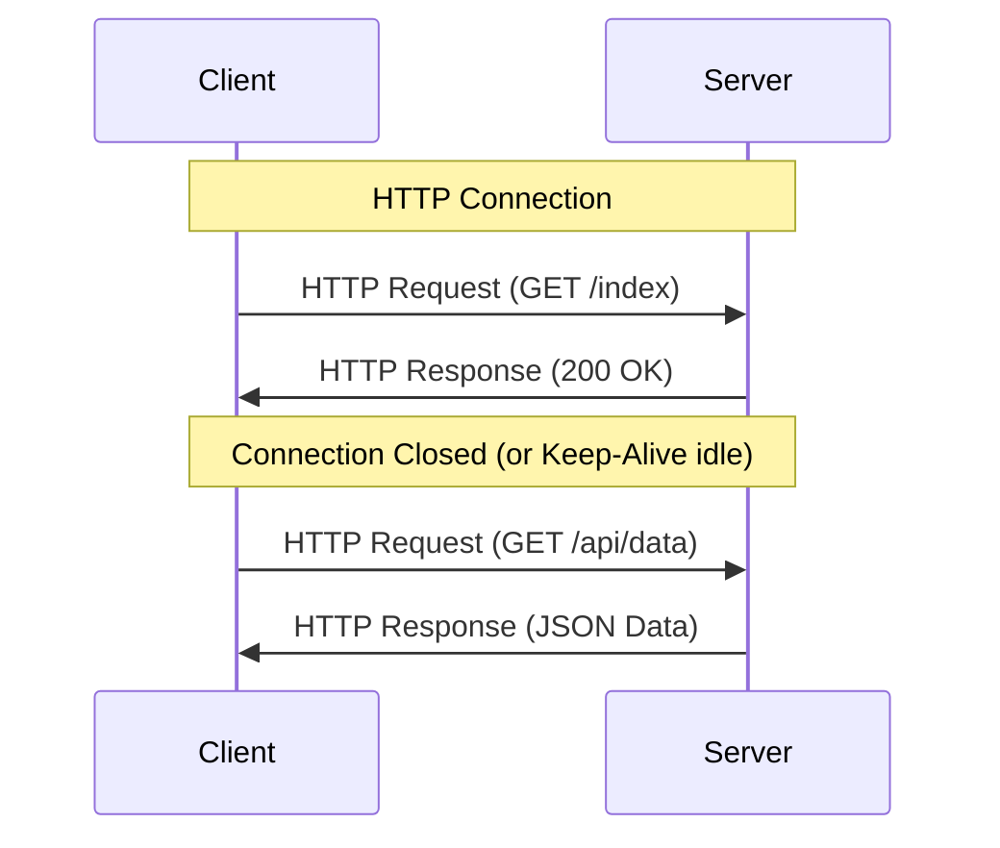
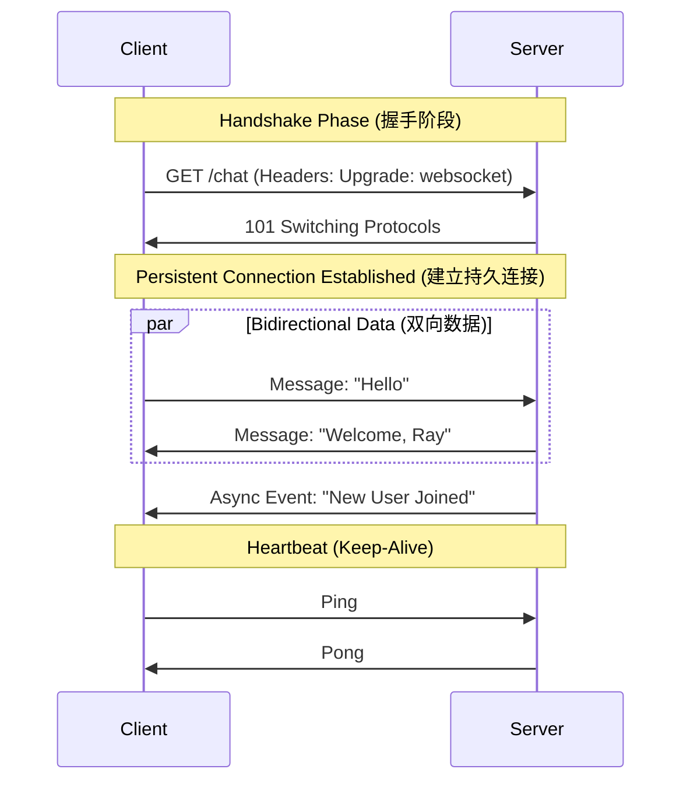

---
tags:
  - tech/web
  - protocols
  - engineering/reference
created: 2026-02-02
updated: 2026-02-02
---

# HTTP vs. WebSocket: 工程深度对比指南

本指南提供了 HTTP 和 WebSocket 协议的技术对比，专为全栈工程场景定制，适用于 **Heimdall** 机器人和 **PersonaPlex** iOS 应用的开发。

## 1. 协议流程可视化 (Protocol Workflow Visualization)

### HTTP: 请求-响应循环 (Request-Response Cycle)
HTTP 严格由客户端驱动。除非被请求，否则服务器保持沉默。



### WebSocket: 全双工通道 (Full-Duplex Channel)
WebSocket 始于 HTTP，但随即“升级”为持久的 TCP 隧道。



---

## 2. HTTP 工程核心 (HTTP Engineering Essentials)

**HTTP (HyperText Transfer Protocol)** 是 REST API 的骨干。

- **Stateless (无状态)**: 服务器不存储连接状态。认证依赖 Headers (Tokens) 或 Cookies。
- **Versions Matter (版本差异)**:
    - **HTTP/1.1**: 标准，基于文本。受 "Head-of-Line" (HOL) 阻塞影响。
    - **HTTP/2**: 二进制，多路复用 (multiplexed，单 TCP 连接并发请求)。非常适合移动端 (**PersonaPlex**)。
    - **HTTP/3 (QUIC)**: 基于 UDP。在不稳定网络下延迟更低。
- **Key Headers**:
    - `Content-Type`: 定义 payload 类型 (例如 `application/json`)。
    - `Authorization`: 用于安全认证的 Bearer tokens。

### 💡 工程洞察 (Engineering Insight)
对于 **PersonaPlex (iOS)**，使用 `URLSession`。它会自动处理 HTTP/2 连接池。
对于 **Heimdall**，Python 中的标准 `requests` 或 `aiohttp` 用于交互 REST endpoints。

---

## 3. WebSocket 工程核心 (WebSocket Engineering Essentials)

**WebSocket** 提供低延迟、持久化的隧道。

- **The Handshake (握手)**:
    - Client 发送: `Connection: Upgrade` 和 `Upgrade: websocket`。
    - Server 响应: `101 Switching Protocols`。
- **Data Frames (数据帧)**: 与 HTTP 厚重的 headers 不同，WS 使用轻量级二进制分帧 (framing)。
- **Heartbeat (Ping/Pong) (心跳保活)**: **稳定性关键**。网络中间件 (Load Balancers, Cloudflare) 经常会切断空闲连接。你 *必须* 实现心跳循环来保持连接存活。
- **Status Codes**: 
    - `1000`: Normal Closure (正常关闭)。
    - `1006`: Abnormal Closure (异常关闭/网络错误) - *在此处触发重连逻辑*。

### 💡 工程洞察 (Engineering Insight)
对于 **Heimdall**: Discord Gateway 使用 WebSockets 推送事件 (消息, reaction adds)。你不需要 "poll" (轮询) 新消息；Discord 会主动 "push" 给你的 bot。
对于 **PersonaPlex**: 如果实现 "Chat with Agent" 功能，使用 WebSockets 流式传输 token-by-token 响应 (类似 ChatGPT)，而不是等待完整的 HTTP 响应。

---

## 4. 对比矩阵 (Comparison Matrix)

| 特性 | HTTP | WebSocket |
| :--- | :--- | :--- |
| **连接模型** | 短连接 (Request -> Response) | 持久连接 (保持打开直到关闭) |
| **发起方** | 总是客户端 | 客户端发起连接，随后双方均可发送 |
| **延迟** | 高 (每次请求需握手 + Headers) | 低 (一次握手，极简 framing) |
| **扩展性 (Scaling)** | 水平扩展容易 (Stateless) | 较难 (Stateful - 需要维护用户/连接映射) |
| **防火墙** | 友好 (标准端口 80/443) | 可能被激进的代理拦截 |
| **最佳场景** | REST APIs, 静态资源, Auth | 实时聊天, 游戏, 流媒体, 实时行情 |

---

## 5. 快速入门代码片段 (Quick Start Code Snippets)

### Python (Client Side)

**HTTP (aiohttp)**
```python
import aiohttp
import asyncio

async def fetch_data():
    async with aiohttp.ClientSession() as session:
        async with session.get('https://api.example.com/data') as resp:
            print(await resp.json())
```

**WebSocket (websockets lib)**
```python
import websockets
import asyncio

async def listen():
    uri = "ws://localhost:8765"
    async with websockets.connect(uri) as websocket:
        await websocket.send("Hello Server")
        while True:
            # 阻塞直到收到消息
            response = await websocket.recv()
            print(f"< {response}")
```

### Swift (iOS - PersonaPlex)

**HTTP (URLSession)**
```swift
let url = URL(string: "https://api.example.com/v1/agent")!
let task = URLSession.shared.dataTask(with: url) { data, _, _ in
    if let data = data {
        // 解析 JSON
    }
}
task.resume()
```

**WebSocket (URLSessionWebSocketTask)**
```swift
let url = URL(string: "wss://api.example.com/chat")!
let webSocketTask = URLSession.shared.webSocketTask(with: url)
webSocketTask.resume()

// 发送 (Send)
let message = URLSessionWebSocketTask.Message.string("Hello")
webSocketTask.send(message) { error in ... }

// 接收 (Receive)
webSocketTask.receive { result in
    switch result {
    case .success(let message):
        // 处理消息
    case .failure(let error):
        // 处理错误
    }
}
```

## 6. 架构决策指南 (Architecture Decision Guide)

- **使用 HTTP 当:**
    - 交互是事务性的 (例如 "Update User Profile")。
    - 数据可缓存 (cacheable)。
    - 需要容易地从网络故障中恢复 (只需 retry 请求)。

- **使用 WebSocket 当:**
    - 需要 "Server Push" (例如 通知: "Job Finished")。
    - 延迟至关重要 (实时语音/视频信令)。
    - 带宽受限，且发送许多小消息。

> **Note for Ray**: 在你为 Heimdall 配置 **Cloudflare** 时，确保 Network 设置中启用了 "WebSockets"，否则握手可能会失败。
