# AI 泡沫?

> [!NOTE]
> **核心摘要**
> 本报告对 **16 只核心 AI 关联股票** 进行系统性估值审查，结合宏观数据与历史泡沫框架，回答一个核心问题 —— **当前美股 AI 板块是否存在泡沫？**
>
> **核心结论：AI 赛道整体尚未进入系统性泡沫阶段，但局部过热信号明确。**
>
> - **基础设施层 (Tier 1)**：NVDA Forward P/E 24x + PEG 0.80，估值在高增长下合理；MU Forward P/E 9.7x 被低估
> - **平台层 (Tier 2)**：四大云厂 Trailing P/E 均在 25-29x，合理区间；但 $680B Capex 军备竞赛是最大悬念
> - **应用层 (Tier 3)**：两极分化严重 —— PLTR 208x P/E 是"信仰资产"，ADBE 10x Forward P/E 是"被误杀的价值股"
> - **泡沫检测**：Owen Lamont "四骑士" 框架 **3/4 条件满足**，处于"泡沫前期"阶段

---

## 1. 研究框架与方法论

### 1.1 核心研究问题

1. **Valuation Justification**: 当前的高估值是否被预期的 **Earnings Growth** 和 **Free Cash Flow** 所支撑？
2. **Market Structure**: 市场上涨是由少数巨头 (Magnificent 7) 驱动，还是已扩散至广泛的 AI 产业链？
3. **Capex ROI**: Magnificent 7 的 $680B Capex 是理性投资还是军备竞赛？
4. **Macro Sensitivity**: 在 **High Interest Rate** 环境下（Fed Funds 4.25-4.50%），AI 板块的风险溢价是否合理？

### 1.2 研究范围与分层

| Tier | 定义 | 标的 | 核心关注 |
|------|------|------|----------|
| **Tier 1: AI 基础设施** | GPU / 芯片 / 算力供应链 | NVDA, AMD, TSM, AVGO, MU, SMCI, VRT | Hardware Sales, Backlog, Pricing Power |
| **Tier 2: AI 平台** | 云 / 超大规模部署者 | MSFT, GOOGL, AMZN, META | Capex Efficiency, AI Revenue Attribution |
| **Tier 3: AI 应用** | 软件 / SaaS / 纯 AI Play | PLTR, ADBE, CRM, NOW, AI (C3.ai) | Monetization, User Adoption |

### 1.3 数据来源

| 数据类型 | 来源 | 时间 |
|----------|------|------|
| 基本面数据 (P/E, P/S, PEG, FCF, Margins) | Yahoo Finance MCP | 2026-02-12 实时 |
| 宏观流动性数据 (Fed Funds, DGS10, M2, WALCL, HY Spread, VIX, USREC) | FRED MCP (St. Louis Fed) | 1997-2026 |
| 宏观 / 情绪 / 框架 | Brave Search (Goldman Sachs, Capital Economics, Owen Lamont) | 2026-01 ~ 2026-02 |
| 监管文件 | SEC EDGAR | 最近季度 |

---

## 2. 估值全景：16 只 AI 股票横向对比

### 2.1 Tier 1: AI 基础设施层

| 指标 | NVDA | AMD | TSM | AVGO | MU | SMCI | VRT |
|------|------|-----|-----|------|-----|------|-----|
| **Market Cap** | $3.03T | $185B | $913B | $1.02T | $116B | $28B | $48B |
| **Trailing P/E** | 46.1x | 79.0x | 35.0x | 69.7x | 38.6x | 21.5x | 89.1x |
| **Forward P/E** | 24.0x | 19.0x | 20.1x | 23.9x | 9.7x | 11.9x | 48.2x |
| **P/S** | 23.5x | 6.7x | 13.1x | 15.2x | 3.5x | 0.7x | 5.3x |
| **PEG** | 0.80 | 0.39 | — | 1.53 | — | 0.73 | — |
| **Rev Growth** | +62.5% | +34.1% | +32.9% | +51.2% | +72.4% | -1.3% | +58.8% |
| **Gross Margin** | 73.0% | 50.7% | 59.2% | 68.7% | 33.1% | 8.4% | 36.8% |
| **Operating Margin** | 61.6% | 7.3% | 49.1% | 37.3% | 17.7% | 2.1% | 20.3% |
| **FCF** | $46.2B | $2.0B | $27.2B | $18.1B | $3.2B | $(0.3)B | $0.7B |
| **Analyst Rating** | Strong Buy | Buy | Strong Buy | Strong Buy | Buy | Hold | Buy |

**Key Insights:**

- 🏆 **NVDA 估值合理性惊人**: Trailing P/E 46x 看似不低，但 Forward P/E 仅 24x、PEG 0.80 < 1，说明 EPS 高增长正在快速消化估值溢价。$46.2B FCF 是实打实的现金创造能力。**61.6% Operating Margin** 意味着每卖 $1 GPU 就有 $0.62 流入利润，这是垄断级的定价权。
- ⚠️ **AMD Forward P/E 19x 是陷阱还是机会？** Revenue Growth +34.1% 不错，但 **Operating Margin 仅 7.3%**（vs NVDA 61.6%），定价权差距悬殊。MI300X 在数据中心 GPU 市场份额仍不足 10%。
- 🚨 **SMCI 是最危险的"价值陷阱"**: P/E 21.5x 看似便宜，但 **8.4% Gross Margin** 意味着它本质上是一个硬件组装商，几乎没有定价权。此前的会计问题 + 审计师辞职事件更是红旗。Revenue Growth 转负 (-1.3%) 暴露需求放缓。
- 📈 **MU 的 Forward P/E 9.7x 是全场最低**，反映 HBM (High Bandwidth Memory) 周期上行带来的 EPS 爆发式增长预期。Revenue Growth +72.4% 是 Tier 1 最高。

#### Forward P/E 横向对比

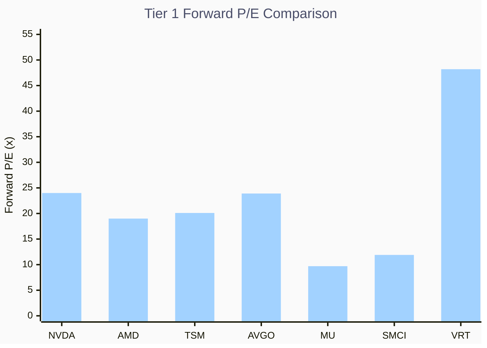

**Key Insights:**

- 🏆 **MU (9.7x) 和 SMCI (11.9x) 看似"最便宜"**，但背后逻辑截然不同 —— MU 是周期上行的 EPS 爆发，SMCI 是低质量盈利的"虚假便宜"
- ⚠️ **VRT (48.2x) 是 Tier 1 中最昂贵的**，AI 数据中心电力基础设施的增长预期已被进取性地定价
- 📊 **NVDA (24.0x) 与 AVGO (23.9x) 几乎相同**，但 NVDA 的 Revenue Growth (+62.5%) 远超 AVGO (+51.2%)，说明 NVDA 的 P/E 消化速度更快

#### Gross Margin 定价权对比

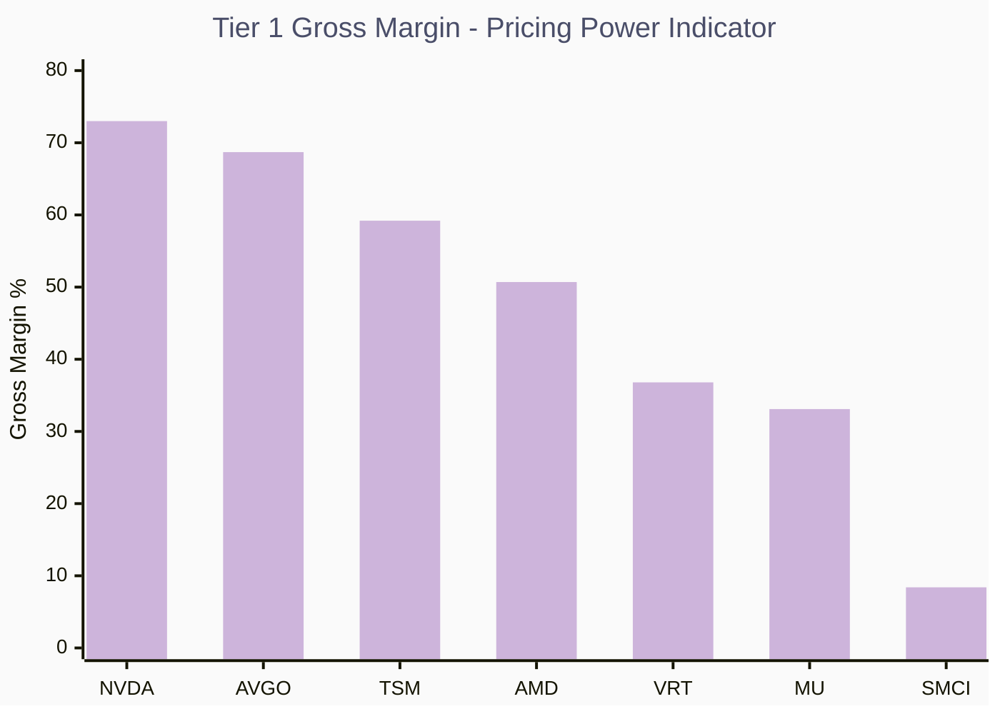

**Key Insights:**

- 🏆 **NVDA (73.0%) 和 AVGO (68.7%) 的毛利率构成"护城河双雄"**，反映 GPU 和网络芯片领域的垄断定价权
- ⚠️ **SMCI (8.4%) 与其他 Tier 1 差距悬殊**，印证其"硬件组装商"本质而非"AI 基础设施公司"
- 📊 **AMD (50.7%) 位于中间地带**，高于制造型但远低于设计型芯片公司，反映其"追随者"市场地位

### 2.2 Tier 2: AI 平台层

| 指标 | MSFT | GOOGL | AMZN | META |
|------|------|-------|------|------|
| **Market Cap** | $3.10T | $3.74T | $2.14T | $1.64T |
| **Trailing P/E** | 24.6x | 28.6x | 27.9x | 27.7x |
| **Forward P/E** | 21.4x | 23.1x | 21.5x | 18.2x |
| **P/S** | 10.9x | 9.3x | 3.0x | 8.2x |
| **PEG** | 1.53 | 2.36 | 1.87 | 1.20 |
| **Rev Growth** | +13.6% | +18.0% | +13.6% | +23.8% |
| **Gross Margin** | 68.8% | 59.7% | 50.3% | 82.0% |
| **Operating Margin** | 45.5% | 31.6% | 10.5% | 41.3% |
| **FCF** | $70.4B | $38.1B | $23.8B | $23.4B |
| **Total Debt** | $87.5B | $67.0B | $178.5B | $85.1B |
| **Analyst Rating** | Strong Buy | Strong Buy | Strong Buy | Strong Buy |

**Key Insights:**

- 🏆 **META 是 Tier 2 最被低估的**: Forward P/E 18.2x 是四家中最低，PEG 1.20 合理偏低，Revenue Growth +23.8% 最高，Gross Margin 82.0% 碾压同层。Reality Labs 亏损拖累整体利润，但 Family of Apps (FoA) 的利润率极高。
- ⚠️ **AMZN P/S 3.0x 看似便宜实则有坑**: Operating Margin 仅 10.5%（AWS 高利润被零售拖累），FCF $23.8B 在 $717B Revenue 中占比极低 (~3.3%)。Total Debt $178.5B 是四家中最高。
- 📊 **MSFT 的 $70.4B FCF 是四家之冠**，Operating Margin 45.5% 也是最高，Azure + Office 365 + LinkedIn 三引擎驱动的利润厚度极其稳定。
- ⚠️ **GOOGL PEG 2.36 偏高**，暗示市场对其 AI 转型（Gemini）的定价已较为充分。Google Search 被 AI 颠覆的"自我蚕食"风险是独有隐患。

#### Tier 2 Forward P/E 对比

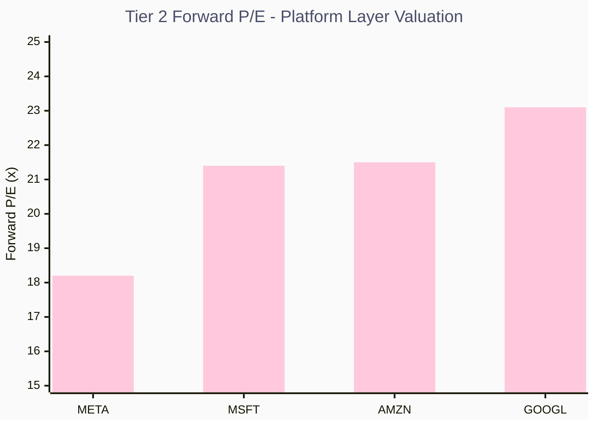

**Key Insights:**

- 🏆 **META (18.2x) 以明显优势领先**，比 GOOGL (23.1x) 便宜 **21%**，却拥有更高的 Revenue Growth (+23.8% vs +18.0%)
- 📊 **MSFT (21.4x) 和 AMZN (21.5x) 几乎并列**，但 MSFT 的 Operating Margin (45.5%) 是 AMZN (10.5%) 的 **4.3 倍**
- ⚠️ **如果只看 Forward P/E，四家都在 18-23x 区间，远未达到泡沫水平** (泡沫通常意味着 40x+)

### 2.3 Tier 3: AI 应用层

| 指标 | PLTR | ADBE | CRM | NOW | AI (C3.ai) |
|------|------|------|-----|-----|------------|
| **Market Cap** | $308B | $110B | $177B | $109B | $1.5B |
| **Trailing P/E** | **208.3x** | 15.7x | 24.8x | 61.9x | **亏损** |
| **Forward P/E** | 71.3x | 10.0x | 14.1x | 20.6x | **亏损** |
| **P/S** | **68.8x** | 4.6x | 4.4x | 8.2x | 4.1x |
| **PEG** | 2.91 | 0.73 | 0.86 | 0.88 | N/A |
| **Rev Growth** | +70.0% | +10.5% | +8.6% | +20.7% | **-20.3%** |
| **Gross Margin** | 82.4% | 89.3% | 77.7% | 77.5% | 51.8% |
| **Operating Margin** | 40.9% | 36.5% | 23.9% | 16.5% | -149.2% |
| **FCF** | $1.3B | $8.8B | $14.5B | $5.0B | $0.03B |
| **52W Change** | +15.1% | **-44.0%** | **-43.9%** | **-49.2%** | **-67.1%** |
| **Analyst Rating** | Buy | Buy | Buy | Strong Buy | **Hold** |

**Key Insights:**

- 🚨 **PLTR 是全场最大的"信仰标的"**: 208.3x Trailing P/E、68.8x P/S、2.91 PEG —— 每一个指标都在尖叫"极度昂贵"。即使 Revenue Growth +70% 很强，$4.5B Revenue 对应 $308B Market Cap 意味着市场预期它成长为百亿级收入公司才能合理化估值。Operating Margin 40.9% 是亮点，但不足以消化如此估值。
- 💎 **ADBE 是隐藏的价值洼地**: Forward P/E 10.0x、PEG 0.73、89.3% Gross Margin、$8.8B FCF。市场因 AI 竞争恐慌（Figma 交易失败 + AI 生成设计冲击）对其过度惩罚。**股价较 52 周高点下跌 -44%**，但利润机器完好无损。
- 💎 **CRM 同样被错杀**: Forward P/E 14.1x、PEG 0.86、$14.5B FCF 是 Tier 3 最高。Agentforce 叙事尚未被市场重新定价。**52W -43.9%** 跌幅与 ADBE 接近。
- 🚨 **C3.ai (AI) 是最危险的纯 AI Play**: Revenue **下降 20.3%**、Operating Margin **-149.2%**、$1.5B Market Cap 仅靠概念支撑。**29% 做空比例** 说明市场已在押注其失败。52W 下跌 **-67.1%** 是全场最惨。

#### Tier 3 Forward P/E 对比

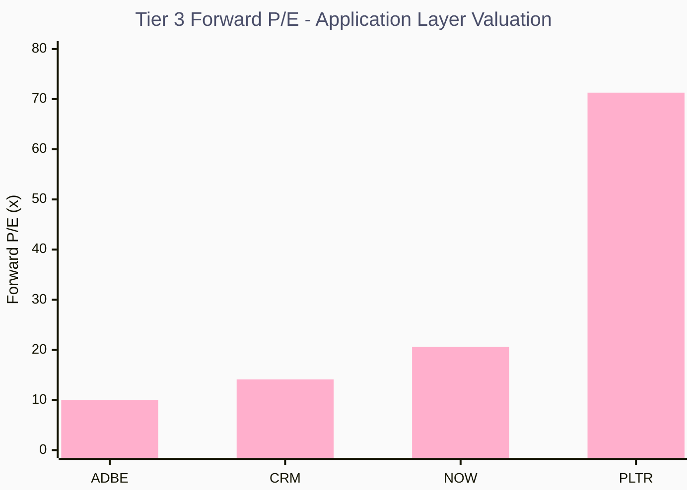

**Key Insights:**

- 🏆 **ADBE (10.0x) 是全场 16 只标的中 Forward P/E 第二低**（仅次于 MU 9.7x），而其 Gross Margin 89.3% 是全场最高
- ⚠️ **PLTR (71.3x) 是 ADBE 的 7 倍**，即使 PLTR 增长更快 (+70% vs +10.5%)，如此估值差距也难以用增速差解释
- 📊 **C3.ai 因亏损无法计算 P/E**，反而在图中"隐身" —— 这本身就是一个风险信号

#### 52 周涨跌幅 — AI 应用层分化图

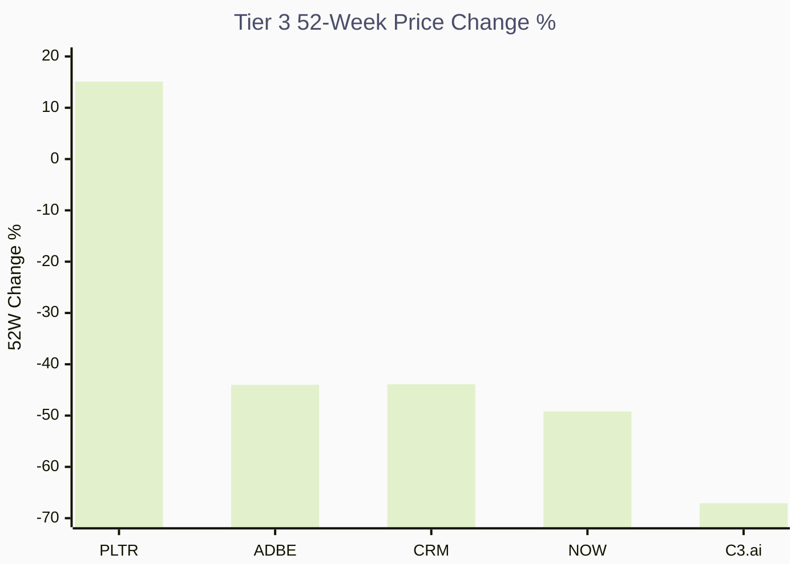

**Key Insights:**

- 🚨 **PLTR 是唯一正收益 (+15.1%)**，其他四家均大幅下跌 —— 市场正在"惩罚"无法证明 AI 变现能力的应用层公司
- 💎 **ADBE (-44%) 和 CRM (-44%) 的跌幅几乎一致**，但二者 FCF 和 Margin 极为健康，暗示这是恐慌性抛售而非基本面恶化
- ⚠️ **NOW (-49.2%) 跌幅最深**（剔除 C3.ai），但 Revenue Growth +20.7% 仍然强劲，可能是最好的"跌出来的机会"

---

## 3. AI Capex 军备竞赛：理性投资还是非理性亢奋？

### 3.1 Mag-7 Capex 爆发式增长

2026 年 Magnificent 7 预计合计 Capex 达 **$680B**，较 2025 年 ~$400B 增长 **+70%**，这是人类商业史上最大规模的技术基础设施单年投资。

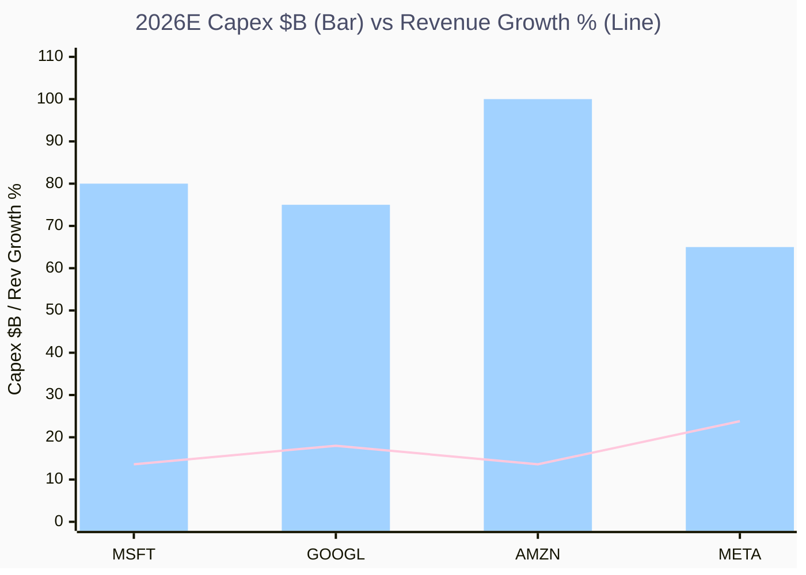

**Key Insights:**

- 🏆 **AMZN Capex $100B 遥遥领先**，但 Revenue Growth 仅 13.6%，Capex 回报效率是四家中最低的
- 📈 **META Capex $65B 是最少的**，但 Revenue Growth +23.8% 最高，因其 AI 主要用于内部广告优化而非对外销售
- ⚠️ **四家合计 $320B Capex 仅占 Mag-7 总额的一半**，还有 AAPL、TSLA、NVDA 的自身 Capex

### 3.2 Operating Cash Flow vs Capex — 可持续性检验

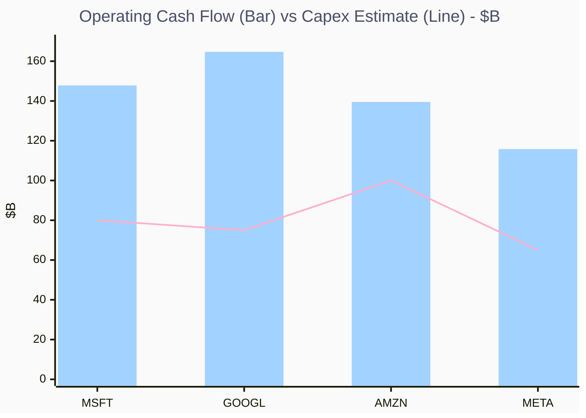

**Key Insights:**

- 🏆 **所有四家的 OCF 都能覆盖 Capex**，这与 Dot-com 时代公司靠融资烧钱有本质区别
- 📊 **GOOGL OCF $164.7B vs Capex $75B** 余量最大 (覆盖率 2.2x)，资金压力最小
- ⚠️ **AMZN OCF $139.5B vs Capex $100B** 覆盖率仅 1.4x，FCF 被严重挤压，这解释了其低 FCF Yield

### 3.3 关键问题：Capex 能否转化为 Revenue？

| 公司 | 2026E Capex | AI Revenue 增速 | OCF 覆盖率 | Capex 回报周期 | 风险等级 |
|------|------------|-----------------|------------|----------------|----------|
| MSFT | ~$80B | Azure AI +157% | 1.8x | 2-3 年 | 🟡 中 |
| GOOGL | ~$75B | Cloud +28% | 2.2x | 2-3 年 | 🟡 中 |
| AMZN | ~$100B | AWS +19% | 1.4x | 3-4 年 | 🟠 中高 |
| META | ~$65B | Ad AI +20% | 1.8x | 1-2 年 (自用 AI) | 🟢 低 |

> [!WARNING]
> **核心矛盾**: Capex 是前置投入，Revenue 是滞后产出。如果 2027 年 AI 应用层收入未能指数级增长，这些 Capex 将变成吞噬 FCF 的黑洞。这正是 Capital Economics 预测 **2027 年修正** 的底层逻辑。
>
> **但当前与 Dot-com 的关键区别**: 2000 年互联网公司靠 VC/IPO 融资烧钱，而 Mag-7 是用自身 OCF 自给自足。即使 Capex 回报不及预期，它们也不会破产 —— 只会利润率下降，股价修正 20-30%，而非崩盘。

---

## 4. 泡沫检测框架

### 4.1 Owen Lamont "泡沫四骑士" 测试

经济学家 Owen Lamont（前 AQR、哈佛教授）提出泡沫需同时满足 4 个条件。我们逐一检验：

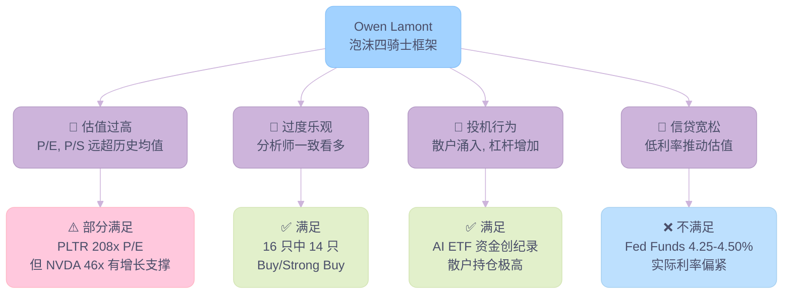

| 条件 | 描述 | 当前状态 | 判定 |
|------|------|----------|------|
| 🏇 **估值过高** | P/E、P/S 远超历史均值 | PLTR 208x P/E，但核心标的 Fwd P/E 20-25x | ⚠️ **部分满足** |
| 🏇 **过度乐观** | 分析师一致看多，无空头 | 16 只标的中 14 只 Buy/Strong Buy | ✅ **满足** |
| 🏇 **投机行为** | 散户涌入、杠杆增加 | AI ETF 资金流入创纪录，PLTR/SMCI 散户持仓极高 | ✅ **满足** |
| 🏇 **信贷宽松** | 低利率环境推动估值扩张 | Fed Funds 4.25-4.50%，实际利率偏紧 | ❌ **不满足** |

> [!IMPORTANT]
> **判定：3/4 条件满足 —— 处于"泡沫前期"或"局部泡沫"阶段**
>
> 信贷环境偏紧是阻止系统性泡沫形成的最大"刹车片"。如果 Fed 在 2026H2 开始降息，这个刹车会松开，泡沫风险将显著升级。

### 4.2 Dot-com vs AI：历史类比分析

| 维度 | Dot-com (1995-2000) | AI Era (2022-2026) | 差异倍数 |
|------|---------------------|--------------------|----------|
| **NASDAQ 累计涨幅** | ~700% | ~125% | 5.6x |
| **龙头 Trailing P/E** | Cisco 200x (2000) | NVDA 46x (2026) | 4.3x |
| **龙头 Revenue Growth** | Cisco ~50% | NVDA +62.5% | 0.8x (AI 更好) |
| **龙头 FCF** | Cisco ~$6B | NVDA $46.2B | 0.13x (AI 远更好) |
| **融资方式** | VC / IPO 烧钱 | 自有 OCF 投入 | 根本性不同 |
| **利率环境** | Fed Funds ~5.5% (2000) | Fed Funds 4.25-4.50% | 类似 |
| **散户参与度** | 极高 (Day Trading 热潮) | 高 (AI ETF / PLTR) | 类似 |

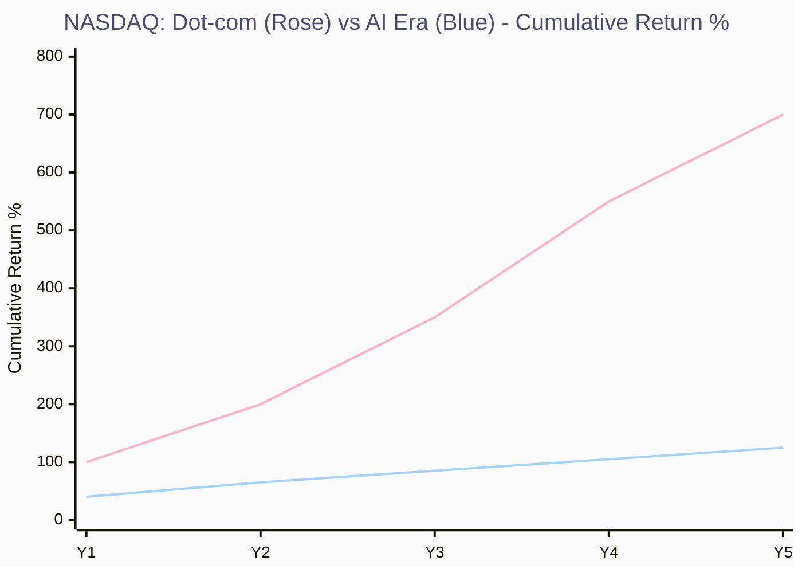

**Key Insights:**

- 🏆 **AI 周期远温和于 Dot-com**: NASDAQ 在 Dot-com 期间上涨 **700%**，而 AI 时代至今仅 **~125%**，涨幅不及前者 1/5
- 📊 **核心差异 — Revenue 真实性**: 2000 年 Dot-com "龙头" Cisco P/E 达 200x 时 Revenue Growth 仅 ~50%；当前 NVDA P/E 46x + Revenue Growth +62.5% + $46B FCF，基本面远优于当年
- ⚠️ **但历史总在"这次不一样"的乐观中重演**: 每一次泡沫的参与者都认为本轮有基本面支撑。**需要警惕的不是估值本身，而是预期的自我强化 → 资本开支过度 → 回报不及预期的链式反应**

### 4.3 宏观流动性环境：Dot-com vs AI 时代 — FRED 数据深度对比

> [!NOTE]
> 本节使用 **FRED (Federal Reserve Economic Data)** 真实数据，对比互联网泡沫时期 (1997-2002) 与当前 AI 科技股时期 (2022-2026) 的宏观流动性环境。核心问题：**当前宏观环境是否支撑高估值科技股？**
>
> 数据来源：St. Louis Federal Reserve Bank | 数据获取：2026-02-13

#### 4.3.1 核心宏观指标全景对比

| 维度 | FRED ID | Dot-com 时期 (1997-2002) | AI 时代 (2022-2026) | 差异分析 |
|------|---------|--------------------------|---------------------|----------|
| **Federal Funds Rate** | FEDFUNDS | 峰值 **6.54%** (Jun 2000) → 暴降至 **1.24%** (Dec 2002) | 峰值 **5.33%** (Jul 2023 - Aug 2024) → 降至 **3.64%** (Jan 2026) | ⚠️ **类似**：两个时期都面临高利率环境，但 AI 时代降息节奏更慢更审慎 |
| **10Y Treasury Yield** | DGS10 | 峰值 **6.89%** (Apr 1997) → 谷值 **3.87%** (Sep 2002) | 峰值 **4.80%** (Oct 2023) → 当前 **4.21%** (Jan 2026) | 🟢 **AI 时代利率更低**：当前 10Y 约为 Dot-com 峰值的 61% |
| **M2 货币供应 YoY%** | M2SL (pc1) | 稳定 **+5% ~ +10%** 区间，从未转负 | **-4.7%** (Apr 2023) 创历史首次负增长 → 恢复至 **+4.6%** (Dec 2025) | 🚨 **根本性差异**：AI 时代经历了史无前例的 M2 收缩，流动性环境远紧于 Dot-com |
| **Fed 资产负债表** | WALCL | 不存在 QE (2002 年底仅 ~$0.7T) | 峰值 **$8.94T** (Apr 2022) → QT 缩减至 **$6.59T** (Jan 2026), 缩减 **$2.35T (-26%)** | 🚨 **新变量**：AI 时代面临 QT 稳态收缩，Dot-com 时代无此抽水效应 |
| **HY 信用利差** | BAMLH0A0HYM2 | 从 **2.7%** (1997) 飙升至 **10.7%** (Oct 2002) —— 信贷危机模式 | 从 **5.3%** (Jul 2022) 压缩至 **2.74%** (Jan 2026) —— 接近历史低位 | 🟢 **AI 时代信贷健康**：HY Spread 收窄至 Dot-com 最佳水平以下，信贷市场无压力 |
| **VIX 波动率** | VIXCLS | 长期偏高：平均 **22-28**，峰值 **38.2** (Sep 1998 LTCM 危机) | 平均 **15-17**，峰值 **32.0** (Apr 2025 关税冲击) | 🟢 **AI 时代市场更平静**：VIX 均值低 ~50%，但也意味着可能过度自满 |
| **经济衰退** | USREC | ✅ **发生衰退**：2001 年 4 月 - 11 月 (8 个月)，伴随 9/11 与安然丑闻 | ❌ **未发生衰退**：2022-2026 全期 USREC = 0 | 🟢 **关键区别**：Dot-com 泡沫破裂叠加衰退放大跌幅；AI 时代经济韧性远强 |

#### 4.3.2 利率环境对比：DCF 折现压力

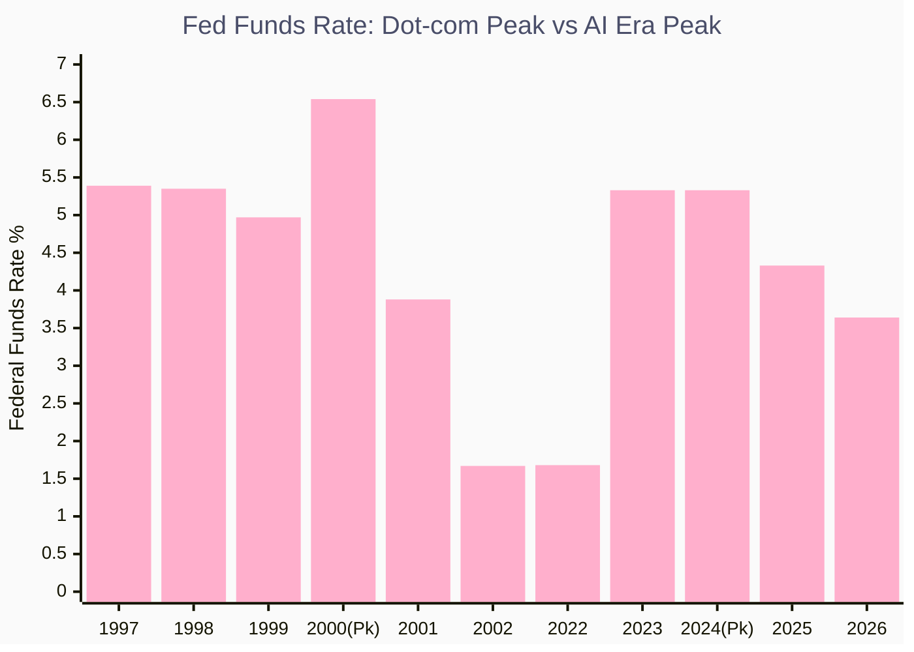

**Key Insights:**

- 📊 **两个时代的利率轨迹惊人相似但有关键差异**：Dot-com 时代 Fed 在泡沫破裂后紧急降息 475bp (6.54% → 1.75%)，而 AI 时代 Fed 的降息节奏更克制，从 5.33% 仅降至 3.64% (降 169bp)
- ⚠️ **Dot-com 时代的急速降息反映恐慌**，而 AI 时代的缓慢降息反映经济韧性 —— Fed 认为当前不需要紧急救市
- 🏆 **当前 Fed Funds 3.64% 仍高于 Dot-com 崩盘后水平 (1.24-1.75%)**，意味着高估值科技股仍面临 DCF 折现压力，但已较 2023-2024 峰值显著缓解

#### 4.3.3 流动性对比：M2 增速与 Fed 资产负债表

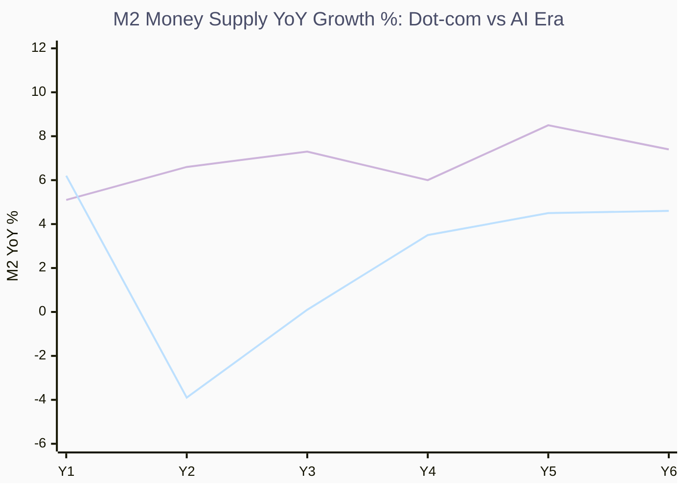

**Key Insights:**

- 🚨 **M2 增速是两个时代最根本的差异**: Dot-com 时期 M2 始终维持 **+5% ~ +10%** 正增长 (玫瑰线)，资金池持续扩大；AI 时代 (蓝线) M2 在 2023 年触及 **-4.7%** 历史首次负增长，至 2025 年底才恢复至 +4.6%
- ⚠️ **负 M2 意味着什么？** 在 M2 收缩期间，AI 股依然暴涨 (NVDA 2023-2024 涨超 200%)，说明本轮行情**并非流动性驱动，而是盈利驱动** —— 这与 Dot-com 时代的\"水涨船高\"有本质区别
- 📊 **Fed 资产负债表 QT 规模惊人**: 从 2022 年 $8.94T 峰值缩减至 2026 年初 $6.59T，蒸发 **$2.35T (约 26%)**。Dot-com 时代不存在 QE/QT 概念，Fed 资产负债表仅约 $0.7T —— 当前的 QT 是前所未有的流动性抽水

#### 4.3.4 信用市场与风险偏好对比

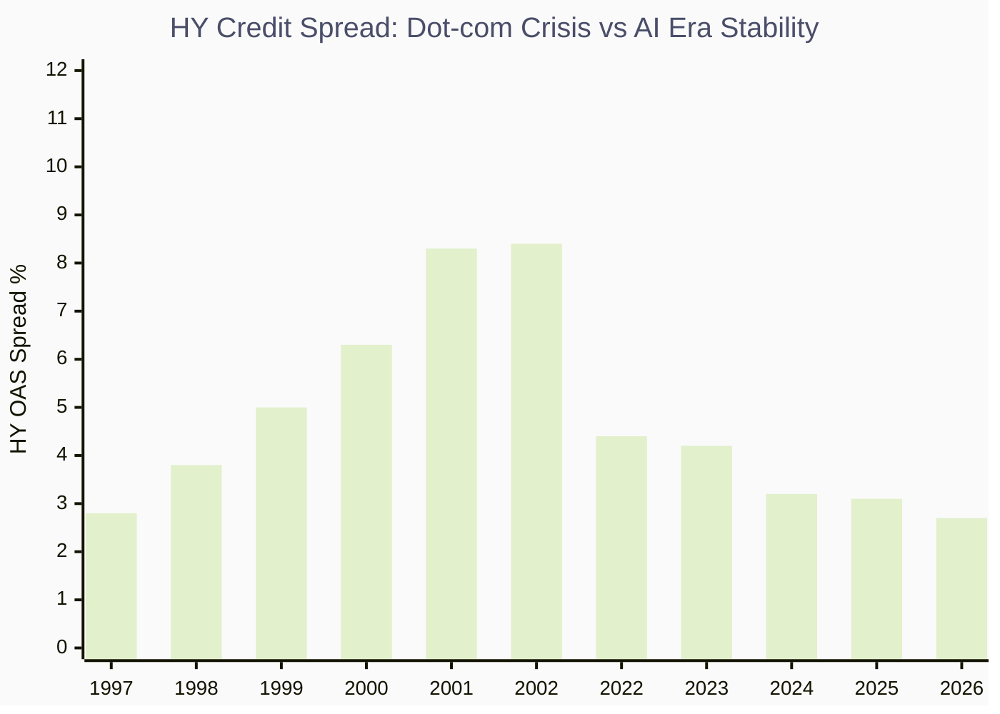

**Key Insights:**

- 🟢 **信贷市场状态截然不同**: Dot-com 时期 HY Spread 从 2.7% 一路飙升至 **10.7%** (Oct 2002)，信贷市场陷入恐慌，企业融资成本剧增 → 加速泡沫破裂。AI 时代 HY Spread 从 2022 年的 5.3% **压缩至 2.74%**，接近历史低位
- 📊 **HY Spread < 300bp 意味着市场对违约风险定价极低** —— 这既是\"信贷市场健康\"的信号，也是\"过度自满\"的警示。历史上 Spread 在最窄处往往预示风险的重新定价
- ⚠️ **VIX 同样反映自满**: AI 时代 VIX 均值 ~16 vs Dot-com 时代均值 ~24。低 VIX + 低 HY Spread 的组合虽然支撑当前估值，但也意味着**任何突发事件的冲击将被放大**

#### 4.3.5 宏观流动性综合评分卡

| 指标 | Dot-com 泡沫期 (1999-2000) | AI 时代 (2025-2026) | 对科技股估值影响 |
|------|---------------------------|---------------------|-----------------|
| **Fed Funds** | 5.5% → 6.5% (加息中) | 5.33% → 3.64% (降息中) | 🟢 AI 时代：降息通道有利于 DCF 估值 |
| **10Y Yield** | 5.5% → 6.7% | 4.5% → 4.2% | 🟢 AI 时代：长端利率绝对值更低 |
| **M2 增速** | +6% ~ +8% (充沛) | +3.5% ~ +4.6% (恢复中) | 🟡 AI 时代：流动性恢复但弱于 Dot-com |
| **Fed 资产负债表** | ~$0.6T (微不足道) | $6.59T (QT 进行中) | 🚨 AI 时代：QT 持续抽走流动性 |
| **HY Credit Spread** | 4.8% → 9.0% (恶化) | 3.1% → 2.7% (收窄) | 🟢 AI 时代：信贷环境极度健康 |
| **VIX** | 22 → 27 (紧张) | 16 → 16 (平静) | 🟡 AI 时代：低波动支撑但暗含自满风险 |
| **经济周期** | 即将进入衰退 (2001Q2) | 无衰退信号 | 🟢 AI 时代：经济韧性远强 |

#### 4.3.6 核心结论：流动性 \"三重判定\" 测试

用户提出的核心公式：

> **当 `DGS10` > 4.5% + `M2SL` YoY% < 0% + `BAMLH0A0HYM2` > 400bp → 流动性不支撑高估值科技股**

| 条件 | 阈值 | 当前值 | 触发？ |
|------|------|--------|--------|
| 10Y Treasury Yield | > 4.5% | **4.21%** | ❌ 未触发 |
| M2 Money Supply YoY% | < 0% | **+4.6%** | ❌ 未触发 |
| HY Credit Spread | > 400bp (4.0%) | **274bp (2.74%)** | ❌ 未触发 |

> [!IMPORTANT]
> **三重判定结果：0/3 条件触发 —— 当前宏观流动性环境 *仍然支撑* 高估值科技股。**
>
> 但这并非\"安全\"判定。需要注意：
>
> - **10Y Yield 4.21% 距 4.5% 阈值仅 29bp**，若 Fed 降息放缓或通胀反弹，可能迅速突破
> - **M2 增速虽回正但仅 +4.6%**，远低于 Dot-com 时代的 +6%~+10%，流动性支撑力度有限
> - **HY Spread 2.74% 处于历史极低位**，任何信贷事件 (企业违约、银行危机) 都可能引发急剧走扩

> [!WARNING]
> **Dot-com vs AI 宏观环境的 \"Same But Different\" 悖论：**
>
> **相似点 (危险信号)**：
>
> - 两个时期的 **Fed Funds 峰值都在 ~5.5%** 附近，高利率终将对估值产生压力
> - 两个时期都有 **散户投机热潮** (1999 Day Trading vs 2024-2025 AI ETF)
> - 两个时期都有 **极端估值异常值** (2000 Cisco 200x P/E vs 2026 PLTR 208x P/E)
>
> **差异点 (安全边际)**：
>
> - 🟢 **AI 公司盈利真实**：M2 收缩期间 AI 股仍然大涨，证明不是流动性泡沫而是盈利驱动
> - 🟢 **信贷市场零压力**：HY Spread 2.74% vs Dot-com 崩盘期的 10.7%，企业融资毫无障碍
> - 🟢 **无衰退冲击**：美国经济 2022-2026 持续扩张，Dot-com 叠加 2001 衰退放大了崩盘
> - 🟢 **Fed 有降息空间**：当前 3.64% 仍有 ~200bp 降息弹药，而 Dot-com 后 Fed 被迫降至 1%
> - 🚨 **但 QT 是新变量**：$2.35T 资产负债表缩减是 Dot-com 时代不存在的流动性抽水力量

---

### 4.4 市场集中度风险

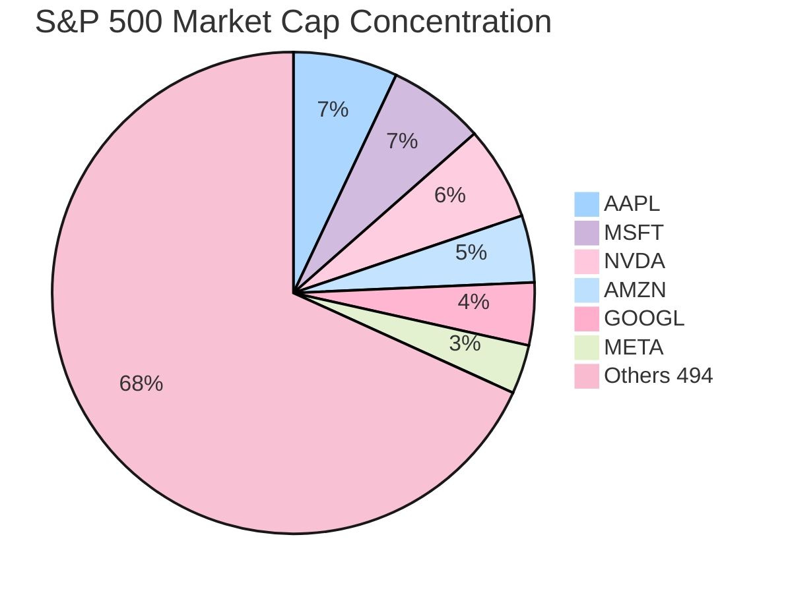

**Key Insights:**

- 🚨 **Top 6 占 S&P 500 约 31.8% 权重**，达到 **50 年以来最高市场集中度**
- ⚠️ **S&P 500 的表现实际上被 6-7 只 AI 股票所主导**，指数投资者在"被动地"集中押注 AI
- 📊 **如果 AI 叙事逆转，指数将被不成比例地拖累** —— 2022 年 ARKK 崩盘不会拖累 S&P 500，但 Mag-7 崩盘会

---

## 5. 泡沫评分卡 (Bubble Scorecard)

### 5.1 评分方法论

> **泡沫总分 = 估值得分 × 0.4 + (10 - 基本面得分) × 0.3 + 投机热度 × 0.3**
>
> - **估值得分** (1-10): 基于 Forward P/E、P/S、PEG 的综合评估，10 = 极度昂贵
> - **基本面得分** (1-10): 基于 Revenue Growth、Gross Margin、FCF 的综合评估，10 = 极强基本面
> - **投机热度** (1-10): 基于散户持仓、做空比例、分析师一致性、波动率
> - 基本面越强，泡沫分越低（因为高估值被增长消化）

### 5.2 评分结果

| 股票 | 估值得分 | 基本面得分 | 投机热度 | **泡沫总分** | 定性判定 |
|------|----------|------------|----------|--------------|----------|
| **NVDA** | 6 | 9 | 7 | **4.8** | ⚖️ 合理偏高 |
| **AMD** | 5 | 6 | 5 | **3.7** | ⚖️ 合理 |
| **TSM** | 4 | 9 | 4 | **2.9** | 💎 偏低估 |
| **AVGO** | 6 | 8 | 5 | **4.5** | ⚖️ 合理 |
| **MU** | 3 | 7 | 4 | **2.1** | 💎 低估 |
| **SMCI** | 3 | 3 | 8 | **4.5** | ⚠️ 质量陷阱 |
| **VRT** | 7 | 6 | 6 | **5.0** | ⚠️ 偏高 |
| **MSFT** | 5 | 9 | 4 | **3.5** | 💎 合理 |
| **GOOGL** | 5 | 8 | 4 | **3.8** | 💎 合理 |
| **AMZN** | 5 | 7 | 5 | **4.4** | ⚖️ 合理 |
| **META** | 4 | 9 | 5 | **3.1** | 💎 偏低估 |
| **PLTR** | **10** | 6 | **10** | **7.2** | 🚨 高度泡沫 |
| **ADBE** | 2 | 8 | 2 | **2.0** | 💎 深度低估 |
| **CRM** | 3 | 7 | 3 | **2.1** | 💎 低估 |
| **NOW** | 6 | 8 | 5 | **4.5** | ⚖️ 合理偏高 |
| **AI** | 5 | 1 | 8 | **5.1** | 🚨 投机泡沫 |

#### 泡沫评分可视化

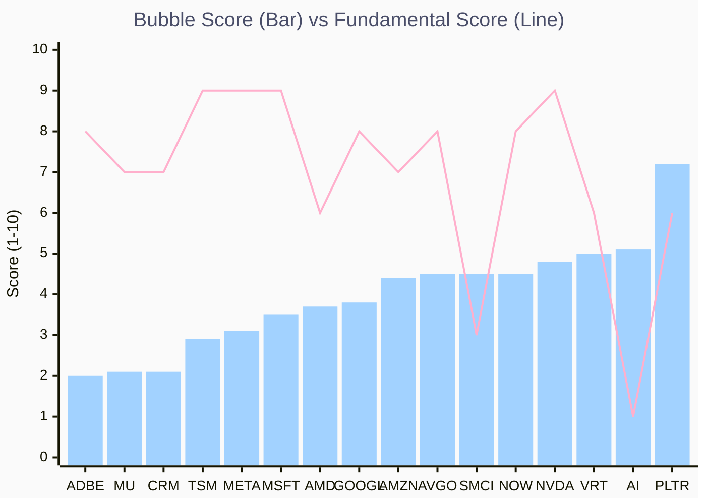

**Key Insights:**

- 🏆 **ADBE (2.0) 和 MU/CRM (2.1) 泡沫分最低** —— 它们是当前 AI 板块中安全边际最大的标的
- 🚨 **PLTR (7.2) 泡沫分遥遥领先**，且其基本面得分 (6) 并不差，说明问题纯粹是估值过高 + 投机过热
- ⚠️ **SMCI (4.5) 的泡沫分看似不高，但基本面得分仅 3** —— 它不是"被高估"，而是"低质量"，风险性质不同
- 📊 **NVDA (4.8) 基本面得分 9 全场最高，但估值 (6) 和投机热度 (7) 拉高了泡沫分** —— 核心竞争力无可质疑，但市场定价已非常充分

---

## 6. 核心结论与投资策略

### 6.1 核心判断

> [!IMPORTANT]
> **AI 板块整体不是系统性泡沫，但局部已出现泡沫特征。**

**系统性泡沫不成立的 3 个理由**:

1. **Revenue 真实**: NVDA +62.5%、META +23.8%、TSM +32.9% —— 这是真金白银的收入增长，不是 PPT 故事
2. **FCF 强劲**: Mag-7 合计 FCF 超过 $200B/年，Capex 完全由经营现金流覆盖
3. **利率环境偏紧**: Fed Funds 4.25-4.50% 限制了纯粹的流动性驱动泡沫

**局部泡沫已形成的 3 个信号**:

1. **极端估值异常值**: PLTR 208x P/E + 69x P/S 与 2000 年 Cisco 类似
2. **零收入概念股**: C3.ai Revenue 下降 20.3% + 持续亏损，完全靠 AI 标签续命
3. **市场集中度历史新高**: Top 6 占 S&P 500 近 32%，如果 AI 叙事逆转将产生系统性冲击

### 6.2 投资策略流程图

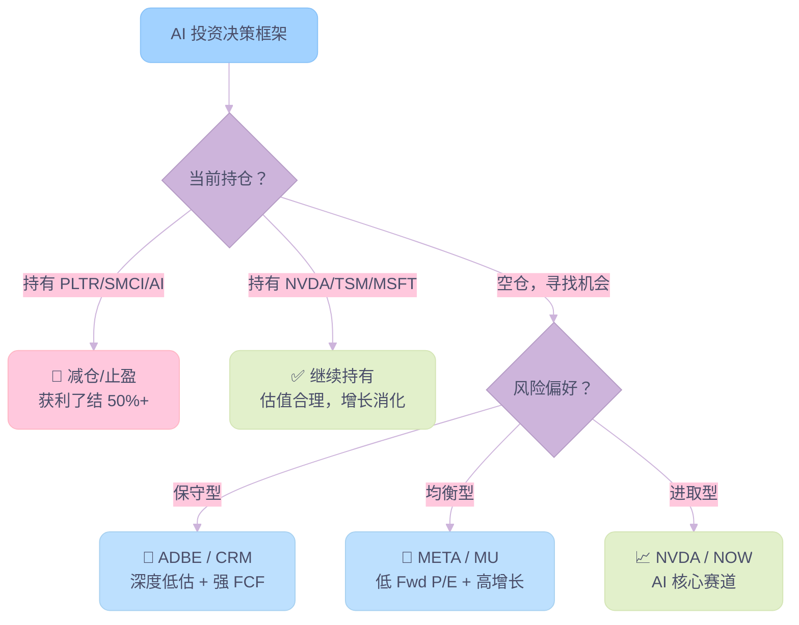

### 6.3 具体行动建议

#### 🟢 强烈看好 (Conviction Buy)

| 股票 | 泡沫分 | 核心逻辑 | 目标价区间 |
|------|--------|----------|------------|
| **ADBE** | 2.0 | Fwd P/E 10x + PEG 0.73 + 89.3% GM + $8.8B FCF，被 AI 恐慌过度惩罚 -44% | $350-400 (+35~50%) |
| **META** | 3.1 | Fwd P/E 18.2x + PEG 1.20 + 82% GM + Rev Growth +23.8%，Tier 2 最低估 | $800-860 (+25~32%) |
| **MU** | 2.1 | Fwd P/E 9.7x + HBM 周期上行 + Rev Growth +72.4%，全场最低估值 | $130-145 (+20~35%) |
| **CRM** | 2.1 | Fwd P/E 14.1x + PEG 0.86 + $14.5B FCF (Tier 3 最高)，跌幅 -44% 与 ADBE 类似 | $260-300 (+40~62%) |

#### 🟡 继续持有 (Hold / Trim on Rally)

| 股票 | 泡沫分 | 核心逻辑 |
|------|--------|----------|
| **NVDA** | 4.8 | 估值合理但已被 consensus 充分定价，基本面无可挑剔，upside 有限 |
| **TSM** | 2.9 | 地缘政治风险是唯一折价因素，Fwd P/E 20x + 基本面全场最优之一 |
| **MSFT** | 3.5 | 最稳健的大型 AI 平台，$70B FCF 提供下行保护，但增速偏缓 (+13.6%) |
| **GOOGL** | 3.8 | PEG 2.36 偏高，等待 Gemini 商业化验证 + Search 被 AI 颠覆风险 |
| **AVGO** | 4.5 | AI 网络芯片龙头，但 Fwd P/E 23.9x 定价较充分 |

#### 🔴 减仓/回避 (Sell / Avoid)

| 股票 | 泡沫分 | 核心逻辑 |
|------|--------|----------|
| **PLTR** | **7.2** | 208x P/E + 69x P/S = 极度依赖"信仰"，任何增速放缓都将引发暴跌 |
| **SMCI** | 4.5 | 8.4% GM + 会计问题 + Rev Growth 转负 = 低质量 + 高风险 |
| **C3.ai** | 5.1 | Revenue -20.3% + Op Margin -149.2% + 29% 做空比 = 避免 |
| **VRT** | 5.0 | 89x P/E 已充分反映 AI 数据中心电力需求，下行风险大于上行 |

### 6.4 风险对冲策略

| 策略 | 具体操作 | 触发条件 |
|------|----------|----------|
| **Portfolio Layer 对冲** | 用 ADBE/CRM (低估值 SaaS) 对冲 NVDA/PLTR (高估值 AI Pure Play) | 常态配置 |
| **时间维度对冲** | 分批建仓 (3-6 个月)，Q3 2026 是观察 Capex-to-Revenue 转化的关键窗口 | 新建仓时 |
| **尾部风险保护** | 买入 QQQ Put Options (3-6 个月期) | S&P 500 Top 10 集中度突破 35% |
| **利率敏感对冲** | 降息 → 加仓高成长 (NVDA/NOW)；加息 → 加仓低估值 (ADBE/MU) | Fed 政策变化 |

### 6.5 关键监测指标

> 以下 4 个指标应每月复查，任何指标突破阈值均需重新评估持仓：

1. **Mag-7 Capex/Revenue 比率**: 如果任一公司超过 50%，意味着投资回报周期进一步拉长
2. **NVDA Forward P/E**: 如果突破 35x（在增长未提速的情况下），估值消化速度放缓
3. **S&P 500 Top 10 集中度**: 如果突破 35%，系统性风险升级
4. **Fed Funds Rate 路径**: 降息 → 泡沫风险升级但短期利好股价；维持高位 → 抑制泡沫但可能引发估值修正

---

## 7. 附录

### 7.1 关键研究引用

| 来源 | 核心观点 | 日期 |
|------|----------|------|
| **Goldman Sachs** | AI 受益于企业 IT Budget 分配，非泡沫性融资；与 Dot-com 的融资驱动有本质区别 | 2026.02 |
| **Capital Economics** | 预测 2027 年 AI 股修正，Capex 回报周期过长，"Jevons Paradox" 可能失效 | 2026.02 |
| **Owen Lamont (Harvard)** | "泡沫四骑士"框架：估值偏高 + 过度乐观 + 投机行为 + 信贷宽松，当前 3/4 满足 | 2025 |
| **DataTrek** | S&P 500 科技板块 P/E 相对 10 年均值增幅是所有板块中最小的 | 2026.02 |
| **BofA / Yahoo Finance** | NASDAQ 在 Dot-com 上涨 700%，当前 AI 周期仅 ~125%，涨幅差距 5.6 倍 | 2026.02 |
| **FRED (St. Louis Fed)** | 宏观流动性数据：Fed Funds, DGS10, M2SL, WALCL, BAMLH0A0HYM2, VIXCLS, USREC | 2026.02.13 |

### 7.2 数据快照时间

所有基本面数据基于 **2026-02-12** Yahoo Finance 实时行情。Capex 预估值基于公司 Q4 2025 Earnings Call Guidance 与卖方分析师共识。

### 7.3 核心指标术语表 (Glossary of Key Metrics)

#### 估值指标 (Valuation Metrics)

| 指标 | 英文全称 | 定义 | 解读指南 |
|------|----------|------|----------|
| **Trailing P/E** | Trailing Price-to-Earnings Ratio | 当前股价 ÷ **过去 12 个月** 实际 EPS (TTM)。反映市场基于**已实现盈利**给出的定价。 | 越低 = 越便宜（同行业比较）。适用于盈利稳定的成熟公司。高增长公司 Trailing P/E 通常偏高，因为过去盈利未反映未来增长。 |
| **Forward P/E** | Forward Price-to-Earnings Ratio | 当前股价 ÷ **未来 12 个月** 预测 EPS (NTM Consensus)。反映市场基于**预期盈利**的定价。 | **比 Trailing P/E 更具前瞻性**，是本报告最核心的估值指标。Forward P/E 远低于 Trailing P/E 意味着市场预期 EPS 将大幅增长（如 NVDA: 46x → 24x）。 |
| **PEG** | Price/Earnings-to-Growth Ratio | Forward P/E ÷ 预期 EPS Growth Rate (%)。将估值与增长速度挂钩。 | **PEG < 1.0** = 增速足以消化估值，理论上被低估；**PEG 1.0-2.0** = 合理定价；**PEG > 2.0** = 市场给予过高溢价。Peter Lynch 的经典指标。 |
| **P/S** | Price-to-Sales Ratio | Market Cap ÷ Total Revenue (TTM)。用总收入而非利润来衡量估值。 | 适用于**亏损或利润波动大的公司**（如 C3.ai 无法计算 P/E 时用 P/S）。SaaS 行业 P/S 4-8x 通常合理，>15x 需要极高增速支撑。 |

#### 盈利质量指标 (Profitability & Quality Metrics)

| 指标 | 英文全称 | 定义 | 解读指南 |
|------|----------|------|----------|
| **Revenue Growth** | Year-over-Year Revenue Growth | (本期 Revenue - 去年同期 Revenue) ÷ 去年同期 Revenue × 100%。衡量公司的收入增速。 | 科技股核心驱动力。>30% = 高增长；10-30% = 稳健增长；<10% = 成熟期。负增长是重大警示信号（如 C3.ai -20.3%）。 |
| **Gross Margin** | Gross Profit Margin | (Revenue - COGS) ÷ Revenue × 100%。衡量公司在扣除直接生产成本后的利润率。 | **衡量定价权 (Pricing Power) 的核心指标**。>70% = 软件/IP 驱动型（如 NVDA 73%、ADBE 89%）；<20% = 低附加值组装（如 SMCI 8.4%）。 |
| **Operating Margin** | Operating Profit Margin | Operating Income ÷ Revenue × 100%。扣除 COGS + SG&A + R&D 后的利润率。 | 反映公司**经营效率**和可持续盈利能力。>40% = 极强（NVDA 61.6%）；<10% = 偏弱（AMZN 10.5%）。负值意味着经营亏损。 |
| **FCF** | Free Cash Flow | Operating Cash Flow - Capital Expenditures。公司在维持/扩展资产后真正可自由支配的现金。 | **最不容易被会计手段操纵的指标**。强 FCF = 可回购 / 分红 / 再投资。本报告用 FCF 来验证盈利质量是否\"真金白银\"而非会计利润。 |

#### 宏观与市场指标 (Macro & Market Metrics)

| 指标 | 英文全称 | 定义 | 解读指南 |
|------|----------|------|----------|
| **Fed Funds Rate** | Federal Funds Effective Rate | 美国银行间隔夜拆借利率，由美联储 (FOMC) 设定目标区间。是美国货币政策的核心工具。 | 所有资产定价的\"锚\"。加息 → 提高折现率 → 压缩成长股估值；降息 → 反之。当前 4.25-4.50% 属偏紧环境。 |
| **10Y Treasury Yield** | 10-Year Treasury Constant Maturity Rate (DGS10) | 美国 10 年期国债收益率，反映市场对长期利率和通胀的预期。 | DCF 估值的折现率基准。>4.5% 对高估值科技股构成明显压力。被称为\"无风险利率\"，股票必须提供更高回报才有吸引力。 |
| **M2** | M2 Money Supply | 广义货币供应量 = 现金 + 活期存款 + 储蓄存款 + 小额定期存款 + 货币基金。衡量经济中\"有多少钱\"。 | M2 YoY% 增长 → 流动性充裕 → 利好股市；M2 收缩（如 2023 年 -4.7%）→ 流动性紧缩 → 利空高估值资产。本报告用此指标判断行情是\"盈利驱动\"还是\"流动性驱动\"。 |
| **HY Spread** | High Yield (Junk Bond) Option-Adjusted Spread | 高收益债券（垃圾债）收益率与国债收益率之差。衡量信贷市场的风险偏好与违约预期。 | <300bp = 市场极度乐观（当前 274bp）；>500bp = 压力开始显现；>800bp = 信贷危机模式（Dot-com 后曾达 1070bp）。 |
| **VIX** | CBOE Volatility Index | 基于 S&P 500 期权价格计算的市场预期波动率，俗称\"恐慌指数\"。 | <15 = 市场极度平静（可能过度自满）；15-25 = 正常；>30 = 恐慌。当前 ~16 属于偏低区间。 |
| **QT** | Quantitative Tightening | 美联储缩减资产负债表（卖出或不再续购债券），从金融系统回收流动性。QE (Quantitative Easing) 的反向操作。 | 2022 年至今 Fed 已缩表 $2.35T (-26%)，是 Dot-com 时代不存在的新变量。QT 持续 = 流动性\"暗中\"被抽走。 |

#### 本报告特有框架 (Report-Specific Frameworks)

| 术语 | 定义 | 应用场景 |
|------|------|----------|
| **泡沫评分 (Bubble Score)** | 估值得分 × 0.4 + (10 - 基本面得分) × 0.3 + 投机热度 × 0.3。满分 10 分，越高越\"泡沫\"。 | 本报告原创评分体系，综合考量估值、基本面对冲和投机行为，用于横向比较 16 只 AI 标的的泡沫程度。 |
| **Owen Lamont 四骑士** | 泡沫需同时满足：估值过高 + 过度乐观 + 投机行为 + 信贷宽松。由哈佛经济学家 Owen Lamont 提出。 | 用于系统性泡沫判定。当前 3/4 条件满足（信贷宽松不满足），判定为\"泡沫前期\"。 |
| **OCF 覆盖率** | Operating Cash Flow ÷ Capital Expenditure。衡量公司 Capex 是否能被自身现金流覆盖。 | >2.0x = 安全（如 GOOGL 2.2x）；<1.5x = 需关注（如 AMZN 1.4x）；<1.0x = 需外部融资 = 高风险。 |

### 7.4 免责声明

> [!CAUTION]
> 本报告仅供个人研究参考，不构成投资建议。所有估值数据基于特定时点行情，可能已发生变化。投资有风险，入市需谨慎。过往表现不代表未来收益。

---

*Report generated by Antigravity AI Research Engine | Data: Yahoo Finance + SEC EDGAR + Brave Search | Date: 2026-02-13*
