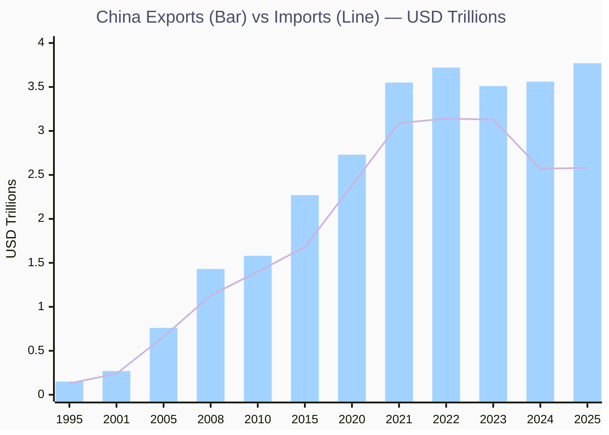
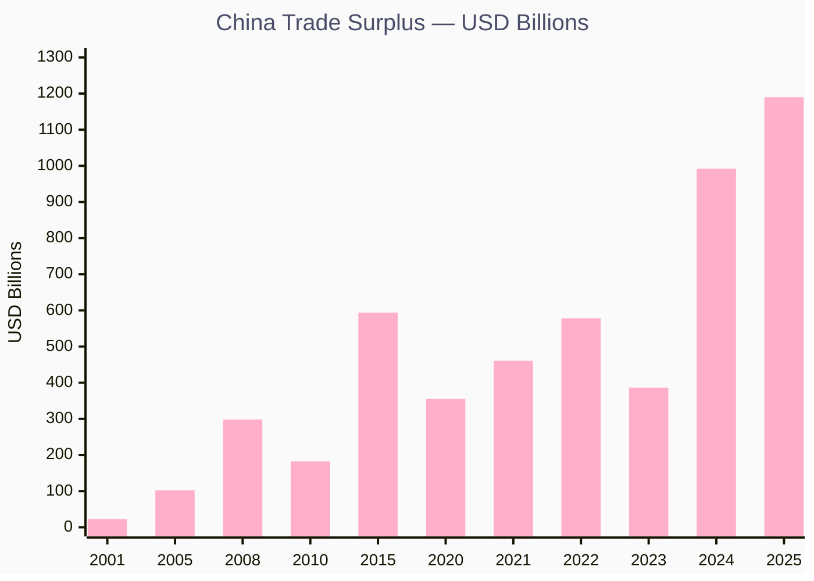
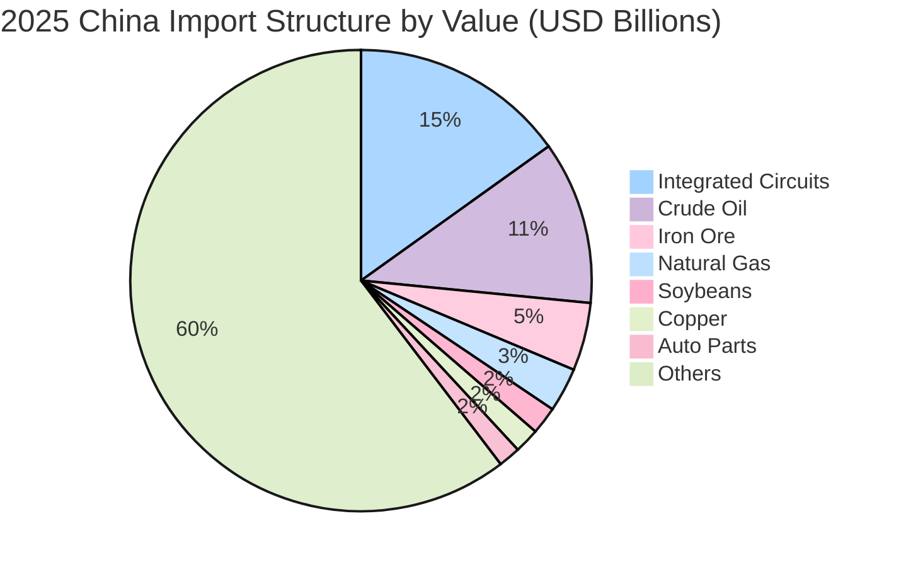
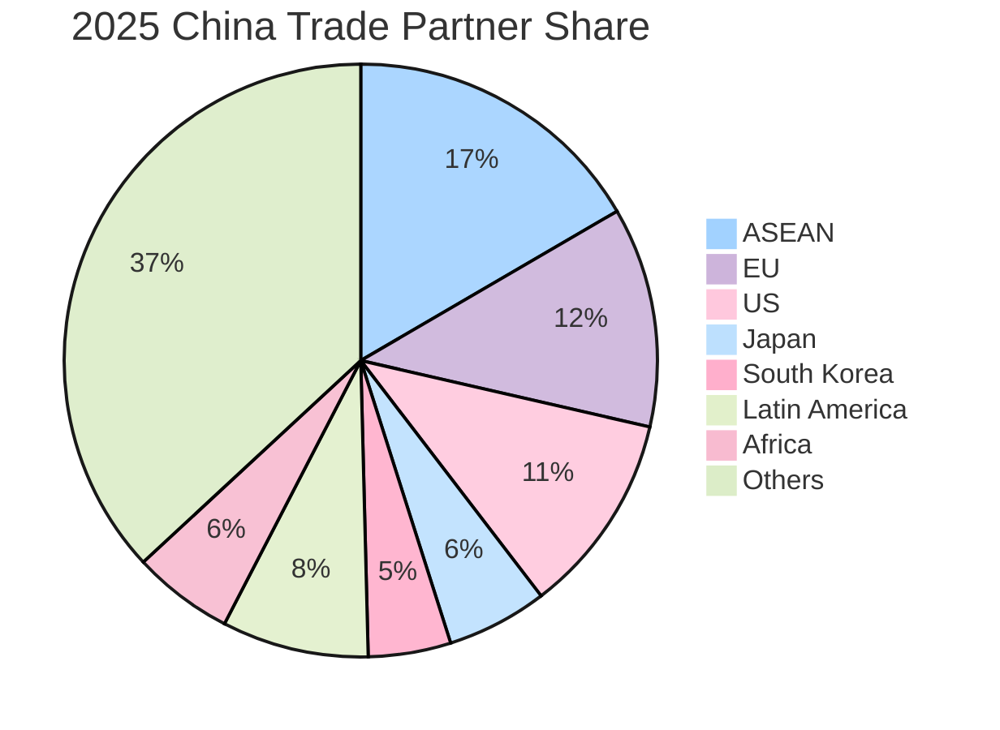
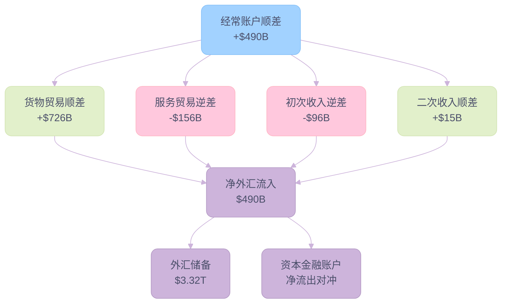
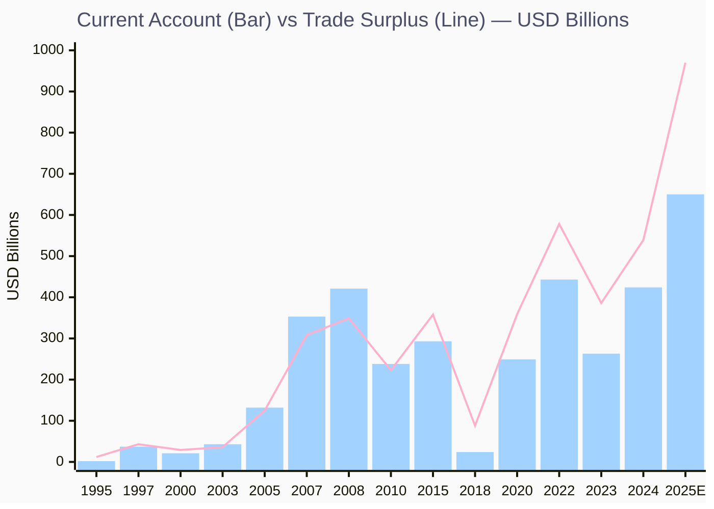

# 三十年沧海桑田：2025年中国进出口贸易深度调研

> **调研日期**: 2026-02-11
> **调研员**: Digital Ray
> **数据来源**: 海关总署 (GAC)、国家外汇管理局 (SAFE)、IMF、World Bank、Macrotrends、Reuters、China Briefing、CEIC Data
> **统一口径**: 全篇以 **美元 (USD)** 计价

---

## 一、核心摘要

2025年是中国外贸史上具有标志性意义的一年。在全球保护主义抬头、中美关税摩擦加剧的背景下，中国货物进出口不仅实现了连续9个月正增长，而且**贸易顺差首次突破1万亿美元关口**，达到创纪录的 **$1.19万亿**。

核心发现：

| 指标            | 2025年数据     | 同比变化               | 历史对比      |
| ------------- | ----------- | ------------------ | --------- |
| 出口总额          | **$3.77万亿** | +5.9%              | 历史新高      |
| 进口总额          | **$2.58万亿** | +0.2%              | 基本持平      |
| 贸易顺差          | **$1.19万亿** | ↑                  | 首次突破万亿门槛  |
| 经常账户顺差 (前三季度) | **$490B**   | —                  | 占GDP约3.3% |
| 外汇储备 (6月底)    | **$3.32万亿** | +$1,151亿 vs 2024年末 | 十年最高水平    |
| 贸易经营主体        | 78万家        | —                  | 民企占比57.3% |
|               |             |                    |           |

**关键判断**：中国正从"世界工厂"加速转型为"全球高端制造中心"。出口的核心驱动力已从传统的服装鞋帽（旧三样）切换到电动汽车、锂电池、光伏组件（新三样），同时贸易伙伴格局发生根本性转变——东盟取代美国成为第一大伙伴。

---

## 💡 关键洞察 (Key Insights)

### 1. 历史性的"万亿顺差"时刻

2025年，中国贸易顺差不仅首次突破 **1万亿美元** 大关 ($1.19T)，更在过去两年间实现了惊人的 **3倍增长** (2023: $386B → 2025: $1.19T)。这一数据标志着中国制造已从"以量取胜"转向"结构性溢出"，其作为全球供应链核心的地位不降反升。

### 2. "大分流" (Great Divergence)：海关 vs BOP

海关口径的货物贸易顺差 ($1.19T) 与国际收支平衡表 (BOP) 的经常账户顺差 (~$650B) 出现了史无前例的 **$5000亿+ 缺口**。这一统计背离暗示了复杂的资本外流、服务贸易逆差掩盖以及可能的统计方法调整 (SAFE 2022年新规)，成为理解中国真实外部尤其是资本流动压力的关键密码。

### 3. 此消彼长的"新三角"关系

- **出口引擎切换**: "新三样" (EV/电池/光伏, ~$120B) 正式接棒纺织服装，成为出口增长核心驱动力，技术附加值显著提升。
- **伙伴格局重构**: 东盟 (ASEAN, $1T+) 彻底取代美国成为第一大贸易伙伴，且"一带一路"国家占比过半；对美直接出口虽暴跌20%，但通过墨西哥/越南的**转口贸易** (Transshipment) 维系了实质上的经贸联结。

### 4. 韧性与脆弱性的双重变奏

- **韧性**: 尽管面临关税围堵，中国凭借全产业链优势 ($3.77T 出口) 展现出极强的抗压能力。
- **脆弱性**: 进口增速 (~0%) 显著低于出口增速，大宗商品进口"价跌量增"，折射出**内需疲软**的深层隐忧。巨大的顺差既是竞争力的体现，也成为全球贸易保护主义的靶子。

---

## 二、30年贸易总量演变（1995-2025）

### 2.1 出口规模的历史飞跃

中国出口在30年间实现了从 **$1,488亿** 到 **$3.77万亿** 的惊人增长，CAGR 约 **11.3%**。

| 年份 | 出口 (USD) | 进口 (USD) | 贸易差额 | 里程碑事件 |
|---|---|---|---|---|
| 1995 | $1,488亿 | $1,321亿 | +$167亿 | 汇率并轨, 外贸起步 |
| 2001 | $2,661亿 | $2,436亿 | +$225亿 | 正式加入WTO |
| 2005 | $7,620亿 | $6,601亿 | +$1,019亿 | WTO红利释放, 顺差首超千亿 |
| 2008 | $1.43万亿 | $1.13万亿 | +$2,981亿 | 金融危机前夜，出口巅峰 |
| 2010 | $1.58万亿 | $1.40万亿 | +$1,815亿 | 危机后V形反弹 |
| 2015 | $2.27万亿 | $1.68万亿 | +$5,939亿 | 产能过剩压力, 价格竞争 |
| 2020 | $2.73万亿 | $2.38万亿 | +$3,552亿 | COVID疫情, 出口逆势增长 |
| 2021 | $3.55万亿 | $3.09万亿 | +$4,608亿 | 疫情下全球制造回流中国 |
| 2022 | $3.72万亿 | $3.14万亿 | +$5,779亿 | 顺差历史新高 |
| 2023 | $3.51万亿 | $3.13万亿 | +$3,860亿 | 增速回落, 结构调整 |
| 2024 | $3.56万亿 | $2.57万亿 | +$9,920亿 | 接近万亿顺差 |
| **2025** | **$3.77万亿** | **$2.58万亿** | **+$1.19万亿** | **首破万亿顺差** |

> 数据来源: 1995-2023 Macrotrends/World Bank; 2024-2025 海关总署/CEIC

#### 图表: 中国出口 (Bar) vs 进口 (Line) 总额演变 (1995-2025)

**Key Insights:**

- 🏆 **25倍增长**: 出口从1995年$1,488亿跃升至2025年$3.77万亿，CAGR约11.3%
- 📈 **出口-进口剪刀差扩大**: 2024-2025年进口增速近乎停滞，顺差急剧膨胀
- ⚠️ **内需隐忧**: 2024-2025进口额反而低于2021-2022峰值，折射内需疲软

#### 图表: 贸易顺差演变 (2001-2025)

**Key Insights:**

- 🏆 **万亿历史性突破**: 2025年顺差$1.19T，首次突破万亿美元
- 📈 **加速膨胀**: 2023到2025仅两年间顺差从$3,860亿飙升3倍至$1.19万亿
- ⚠️ **全球争议焦点**: 巨额顺差引发"产能过剩"指控与贸易摩擦升级

### 2.2 关键历史节点分析

#### 🏛 2001年入世 (WTO Accession)

- 入世前后5年（1998-2006），出口CAGR达 **24%**
- 关税大幅下降（平均关税从43%降至9.8%），外资涌入加工贸易
- 中国迅速成为全球制造供应链的核心环节

#### 💥 2008年金融危机

- 2009年出口同比暴跌 **-16%**，全球需求急冻
- 但中国通过 **4万亿刺激计划** 快速恢复内需，2010年出口即超越危机前水平

#### 🔥 2018-2019年贸易战

- 中美互征关税（最高达25%），直接抑制对美出口
- 但中国通过 **市场多元化** 战略（东盟/一带一路）成功对冲
- 对美出口占比从2017年的19%持续下降至2025年的约14%

#### 🦠 2020-2021年COVID红利

- 全球产能受限，中国率先复工
- 2020年出口逆势增长 **+3.8%**，2021年爆发性增长 **+30.2%**
- 医疗物资、居家办公设备出口激增

#### 📈 2024-2025年结构性顺差时代

- 新能源产品出口迅猛增长 + 大宗商品进口价格下跌
- 顺差从2023年的$3,860亿飙升至2025年的$1.19万亿
- 引发全球对"中国产能过剩"的争议

---

## 三、进出口结构深层演变

### 3.1 出口结构：从"旧三样"到"新三样"

中国出口商品结构已发生根本性转变：

**旧三样（1990s-2010s主导）**:

| 品类 | 代表产品 | 2024年占比趋势 |
|---|---|---|
| 服装 | 纺织品、鞋帽 | 持续下降 |
| 家具 | 木质家具、家居 | 趋于平稳 |
| 家电 | 白色家电 | 平稳，利润率提升 |

**新三样（2022年后爆发）**:

| 品类 | 2025年1-7月出口 | 增长态势 |
|---|---|---|
| 电动汽车 (EV) | $380亿+ | 对欧增速放缓（反补贴税），对东南亚/中东加速 |
| 锂电池 | $350亿+ | 储能电池增长尤为迅猛 |
| 光伏组件 | $200亿+ | 价格下跌但出货量创纪录 |
| **合计** | **~$1,200亿 (7个月)** | **新能源占出口增量的"半壁江山"** |

> 来源: Digitimes Asia, Carbon Brief 2025年报道

**核心洞察**：新三样的崛起不仅改变了出口商品构成，更重塑了中国在全球产业链中的角色——从低附加值代工者跃升为高端装备和核心技术的输出者。2025年，中国清能源对GDP增长的贡献达 **40%**。

### 3.2 进口结构：资源刚需 + 芯片依赖

2025年中国进口呈现"价跌量增"的显著特征：

| 品类 | 2025年进口金额 | 数量变化 | 价格变化 |
|---|---|---|---|
| 集成电路 (IC) | $228B (7个月) / ~$390B (全年估) | ↑ | 价格企稳 |
| 原油 | $295.2B | 量↑4.4% (日均1,160万桶创新高) | 价↓ |
| 铁矿石 | $122.7B | 量↑5.2% (12.6亿吨历史新高) | 价↓10%+ |
| 天然气 | — | 量↑ | 价↓ |
| 大豆 | — | 量稳 | 价↓ |

> 来源: China Briefing, SteelOrbis, Reuters, Columbia CGEP

#### 图表: 2025年中国进口商品结构 (按金额估算)

**Key Insights:**

- 🏆 **芯片为王**: 集成电路年化$3,900亿，占进口总额约15%，超越原油成为第一大进口品
- 📈 **资源三巨头**: 原油+铁矿石+天然气合计占进口约19%，中国仍为全球最大资源买家
- ⚠️ **价格敏感性**: 大宗价格跌10%即拖累进口增速2.7个百分点，放大了顺差规模

**结构性特征**：

1. **芯片进口仍是第一大单一品类**，年化约$3,900亿，超过原油。尽管国产替代推进（半导体设备进口↑21%），但高端芯片仍高度依赖进口。
2. **大宗商品价格下跌拖累进口金额**：上半年原油、铁矿石、大豆均价跌幅超10%，压低进口增速约2.7个百分点。
3. **消费升级品类表现亮眼**：食用植物油进口增长16.6%，水果进口增速领先。
4. **原油进口创纪录**：受低油价和地缘风险驱动，中国日均进口原油1,160万桶，其中印尼（伊朗转口）和巴西贡献主要增量。

### 3.3 贸易主体结构

| 主体类型 | 2025年占外贸比重 | 同比增速 | 趋势 |
|---|---|---|---|
| 民营企业 | **57.3%** | +7.1% | 连续21个季度领涨，外贸第一引擎 |
| 外商投资企业 | ~37% | +3.7% | 连续7个季度正增长 |
| 国有企业 | ~6% | — | 占比持续收缩 |

**跨境电商新业态**:

- 2025年跨境电商进出口规模达 **2.75万亿元人民币** (~$3,800亿)，较2020年增长近70%
- 前三季度出口1.63万亿元，增长6.6%
- Temu、SHEIN、TikTok Shop 加速全球化布局
- 商务部首推"跨境电商+产业带"模式，覆盖中部地区

---

## 四、贸易伙伴格局重构

### 4.1 2025年贸易伙伴格局

| 排名 | 贸易伙伴 | 2025年双边贸易额 | 占中国外贸比重 | 同比变化 |
|---|---|---|---|---|
| 1 | **东盟 (ASEAN)** | **$1.02万亿+** | ~16.6% | +9.1%~9.7% |
| 2 | 欧盟 (EU) | ~$7,500亿 | ~12% | +5%~6% |
| 3 | 美国 (US) | — | ~11% (↓) | 出口-20%, 整体↓15.9% |
| 4 | 一带一路国家 | 22万亿RMB (2024) | 51.7% (前9月) | +6.2%~6.3% |
| 5 | 拉美 | — | — | +3.9% |
| 6 | 非洲 | — | — | +19.5%~25.8% |
| 7 | 中亚 | — | — | +16.7% |

#### 图表: 2025年中国贸易伙伴结构

**Key Insights:**

- 🏆 **东盟称王**: 东盟以16.6%份额连续5年居首，双边贸易超$1T
- 📈 **全球南方崛起**: 一带一路国家合计占比超50%，拉美/非洲/中亚增速均超两位数
- ⚠️ **对美脱钩加速**: 美国份额跌至约11%，对美出口暴跌20%，但通过转口贸易部分缓冲

### 4.2 关键伙伴深度分析

#### 🇹🇭 东盟：第一大伙伴的战略意义

- **连续5年**保持中国第一大贸易伙伴地位
- 2025年双边贸易首次突破 **$1万亿**（2024年为$982B）
- ASEAN-中国自贸区3.0版于2025年10月签署，覆盖数字经济和绿色产业
- 零关税覆盖率维持在 **65%以上**
- 中间品贸易占双边贸易 **67%**，形成深度嵌合的供应链网络
- RCEP实施后，贸易自由化水平和规模稳步提升

#### 🇪🇺 欧盟：增长中的摩擦

- 双边贸易5.37万亿元（~$7,490亿），增长约5%
- 欧盟仍为第二大贸易伙伴
- 但EV反补贴关税、数字市场法规（DSA）带来结构性摩擦
- 欧盟对华贸易逆差持续扩大

#### 🇺🇸 美国：脱钩加速

- 对美出口大幅下滑 **-20%**（受关税和出口管制影响）
- 美国对华关税最高达145%（关键品类）
- **转口贸易繁荣 (Transshipment)**: 尽管直接贸易额下降，但中国对墨西哥 (+15%) 和越南 (+12%) 的中间品出口大幅增加，这些国家加工组装后最终产品仍流向美国市场。实质上，中美供应链并未断裂，而是变得更加迂回和昂贵。
- 稀土磁体出口出现戏剧性波动（2025年6月对美暴涨660%）

#### 🌍 全球南方：新增量来源

- 中国已成为 **157个国家和地区** 的前三大贸易伙伴
- 与249个国家/地区存在贸易往来
- 万亿级贸易国14个、千亿级62个、百亿级137个
- 非洲和中亚市场增速最快（分别+19.5%和+16.7%）

### 4.3 30年伙伴结构变迁

| 维度 | 1995-2000 | 2001-2010 | 2015-2025 |
|---|---|---|---|
| 第一大出口目的地 | 美国 | 美国 | **东盟** (2020年起) |
| 第一大进口来源 | 日本 | 日本/韩国 | **东盟** |
| 新兴市场占比 | <20% | ~25% | **>50%** (一带一路国家) |
| 对美依赖度 | ~21% | ~19% | **~14%** (出口) ↓ |

---

## 五、外汇盈余与国际收支分析

### 5.1 国际收支结构（2025年）

根据国家外汇管理局 (SAFE) 发布的官方数据：

**前三季度 (2025年1-9月)**:

| BOP项目 | 金额 (USD) | 说明 |
|---|---|---|
| 经常账户余额 | **+$490B** | 占GDP约3.3% |
| ├ 货物贸易顺差 | **+$726B** | 核心顺差来源 |
| ├ 服务贸易逆差 | **-$156B** | **旅行 (Travel)**: 随着出境游恢复，逆差显著扩大 (约占60%); **知识产权 (IP)**: 持续逆差，反映技术引进成本; **运输 (Transport)**: 受运价波动影响较大 |
| ├ 初次收入逆差 | **-$96B** | 投资收益净流出 |
| └ 二次收入顺差 | +$15B | 侨汇等 |
| 资本与金融账户 | **-$3,708B RMB** | 与经常账户顺差大致对冲 |

#### 图表: 2025年前三季度经常账户结构

**Key Insights:**

- 🏆 **货物顺差主导**: 货物贸易顺差$726B占经常账户顺差的148%，服务和收入逆差抵消部分
- 📈 **服务逆差可控**: 服务贸易逆差$156B仅为货物顺差的21%，以旅游和知识产权为主
- ⚠️ **资本外流对冲**: 经常账户顺差几乎被资本金融账户逆差完全对冲，实现"自主平衡"

**年度趋势 (1995-2025)**:

| 年份 | 经常账户余额 (USD B) | 货物及服务贸易顺差 (USD B) | 说明 |
| --- | --- | --- | --- |
| 1995 | $1.6B | $12B | 汇率并轨后外贸起步 |
| 1997 | $37B | $43B | 亚洲金融危机前夕 |
| 2000 | $21B | $29B | 危机后恢复期 |
| 2001 | $17B | $28B | 加入WTO元年 |
| 2003 | $43B | $36B | WTO红利初显 |
| 2005 | $132B | $125B | WTO红利爆发 |
| 2007 | $353B | $308B | 历史占GDP巅峰(9.9%) |
| 2008 | $421B | $349B | 金融危机前夜 |
| 2010 | $238B | $223B | 危机后收缩 |
| 2015 | $293B | $358B | 服务逆差扩大期 |
| 2018 | $24B | $88B | 贸易战冲击 |
| 2020 | $249B | $359B | COVID出口红利启动 |
| 2021 | $353B | $461B | 全球供应链回流中国 |
| 2022 | $443B | $578B | CA历史最高(BOP口径) |
| 2023 | $263B | $386B | BOP新方法论压缩CA |
| 2024 | $424B | $539B | 顺差重新扩大 |
| 2025E | ~$650B | ~$970B | 前三季度CA $490B |

> 数据来源: World Bank API (BN.CAB.XOKA.CD, BN.GSR.GNFS.CD) 1995-2024实际值; 2025为SAFE前三季度+全年估算

#### 图表: 经常账户余额 (Bar) vs 货物及服务顺差 (Line) 年度演变 (1995-2025)

**Key Insights:**

- 🏆 **30年四阶段**: 1995-2001经常账户仅$2-37B → 2005-2008爆发至$421B → 2015-2018回落至$24B低谷 → 2020-2025再次飙升至$650B+
- 📈 **两条线的剪刀差**: 2015年前经常账户与贸易顺差走势基本匹配；2015年后贸易顺差持续膨胀但经常账户因服务逆差和收入逆差被大幅压缩
- ⚠️ **2018年谷底之谜**: 贸易战冲击下经常账户骤降至$24B (占GDP仅0.2%)，但贸易顺差仍有$88B；服务逆差(出境旅游+知识产权)和投资收益净流出吞噬了大部分货物顺差

> **注**: CFR(Council on Foreign Relations)分析师Brad Setser指出，中国海关贸易数据与BOP口径之间存在持续不可解释的差距，如果使用海关口径+旧方法论，经常账户顺差可能高达GDP的5%。

### 5.2 外汇储备动态

| 时间点 | 外汇储备规模 | 变动说明 |
|---|---|---|
| 2025年6月底 | **$3.3174万亿** | 较2024年末增加$1,151亿, **十年最高** |
| 变动因素 | — | 非美货币升值 + 资产估值变动 |

**关键发现**：

1. **储备增长不等于外汇流入**：SAFE指出上半年储备增长主要来自非美货币对美元升值的估值效应，而非实际外汇购入
2. **黄金储备持续增持**：央行连续多年增持黄金，推动人民币国际化
3. **国有银行角色凸显**：OMFIF分析指出，过去10年外储报告值保持稳定，但国有银行已成为外汇市场的关键操作者，其外币资产头寸比央行资产负债表更能反映市场压力
4. **人民币承压方向逆转**：2024-2025年，人民币从贬值压力转向升值压力。SAFE结售汇数据显示，2025年5-6月已转为顺差，表明市场正在抵制人民币升值

### 5.3 顺差的宏观影响与争议

巨额贸易顺差引发了以下关键议题：

1. **IMF汇率评估**：IMF 2025年10月WEO将中国经常账户顺差上调至GDP的3.3%，暗示人民币可能被低估约18%
2. **全球产能过剩争议**：欧美指责中国新能源产品以"倾销"价格涌入全球市场，对此中国强调——
   - 出口价格竞争力源自完整产业链和规模效应
   - 新能源出口有助于全球碳减排目标
3. **经常账户与资本账户的"自主平衡"**：SAFE强调，经常账户顺差与非储备金融账户逆差大致相当，国际收支实现"自主均衡"
4. **隐性外汇管理**：尽管中国官方宣称人民币汇率灵活浮动，但中间价机制（fixing）和国有银行操作实质上构成了对汇率的有效管理

---

## 六、风险地图与前瞻

### 6.1 外部风险

| 风险因素 | 影响评估 | 应对策略 |
|---|---|---|
| 中美关税升级 (145%+) | ⚠️ 高: 直接冲击对美出口 | 市场多元化 + 转口贸易 |
| 欧盟反补贴调查 | ⚠️ 中高: EV/太阳能出口受限 | 在欧建厂本地化 |
| 全球需求放缓 | ⚠️ 中: 发达经济体衰退风险 | 扩大对新兴市场出口 |
| 供应链"去风险化" | ⚠️ 中: "友岸外包"趋势 | 深化RCEP/一带一路合作 |

### 6.2 内部挑战

| 挑战 | 表现 | 影响 |
|---|---|---|
| 内需不足 | 进口增速仅+0.2%，消费品进口结构分化 | 贸易顺差持续扩大，加剧外部摩擦 |
| 芯片"卡脖子" | IC进口年化$3,900亿，高端芯片完全依赖进口 | 技术安全隐患 |
| 人民币汇率困境 | 升值压力与出口竞争力的矛盾 | 央行面临政策两难 |
| 加工贸易占比下降 | 一般贸易占比升至63.4% | 反映产业升级，但也增加固定成本 |

### 6.3 2026年展望

**基准情景**：

- 出口增速回落至 **+2%~4%**（高基数效应 + 关税影响延迟兑现）
- 进口在内需政策刺激下小幅回升至 **+3%~5%**
- 顺差高位回落至 **$8,000亿~$1万亿** 区间
- 东盟、拉美、非洲继续贡献出口增量
- 新三样出口仍是核心引擎，但增速放缓

**关键变量**：

1. 中美贸易谈判进展（关税是否阶段性缓解）
2. 美联储利率政策对全球需求的影响
3. 欧盟EV反补贴税实际执行力度
4. 中国国内消费刺激政策的效果

---

## 七、数据来源与方法论说明

### 数据来源

| 来源 | 数据类型 | 覆盖范围 |
|---|---|---|
| 海关总署 (GAC) | 贸易总量、伙伴、商品 | 2025年月度/季度/全年 |
| 国家外汇管理局 (SAFE) | BOP、外汇储备 | 2025年季度 |
| Macrotrends (World Bank) | 历史出口/进口/贸易差额 | 1960-2023 |
| CEIC Data | 月度进出口 | 1992-2025 |
| IMF WEO | 经常账户/GDP比值 | 2025年 |
| China Briefing | 商品细分、政策分析 | 2025年 |
| Reuters / Bloomberg | 大宗商品、市场动态 | 2025年 |
| Columbia CGEP | 原油进口分析 | 2025年 |
| CFR (Brad Setser) | BOP数据质量分析 | 2025年 |
| OMFIF | 人民币汇率分析 | 2025年 |

### 方法论

1. **统一口径**：全文以美元计价，RMB数据按当期汇率折算
2. **数据交叉验证**：海关口径与BOP口径数据分别标注，重大差异专门说明
3. **IMF API本次受限**：原计划通过 `imf-data-mcp` 获取DOT/IFS/BOP长周期数据，但因API速率限制未能成功调取，历史数据改用World Bank/Macrotrends公开数据补充
4. **定性分析来源**：政策解读和市场分析基于Brave Search检索的权威来源，均已在文中标注

---
