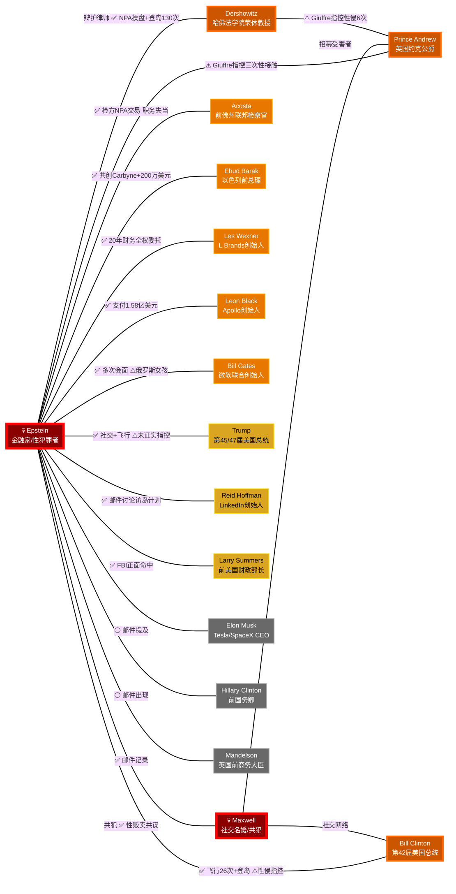
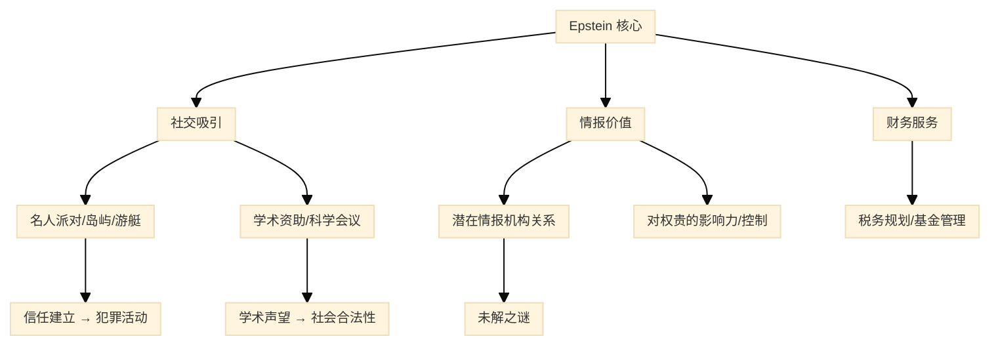

# 爱泼斯坦案深度调查报告

> **研究日期**: 2026年2月  
> **信息截止**: 2026年2月9日  
> **注**: 本报告基于公开可查证的资料编制。事实与指控严格区分标注。涉及争议性话题时呈现多方观点。

---

## 目录

1. [文件公开时间线](#1-文件公开时间线)
2. [案件完整时间线](#2-案件完整时间线-1990s至今)
3. [涉案政治人物分析](#3-涉案政治人物分析)
4. [特朗普与爱泼斯坦关系深度分析](#4-特朗普与爱泼斯坦关系深度分析)
5. [案件深层洞察](#5-案件深层洞察)

---

## 1. 文件公开时间线

### 1.1 主要文件发布节点

| 日期 | 事件 | 文件规模 | 来源 |
|------|------|----------|------|
| **2024年1月** | Ghislaine Maxwell 诽谤案文件解封 | 数百页 | 纽约南区联邦法院 |
| **2025年2月** | 司法部长 Pam Bondi 发布首批解密文件 | 第一阶段 | 司法部 (DOJ) |
| **2025年11月19日** | 《爱泼斯坦文件透明法案》(Epstein Files Transparency Act) 签署 | 立法框架 | 总统签署 |
| **2025年12月** | 法案生效，DOJ 开始系统性发布 | 分批发布 | DOJ 合规发布 |
| **2026年1月30日** | **最终发布：超过350万页文件** | 350万+ 页 | DOJ 最终合规 |

### 1.2 文件来源构成

DOJ 最终发布的350万页文件来自**五个主要来源**：

1. **佛罗里达州案件** — 早期调查与2008年认罪协议相关文件
2. **纽约州案件** — 2019年联邦起诉（性贩卖指控）
3. **Maxwell 案件** — 纽约南区联邦法院审判材料
4. **爱泼斯坦死亡调查** — FBI 和 OIG 对MCC监狱死亡的调查
5. **多项FBI调查** — 包括管家调查和监察长办公室调查

### 1.3 发布争议

- **篡改指控**: WIRED 报道发现 DOJ/FBI 描述为"完整原始"监控录像的文件实际上被拼接，缺失了近 **3分钟** 的内容
- **虚假视频**: 一段12秒的虚假"爱泼斯坦自杀"视频曾短暂出现在 DOJ 网站上，后被确认来自暗网的 CGI 伪造品
- **编辑错误**: DOJ 承认部分文件存在编辑遗漏
- **受害者批评**: 受害者倡导者指出，文件发布时缺乏背景说明，"给人一种系统运作正常的错觉"

> **来源**: DOJ 官方公告、BBC News、WIRED、The Guardian

---

## 2. 案件完整时间线 (1990s至今)

### 2.1 早期阶段 (1990s–2005)

| 时间 | 事件 |
|------|------|
| 1953年 | Jeffrey Epstein 出生于纽约布鲁克林 |
| 1976年 | 在道尔顿学校 (Dalton School) 任教，后进入金融界 |
| 1988年 | 创立 J. Epstein & Company，专为身价超10亿美元的客户管理资产 |
| 约1988年 | 开始与 Les Wexner（L Brands 创始人）建立核心财务关系 |
| 1990年代初 | 获得棕榈滩豪宅、新墨西哥 Zorro Ranch |
| 1996年 | Wexner 将曼哈顿最大私人住宅（东71街9号）转让给 Epstein |
| 约1994–2004年 | **犯罪活动期**: 与 Ghislaine Maxwell 共同招募、诱骗未成年女孩 |
| 2005年 | 棕榈滩警方接到家长举报，开始调查 Epstein 对14岁女孩的性侵 |

### 2.2 2008年认罪协议——"世纪交易"

| 时间 | 事件 |
|------|------|
| 2006–2007年 | FBI 介入调查，识别至少 **40名** 未成年受害者 |
| 2007年8月 | 佛州南区联邦检察官 **Alexander Acosta** 开始与 Epstein 的律师团队谈判 |
| 2007年9月24日 | Epstein 签署**不起诉协议 (NPA)** — 比检方准备提起公诉的日期早一天 |
| 2008年 | Epstein 以**州级卖淫罪**认罪，避免联邦性贩卖指控 |
| 2008–2009年 | 服刑 **13个月**（佛州县级监狱），享有**白天离监工作释放**待遇 |
| | 注册为性犯罪者 |

**NPA 协议关键争议点**:

- 🔴 **广泛豁免**: 不仅豁免 Epstein，还豁免其所有"未具名共谋者"
- 🔴 **秘密操作**: 协议被秘密保管，**受害者不知情**（后被裁定违反《犯罪受害者权利法》）
- 🔴 **异常配合**: Epstein 律师团队（包括 Alan Dershowitz）与检方存在"不寻常的合作水平"
- 🔴 **后续评价**: DOJ 职业责任办公室 (OPR) 裁定 Acosta 使用了**"糟糕的判断力"**，但**未构成职业不端**
- ⚪ **Acosta 的辩护**: 声称庭审将是"赌博"，受害者不愿出庭作证，州级认罪比无罪释放更好

> **事实**: Acosta 于2017年被特朗普提名为劳工部长；2019年 Epstein 再次被捕后，因压力**辞职**。
> 2025年9月，Acosta 在众议院监督委员会闭门作证约6小时，继续为 NPA 辩护。

### 2.3 再次被捕与死亡 (2019)

| 时间 | 事件 |
|------|------|
| **2019年7月6日** | Epstein 在纽约被逮捕，被控**性贩卖未成年人及共谋罪** |
| 7月8日 | 纽约南区联邦法院提起公诉（2007年 NPA 不约束纽约联邦检察官） |
| 7月23日 | 在 MCC (大都会惩教中心) 牢房中发现 Epstein 颈部缠绕布条 — 被置于**自杀监视** |
| 7月24日 | 仅**一天**后被撤销自杀监视 |
| 8月9日晚 | 室友于当天被释放，Epstein 独自关押 |
| **8月10日清晨** | 狱警发现 Epstein 在牢房中无反应，6:39am 被**宣告死亡** |

### 2.4 爱泼斯坦之死——争议焦点

**官方结论**: 纽约市法医裁定死因为**上吊自杀**。DOJ 监察长办公室 (OIG) 确认此结论。

**异常情况汇总**:

| 异常项 | 详情 |
|--------|------|
| 🔴 监控摄像头故障 | SHU（特殊住房区）中几乎所有摄像头自2019年7月底起**停止录制** |
| 🔴 唯一存留视频问题 | 仅一台摄像头有录制，但无法看到 Epstein 的牢房内部；且 WIRED 分析发现该视频被拼接，缺失近3分钟 |
| 🔴 狱警失职 | 两名值班狱警当晚**睡觉和网上购物**，未按要求每30分钟巡视 |
| 🔴 巡视记录伪造 | 狱警承认**伪造巡视记录**（后达成认罪协议，避免入狱） |
| 🔴 独自关押 | 监狱长曾明确要求 Epstein 不得独自关押 |
| 🔴 快速解除自杀监视 | 第一次自杀未遂后仅一天就被撤销监视 |
| 🔴 死亡声明日期争议 | 部分文件中宣布死亡的声明日期标注为8月9日——比发现死亡早一天 |
| ⚪ 独立法医意见 | 家属聘请的法医 Michael Baden 认为伤痕更符合**勒杀**而非上吊 |

**官方调查结论**:

- OIG 识别 **13名**表现不佳的员工，建议对 **4人** 提起指控
- 仅两名狱警被起诉，通过认罪协议**避免入狱**
- **未发现**任何支持阴谋论的物证，但确认存在广泛的管理失败和制度性缺陷

### 2.5 Maxwell 审判与后续 (2020–2026)

| 时间 | 事件 |
|------|------|
| **2020年7月2日** | Ghislaine Maxwell 被逮捕，面临多项性犯罪指控 |
| **2021年11月29日** | Maxwell 审判开始 |
| **2021年12月29日** | 陪审团裁定 Maxwell **五项罪名成立**（包括性贩卖未成年人、共谋等） |
| **2022年6月28日** | Maxwell 被判处 **20年监禁** + 75万美元罚款 |
| 2022年7月 | Maxwell 被转移至德州联邦女子监狱 |
| **2024年9月17日** | 第二巡回上诉法院维持五项定罪和判决 |
| **2025年10月** | 美国最高法院拒绝审理 Maxwell 的上诉 |
| 2025年12月17日 | Maxwell 提交人身保护令请求，声称有 **29人**通过"秘密和解"逃脱起诉 |
| **2026年2月9日** | 众议院监督委员会计划质询 Maxwell |
| 预计释放日期 | **2037年7月17日** |

> **来源**: DOJ 官方声明、PBS、AP、BBC、WIRED、NY Times

---

## 3. 涉案政治人物分析

### 3.1 按陈营分类

#### 3.1.1 民主党人物

| 人物 | 职务 | 关联类型 | 证据级别 | 主要指控/关联 | 本人回应 |
|------|------|----------|----------|---------------|----------|
| **Bill Clinton** | 第42届美国总统 | 社交/飞行记录 | ✅ 已证实（社交关系） | 多次乘坐爱泼斯坦私人飞机"Lolita Express"（飞行日志记录至少26+次飞行）；访问过爱泼斯坦私人岛屿 | 否认任何不当行为；声称每次飞行都有特勤局随行 |
| **Hillary Clinton** | 前美国国务卿、2016民主党总统候选人 | 间接/邮件提及 | ⚪ 邮件中出现但无直接关联 | 出现在爱泼斯坦文件的邮件中 | 未直接回应 |
| **Larry Summers** | 前美国财政部长、哈佛大学校长 | 社交/财务顾问 | ✅ 已证实（社交关系） | 出现在爱泼斯坦的联系人列表和邮件中；FBI 文件中列为"positive case hits" | 未详细回应 |
| **Bill Richardson**† | 前新墨西哥州州长 | 指控 (Virginia Giuffre) | ⚠️ 证人证词（Giuffre） | Giuffre 证词中指控其涉及不当行为 | 生前否认所有指控 |
| **George Mitchell** | 前美国参议院多数党领袖 | 指控 (Virginia Giuffre) | ⚠️ 证人证词（Giuffre） | Giuffre 证词中指控其涉及不当行为 | 否认所有指控 |

#### 3.1.2 共和党人物

| 人物 | 职务 | 关联类型 | 证据级别 | 主要指控/关联 | 本人回应 |
|------|------|----------|----------|---------------|----------|
| **Donald Trump** | 第45/47届美国总统 | 社交/飞行/场所 | ✅ 已证实（社交关系）+ ⚠️ 未经证实的指控 | [详见第4章完整分析] | 否认深交；称已于2003-04年与其断交 |
| **Alexander Acosta** | 前佛州联邦检察官、前劳工部长 | 官方决策 | ✅ 已证实（职务行为） | 作为佛州联邦检察官，批准了2008年"世纪"认罪协议 | 辩称是当时最佳结果 |
| **Matt Gaetz** | 佛罗里达州联邦众议员 | 调查关联 | ⚠️ 独立调查中 | 面临独立的性贩卖调查（非直接 Epstein 案） | 否认所有指控 |

#### 3.1.3 超党派/国际人物

| 人物                  | 职务                          | 关联类型     | 证据级别                   | 主要指控/关联                                                                    | 本人回应                          |
| ------------------- | --------------------------- | -------- | ---------------------- | -------------------------------------------------------------------------- | ----------------------------- |
| **Prince Andrew**   | 英国约克公爵、女王次子                 | 社交/指控    | ✅ 已证实社交 + ⚠️ 民事和解      | Giuffre 指控三次性接触（伦敦、纽约、爱泼斯坦岛）；著名照片显示其搂着 Giuffre                             | 2022年以1200万英镑庭外和解；否认不当行为      |
| **Ehud Barak**      | 以色列前总理                      | 社交/商业/财务 | ✅ 已证实密切关系              | 与 Epstein 共同创立 Carbyne（技术公司，前以色列情报人员任职）；从 Wexner 基金会获200万美元                | 承认关系但否认不当行为                   |
| **Alan Dershowitz** | 哈佛大学法学院荣休教授、知名刑辩律师          | 辩护律师/指控  | ✅ 辩护关系 + ⚠️ Giuffre 指控 | 为 Epstein 2008年 NPA 辩护；文件中出现 **130+次**；Giuffre 指控其性侵（后撤诉）；曾多次登岛            | 否认所有性侵指控；承认律师-客户关系            |
| **Peter Mandelson** | 英国前商务大臣、欧盟贸易专员              | 社交       | ✅ 邮件记录                 | 出现在 Epstein 的社交网络邮件中                                                       | 未详细回应                         |
| **Elon Musk**       | Tesla/SpaceX CEO            | 邮件提及     | ⚪ 出现在文件中               | 出现在 Epstein 的邮件和联系人中                                                       | 否认实质性关系                       |
| **Bill Gates**      | 微软联合创始人、盖茨基金会主席             | 社交/财务/个人 | ✅ 多次会面记录               | 2011年后多次会面和Skype通话（Epstein 已是定罪性犯罪者之后）；Epstein 在邮件中声称 Gates 涉及"俄罗斯女孩"和 STD | Gates 否认所有不当行为；承认会面是"严重的判断失误" |
| **Reid Hoffman**    | LinkedIn联合创始人               | 社交       | ✅ 邮件/行程记录              | 讨论访问 Epstein 岛屿、新墨西哥牧场和纽约联排别墅的计划                                           | 道歉                            |
| **Les Wexner**      | L Brands创始人兼CEO             | 财务核心关系   | ✅ 长期深度财务关系             | 约20年的首席财务顾问；Epstein 有 Wexner 的委托权，可代其签字交易                                  | 声称被 Epstein 利用，表示"尴尬"         |
| **Leon Black**      | Apollo Global Management创始人 | 财务       | ✅ 已证实（大额支付）            | 2012–2017年间向 Epstein 支付超1.58亿美元（税务和遗产规划服务）                                 | 否认参与不当行为                      |

### 3.2 涉案人物关系图



**图例**: 🔴 深红=核心犯罪者 | 🟠 深橙=严重涉案（指控/频繁登岛） | 🟡 橙=深度关联（财务/职务） | 🟡 黄=中度关联 | ⚫ 灰=轻度/间接提及

### 3.3 证据级别说明

| 符号 | 含义 |
|------|------|
| ✅ | 经文件、飞行日志、邮件或法庭记录证实的事实 |
| ⚠️ | 证人证词、未经证实的指控或正在调查中 |
| ⚪ | 仅在文件中被提及，不暗示任何不当行为 |

> **重要提醒**: 出现在 Epstein 文件中**并不等同于**参与或知情其犯罪活动。许多名人与 Epstein 的社交关系发生在其犯罪被广泛知晓之前。

---

## 4. 特朗普与爱泼斯坦关系深度分析

### 4.1 关系时间线

| 时期 | 关系阶段 |
|------|----------|
| **约1992年** | 初识 — 在纽约社交圈结识 |
| **1992–2002年** | 密切社交期 — 频繁在 Mar-a-Lago 互动 |
| **约2003–2004年** | 关系断裂 |
| **2007–至今** | 公开否认深交 |

### 4.2 已证实的事实 (✅)

#### 社交互动

- **1992年 Mar-a-Lago 派对**: NBC 存档录像显示 Trump 和 Epstein 一起出席 Mar-a-Lago 的派对，与啦啦队员交谈
- **频繁社交**：两人在1990年代末至2000年代初的纽约和棕榈滩社交圈共同出席多个活动
- **Trump 公开评价 (2002年)**：
  > *"我已经认识 Jeff 十五年了。他是一个很棒的人。跟他在一起很有趣。据说他和我一样喜欢漂亮女性——而且很多都是偏年轻的那种 (on the younger side)。"*
  > — 《纽约杂志》, 2002年

#### 飞行记录与场所

- **飞行日志**: 记录显示 Trump 至少乘坐过 Epstein 的私人飞机
- **Mar-a-Lago 访问**: Epstein 是 Mar-a-Lago 的常客；Epstein 的员工也曾到访
- **Epstein 联系簿**: Trump 的14个电话号码出现在 Epstein 的"小黑簿"中

#### 断交

- **约2003–2004年**: 据报道，Trump 在一名 Mar-a-Lago 员工投诉 Epstein 后将其**禁止入内**
- 另一说法是两人在一场棕榈滩房地产竞标中产生矛盾

### 4.3 文件中涉及的未经证实信息 (⚠️)

#### FBI 文件中的线报

- 公开的 FBI 文件中包含**未经证实的举报信息**，涉及对 Trump 的性侵指控（与 Epstein 相关）
- FBI 内部邮件将 Trump 和 Prince Andrew 的名字列为与案件存在**"耸人听闻的信息" (salacious information)** 关联
- 一份已撤销的2016年民事诉讼声称 Trump 在 Epstein 的纽约住所性侵了一名当时13岁的女孩（该案原告在大选前撤诉，存在广泛质疑）

> **⚠️ 重要区分**: 这些线报和诉讼均未得到证实，也未导致任何刑事指控。FBI 线报信息可能来自多种动机，不代表经调查确认的事实。

### 4.4 Trump 的公开立场与回应

| 时间 | 立场 |
|------|------|
| 2002年 | 公开赞扬 Epstein |
| 2019年7月 | 否认密切关系："我不是他的粉丝" |
| 2019年8月 (Epstein死后) | 转发了暗示 Clinton 与 Epstein 死亡有关的阴谋论 |
| 2025年 | 初期抵制文件公开，称 Epstein 案是"民主党骗局" |
| 2025年11月 | 在两党压力下签署《爱泼斯坦文件透明法案》 |
| 2025年7月 | 白宫表示总统"不建议任命特别检察官"调查 Epstein 案 |
| 2026年初 | 部分场合称文件可能被"伪造"或出于政治目的 |

### 4.5 多方观点

| 视角 | 论点 |
|------|------|
| **为 Trump 辩护** | 两人只是纽约社交圈的点头之交；Trump 主动将 Epstein 赶出 Mar-a-Lago；没有可信的指控导致刑事指控 |
| **对 Trump 批评** | 飞行日志和14个电话号码表明关系远超"点头之交"；2002年的"younger side"评论暗示 Trump 可能知道 Epstein 的倾向；签署透明法案后仍有阻碍公开的举动 |
| **中立分析** | 没有证据证明 Trump 参与了 Epstein 的犯罪活动；但有证据表明两人在1990年代关系密切。两人确实在2004年前后疏远，但原因存在多种说法。文件中的线报未经证实，不应等同于证据 |

> **来源**: NBC 存档视频, 纽约杂志2002年报道, FBI 公开文件, 飞行日志, The Guardian, WIRED, AP

---

## 5. 案件深层洞察

### 5.1 Epstein 的权力网络运作机制

#### 5.1.1 财富来源之谜

Epstein 的财富来源至今仍是一个谜团：

```
[教师] → [Bear Stearns交易员] → [J. Epstein & Company] → [亿万富翁?]
```

**已知的资金来源**:

1. **Les Wexner** — 约20年的核心财务关系
   - Epstein 拥有 Wexner 的**全权委托**，可以代其签字进行数千万美元的交易
   - Wexner 免费转让了曼哈顿最大私人住宅给 Epstein
   - Epstein 管理 Wexner 的个人投资和信托

2. **Leon Black** — 2012–2017年支付超**1.58亿美元**（税务和遗产规划）

3. **"金融黑箱"** — Epstein Financial Trust Company
   - 没有公开的投资组合或明确的投资策略
   - 无法解释其报告的回报率如何产生
   - 仅为少数亿万富翁、政治人物和外国精英服务

#### 5.1.2 网络运作模式



#### 5.1.3 关键房产——犯罪与情报的节点

| 房产 | 位置 | 角色 |
|------|------|------|
| 东71街9号 | 曼哈顿 | Wexner 转让；主要社交和犯罪场所 |
| Mar-a-Lago 附近宅邸 | 棕榈滩 | FBI 调查的主要犯罪场所 |
| Zorro Ranch | 新墨西哥州 | 私人牧场，据报有优生学实验构想 |
| Little St. James | 美属维京群岛 | "恋童癖岛"（Pedophile Island），核心犯罪场所 |
| 巴黎公寓 | 法国巴黎 | 欧洲社交和活动基地 |

### 5.2 情报机构关联 — 未证实但持续的指控

#### 核心争议

以下信息来自多方来源，但**均未得到官方确认**：

| 声称 | 来源 | 证据水平 |
|------|------|----------|
| Epstein 是"情报资产" | Acosta 据称曾说被告知"放过 Epstein，他是情报人员" | ⚠️ Acosta 后否认此说法 |
| 与以色列情报 (Mossad) 的关联 | Ghislaine Maxwell 之父 Robert Maxwell 是已知的 Mossad 资产 | ✅ Robert Maxwell 的情报关系已被广泛记录 |
| Carbyne 技术公司 | Epstein 与 Ehud Barak 共同创立，前以色列情报人员任职 | ✅ 公司存在，但不证明情报行动 |
| "Mega Group" 联系 | 受害者 Maria Farmer 证词称 Epstein 网络与亲以色列亿万富翁秘密俱乐部有关 | ⚠️ 证人证词 |
| CIA-Mossad 联合行动 | 调查记者 Whitney Webb 在著作中的主张 | ⚠️ 调查性新闻推论 |

### 5.3 系统性失败分析

#### 5.3.1 司法系统的多重失败

| 阶段 | 失败内容 |
|------|----------|
| **2008年认罪协议** | 检方给予"世纪级"优惠交易，秘密操作，违反受害者权利 |
| **2008–2019年间** | 11年间无实质性追诉，Epstein 继续犯罪活动 |
| **MCC 监狱管理** | 狱警睡觉、篡改记录、监控失效、过早解除自杀监视 |
| **文件篡改** | DOJ 发布的"原始"监控视频被证实经过编辑 |
| **受害者赔偿** | Epstein 遗产受害者赔偿基金向约150名受害者支付了1.21亿美元 |
| **问责不足** | 仅 Epstein 和 Maxwell 两人面临刑事追诉；Maxwell 声称29名同谋者通过"秘密和解"逃脱 |

#### 5.3.2 权力对司法的扭曲

Epstein 案揭示的系统性问题：

1. **财富效应**: 亿万美元级别的律师团队（Dershowitz, Lefkowitz, Roy Black 等）能够影响检方决策
2. **社交网络保护**: 与权贵的关系形成了事实上的"保护伞"
3. **跨辖区漏洞**: 2008年 NPA 仅约束佛州南区，不约束纽约联邦法院——这一漏洞直到11年后才被利用
4. **受害者边缘化**: 最初30名受害者未被告知 NPA 条款；受害者被标签为"卖淫者"而非性贩卖受害者

### 5.4 #MeToo 运动与 Epstein 案的互动

#### 5.4.1 #MeToo 如何推动了 Epstein 案进展

| 影响路径 | 具体效果 |
|----------|----------|
| **文化转变** | 公众对性侵受害者的支持度大幅提升，推动了对旧案的重新审视 |
| **媒体推动** | 《迈阿密先驱报》2018年的调查报道在 #MeToo 大背景下产生了更大的公众影响力 |
| **受害者赋权** | 更多受害者愿意出面作证，为2019年的联邦起诉提供了支持 |
| **民事诉讼** | 后 #MeToo 时代，对 Epstein 遗产和相关机构的民事诉讼获得更大动力 |
| **立法推动** | 推动了有关受害者通知、检察透明度和性贩卖执法的法律改革 |

#### 5.4.2 讽刺的反转

根据最新文件揭示，Epstein 本人在2018年**积极追踪** #MeToo 运动的进展，并**暗中为被指控的男性提供建议**。他在邮件中写道："每天都有这么多人联系我寻求建议。"这一发现揭示了 Epstein 在公共道德运动中扮演的扭曲角色。

### 5.5 未解之谜

#### 仍然悬而未决的核心问题

1. **共犯追诉**: 为什么在350万页文件公开后，除 Maxwell 外几乎无人面临刑事指控？Maxwell 声称的29名秘密和解者是谁？

2. **财富真正来源**: Epstein 的"J. Epstein & Company"如何为只有极少数客户的公司创造了这样的回报？是否存在情报机构资金来源？

3. **情报机构角色**: Acosta 是否真的被告知 Epstein 是"情报资产"？如果是，是哪个国家的情报机构？

4. **死亡全部真相**: 监控摄像头为何恰在关键时刻全部失效？被编辑掉的近3分钟视频中包含什么内容？

5. **全部受害者规模**: FBI 最初识别了至少40名受害者，受害者赔偿基金赔偿了约150人——但总受害者人数可能远超此数

6. **"客户名单"之争**: FBI 和 DOJ 声明不存在所谓的"客户名单"，但 Maxwell 声称存在大量未起诉的同谋者，公众质疑仍在

7. **2008年 NPA 的完整真相**: 豁免中的"未具名共谋者"究竟包括哪些人？

### 5.6 案件影响与遗产

#### 5.6.1 制度改革推动

| 领域 | 改变 |
|------|------|
| **受害者权利** | 2019年联邦法院裁定2008年 NPA 违反了《犯罪受害者权利法》 |
| **监狱管理** | DOJ OIG 报告推动了对联邦监狱管理系统的审查 |
| **信息透明** | 《爱泼斯坦文件透明法案》开创了通过立法要求政府披露调查信息的先例 |
| **性贩卖执法** | 案件推动公众关注跨国性贩卖网络及对权贵犯罪者的追诉 |

#### 5.6.2 持续的社会审判

Epstein 案已超越单一刑事案件，成为关于以下议题的社会讨论焦点：

- **精英犯罪的问责机制** — 财富和权力如何系统性地扭曲司法
- **机构信任危机** — 公众对 DOJ、FBI 和联邦监狱系统的信任遭受重创
- **阴谋论与信息时代** — 真实的系统性失败为阴谋论提供了肥沃土壤
- **跨党派政治武器化** — 两党都试图利用 Epstein 案攻击政治对手
- **#MeToo 的局限与成就** — 文化转变推动了案件进展，但制度性变革仍然有限

---

## 附录 A: 主要相关人物速查表

| 姓名 | 角色 | 现状 (2026年2月) |
|------|------|------------------|
| Jeffrey Epstein | 案件主犯 | 2019年8月死于监狱 |
| Ghislaine Maxwell | 核心共犯 | 服刑中（20年，预计2037年释放） |
| Alexander Acosta | 2008年认罪协议检察官 | 2025年9月在众议院作证 |
| Les Wexner | 主要金主/被利用者 | 声称被欺骗 |
| Leon Black | 高额付款人 | 否认不当行为 |
| Bill Clinton | 社交关联者 | 否认不当行为 |
| Donald Trump | 社交关联者 | 否认深交；2025年签署透明法案 |
| Bill Gates | 社交/财务关联者 | 否认不当行为；承认会面系判断失误 |
| Prince Andrew | 民事被告/和解者 | 2022年以1200万英镑和解 |
| Virginia Giuffre | 核心受害者/证人 | 多起诉讼的关键证人 |
| Julie K. Brown | 调查记者 (迈阿密先驱报) | 2018年调查报道重启了公众关注 |

## 附录 B: 重要来源索引

| 来源类型 | 来源名称 | 可靠度 |
|----------|----------|--------|
| 官方文件 | DOJ 发布的350万页文件 | ★★★★★ |
| 官方调查 | DOJ OIG 关于 Epstein 死亡的报告 | ★★★★★ |
| 官方调查 | DOJ OPR 关于 Acosta NPA 的报告 | ★★★★★ |
| 法庭文件 | 纽约南区联邦法院 Maxwell 审判记录 | ★★★★★ |
| 调查报道 | 《迈阿密先驱报》Julie K. Brown 系列 | ★★★★ |
| 调查报道 | WIRED 对监控视频的分析 | ★★★★ |
| 学术/书籍 | Whitney Webb《One Nation Under Blackmail》 | ★★★ |
| 社交媒体/自媒体 | 各类 Substack/独立分析 | ★★ |

---

> **免责声明**: 本报告仅基于公开信息编制，旨在提供事实梳理和多角度分析。出现在文件或本报告中**不等同于**参与犯罪。未经证实的指控已明确标注。涉及的个人享有无罪推定权。
>
> **最后更新**: 2026年2月9日
