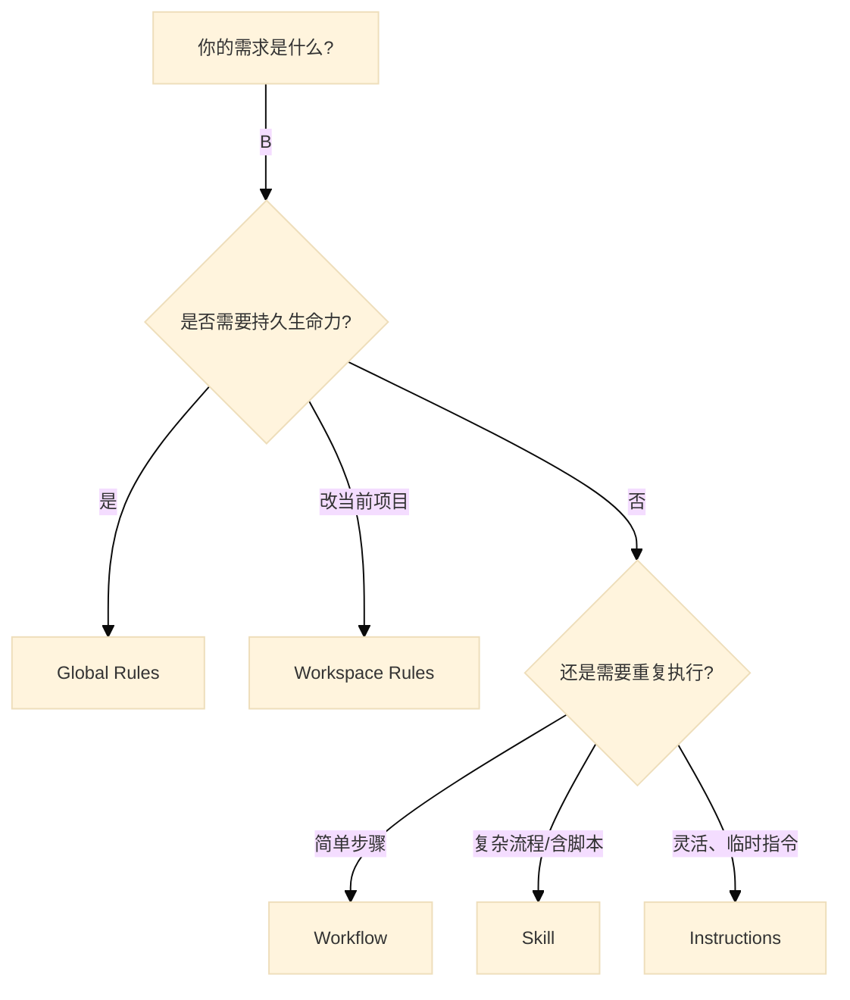

# Agentic AI 四大定制化核心概念: Rules、Instructions、Workflows 与 Skills 完全指南

这份指南将帮助你深入理解并掌握 Google Antigravity (Agentic AI) 的四大核心定制化概念：**Custom Agent Rules (自定义规则)**、**Instructions (指令)**、**Workflows (工作流)** 和 **Skills (技能)**，并通过实际操作来学习如何使用它们。

> [!TIP]
> **阅读建议**：建议先阅读「核心概念概览」建立整体认知，然后通过「Quick Start」章节进行实战练习。

---

## 核心概念概览

在与 AI Agent 协作时，我们可以通过不同层级的机制来控制其行为：

| 概念 | 作用范围 | 生命周期 | Role (LLM) | 典型用途 |
| :--- | :--- | :--- | :--- | :--- |
| **Agent Rules** | 全局 (Global) | 长期有效 (Persistent) | `system` | 设定编码风格、禁止事项、特定技术栈偏好 |
| **Instructions** | 会话/任务 (Session) | 单次交互或任务期间 | `user` | 指挥具体任务执行、上下文补充 |
| **Workflows** | 会话 (Session) | 按需触发 (On-Demand) | `user` | 保存的提示词模板、可重复的多步骤流程 |
| **Skills** | 能力扩展 (Capability) | 按需加载 (On-Demand) | `system` (动态) | 封装复杂流程、特定领域知识、自定义工具链 |

---

### 主流 AI 编程工具支持情况

| 概念 | Google Antigravity | Claude Code | OpenAI Codex CLI |
| :--- | :--- | :--- | :--- |
| **Agent Rules** | ✅ 完整支持 <br> `~/.gemini/GEMINI.md` (全局) <br> `.agent/rules/*.md` (工作区) | ✅ 完整支持 <br> `~/.claude/CLAUDE.md` (全局) <br> `.claude/settings.json` (项目级) | ✅ 完整支持 <br> `~/.codex/instructions.md` (全局) <br> `codex.md` / `AGENTS.md` (项目级) |
| **Instructions** | ✅ Chat Panel (`Cmd+L`) <br> ✅ Inline Edit (`Cmd+I`) | ✅ 对话式交互 <br> ✅ `/` 命令触发 | ✅ 终端交互式对话 <br> ✅ 支持 `-q` 快速提问模式 |
| **Workflows** | ✅ 完整支持 <br> `.agent/workflows/*.md` <br> 通过 `/slash-command` 触发 | ⚠️ 部分支持 <br> 通过 `/` 命令实现类似功能 | ❌ 暂不支持 <br> 需通过 Instructions 手动触发 |
| **Skills** | ✅ 完整支持 <br> `.agent/skills/*/SKILL.md` <br> 支持脚本、模板、资源文件 | ✅ 完整支持 <br> 通过 MCP 协议动态加载工具与扩展能力 | ⚠️ 通过 `AGENTS.md` 定义多角色代理 <br> 支持沙盒化执行 |

> [!NOTE]
> **配置路径差异**：三款工具的配置路径和文件格式不同，但核心理念相似。本指南以 **Google Antigravity** 为主进行讲解。
>
> **MCP 与 Skills 的关系**：MCP (Model Context Protocol) 是 Anthropic 提出的开放协议，旨在标准化 AI 与外部工具/数据源的连接方式。Skills 是 Antigravity 的原生能力扩展机制，两者目标相似但实现不同：
>
> - **Skills**：通过 Markdown 文件定义流程，更轻量、易于编写，适合封装内部 SOP
> - **MCP**：通过标准化协议连接外部服务，更适合集成第三方工具（如数据库、API）
>
> **社区评价**：目前开发者社区普遍认为 **Antigravity 的 Skills + Workflows 体系最为完善**，配置简单且开箱即用；Claude Code 的 MCP 生态正在快速发展，第三方工具支持丰富；Codex CLI 作为后来者，功能相对精简但沙盒安全性较高。

---

## 1. Custom Agent Rules (自定义代理规则)

**“宪法”与“行为准则”**

Rules 是你赋予 Agent 的基础设定。它们就像是 Agent 的“潜意识”，在每一次思考和行动中都会生效。

### 怎么操作？

在 **Google Antigravity** 中，Rules 配置文件分为两个层级：

| 类型 | 路径 | 作用范围 |
| :--- | :--- | :--- |
| **Global Rules** | `~/.gemini/GEMINI.md` | 所有项目 (全局) |
| **Workspace Rules** | `your-project/.agent/rules/*.md` | 当前工作区 (项目级) |

> [!TIP]
> 如何快速创建 Global Rules：
>
> 1. 打开 Agent Chat 窗口。
> 2. 点击 **Customizations** (定制) 部分。
> 3. 点击 **+ Global**。
> 4. 编辑自动创建的 `~/.gemini/GEMINI.md` 文件即可。

**Workspace Rules 激活方式**：

- **Always On**：始终生效。
- **Manual**：手动激活。
- **Model Decision**：由 Agent 自行判断是否应用。
- **Glob Pattern**：匹配特定文件类型时生效 (如 `*.py`)。

### 编写最佳实践

- **明确性**：不要说“写好代码”，要说“使用 TypeScript，严格遵循 Airbnb 风格指南”。
- **否定式**：明确指出“不要做什么”。
  - *例*：“不要使用 `JQuery`，只使用原生 DOM API。”
  - *例*：“涉及数据库操作时，**不要**直接拼接 SQL，必须使用参数化查询。”
- **身份设定**：
  - *例*：“你是一个资深 Rust 系统工程师，关注内存安全和零拷贝优化。”

### 示例配置

```markdown
# General
- 始终使用中文回复，除非被要求翻译。
- 代码注释必须清晰，解释“为什么”而不是“是什么”。

# Tech Stack
- Frontend: React 18+, TailwindCSS, Vite.
- Backend: Python 3.11, FastAPI.

# Constraints
- 禁止使用 `any` 类型 (TypeScript)。
- 所有的异步操作必须使用 `async/await`，禁止 `.then()` 链式调用。
```

---

## 2. Instructions (指令)

**“指挥棒”与“具体命令”**

Instructions 是你与 Agent 交互的**动态指令**。在 IDE 环境中，通常有两种核心输入模式，它们的区别如下：

| 模式 | 快捷键 | 场景 | 特点 |
| :--- | :--- | :--- | :--- |
| **Chat Panel (对话框)** | `Cmd+L` | 问答、策划、寻求解释 | **Scope: Session**. 就像在跟同事聊天，上下文是整个对话历史。 |
| **Inline Edit (内联编辑)** | `Cmd+I` / `Cmd+K` | 改代码、生成代码 | **Scope: Selection**. 就像在指着屏幕说“改这行”，上下文聚焦于当前光标或选中的代码块。 |

**两者的本质区别**：

- **Chat** 偏向于 *Consultation* (咨询/规划)。
- **Inline** 偏向于 *Action* (直接行动/修改)。

### 高级操作技巧

- **Contextualize (提供上下文)**：
  - *Bad*: “帮我改一下这个错。”
  - *Good*: “我正在看 `utils.py` 的第 45 行，这个 `parse_date` 函数解析 ISO8601 格式报错，请基于当前打开的文件修复它。”
- **Task Breakdown (任务拆解技巧)**：
  - **Bad**: "重构一下认证模块。" (太模糊，Agent 可能会随机发挥)
  - **Good (Step-by-Step)**:
    > "请重构 `auth.ts` 模块，按以下步骤执行：
    > 1. 将 `verifyToken` 函数提取到新的 `validators.ts` 文件中。
    > 2. 将 Session 存储方式从 `localStorage` 改为 `Cookies`。
    > 3. 并在 `login` 组件中更新调用逻辑。
    > 4. 完成后，运行测试确保没有破坏现有功能。"
  - *技巧*：使用序号列表 (1. 2. 3.) 明确执行顺序。
- **Chain of Thought (思维链触发)**：
  - *例*：“在写代码之前，先分析一下这会对现有的 Authentication 模块产生什么影响。”

---

## 3. Workflows (工作流)

**"保存的提示词"与"快捷指令"

Workflows 是你预先定义的**提示词模板**或**多步骤指令序列**。它们就像“快捷键”，让你无需每次都手动输入重复的指令。

### 路径配置

| 类型 | 路径 | 作用范围 |
| :--- | :--- | :--- |
| **Workspace Workflows** | `your-project/.agent/workflows/*.md` | 当前项目 |
| **Global Workflows** | `~/.gemini/antigravity/global_workflows/*.md` | 所有项目 |

### Workflow 文件格式

Workflow 文件使用 Markdown 格式 + YAML Frontmatter：

```markdown
---
description: [简短描述，如: 部署到测试环境]
---
[具体步骤指令]
```

### 实战案例：创建 "deploy-staging" Workflow

**File: `.agent/workflows/deploy-staging.md`**

```markdown
---
description: 部署到 Staging 环境
---
1. 运行 `npm run build` 构建生产包。
2. 运行 `npm run test` 确保所有测试通过。
3. 运行 `./scripts/deploy.sh staging` 部署到 Staging。
4. 完成后通知用户。
```

### 使用方式

在对话中使用 **Slash Command** 触发：

```bash
/deploy-staging
```

Agent 会自动读取并执行工作流中定义的步骤。

> [!TIP]
> **turbo 注解**：在步骤前添加 `// turbo` 可以让该命令自动执行 (无需用户确认)。
> 在文件任意位置添加 `// turbo-all` 可让所有步骤自动执行。

---

## 4. Skills (技能)

**"工具箱"与"扩展模组"**

Skills 是 Antigravity 最强大的扩展机制。它允许你将一套复杂的流程、知识或脚本封装成一个“技能包”，让 Agent 学会新本事。

### Skill 的结构

一个标准的 Skill 通常是一个文件夹，包含：

1. **`SKILL.md` (核心)**：技能的“说明书”。
2. **`scripts/` (可选)**：辅助脚本（Python, Bash 等）。
3. **`resources/` (可选)**：模板文件、参考文档。

### `SKILL.md` 怎么写？

这是 Agent 阅读的文件，需要用 Markdown 编写，通过 YAML Frontmatter 定义元数据。

#### 模板结构

```markdown
---
name: [技能名称，如: daily-report-generator]
description: [简短描述，如: 生成每日工程进度报告]
---

# Instructions
(详细告诉 Agent 如何执行这个技能)

1. **Step 1: Gather Info**
   - Run command `git log --since="yesterday"` to get updates.
   - Read file `task.md` to update status.

2. **Step 2: Generate Report**
   - Use the template in `resources/template.md`.
   - Summarize the git logs.

3. **Step 3: Save**
   - Save the file to `reports/YYYY-MM-DD.md`.
```

### 具体操作流程

1. **创建文件夹**：在项目根目录下创建 `.agent/skills/` 目录和技能文件夹：

   ```bash
   mkdir -p .agent/skills/code-review-pro
   ```

2. **编写定义**：在技能文件夹中创建 `SKILL.md`，写下你希望 Agent 遵循的 SOP (标准作业程序)。

3. **使用技能**：参考下方的触发方式表格。

### Skill 的触发方式

| 方式 | 说明 | 示例 |
| :--- | :--- | :--- |
| **手动调用** | 在对话中明确要求使用某个技能 | "使用 `code-review-pro` 技能来审查当前 PR" |
| **自动检索** | Agent 根据任务语义自动匹配相关 Skill | 当你说"帮我做代码评审"，Agent 可能自动加载相关 Skill |
| **上下文触发** | Skill 的 description 包含触发关键词 | `description: 代码审查、Code Review、PR 评审` |

> [!NOTE]
> **Skill vs Workflow 的选择**：
>
> - 如果只是简单的多步骤命令序列 → 使用 **Workflow**
> - 如果需要复杂逻辑、脚本、模板文件 → 使用 **Skill**

### 实战案例：创建一个 "Deploy-Check" Skill

假设你每次部署前都要检查 3 个配置文件和 1 个数据库状态。

**File: `skills/deploy-check/SKILL.md`**

```markdown
---
name: deploy-check
description: 安全部署前的检查清单流程
---

# Deploy Pre-flight Check

When verify deployment readiness, follow these steps strictly:

1. **Check Environment Variables**
   - View file `.env.example` and ensure the user has a corresponding `.env`.
   - WARNING: Do not read the actual `.env` content unless explicitly asked (security).

2. **Verify Database Migration**
   - Run command `npm run prisma:status` to check for pending migrations.
   - If output contains "Pending", STOP and notify user.

3. **Run Lint**
   - Run `npm run lint`.
   - If errors exist, list them and ask user if we should proceed.
```

### 4.1 工程目录结构示例

将上述概念映射到实际的项目文件中，结构如下：

```text
Project_Root/
├── .env                     <-- (环境配置，勿提交)
├── src/                     <-- (源码)
│   └── ...
└── .agent/                  <-- (Agent 配置目录)
    ├── rules/               <-- (Rules) 工作区级规则
    │   ├── coding-style.md  <-- 例：代码风格规范
    │   └── security.md      <-- 例：安全红线
    ├── workflows/           <-- (Workflows) 可触发的工作流
    │   └── deploy.md
    └── skills/              <-- (Skills) 技能扩展包
        ├── deploy-check/
        │   ├── SKILL.md     <-- 技能定义
        │   └── scripts/     <-- 辅助脚本
        └── code-review/
            └── SKILL.md

# 全局配置（用户目录）
~/.gemini/
├── GEMINI.md                <-- (Global Rules) 全局宪法
└── antigravity/
    ├── global_workflows/    <-- 全局工作流
    └── skills/              <-- 全局技能
```

---

## 5. 深度解析：技术实现机制对比

为了更好地设计 Agent 行为，我们需要从**运行机制 (Runtime Mechanism)** 的角度来理解这三者的区别。

### 💡 进阶理解：Instructions vs System Prompt

从底层实现机制来看：

1. **System Prompt (包含 Rules)**：
   - 位于上下文窗口的最顶端 (`role: system`)。
   - 权重最高，定义**边界**和**身份**。
   - *就像“出厂设置” + “长期宪法”。*

2. **Instructions**：
   - 位于上下文窗口的最底端 (`role: user`)。
   - 利用模型的“近因效应”，引导**具体行动**。
   - *就像“即时命令”。*

### (B) System Prompt vs. Skills

这是**通用大脑**与**外挂插件**的区别。

| 特性 | System Prompt | Skills |
| :--- | :--- | :--- |
| **本质** | **The "OS" (操作系统)** | **The "Apps" (应用程序)** |
| **上下文管理** | 始终加载在 Context Window 中。 | **On-Demand (按需加载)** <br> 只有当需要用到该技能时，其内容才会被检索并注入到 Context 中。 |
| **设计哲学** | 定义 Agent 的“性格”和“底线”。 | 定义 Agent 的“工作流”和“特定能力”。 |
| **扩展性** | 有限（受限于 Context Window 上限）。 | **无限**（可以有 1000 个 Skill，但每次只加载相关的 1 个）。 |
| **Injection Role** | **`role: system` (Static)** <br> 静态常驻，作为会话的“根基”。 | **`role: system` (Dynamic)** <br> 动态注入，作为临时的“高优先级规则”。虽然是后加载的，但拥有 System 级的执行权威性。 |
| **例子** | “你是一个精通 Python 的资深工程师。” | “这是如何使用内部 API 进行部署的 5 个步骤...” |

### 💡 架构设计建议

1. **保持 System Prompt 轻量化**：不要把所有公司的文档都塞进去。只放最核心的原则（如代码风格、安全红线）。
2. **用 Skills 封装复杂流程**：任何超过 3 步的固定流程，或者包含大量参考文档的内容，都应该做成 Skill。这样既节省 Token，又提高准确率。
3. **用 Instructions 灵活调度**：在对话中，通过 Instructions 指挥 Agent 调用特定的 Skill，或者在 System Prompt 的框架内微调行为。
4. **用 Workflows 固化常用流程**：把经常输入的多步骤指令保存为 Workflow，通过 `/` 命令快速触发。

### (C) Workflows vs. Skills vs. Instructions

| 特性 | Instructions | Workflows | Skills |
| :--- | :--- | :--- | :--- |
| **本质** | 即时的一次性命令 | 保存的提示词模板 | 封装的能力包 |
| **触发方式** | 用户手动输入 | `/slash-command` 快捷触发 | Agent 自动检索或手动调用 |
| **内容复杂度** | 低 (单次交互) | 中 (多步骤序列) | 高 (可包含脚本、模板、资源) |
| **适用场景** | 临时需求 | 重复性操作模式 | 复杂领域能力 |

---

## 6. 总结与应用建议

1. **Rules** 是你的**底线**。把“绝对不能做”和“必须遵守的代码规范”写在这里。
2. **Instructions** 是你的**此时此刻的需求**。清晰、具体、提供上下文。
3. **Workflows** 是你的**常用操作模板**。把重复输入的多步骤指令保存为 Workflow。
4. **Skills** 是你的**自动化流程**。把你重复做的、复杂的、有多步骤的一套动作，通过 `SKILL.md` 教给 Agent。

**学习建议路径**：

1. 先在当前对话中尝试完善 **Instructions**。
2. 整理出一套你喜欢的代码风格，写入 **Rules**。
3. 当你发现自己总是重复输入同一段指令时，就把它保存成一个 **Workflow**。
4. 当流程变得复杂（多文件、多脚本、多模板），就升级为 **Skill**。

---

## 7. Quick Start: 5 分钟实战练习

在理解了核心概念后，让我们通过实战来巩固学习。

### 🚀 实战 1：创建你的第一个 Global Rule

**目标**：让 Agent 始终使用中文回复。

**步骤**：

1. 打开 Antigravity 的 Agent Chat 面板（快捷键 `Cmd+L`）
2. 点击输入框上方的 **Customizations** 区域
3. 点击 **+ Global** 按钮
4. 系统会自动创建并打开 `~/.gemini/GEMINI.md` 文件
5. 在文件中添加以下内容：

```markdown
# My Global Rules
- 始终使用中文回复，除非用户明确要求其他语言。
- 代码注释使用英文，保持简洁。
```

1. 保存文件，然后在 Agent Chat 中输入任意英文问题测试效果。

> [!NOTE]
> 如果 Agent 没有立即遵守新规则，尝试开启一个新的对话会话。

### 🚀 实战 2：创建你的第一个 Workflow

**目标**：创建一个快速 Git 提交的工作流。

**步骤**：

1. 在项目根目录创建目录结构：

```bash
mkdir -p .agent/workflows
```

1. 创建工作流文件 `.agent/workflows/git-push.md`：

```markdown
---
description: Git 快速提交并推送
---
1. 运行 `git add .` 添加所有更改。
2. 运行 `git commit -m "update"` 提交更改。
3. 运行 `git push` 推送到远程仓库。
```

1. 在 Agent Chat 中输入 `/git-push` 即可触发该工作流。

---

## 8. 选择指南：我应该用哪个？

当你不确定应该使用哪种定制化机制时，可以参考以下决策流程：



**简易速查表**：

| 你的场景 | 推荐使用 |
| :--- | :--- |
| 设定代码风格、禁止事项 | **Rules** |
| 临时让 Agent 做某件事 | **Instructions** |
| 重复执行的部署/构建流程 | **Workflow** |
| 复杂的代码审查/报告生成流程 | **Skill** |

---

## 9. FAQ & 故障排除

### Q1: 我添加了 Rule，但 Agent 没有遵守？

**排查步骤**：

- ✅ 确认文件路径正确：Global Rules 必须是 `~/.gemini/GEMINI.md`（注意大写）
- ✅ 重启 VSCode 或重新打开 Agent Chat 窗口
- ✅ 确认 Markdown 格式正确，避免前后有多余空行
- ✅ 尝试开启一个新的对话会话

### Q2: `/my-workflow` 无法触发？

**排查步骤**：

- ✅ 确认文件在 `.agent/workflows/` 目录下且扩展名为 `.md`
- ✅ Frontmatter 的 `description` 字段不能为空
- ✅ 文件名即为 slash command 名称（`deploy.md` → `/deploy`）
- ✅ 确认当前工作区已打开包含 `.agent/` 目录的项目

### Q3: Skill 没有被 Agent 调用？

**排查步骤**：

- ✅ 尝试在对话中明确说："请使用 xxx 技能"
- ✅ 确认 `SKILL.md` 存在且格式正确
- ✅ 检查 Skill 的 `description` 是否包含相关关键词

### Q4: Workspace Rules 和 Global Rules 冲突了怎么办？

**优先级规则**：

- Workspace Rules 优先级高于 Global Rules
- 如果两者冲突，Workspace Rules 会覆盖 Global Rules 的设定
- 建议：Global Rules 写通用规范，Workspace Rules 写项目特定规则

---

> [!TIP]
> **持续学习**：随着使用深入，你会发现更多定制化的可能性。建议从简单的 Rules 开始，逐步探索 Workflows 和 Skills，打造专属于你的 AI 编程助手。
