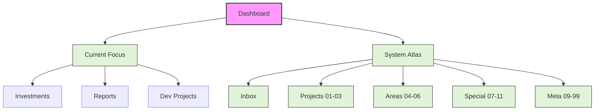

---
tags:
  - MOC
  - Dashboard
updated: 2026-02-13
---

# Home (Dashboard)

## 🎯 Current Focus (当务之急)

### 🚀 Key Projects & Reports

* **Investments**: [[04_Investments/Portfolio Plan/Portfolio_Plan_2026_1M_USD|💰 Portfolio Plan 2026 ($1M)]]
* **Investigation**: [[07_Investigation/AI 泡沫/美股 AI 泡沫深度调查报告|🫧 Investigation: AI Bubble Report]]
* **Investigation**: [[07_Investigation/China Export/2025年中国进出口贸易深度调研报告|🚢 Investigation: China Export 2025]]
* **Production**: [[03_Productions/MarkdownToStat/Obsidian markdown to stat plugin|🛠️ Project: MarkdownToStat]]

---

## 🗺️ System Atlas (知识地图)

### 📥 Inbox & Flow

* [[00_Inbox/Inbox|📥 00_Inbox (收集箱)]]

### 🏗️ Projects & Output (产出层)

* [[01_Research/Index|🔬 01_Research (研究)]]
* [[02_Ideas/Index|💡 02_Ideas (灵感)]]
* [[03_Productions/Index|🎬 03_Productions (产出)]]

### 🧱 Areas & Resources (领域层)

* **[[04_Investments/Index|💰 04_Investments (投资)]]**
  * *Watchlist*: [[04_Investments/Company Watchlist/tsm/Index|TSM]], [[04_Investments/Company Watchlist/nvda/Index|NVDA]]
* [[05_Technology/Index|💻 05_Technology (技术)]]
* [[06_Accounts/Index|💳 06_Accounts (账户)]]

### 🔍 Special Topics (专项层)

* **[[07_Investigation/Index|🕵️ 07_Investigation (调查)]]**
* [[08_Personal/Index|🔒 08_Personal (个人)]]
* [[11_Explore/Index|🧭 11_Explore (探索)]]

### 🏛️ Archives & Meta (归档与系统)

* [[09_MOC/Home|🗺️ 09_MOC (地图)]]
* [[99_Archives/Index|📦 99_Archives (归档)]]
* [[GEMINI|🧠 GEMINI (System Context / 知识图谱)]]

---

## 📊 Structure Overview

